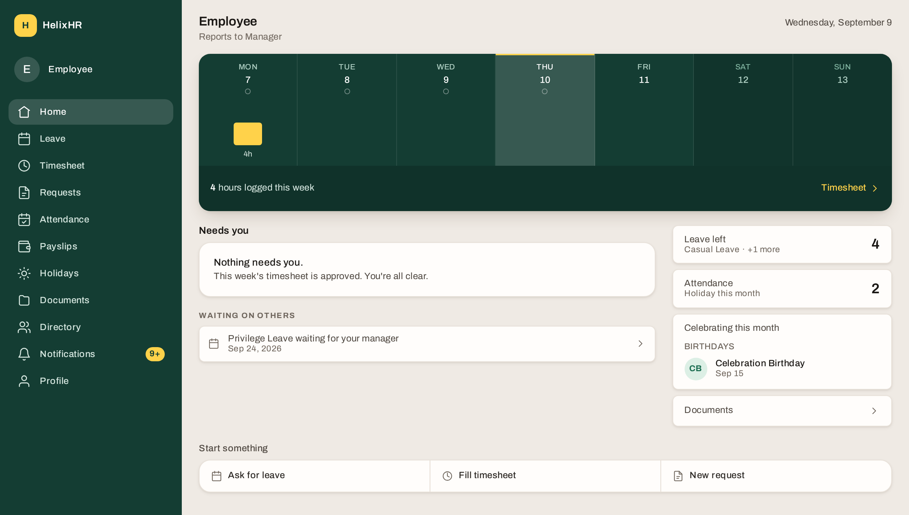
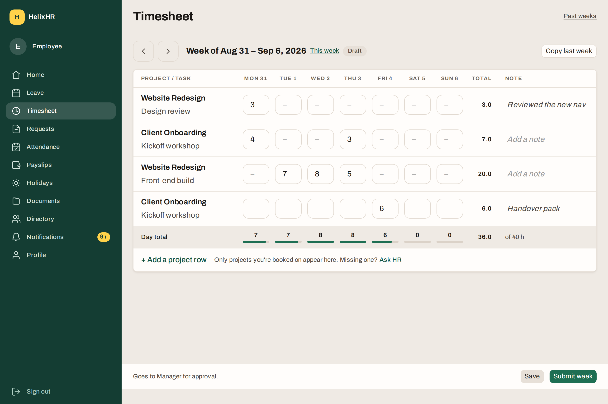
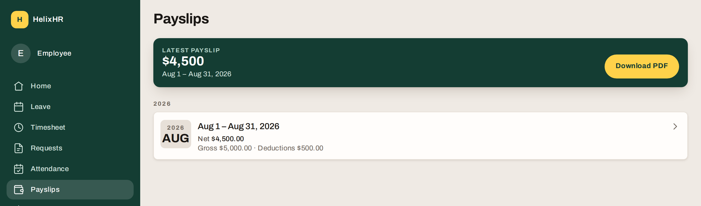
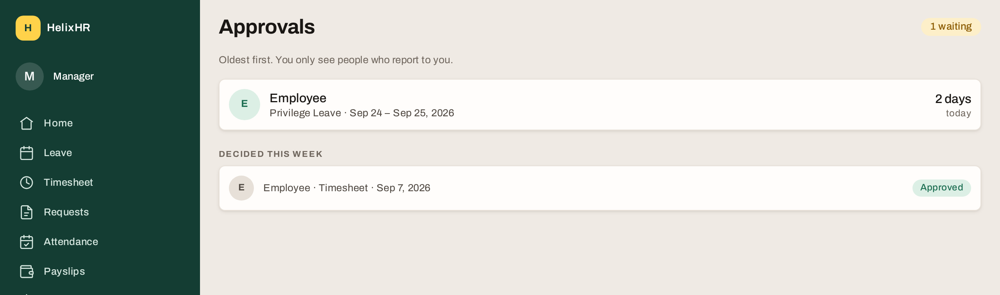
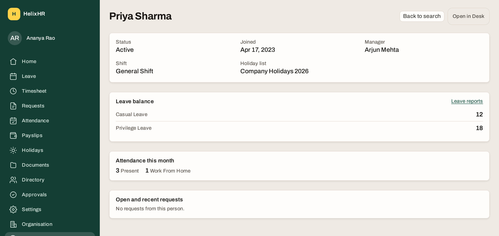
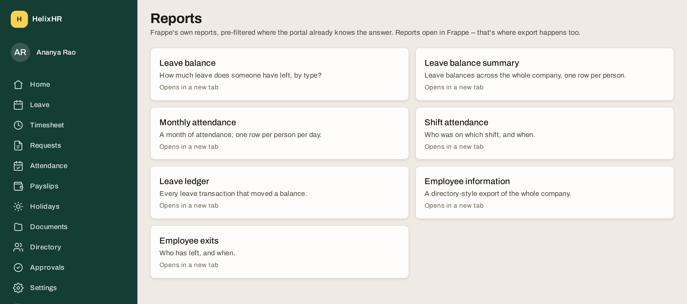
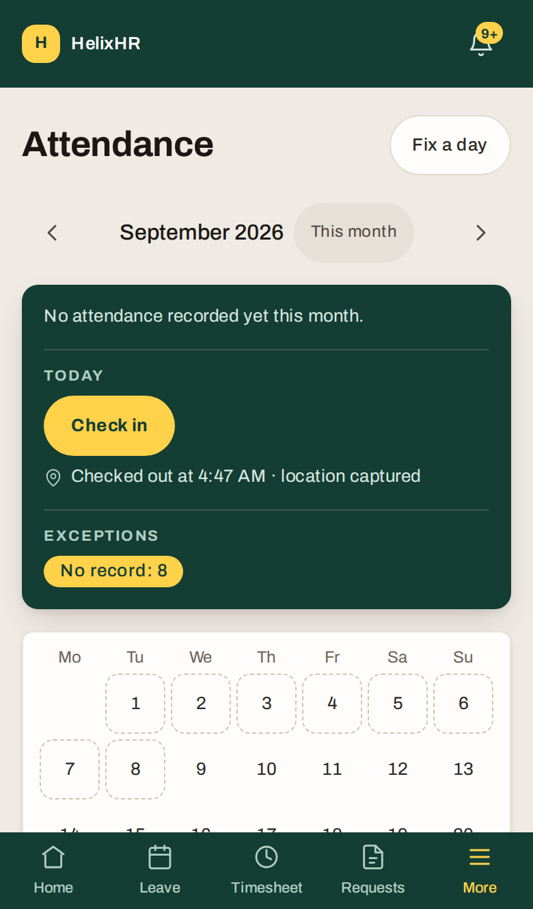
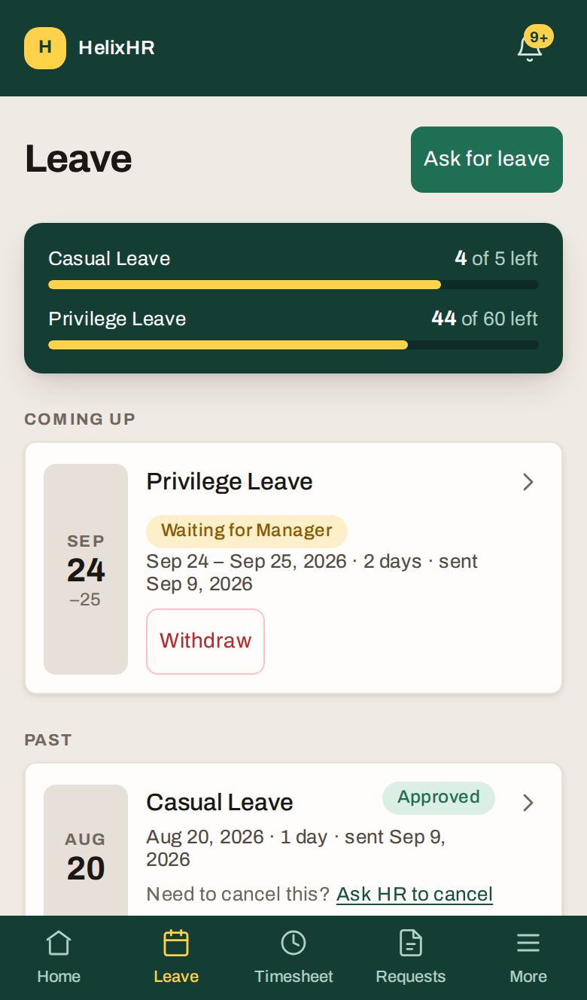

<p align="center">
  <a href="https://nitcoinc.ai">
    <picture>
      <source media="(prefers-color-scheme: dark)" srcset="docs/images/nitco-logo-white.svg">
      
    </picture>
  </a>
</p>

<h1 align="center">HelixHR Employee Portal</h1>

<p align="center">
  A modern, mobile-first employee portal built on top of Frappe HR,<br>
  providing employees with seamless access to HR services, information,<br>
  and self-service tools. HelixHR empowers employees with quick and easy<br>
  access to their HR information, benefits, and workplace resources.
</p>

<p align="center">
  <a href="https://github.com/nitcoinc/helixhr-portal/actions/workflows/ci.yml"></a>
  <a href="LICENSE"></a>
  
  
  
  <a href="https://nitcoinc.ai"></a>
</p>

<p align="center">
  <a href="#screens">Screens</a> ·
  <a href="#what-it-does">What it does</a> ·
  <a href="#quick-start">Quick start</a> ·
  <a href="#how-it-is-built">Architecture</a> ·
  <a href="#contributing">Contributing</a> ·
  <a href="#license">License</a>
</p>

---

## Why HelixHR

Frappe HR provides a robust and comprehensive HR system of record. NITCO's
HelixHR enhances that foundation with a modern, intuitive employee
experience designed for everyday HR interactions.

HelixHR is a Frappe v16 application that adds a streamlined, mobile-first
employee portal at `/helixhr`, giving employees a simple and engaging
interface for common HR tasks such as checking leave balances, updating
attendance, responding to HR requests, and accessing employment information.

Built directly on top of Frappe HR, HelixHR does not create a separate
system or data store. All employee interactions continue to use Frappe's
native records, workflows, permissions, and security model. NITCO's focus
was to modernize the user experience, simplify navigation, and improve
employee self-service adoption while preserving the power, governance, and
scalability of the underlying Frappe HR platform.

By separating the employee experience from administrative functions,
HelixHR delivers a consumer-grade interface for employees while allowing
HR, payroll, onboarding, recruitment, and other administrative processes to
remain within the standard Frappe HR and ERPNext environments.

## What it does

| Audience | What they get |
|---|---|
| **Every employee** | Home as an action queue built on the working week — what needs *me*, what is waiting on someone else, and three ways to start. Leave with live balances and a Withdraw that works. Attendance with a located check-in and a "Fix a day" request. Timesheets as a day-first weekly grid. Payslips with one-tap PDF. Holidays, HR requests with attachments and a reply thread, a policy documents page, a colleague directory, notifications and profile. |
| **Managers** | One Approvals queue, oldest first, four outcomes per request (approve, send back, reject, escalate to HR), a record of what was already decided, and a team leave week for direct reports. |
| **HR** | The HR half of the same queue, including requests routed to a portal-only `IT Team` role. A Settings screen for request categories and routing, the portal's own notification wording, and a short named field set on leave types, holiday lists and shift types. A read-only Organisation view (counts, never names). A **People** lookup that opens one person's leave balance, attendance, requests, shift, holiday list and manager — read-only, and no wider than Desk already shows the same roles. A **Reports** launcher into Frappe's own HR reports, pre-filtered to the person being viewed; export happens in Frappe, not here. |

Every number on every screen is Frappe's. The portal computes nothing it is
not the source of truth for.

## Screens

Captured from a running bench with fixtures seeded, so every figure came out
of Frappe. Regenerate them with the command under [Screenshots](#screenshots).

<p align="center">
  
</p>

**Home** answers "what needs me?" before anything else: the week spine with
hours per day, one card per thing waiting on the employee, one per thing
waiting on somebody else, and three ways to start.

<p align="center">
  
</p>

**Timesheet** is a day-first grid — projects down, days across, hours in the
cells — with a running day total, a 40-hour target and one Submit for the
whole week.

<table>
<tr>
<td width="50%"></td>
<td width="50%"></td>
</tr>
<tr>
<td><b>Payslips</b> put the latest net pay and its PDF one tap away, with
every earlier month grouped by year.</td>
<td><b>Approvals</b> is the decider's queue: oldest first, four outcomes per
request, HR's escalations tagged in the same list, and a record of what was
already decided.</td>
</tr>
</table>

<table>
<tr>
<td width="50%"></td>
<td width="50%"></td>
</tr>
<tr>
<td><b>People</b> is HR's read-only view of one person: leave balance by type,
this month's attendance, open requests, shift, holiday list and manager, with
a Desk link for anything beyond that. It writes nothing.</td>
<td><b>Reports</b> is a curated launcher into Frappe's own HR reports, each
named by the question it answers and pre-filtered to the person HR was
looking at. Export stays where it already works — in Frappe.</td>
</tr>
</table>

The portal is built mobile-first: the desktop rail becomes a bottom tab bar,
and every action stays inside a thumb's reach.

<p align="center">
  
  &nbsp;&nbsp;
  
</p>

## How it is built

- **Backend**: a Frappe v16 app. Whitelisted methods in `helixhr/api.py`,
  document-event hooks in `events.py`, configuration shipped as fixtures,
  four small DocTypes of its own (`HR Request`, `HelixHR Request Category`,
  `HelixHR Message Template`, `HelixHR Document Link`). Frappe, ERPNext and
  HRMS core are never modified.
- **Frontend**: Vue 3 + [frappe-ui](https://github.com/frappe/frappe-ui) +
  Tailwind, built by Vite into the app's `public/` and served by one Frappe
  web route. One bootstrap request per hard load; every resource-backed
  region renders through a single `AsyncState` component so loading, empty,
  forbidden and failed are told apart everywhere.
- **Security**: every call runs as the signed-in user; the browser never
  holds a token. A go-live **preflight** (`helixhr.preflight.run`) machine-checks
  the per-site settings a human would otherwise eyeball, and exits non-zero on
  any FAIL so a deploy can gate on it.
- **Tests**: Python integration tests against a real site, vitest for the
  pure-function libraries, Playwright end to end in a real browser as four
  identities (employee, manager, HR, IT). CI runs all three from a fresh
  site on every push.

Full detail: [docs/architecture.md](docs/architecture.md). Product framing and
scope: [PRODUCT.md](PRODUCT.md). Visual system and copy rules:
[docs/design-system.md](docs/design-system.md). The plans each phase was built
from, with requirement IDs the code cites: [docs/plans/](docs/plans/).

<details>
<summary><b>Repository layout</b></summary>

```
helixhr/                 Frappe app (Python)
  api.py                 every whitelisted method the frontend calls
  events.py              Timesheet, Leave, Attendance Request, HR Request, Employee and File hooks
  tasks.py               scheduled jobs (punch-coordinate retention)
  reminders.py           the birthday and work-anniversary emails HR words
  telemetry.py           opt-in anonymous install ping (off by default)
  preflight.py           go-live checks: bench --site <site> execute helixhr.preflight.run
  utils.py               admin scope, week bounds, rate-limit policy, the curated report list
  hooks.py               fixtures, doc_events, scheduler_events, the /helixhr/* route rule
  fixtures/              Property Setters, Workflows, Roles, Notifications
  patches/               migrate-time fixes, incl. this app's permission deltas
  helixhr/doctype/       HR Request, HelixHR Request Category, HelixHR Message Template, HelixHR Document Link
  www/helixhr.py         serves the built SPA, injects CSRF token and site config
  tests/                 Python integration tests (bench run-tests) and the fixture helpers
frontend/                Vue 3 + frappe-ui + Tailwind, built by Vite
  src/pages/             one file per screen
  src/components/        AppShell, AsyncState, WeekSpine, NeedsYou, forms
  src/lib/               api client, session, dates, money, hours, geolocation, status words
  tests/e2e/             Playwright specs (real browser, real site)
  tests/screenshots.mjs  regenerates the README screenshots
docs/                    deployment, runbook, architecture, design system, plans
  images/                the README screenshots and logos
```

The frontend build writes into `helixhr/public/helixhr/` and
`helixhr/www/helixhr.html`. Both are gitignored: build them on the bench, never
commit them.
</details>

## Quick start

**Requirements**: a Frappe bench on `version-16` with `erpnext` and `hrms`
installed; Python 3.14, Node 24, Yarn 1; MariaDB 11.x and Redis, as any bench.

```bash
cd frappe-bench
bench get-app https://github.com/nitcoinc/helixhr-portal --branch main
cd apps/helixhr/frontend && yarn install --frozen-lockfile && yarn build && cd -
bench --site <site> install-app helixhr
bench build --app helixhr          # links sites/assets/helixhr; needed once per bench
bench --site <site> clear-cache
bench --site <site> execute helixhr.preflight.run
```

`bench get-app` runs the pip install. If you copy the folder in by hand instead,
also run `uv pip install -e apps/helixhr --python env/bin/python`, otherwise
`install-app` fails with `No module named 'helixhr'`. Container caveats and
every gotcha found so far: [docs/runbook.md](docs/runbook.md).

Every portal user needs an active Employee record whose `user_id` is their User,
the **Employee Self Service** role, and a User Permission on their own Employee.
Creating the Employee with "Create User Permission" checked does the last part;
[docs/deployment.md](docs/deployment.md) covers the one ERPNext button that
skips it, and how to keep employees out of Desk entirely.

## Configure a site

All configuration is per-site data, not code. Set it in Desk or with
`bench set-config`, then run the preflight to confirm. Site config is cached
for 60 seconds per web process, so a `set-config` change reaches the page
within a minute with no restart.

<details>
<summary><b>Every setting the preflight checks</b></summary>

| Setting | Where | Value |
|---|---|---|
| Apply Strict User Permissions | System Settings | on. Without it a User Permission on Employee does not restrict linked doctypes. |
| Disable Signup | Website Settings | on. An unknown sign-in must see "contact HR", not self-register. |
| Disable Username/Password Login | System Settings | **off** while sign-in is local. Turn on only once an Entra ID Social Login Key is enabled. |
| Enable Password Policy | System Settings | on, for local login. |
| Allowed File Extensions | System Settings | `PDF PNG JPG JPEG DOCX XLSX`, one per line. Anything wider lets the *site* accept a file the portal refuses. |
| Max File Size | System Settings | 10 (MB) or lower. |
| Allow Guests to Upload Files | System Settings | off. |
| Only allow System Managers to upload public files | System Settings | on. |
| `allow_tests` | `bench --site <site> set-config allow_tests false` | **off on production.** It exposes the fixture entry points and disables the per-user write limiter. |
| `ignore_csrf` | never set it | it disables CSRF validation for every mutation on the site. |
| `helixhr_auth_phase` | `bench --site <site> set-config helixhr_auth_phase local` | `local` or `entra`; preflight's sign-in expectations follow it. |
| `helixhr_public_url` | `bench --site <site> set-config helixhr_public_url https://<host>/helixhr` | lets preflight probe the real HTTPS endpoint for security headers and cookie flags. |
| `rate_limit` | `bench --site <site> set-config rate_limit '{"limit": 600, "window": 60}'` | site-wide request limit, in addition to the app's per-user write limits. |
| `helixhr_rate_limits` | optional, e.g. `'{"create_my_request": [5, 3600]}'` | tightens one per-user write bound. Preflight FAILs on anything looser than policy. |
| `helixhr_hr_contact` | `bench --site <site> set-config helixhr_hr_contact hr@example.com` | the address shown to a signed-in user with no Employee record. Unset shows "Contact HR" with no link. |
| `helixhr_checkin_location_retention_days` | `bench --site <site> set-config helixhr_checkin_location_retention_days 90` | how long a punch keeps its coordinates. The daily job does nothing until it is set, and preflight WARNs; the number is HR and legal's decision. |
| `helixhr_telemetry_enabled` / `helixhr_telemetry_url` | see [Anonymous install ping](#anonymous-install-ping-off-by-default) | both unset by default; nothing is sent until an operator sets both. |
| Allow Employee Checkin From Mobile App | HR Settings | on, to offer check-in in the portal at all. Off is a preflight WARN, not a FAIL — a site may not want it. |
| Allow Geolocation Tracking | HR Settings | the portal requires coordinates either way. Turning it **on** also makes HRMS refuse coordinate-less punches from devices and from Desk. |
| Shift Type + Shift Assignment | Desk: HR | at least one Shift Type with Enable Auto Attendance, `Process Attendance After` set and its sync advancing, plus an assignment per employee. Without them no punch ever becomes Attendance. |
| Salary Slip default print format | Desk: Salary Slip → Print Settings | decides what the downloaded payslip PDF looks like. Falls back to `Salary Slip Standard`. |
| `Permissions-Policy` at the proxy | reverse proxy | must not disable geolocation. The app sends `geolocation=(self)` with `setdefault`, so a proxy header wins; preflight FAILs on the effective value. |
| Role home page | Desk: Role → Employee | leave **empty**. A Role home page wins over the app's landing rule and sends employees to Desk. Preflight FAILs on it. |
| Default Portal Home | Desk: Portal Settings | leave **empty**, same reason. |
| Default Workspace | Desk: User | leave **empty** on portal users and on HR Managers; it overrides the resolved landing page. Preflight FAILs and names them. |
| Documents page content | Desk: HelixHR Document Link | one record per link; no code change to add one. |
| HelixHR Birthday / Work Anniversary Template | HR Settings → Reminders | pick an Email Template and HelixHR sends from it. Empty sends nothing. Untick HRMS's own sender for the same event first — both on is refused on save and FAILs preflight. |
| HR Approves | Desk: Leave Type, or `/settings → Leave types` | tick it and requests for that type skip the manager and go straight to the HR queue. Off by default on every type. |
| Default outgoing Email Account | Desk: Email Account | needed for the HR-queue notifications, which send from inside the save that escalates a request, and for the celebration emails. Preflight WARNs without one. |
</details>

### Anonymous install ping (off by default)

`helixhr/telemetry.py` can send a weekly, anonymous ping so Nitco Inc can
count installs. It never reads an Employee, User or Company record. The
payload is exactly:

```json
{ "install_id": "<random, generated once per site>", "app_version": "0.0.1", "frappe_version": "16.33.0" }
```

It is a no-op on every site until **both** keys are set:

```bash
bench --site <site> set-config helixhr_telemetry_enabled true
bench --site <site> set-config helixhr_telemetry_url https://<your-endpoint>/ping
```

Set `helixhr_telemetry_enabled` back to `false`, or remove the URL, and it
stops on the next scheduled run — the check is made fresh every time.

### Preflight

```bash
bench --site <site> execute helixhr.preflight.run
```

Prints one PASS/WARN/FAIL line per check above, plus fixtures installed,
frontend built, every linked employee having their User Permission, the exact
upload policy, every named per-user write bound, the curated report list,
test mode, CSRF, and — when `helixhr_public_url` is set — a real HTTPS fetch
that inspects the security headers and the `sid` cookie's flags. Exits
non-zero on any FAIL, so a deploy script can gate on it. Run it on staging,
then again on production, after every deploy.

On a **test** site one FAIL is expected and correct: `allow_tests` is on. The
checks it cannot make — the proxy's `X-Forwarded-Proto`, immutable asset
caching and compression, the staging performance run and one screen-reader
pass — are the host-only sign-off list in [docs/runbook.md](docs/runbook.md).

## Develop

The team's dev bench is a `frappe_docker` devcontainer with this repo
bind-mounted at `apps/helixhr`; `bench start` serves `test_site` on port 8000.
Any bench works the same way.

```bash
# backend: edit Python, the dev server reloads
# frontend: rebuild after each change, then clear the page cache
cd apps/helixhr/frontend && yarn build && bench --site <site> clear-cache
```

`yarn dev` (Vite dev server with proxy) also works, but the built page is what
ships, so verify against `yarn build` before committing. Do not run `prettier`
in `frontend/`: the repo root `.editorconfig` is for Frappe's Python and would
retab every Vue file; `yarn lint` is the formatter.

## Verify

Run all of these before claiming a change is done. CI runs the same set from
a fresh site and is the authoritative signal.

```bash
# Python (from the bench root; needs allow_tests on the site)
bench --site test_site set-config allow_tests true
bench --site test_site run-tests --app helixhr
ruff check helixhr

# frontend
cd frontend
yarn lint
yarn test                       # vitest, unit
yarn build

# end to end, against a running bench that has the Playwright fixtures seeded
bench --site test_site execute helixhr.tests.utils.setup_playwright_fixtures
BASE_URL=http://localhost:8000 SITE_HOST=test_site yarn test:e2e -- --workers=1
```

The e2e run covers desktop Chromium **and** mobile WebKit, which is the only
engine on iOS. WebKit needs its system libraries (`npx playwright install
--with-deps webkit`, which needs root); on a host that cannot install them,
select the Chromium projects explicitly and treat mobile WebKit as a CI gate.

Two things bite on a long-lived local site and are not bugs: the Python suite's
leave-balance test fails if an earlier run left a Leave Allocation behind, and
`timesheet-approval.spec.ts` is single-run-per-site by design. Recreate the test
site before a final run.

### Screenshots

The images in [Screens](#screens) are generated, never hand-cropped, so they
cannot drift from the built UI:

```bash
cd frontend
# plainly named people, a shift and a holiday list for the People and Reports shots
PERSON_ID=$(bench --site test_site execute helixhr.tests.utils.ensure_showcase_fixtures | grep -o 'HR-EMP-[0-9]*' | head -1)
BASE_URL=http://localhost:8000 SITE_HOST=test_site PERSON_ID=$PERSON_ID node tests/screenshots.mjs
# or just two of them
BASE_URL=http://localhost:8000 SITE_HOST=test_site PERSON_ID=$PERSON_ID node tests/screenshots.mjs portal-people.png portal-reports.png
```

It needs the same running bench and seeded fixtures as the e2e suite, signs the
identities in itself, and writes `docs/images/*.png`. The shots are only as
good as the site's data: a long-lived test site is full of `_Test ...` records
that do not belong in a README, which is exactly what `ensure_showcase_fixtures`
exists to avoid for the HR shots. The employee-facing shots were taken on a
site where a couple of plainly named projects, a booked week and two leave
requests had been created by hand first.

### Performance

The pinned protocol lives in `frontend/tests/e2e/performance.spec.ts` and only
exists when `BASELINE_MODE` is set, so an ordinary run cannot pick it up. Full
procedure and current result: [docs/runbook.md](docs/runbook.md).

## Release

<details>
<summary><b>Release checklist</b></summary>

1. Merge to `main`; CI must be green.
2. On the server: `bench get-app`/`git pull` in `apps/helixhr`, then
   `cd apps/helixhr/frontend && yarn install --frozen-lockfile && yarn build`.
3. **Before the first migrate that ships the attendance workflow**, count the
   Attendance Request drafts the site already has and decide what happens to
   them — [docs/deployment.md](docs/deployment.md) has the command and the two
   options. Frappe backfills the new `workflow_state` by docstatus, so this is
   a one-time, one-way step.
4. **Before the first migrate that ships the four approval outcomes**, know
   that it renames a workflow state in place: every docstatus-0 `Rejected`
   timesheet and attendance request becomes `Sent Back`. The patch is
   idempotent; a migrate that dies part-way is fixed by running migrate again,
   never by editing rows.
5. **Clear `Default Workspace` on every HR Manager** (Desk → User), or they
   keep landing in Desk. Preflight's `Portal landing` check names them.
6. `bench --site <site> migrate` and `bench --site <site> clear-cache`.
7. First deploy to a site only: work through the Configure table above and
   [docs/deployment.md](docs/deployment.md) for the HR Settings flags, the
   Shift Type, holiday list coverage, the Salary Slip print format and the
   proxy's `Permissions-Policy`.
8. Make sure `allow_tests` is **off**.
9. `bench --site <site> execute helixhr.preflight.run` and fix every FAIL.
10. Work through the host-only sign-offs in [docs/runbook.md](docs/runbook.md).
11. Restart the web workers if the Python changed (`bench restart`). The
    scheduled jobs only fire on a site whose scheduler is enabled
    (`bench --site <site> enable-scheduler`; `bench doctor` reports the state).
</details>

## Sign-in

Ships with **local username/password login**. Microsoft Entra ID via Frappe's
Office 365 Social Login Key is the planned next step; the Azure and Frappe
steps are written up in the runbook. Do not disable password login before an
Entra key is enabled and tested, or nobody can sign in — preflight fails on
exactly that combination. Which phase a site is in is site config:
`bench --site <site> set-config helixhr_auth_phase entra` (default `local`).

## Test users

`helixhr/tests/utils.py` creates `employee@helixhr.test`, `manager@helixhr.test`,
`hr-manager-employee@helixhr.test`, `it-team@helixhr.test` and
`no-employee@helixhr.test` on demand, all with the password in that file's
`TEST_PASSWORD`. They exist only on sites where `allow_tests` is on; never
enable that on production.

## Engineering rules

- Never modify Frappe, ERPNext or HRMS core code. Extend through fixtures,
  hooks and whitelisted methods only.
- Every server call runs as the logged-in user. Frappe permissions are the
  security model; do not bypass them with `ignore_permissions` in request paths.
- No Frappe vocabulary on screen. The copy table in the design system is the
  mapping.
- Assert the payload, not the chrome: tests must check that a feature works,
  not that its label rendered.
- Every new read is bounded and rate-limited; every new screen renders through
  `AsyncState`; every structural change gets a standing preflight guard.

## Contributing

Issues and pull requests are welcome. Read [CONTRIBUTING.md](CONTRIBUTING.md)
for how the work is planned (every phase starts as a plan under `docs/plans/`
with requirement IDs the code cites), how to run the verification set, and
what a reviewable change looks like. Security issues go to the address in
[SECURITY.md](SECURITY.md), not to the public tracker.

## License

**GNU Affero General Public License v3** — see [LICENSE](LICENSE).

HelixHR runs as a Frappe app loaded into the same process as ERPNext and
HRMS, both GPLv3, and imports their modules directly. AGPLv3 is the license
the FSF lists as combinable with GPLv3 code (AGPLv3 section 13), so the
combined product stands on solid ground — and it adds one thing plain GPLv3
does not: anyone who modifies HelixHR and runs it as a service for others
must make *that* modified source available too.

Two things the license requires stay in the product, in every copy: the
"Powered by Nitco Inc" credit in the app shell and the notice block at the top
of `frontend/index.html`. Frappe is MIT; ERPNext and HRMS are GPLv3; their
licenses are their own.

---

<p align="center">
  <a href="https://nitcoinc.ai">
    <picture>
      <source media="(prefers-color-scheme: dark)" srcset="docs/images/nitco-logo-white.svg">
      
    </picture>
  </a>
</p>

<p align="center">
  <b>Built and maintained by <a href="https://nitcoinc.ai">Nitco Inc</a></b><br><br>
  <a href="https://nitcoinc.ai">nitcoinc.ai</a> ·
  <a href="https://www.linkedin.com/company/nitcoincofficial">LinkedIn</a> ·
  <a href="mailto:YourPartner@nitcoinc.com">YourPartner@nitcoinc.com</a>
</p>
