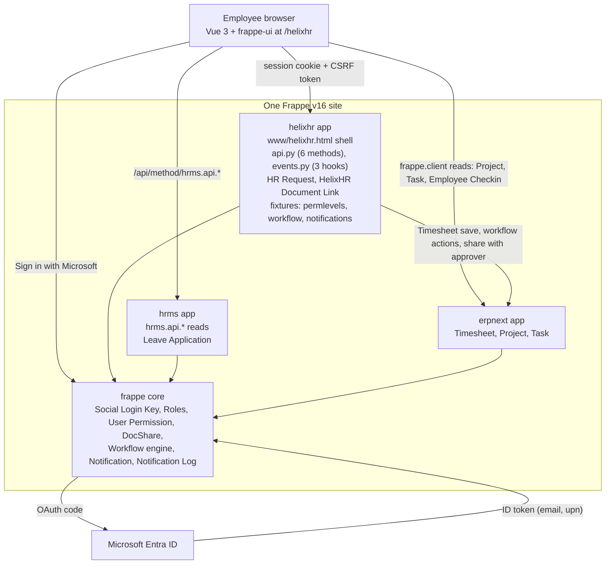
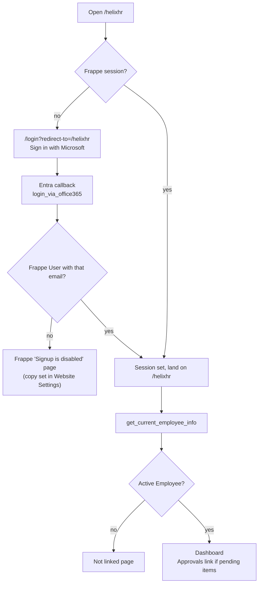
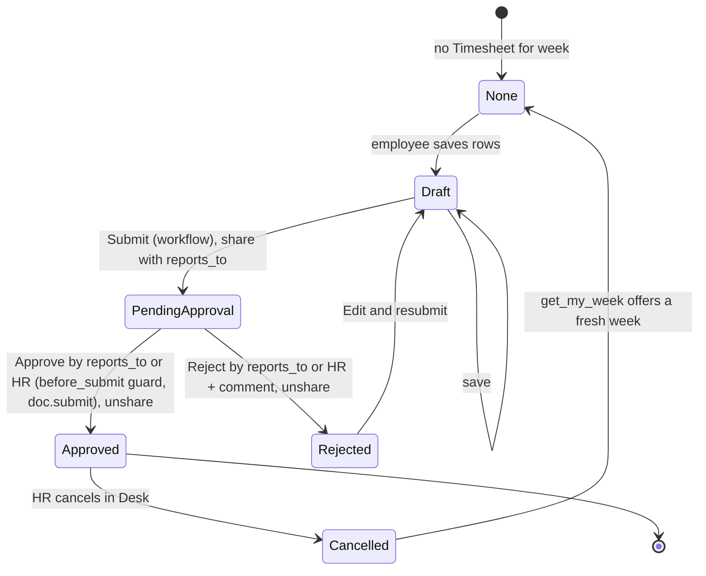

# HelixHR Employee Portal Phase 1 - Plan

## Goal Capsule

- **Objective:** Ship phase 1 of the HelixHR Employee Portal as one custom Frappe app named `helixhr`, installed on the existing Frappe v16 + Frappe HR v16 + ERPNext v16 site, with a Vue 3 + frappe-ui web app served at `/helixhr`.
- **Authority hierarchy:** `HelixHR_Portal-Project-Brief.md` decisions D1 to D19 win on product behavior. This plan wins on implementation. Repo conventions in `CLAUDE.md` win on code style, except where KTD8 overrides the package manager.
- **Execution profile:** One developer. Units land in the order given in Sequencing, one commit or small PR per unit. Every unit ends with its tests green on the disposable `test_site`.
- **Stop conditions:** Stop and ask the user if (a) a settled decision cannot work (for example Social Login Key cannot match Entra users), (b) a change to Frappe, HRMS, or ERPNext core code seems required, (c) an employee can read or write another employee's data through any route, or (d) a unit needs a new dependency not named in this plan.
- **Tail ownership:** `ce-work` owns build, test, commit, and the final review. The user owns Azure app registration and production Social Login Key secrets.

---

## Product Contract

### Summary

Build a simple, mobile-first employee portal inside Frappe. Employees log in with Microsoft, then handle leave, attendance, timesheets, profile, requests, documents, and notifications on a few plain screens. Managers get one approvals page. Frappe HR stays the only source of truth and the only place for HR administration.

### Problem Frame

Frappe HR Desk is an administration tool. Employees must learn DocTypes, menus, and workflow words to do simple tasks. Frappe ships a small employee mobile app at `/hrms`, but it lacks timesheets, requests, and documents, and its look cannot be changed. The company has 100 to 200 people in India and the USA and one developer. The portal must be small, safe, and easy to keep.

### Requirements

**Access and identity**
- R1. Employees sign in with Microsoft Entra ID through Frappe's built-in Office 365 Social Login Key. No custom auth code.
- R2. Self sign-up is off. Only pre-created Frappe Users can log in. An unknown email sees a "not set up" message.
- R3. A logged-in user with no active Employee record sees a friendly "not linked" page, not an error.
- R4. Every server call runs as the logged-in Frappe user. The browser never holds API keys or tokens.
- R5. A logged-in employee can only read and write data Frappe permissions allow for that employee.

**Dashboard**
- R6. The home screen shows name, designation, department, manager, location, leave balances, this month's attendance summary, this week's timesheet status, my pending items, and unread notification count.
- R7. Every dashboard number links to its page. Quick actions: Apply Leave, Fill Timesheet, New Request.

**Profile**
- R8. Employees view their employment information read-only.
- R9. Employees edit only these fields: personal mobile, personal email, current address, permanent address, emergency contact name, relation, and phone.
- R10. Sensitive Employee fields are locked by permission level so the Employee Self Service role cannot change them by any route, including the plain REST API. Bank, salary, passport, and tax identifiers are not even readable by that role.
- R11. A locked field shows an "Ask HR" link that opens a pre-filled HR Request.

**Leave**
- R12. Employees see balances, history, pending applications, status, and the approver's name.
- R13. Employees apply for leave with type, dates, optional half day, and reason. Frappe validates everything. The portal never computes leave validity.
- R14. Employees can withdraw a leave that is still a draft or pending. Approved leave goes through an HR Request.
- R15. The ten most common Frappe leave errors are shown as plain sentences. Other errors show Frappe's text stripped of markup.

**Attendance**
- R16. Employees see a month calendar with attendance status, check-in and check-out times, a monthly summary, and exceptions (absent, half day, late, missing).

**Timesheets**
- R17. Employees see the current week (Monday to Sunday), add rows with project, task, hours, and note, save a draft, and submit.
- R18. Only projects the employee may book time on appear. A project is required on every row.
- R19. Timesheet approval uses a Frappe Workflow. Approver is the employee's `reports_to` manager, with HR Manager as fallback. Nobody can approve their own timesheet by any route. A rejected timesheet can be edited and resubmitted without amend.
- R20. Employees see previous timesheets and their status.

**Requests and documents**
- R21. Employees create an HR Request with category (HR Letter, IT / Asset, Payroll Question, Other), subject, details, and optional private file.
- R22. Employees see their requests with status (Open, In Progress, Done, Rejected) and HR's note. Only HR can change status and note. HR works requests in Desk and is notified on creation.
- R23. Employees see a list of document links filtered by their company. SharePoint enforces access.

**Notifications and approvals**
- R24. A bell shows the unread count and a list of status changes for leave, timesheets, and requests. Notifications are in-portal only.
- R25. Managers see pending Leave Applications and Timesheets where they are the approver, and can approve or reject. Reject requires a comment.
- R26. A manager never sees their own requests in the approvals list. The server, not the portal, checks who may approve.

**Platform and quality**
- R27. Everything lives in one repo that is one Frappe app. Installing the app and running `bench migrate` applies all fixtures.
- R28. Frappe, HRMS, and ERPNext core code is never modified.
- R29. Screens are mobile first, WCAG AA, keyboard friendly, and use plain words. No Frappe terms are shown to employees.
- R30. Every API method, every permission lock, and every approval guard has a Python test. The main screens have Playwright tests.

### Key Decisions

- **Frappe stays the engine.** The portal adds screens, six thin methods, and three small document event hooks. Governs R4, R5, R13, R28.
- **Reuse before build.** Existing `hrms.api` methods, Frappe Workflow, Notification, Notification Log, DocShare, Property Setter, and User Permission are used as they are. Governs R10, R12, R16, R19, R24.
- **Phase 1 is employee-first plus one approvals page.** No team views, no HR screens, no AI. Governs R25, R26.

### Actors

- A1. Employee: any active Employee with the Employee Self Service role and a User Permission on their own Employee record.
- A2. Manager: an Employee who is `reports_to` or `leave_approver` for others. Same portal, plus the Approvals page.
- A3. HR Manager: works HR Requests, configures workflows, and is the approval fallback. Works in Frappe Desk.

### Acceptance Examples

- AE1. **Locked field via API.** Covers R10. Given an employee with the Employee Self Service role, when they PUT `department` on their own Employee record through `/api/resource`, then the call succeeds but `department` is unchanged. When they read `bank_ac_no`, they get nothing.
- AE2. **Apply leave.** Covers R13, R15. Given an employee with 0 casual leave left, when they submit a casual leave for tomorrow, then no Leave Application is created and the screen says "You do not have enough Casual Leave for these dates."
- AE3. **Weekly timesheet round trip.** Covers R17, R19, R25. Given a draft week with two rows, when the employee submits, then the manager sees it on Approvals, rejects it with a comment, and the employee sees "Sent back" with the comment and can edit and resubmit the same document.
- AE4. **Wrong manager.** Covers R26. Given manager B who is not `reports_to` for employee A, when B calls the approve action on A's timesheet, then Frappe refuses and the timesheet stays pending.
- AE5. **Not linked.** Covers R3. Given a Frappe User with no active Employee, when they open `/helixhr`, then they see the "not linked" page and no API errors.
- AE6. **No self-approval.** Covers R19. Given an employee's own timesheet in Draft or Pending Approval, when the employee calls `frappe.client.submit` or PUTs `workflow_state` = Approved on it, then Frappe refuses and the state is unchanged.

### Scope Boundaries

**In scope:** everything in Requirements above.

**Deferred to Follow-Up Work** (small, decided later, not in phase 1 units):
- Redirect or hide the stock `/hrms` mobile app. Phase 1 leaves it reachable.
- Web app manifest and service worker (`vite-plugin-pwa`).
- Dark mode.
- Content Security Policy header via an `after_request` hook or nginx.
- Real-time unread count over socket.io. Phase 1 polls.
- Auto-save of half-filled forms.
- Email and Teams notifications. Turn on later by adding channels to the same Notification documents.
- A `HelixHR Settings` single DocType (for example an assistant kill switch). Not needed until phase 2.

**Deferred for later** (phase 2, from the brief): AI HR Assistant, team attendance and leave calendar, employee directory, Travel Request, expense claims, salary slips, onboarding, performance.

**Outside this product's identity:** HR configuration, payroll, leave policy, shifts, attendance devices and imports, users and roles, workflow design, reports, recruitment, accounting, any direct database access from the browser, any Frappe API key in the browser.

### Sources

- `HelixHR_Portal-Project-Brief.md` (v2, decisions D1 to D19)
- `docs/frappe-hr-research.md` (what Frappe already provides, with source links)
- `docs/ai-assistant-phase2.md` (why the API methods stay small and session-scoped)

---

## Planning Contract

### Key Technical Decisions

- KTD1. **One Frappe app holds both Python and the Vue app.** Repo root is the app. Python in `helixhr/`, Vue in `frontend/`, build output in `helixhr/public/helixhr/`, shell page in `helixhr/www/helixhr.html`, route rule in `helixhr/hooks.py`. This is how `frappe/hrms`, Helpdesk, and CRM are built. (session-settled: user-directed — chosen over two repos or a separate website: one install, same-origin cookies, no CORS, one deploy.)
- KTD2. **Vue 3 + frappe-ui + Tailwind + Vite from `frappe-ui-starter`.** Use the `frappe-ui/vite` plugin with `frontendRoute`, `buildConfig.outDir`, `baseUrl`, and `indexHtmlPath`. Write new code against the composables `useDoc`, `useList`, `useCall`, not the older `createResource` layer. Check frappe-ui's own components (for example its calendar) before writing one. (session-settled: user-approved — chosen over plain Frappe web pages: modern app feel, Frappe's own toolkit.)
- KTD3. **Login is Frappe's Social Login Key, provider Office 365.** Frappe resolves the email from the ID token claims `email`, then `upn`, then `unique_name`, and matches a Frappe User. Set Website Settings "Disable Signup" and System Settings "Disable Username/Password Login" on production. The Social Login Key holds a secret, so it is configured by hand and documented in the runbook, never shipped as a fixture. (session-settled: user-approved — chosen over custom OAuth code: zero auth code to maintain.)
- KTD4. **Post-login landing.** Send users to `/login?redirect-to=/helixhr`. Only same-origin paths are accepted in `redirect-to`. Frappe has an open bug where `redirect-to` can be lost on the social login round trip (frappe/frappe#27672). Fallback: `helixhr/www/helixhr.py` is the landing page and Website Settings "Home Page" is set to `/helixhr`. Verify in U3 before building on it.
- KTD5. **Authorization is Frappe's.** Employee Self Service role plus User Permission on Employee. Every `helixhr.api` method resolves the employee from the session with `hrms.api.get_current_employee()` and never accepts an `employee` parameter. Every method that changes data is `methods=["POST"]` only, because Frappe skips CSRF checks on GET. Methods are small, typed, and named by intent so the phase 2 assistant can reuse them unchanged. (session-settled: user-approved — chosen over a custom API layer: fewer endpoints, Frappe checks every call.)
- KTD6. **Field lock is two permission levels plus an allow-list method.** Permission level applies per level, not per field, so two levels are needed. Permlevel 1 = visible but locked: company, department, designation, branch, reports_to, employment_type, status, date_of_joining, date_of_birth, gender, holiday_list, grade, default_shift, and every Table field on Employee. Employee Self Service reads permlevel 1. Permlevel 2 = HR only: salary_mode, bank_name, bank_ac_no, passport and tax identifier fields. Employee Self Service has no access to permlevel 2. HR Manager, HR User, and System Manager get read and write on both levels so Desk keeps working. Frappe silently resets a higher-level field written by a lower-level user, so tests assert "value unchanged", not "request rejected". `update_my_profile` loads the Employee with `frappe.get_doc`, applies only allow-listed keys, and calls `save()` as the session user, so `validate` runs and a Version row is written. (session-settled: user-approved — chosen over UI-only hiding: the ESS role has write on Employee, so a UI lock alone is not a lock.)
- KTD7. **Timesheet Workflow with Rejected as a draft state and two guards.** States: Draft (docstatus 0, edit by Employee Self Service), Pending Approval (docstatus 0, edit by HR Manager only), Approved (docstatus 1), Rejected (docstatus 0, edit by Employee Self Service). Transitions: Submit (Employee Self Service, refused when `reports_to` is empty), Approve and Reject (Employee Self Service with the condition "the timesheet's employee reports to the acting user's employee", and HR Manager with no condition as fallback), Edit (Rejected to Draft, Employee Self Service). Approve performs `doc.submit()` so ERPNext validations run. `allow_self_approval` is off. Two document event hooks in `helixhr` make this safe: on entering Pending Approval the timesheet is shared with the `reports_to` user with write and submit (the manager's User Permission would otherwise hide it), and a `before_submit` guard refuses any submit unless the acting user is that manager or HR Manager or System Manager (Frappe's own submit path would otherwise jump to Approved without checking the transition). Shares are removed on Approved or Rejected. HR cancelling an Approved timesheet in Desk is allowed; `get_my_week` then offers a fresh week. Shipped as Workflow fixtures plus the two hooks. Chosen over a submitted Rejected state: amend flow is confusing and doubles document names.
- KTD8. **`yarn` inside `frontend/`, not `pnpm`.** `bench build` shells out to `yarn`, and `frappe-ui-starter` ships a yarn lockfile. This overrides the repo-wide `pnpm` preference in `CLAUDE.md` for this one folder. Note the reason in `frontend/README.md`.
- KTD9. **In-portal notifications come from four Frappe Notification documents with channel System Notification.** One per DocType on Value Change of `status` or `workflow_state`: Leave Application (recipient owner), Timesheet (recipient the `user` field, set by `save_my_week`), HR Request (recipient owner). Plus one on new HR Request to the HR Manager role with subject category and employee name only, no details. Subjects are Jinja templates in plain words. The Notification template context exposes comments, so the rejection comment needs no code. Each writes a Notification Log row. The bell reads `frappe.desk.doctype.notification_log.notification_log.get_notification_logs` and `mark_all_as_read`. Chosen over HRMS PWA Notification (built for mobile push) and over a Python hook (a Notification record is zero code and "email later" is a checkbox on it).
- KTD10. **One week equals one Timesheet.** `get_my_week` returns the newest non-cancelled Timesheet whose `start_date` is the week's Monday, or nothing. The portal never creates a second timesheet while one exists. `save_my_week` sets `employee`, `user`, `start_date`, and `end_date` explicitly. Rows are validated in the portal to 0.25 to 24 hours per row and 24 per day. `# ponytail: client-side hour caps only; add a Server Script if HR needs a policy.`
- KTD11. **Bookable projects come from `get_my_projects`.** ERPNext Project has no "who may book" API. The Project Users child table only drives document sharing. `get_my_projects` returns open Projects where the session user is in Project Users or has a User Permission on Project, with their open Tasks. This is one of the six new methods.
- KTD12. **Design system first.** U1 runs the local `/ui-ux-pro-max` and `/hallmark` design pass before any screen is built. Output is `docs/design-system.md` plus a Tailwind theme that extends frappe-ui's preset (`frappe-ui/src/utils/tailwind.config`). Screens use frappe-ui components themed by that preset. `/impeccable` runs once at the end (U11). (session-settled: user-directed — chosen over frappe-ui defaults with a light theme: the user wants the best UI.)
- KTD13. **Tests: Python `IntegrationTestCase` plus Playwright.** `FrappeTestCase` is deprecated in v16 and removed in v17, so all tests use `frappe.tests.IntegrationTestCase`. Employees in tests come from `erpnext.setup.doctype.employee.test_employee.make_employee`, and the test helper asserts that each test user has a User Permission on their Employee. Playwright logs in once per role through `POST /api/method/login` and reuses `storageState` files for an employee and a manager. Both suites run against a disposable `test_site` on the Docker bench. Phase 1 has four Playwright specs. (session-settled: user-directed — chosen over a manual checklist for screens.)
- KTD14. **Local Docker dev bench with v16.** Use `frappe_docker` development setup with `apps.json` for `erpnext` and `hrms` on `version-16`, then bind-mount this repo into `apps/helixhr`. Frappe's Docker docs list stale version pins, so read `requires-python` and `engines` from the version-16 branches before choosing base images. (session-settled: user-approved — chosen over building against the real site: no risk to real employee data.)
- KTD15. **Fixtures, not patches, for configuration.** Property Setter, Custom DocPerm, Workflow, Workflow State, Workflow Action Master, and Notification are shipped as fixtures filtered to this app's records. Frappe can load Property Setters before Custom Fields, so U5 verifies a clean install on a new site. Custom Fields are not planned; if one becomes needed, it must be installed before the Property Setters that touch it.
- KTD16. **Rate limiting is narrow.** Only `update_my_profile` gets Frappe's rate limiter, keyed per user, not per IP, because one office network would share an IP bucket. Everything else relies on the site-level `rate_limit` in `site_config.json`, documented in the runbook. Read the exact decorator signature in `frappe/rate_limiter.py` on the bench before use.
- KTD17. **Leave uses stock HRMS behavior, no custom Leave Workflow.** Leave Application status is Open, Approved, Rejected. Withdraw of a pending leave deletes the docstatus 0 document. If the site already has a Leave Workflow that submits pending leaves, withdraw becomes cancel. U6 checks the site's setup first.
- KTD18. **Three document event hooks, no core change.** Timesheet `on_update` (share with approver on Pending Approval, unshare after), Timesheet `before_submit` (approver guard), and File `before_insert` (when attached to an HR Request, force `is_private` and require write permission on that request, because Frappe lets a file's owner attach it to any document they can read). All three live in `helixhr/events.py` and are wired in `hooks.py`.
- KTD19. **Document links are one plain DocType.** `HelixHR Document Link` with title, url, company (optional), description. Employee Self Service has read. The Documents page uses `frappe.client.get_list` filtered to company empty or equal to the employee's company. Chosen over a Single settings DocType with a child table and a method: fewer parts.
- KTD20. **Session handling is minimal.** One error handler in `frontend/src/lib/api.js`: on 401 or 403 with `SessionExpired` or `AuthenticationError`, redirect to `/login?redirect-to=<current route>`; on 417 `CSRFTokenError`, reload the page so the new token is picked up. Logout is `POST /api/method/logout`. No custom session page.

### High-Level Technical Design

Component shape. The browser talks only to the Frappe site. Everything runs as the logged-in user. Timesheet writes go through `helixhr.api`; the browser reads Projects and Tasks directly.



Login and landing flow.



Timesheet lifecycle (KTD7, KTD10, KTD18).



### Output Structure

```text
HelixHR-Fronend/                     (this repo = the helixhr Frappe app)
  pyproject.toml
  README.md
  .github/workflows/ci.yml
  helixhr/
    __init__.py
    hooks.py                         website_route_rules, fixtures, doc_events
    modules.txt                      "HelixHR"
    api.py                           6 whitelisted methods
    events.py                        3 doc_event hooks (KTD18)
    utils.py                         allow-list, week helpers
    www/
      helixhr.html                   Vite writes the built shell here
      helixhr.py                     boot context (csrf_token, user)
    public/helixhr/                  build output, git-ignored
    fixtures/
      property_setter.json
      custom_docperm.json
      workflow.json
      workflow_state.json
      workflow_action_master.json
      notification.json
    helixhr/
      doctype/
        hr_request/
        helixhr_document_link/
    tests/
      utils.py                       test employee + manager, asserts User Permission
      test_install.py
      test_api_dashboard.py
      test_employee_permlevel.py
      test_api_profile.py
      test_leave_flow.py
      test_attendance_read.py
      test_api_timesheet.py
      test_hr_request.py
      test_notifications.py
      test_api_approvals.py
  frontend/
    package.json                     yarn
    vite.config.js                   frappe-ui/vite plugin
    tailwind.config.js               extends frappe-ui preset with HelixHR theme
    README.md
    src/
      main.js
      router.js
      App.vue
      pages/                         Dashboard, Profile, Leave, Attendance, Timesheet,
                                     TimesheetHistory, Requests, Documents,
                                     Notifications, Approvals, NotLinked
      components/
      lib/                           api.js, errorMap.js, dates.js
    tests/
      playwright.config.ts
      e2e/                           auth.setup.ts, login-dashboard.spec.ts, leave.spec.ts,
                                     profile-lock.spec.ts, timesheet-approval.spec.ts
  docs/
    design-system.md                 from U1
    runbook.md                       Azure app, Social Login Key, settings, roles, checks
```

The tree is a scope declaration. Per-unit `Files` lists are authoritative.

### Sequencing

Linear, one developer: U1, U2, U3, U4, U5, U6, U7, U8, U9, U10, U12, U11. U4 completes the tracer bullet: login, then dashboard with a real leave balance. U1 is documents only, so it delays U4 by its own length and nothing else.

### Assumptions

- The production site runs Frappe, HRMS, and ERPNext v16 (confirmed by the owner).
- Every employee has a Frappe User whose email equals their Entra sign-in email (brief D14).
- Every Employee Self Service user has a User Permission on their own Employee. Without it, Frappe shows that user every employee's data. The runbook carries a go-live check for this.
- HR Manager and HR User roles must keep editing all Employee fields in Desk. KTD6 grants them both permission levels.
- The site has no custom Leave Workflow. U6 verifies and adapts (KTD17).

---

## Implementation Units

### Unit Index

| U-ID | Title | Key files | Depends on |
|---|---|---|---|
| U1 | Design system and theme | `docs/design-system.md`, `frontend/tailwind.config.js` | none |
| U2 | App scaffold and Docker bench | `pyproject.toml`, `helixhr/hooks.py`, `frontend/vite.config.js` | none |
| U3 | Login, session, app shell, test auth, CI | `helixhr/www/helixhr.py`, `frontend/src/router.js`, `frontend/src/lib/api.js`, `frontend/tests/e2e/auth.setup.ts`, `.github/workflows/ci.yml`, `docs/runbook.md` | U2 |
| U4 | Dashboard (tracer bullet) | `helixhr/api.py`, `frontend/src/pages/Dashboard.vue` | U1, U3 |
| U5 | Employee field lock and profile | `helixhr/fixtures/property_setter.json`, `custom_docperm.json`, `helixhr/api.py`, `Profile.vue` | U4 |
| U6 | Leave | `frontend/src/pages/Leave.vue`, `frontend/src/lib/errorMap.js` | U4 |
| U7 | Attendance | `frontend/src/pages/Attendance.vue` | U4 |
| U8 | Timesheets, workflow, approver guards | `helixhr/fixtures/workflow*.json`, `helixhr/api.py`, `helixhr/events.py`, `Timesheet.vue` | U4 |
| U9 | HR Request and documents | `helixhr/helixhr/doctype/*`, `helixhr/events.py`, `Requests.vue`, `Documents.vue` | U4 |
| U10 | Notifications | `helixhr/fixtures/notification.json`, `Bell.vue`, `Notifications.vue` | U6, U8, U9 |
| U12 | Approvals | `helixhr/api.py`, `Approvals.vue`, `timesheet-approval.spec.ts` | U6, U8 |
| U11 | Polish, accessibility, release check | all pages, `docs/runbook.md` | U5 to U10, U12 |

### U1. Design system and theme

- **Goal:** Decide the look once: palette, type, spacing, component styles, plain-words copy rules, empty states, and mobile layout for every phase 1 screen.
- **Requirements:** R29, KTD12.
- **Dependencies:** none.
- **Files:** `docs/design-system.md` (create), `docs/design-system/screens.md` (one layout note per screen), `frontend/tailwind.config.js` (theme tokens, applied in U2 when the folder exists).
- **Approach:**
  1. Run the local `/ui-ux-pro-max` skill for product type "employee self-service HR portal", mobile first, two-country company, accessibility AA.
  2. Run `/hallmark` to produce the macrostructure for the screens listed in Output Structure. Keep to frappe-ui components; the theme is colors, type, radius, and spacing on top of frappe-ui's preset.
  3. Write the copy rules: verbs employees use ("Ask for leave", "Sent back", "Waiting for [manager]"), never Frappe words.
  4. List the ten plain error sentences for R15 as a table in `docs/design-system.md`. U6 codes them.
- **Patterns to follow:** frappe-ui component set at ui.frappe.io. HRMS mobile app for information density on a phone.
- **Test scenarios:** Test expectation: none -- design artifact. U11 checks contrast and focus on the real screens.
- **Verification:** `docs/design-system.md` names the palette with contrast ratios, the font stack, one component style per frappe-ui component used, and the ten error sentences. Each screen has a short layout note.

### U2. App scaffold and Docker bench

- **Goal:** A working empty app that installs on a v16 bench and serves a Vue page at `/helixhr` on the dev site.
- **Requirements:** R27, KTD1, KTD2, KTD8, KTD14.
- **Dependencies:** none.
- **Files:** `pyproject.toml`, `helixhr/__init__.py`, `helixhr/hooks.py`, `helixhr/modules.txt`, `helixhr/www/helixhr.html`, `helixhr/www/helixhr.py`, `frontend/package.json`, `frontend/vite.config.js`, `frontend/tailwind.config.js`, `frontend/src/main.js`, `frontend/src/App.vue`, `frontend/README.md`, `.gitignore`, `docker/README.md` (bench setup notes), `helixhr/tests/test_install.py`.
- **Approach:**
  1. Create the app with `bench new-app helixhr` inside the Docker bench, then move the generated files into this repo so the repo root is the app. Bind-mount the repo as `apps/helixhr`.
  2. Bench: `frappe_docker` development setup, `apps.json` with `erpnext` and `hrms` on `version-16`. Read `requires-python` and `engines` from those branches and pick matching images (KTD14). Create `dev_site` and `test_site` with all three apps.
  3. Frontend from `frappe-ui-starter` into `frontend/`. Configure the `frappe-ui/vite` plugin: `frontendRoute: '/helixhr'`, `outDir: '../helixhr/public/helixhr'`, `baseUrl: '/assets/helixhr/helixhr/'`, `indexHtmlPath: '../helixhr/www/helixhr.html'`. Add the `website_route_rules` entry for `/helixhr/<path:app_path>`.
  4. `www/helixhr.py` returns boot context with `csrf_token` and the user. Confirm whether the dev proxy needs `ignore_csrf`; the research says probably not. Record the answer in `frontend/README.md`.
  5. Apply the U1 theme tokens to `tailwind.config.js` using frappe-ui's preset.
  6. Tooling: `ruff` for Python, `eslint` and `prettier` from the starter.
- **Execution note:** Smoke first. The proof is a logged-in user seeing the Vue page at `/helixhr` on the dev site and the install test green locally.
- **Patterns to follow:** `frappe/hrms` repo layout (`hrms/` plus `frontend/`) and its `hooks.py` route rules.
- **Test scenarios:**
  - App installs on a fresh `test_site` and `bench migrate` completes with no error.
  - `GET /helixhr` as a logged-in user returns the shell page with the built assets.
  - `GET /helixhr` as Guest redirects to `/login`.
- **Verification:** `bench --site test_site run-tests --app helixhr` passes with the install test. `cd frontend && yarn build` writes to `helixhr/public/helixhr/` and updates `helixhr/www/helixhr.html`.

### U3. Login, session, app shell, test auth, CI

- **Goal:** Users sign in with Microsoft on staging, with a password on dev, land on `/helixhr`, and see the app shell. Users without an Employee see the not-linked page. Expired sessions redirect to login. Playwright can log in as two roles. CI runs everything.
- **Requirements:** R1, R2, R3, R4, KTD3, KTD4, KTD13, KTD20.
- **Dependencies:** U2.
- **Files:** `helixhr/www/helixhr.py`, `frontend/src/router.js`, `frontend/src/App.vue`, `frontend/src/lib/api.js`, `frontend/src/pages/NotLinked.vue`, `frontend/tests/e2e/auth.setup.ts`, `frontend/tests/playwright.config.ts`, `frontend/tests/e2e/login-dashboard.spec.ts` (skeleton, completed in U4), `helixhr/tests/utils.py`, `.github/workflows/ci.yml`, `docs/runbook.md`.
- **Approach:**
  1. Router guard: on app load call `hrms.api.get_current_employee_info`. No session leads to `/login?redirect-to=/helixhr`. Session without an active Employee leads to `NotLinked.vue`. Otherwise load the shell with the bottom nav (phone) or side nav (desktop) from U1.
  2. Verify the `redirect-to` round trip on the dev bench with a password login and on staging with Entra. If it fails, apply the KTD4 fallback and record which path is live in the runbook. Accept only same-origin paths in `redirect-to`.
  3. `api.js`: frappe-ui `setConfig` with `frappeRequest`, plus the KTD20 error handler (401 or 403 session errors redirect to login with the current route; 417 reloads). Logout button posts to `/api/method/logout`.
  4. `docs/runbook.md`: Azure app registration steps (Web platform, redirect URI `/api/method/frappe.integrations.oauth2_logins.login_via_office365`, `email` optional claim, client secret), Social Login Key fields, Website Settings "Disable Signup" and its message copy, System Settings "Disable Username/Password Login" for production only, `X-Forwarded-Proto` so cookies are marked Secure behind the proxy, and how to create a test employee and manager on `test_site` with password login.
  5. Playwright: `auth.setup.ts` posts to `/api/method/login` for `employee@test` and `manager@test`, saves two `storageState` files. `playwright.config.ts` has a setup project and two dependent projects. `helixhr/tests/utils.py` creates the same two users and employees with `make_employee`, manager set as `reports_to` and `leave_approver`, and asserts each has a User Permission on their Employee.
  6. CI: copy the shape of `frappe/hrms` `ci.yml`: MariaDB service, bench init with v16, install apps, `bench --site test_site run-tests --app helixhr`, `yarn lint`, `yarn build`, and a Playwright job against `test_site`.
- **Execution note:** Verify the redirect and session behavior by hand on the bench before writing the guard. This is where the upstream bug lives.
- **Patterns to follow:** HRMS `frontend/src/router.js` guard and `frontend/src/data/session.js`. Playwright "setup project with storageState" convention. `frappe/hrms` `ci.yml`.
- **Test scenarios:**
  - Covers AE5. User with no Employee opens `/helixhr` and sees the not-linked page; no API call returns an error toast.
  - User with an Employee whose status is Left sees the not-linked page.
  - Guest opening `/helixhr/leave` lands on `/login` and after login returns to `/helixhr/leave` (or the KTD4 fallback landing; the test asserts the documented behavior).
  - `redirect-to` set to an external URL is ignored and the user lands on `/helixhr`.
  - Session cookie deleted mid-session, then a click, redirects to login and returns to the same route after login.
  - Playwright setup produces two storageState files and the employee project can load `/helixhr` without a login page.
  - Playwright on staging: the `sid` cookie is HttpOnly, Secure, and SameSite.
- **Verification:** On dev, password login lands on the shell. On staging, "Sign in with Microsoft" with a known employee lands on the shell, and with an unknown email shows the signup-disabled page with the HR contact copy. CI is green including the Playwright setup project.

### U4. Dashboard (tracer bullet)

- **Goal:** One screen with the employee's real numbers, all from Frappe. Completes login to dashboard with a real leave balance.
- **Requirements:** R6, R7, KTD5, KTD9.
- **Dependencies:** U1, U3.
- **Files:** `helixhr/api.py` (`get_dashboard`), `helixhr/tests/test_api_dashboard.py`, `frontend/src/pages/Dashboard.vue`, `frontend/src/components/StatCard.vue`, `frontend/src/components/QuickActions.vue`, `frontend/tests/e2e/login-dashboard.spec.ts`.
- **Approach:**
  1. `get_dashboard()` is whitelisted, GET only, resolves the employee with `hrms.api.get_current_employee()`, and returns one JSON object: employee header fields, leave balances from `hrms.api.get_leave_balance_map`, this month's attendance counts from `get_attendance_calendar_events`, this week's timesheet state (null until U8 lands), pending counts (my open leave, my open requests, approvals waiting for me), and unread count from Notification Log. Each section is wrapped so one failure returns null for that card, not an error for the page.
  2. `Dashboard.vue` renders one card per section with the U1 styles, an empty state per card, and links to the pages. Quick actions row.
  3. Show dates with the user's Frappe date format and time zone through frappe-ui's date helpers.
- **Patterns to follow:** HRMS `frontend/src/views/Home.vue` for card layout. `hrms.api.get_current_employee` for the session lookup.
- **Test scenarios:**
  - Employee with a Leave Allocation sees the same balance number that `get_leave_balance_map` returns.
  - Employee with no allocation gets `leave_balances` as an empty object and the card shows "No leave set up yet."
  - Employee A calling `get_dashboard` never sees employee B's data even if B's name is passed as a query argument (argument is ignored).
  - Guest calling `get_dashboard` gets a permission error.
  - One failing section (simulate by removing the Holiday List) returns null for that card and the rest of the payload is intact.
  - Covers R6. Playwright: employee logs in, sees name, department, manager, and a leave balance card with a number.
- **Verification:** `login-dashboard.spec.ts` passes against `test_site`. Python tests pass. The dashboard renders on a 360 px wide phone view without horizontal scroll.

### U5. Employee field lock and profile

- **Goal:** Employees can change only their contact fields. Locked fields cannot be changed by any route. HR-only fields cannot even be read. HR keeps full edit rights in Desk.
- **Requirements:** R8, R9, R10, R11, KTD6, KTD15, KTD16.
- **Dependencies:** U4.
- **Files:** `helixhr/fixtures/property_setter.json`, `helixhr/fixtures/custom_docperm.json`, `helixhr/hooks.py` (fixtures filters), `helixhr/utils.py` (allow-list), `helixhr/api.py` (`update_my_profile`), `helixhr/tests/test_employee_permlevel.py`, `helixhr/tests/test_api_profile.py`, `frontend/src/pages/Profile.vue`, `frontend/tests/e2e/profile-lock.spec.ts`.
- **Approach:**
  1. Read the live Employee field list on the bench, including Table fields and site-specific tax and passport fields. Assign permlevel 1 and permlevel 2 per KTD6 with Property Setters.
  2. Custom DocPerm rows: HR Manager, HR User, System Manager read and write on permlevel 1 and 2. Employee Self Service read on permlevel 1 only.
  3. `update_my_profile(**fields)` is POST only, rate limited per user, resolves the employee from the session, drops any key not in the allow-list, loads the document, updates, and saves as the session user. Returns the updated fields.
  4. `Profile.vue`: read-only block, editable block with inline save, and "Ask HR" link on every locked field that opens Requests with category and subject pre-filled.
  5. Install the fixtures on a fresh `test_site` to prove ordering and idempotence (KTD15). Run `bench migrate` twice.
- **Execution note:** Write the permlevel tests first. They are the security proof for the whole portal.
- **Patterns to follow:** Frappe fixtures docs for Property Setter and Custom DocPerm. Frappe's `validate_higher_perm_levels` in `frappe/model/document.py` explains the silent reset.
- **Test scenarios:**
  - Covers AE1. As an ESS user, PUT `department` on own Employee via `/api/resource`. Response is success. `department` is unchanged in the database.
  - As an ESS user, `frappe.client.get_value` for `bank_ac_no` on own Employee returns nothing, and the field is absent from `/api/resource/Employee/<own id>`.
  - As an ESS user, `frappe.client.set_value` on a child row of an Employee Table field is reset.
  - As an ESS user, `update_my_profile(cell_number=...)` changes the number and writes a Version row.
  - As an ESS user, `update_my_profile(department=...)` returns success with `department` absent from the response and unchanged in the database.
  - As an ESS user, `update_my_profile(personal_email="not-an-email")` raises a validation error with a plain message.
  - Employee A cannot change employee B by passing B's name in any argument.
  - As HR Manager in Desk, editing `department` and `bank_ac_no` on any Employee still saves.
  - The rate limit triggers after the configured number of calls per minute for one user and returns a 429; a second user is not affected.
  - `bench migrate` on a clean site installs all Property Setters and DocPerms; running it again changes nothing.
  - Playwright: locked field is read-only and its "Ask HR" link opens a pre-filled request form.
- **Verification:** All Python tests pass on a fresh `test_site`. HR Manager can still edit every Employee field in Desk on `dev_site`.

### U6. Leave

- **Goal:** Employees see balances and history, apply for leave, and withdraw pending leave, with Frappe doing all validation and the portal speaking plainly.
- **Requirements:** R12, R13, R14, R15, KTD17.
- **Dependencies:** U4.
- **Files:** `frontend/src/pages/Leave.vue`, `frontend/src/components/LeaveForm.vue`, `frontend/src/lib/errorMap.js`, `frontend/src/lib/errorMap.test.js` (vitest, from the starter), `frontend/tests/e2e/leave.spec.ts`, `helixhr/tests/test_leave_flow.py`.
- **Approach:**
  1. Check the site for a Leave Application Workflow. None expected. If one exists with pending at docstatus 1, withdraw uses cancel instead of delete (KTD17) and the plan note is updated.
  2. Reads: `hrms.api.get_leave_balance_map`, `get_leave_applications`, `get_leave_types(employee, date)`, `get_holidays_for_employee`, `get_leave_approval_details`.
  3. Apply: insert a Leave Application with `frappe.client.insert` carrying employee, leave_type, from_date, to_date, half_day, half_day_date, description, and leave_approver from approval details. Then re-read and show `total_leave_days` and status "Waiting for [approver]".
  4. Withdraw: for docstatus 0 with status Open call `frappe.client.delete`. Approved leave shows "Ask HR" only.
  5. `errorMap.js`: ten regex to plain sentence pairs from U1. Fallback strips HTML from Frappe's message. Rejection reason comes from the latest Comment on the document.
- **Patterns to follow:** HRMS `frontend/src/views/leave/` forms and its use of `get_leave_types`.
- **Test scenarios:**
  - Covers AE2. Zero balance: no Leave Application is created and the plain sentence for insufficient balance is shown.
  - Valid one-day leave creates a Leave Application with status Open and the correct approver, and the list shows "Waiting for [approver]".
  - Half-day leave sends `half_day` and `half_day_date` and shows `total_leave_days` as 0.5.
  - Leave overlapping an existing one shows the plain overlap sentence.
  - Inserting a Leave Application with another employee's id is refused by Frappe (User Permission).
  - Withdraw on a pending leave deletes it and it disappears from the list. Withdraw is not offered on an approved leave.
  - Rejected leave shows the approver's comment as the reason.
  - `errorMap.test.js`: each of the ten Frappe messages maps to its sentence; an unknown message falls back to stripped text.
  - Playwright: apply for leave and see the waiting status.
- **Verification:** `leave.spec.ts` and Python tests pass. The ten error sentences match `docs/design-system.md`.

### U7. Attendance

- **Goal:** Employees see their attendance for a month at a glance.
- **Requirements:** R16.
- **Dependencies:** U4.
- **Files:** `frontend/src/pages/Attendance.vue`, `frontend/src/components/MonthCalendar.vue` (only if frappe-ui's calendar does not fit), `helixhr/tests/test_attendance_read.py`.
- **Approach:** Month view from `hrms.api.get_attendance_calendar_events(from_date, to_date)` plus a day drawer listing Employee Checkin rows for that day read with `frappe.client.get_list` filtered by the session employee (User Permission filters it). Summary counts by status. Exceptions colored with the U1 palette and a word. Check frappe-ui's calendar component first (KTD2).
- **Patterns to follow:** HRMS `frontend/src/views/attendance/` calendar.
- **Test scenarios:**
  - Month with Present, Absent, Half Day, and Holiday shows the right count per status.
  - Employee A requesting checkins sees none of employee B's rows.
  - A month with no data shows the empty state, not an error.
  - Month navigation across a year boundary requests the right date range.
- **Verification:** Python read test passes. Manual check on phone width: calendar fits without horizontal scroll.

### U8. Timesheets, workflow, approver guards

- **Goal:** Employees fill one weekly timesheet, submit it, and resubmit after rejection. The workflow, the approver share, and the approver guard live in Frappe configuration plus two small hooks.
- **Requirements:** R17, R18, R19, R20, KTD7, KTD10, KTD11, KTD18.
- **Dependencies:** U4.
- **Files:** `helixhr/fixtures/workflow.json`, `helixhr/fixtures/workflow_state.json`, `helixhr/fixtures/workflow_action_master.json`, `helixhr/fixtures/custom_docperm.json` (Timesheet rows only if step 0 finds a gap), `helixhr/events.py` (Timesheet `on_update` share, `before_submit` guard), `helixhr/hooks.py` (doc_events), `helixhr/api.py` (`get_my_week`, `get_my_projects`, `save_my_week`), `helixhr/utils.py` (week helpers), `helixhr/tests/test_api_timesheet.py`, `frontend/src/pages/Timesheet.vue`, `frontend/src/components/WeekGrid.vue`, `frontend/src/pages/TimesheetHistory.vue`.
- **Approach:**
  0. On the bench, confirm Employee Self Service has create, read, write, and submit on Timesheet (HRMS grants these). Ship a Custom DocPerm fixture only if something is missing.
  1. Workflow fixtures per KTD7, including `allow_self_approval` off, HR Manager fallback on Approve and Reject, Pending Approval editable by HR Manager only, and the approver condition on the Employee Self Service transitions.
  2. `events.py`: Timesheet `on_update` shares the document with the `reports_to` user (write and submit) when `workflow_state` becomes Pending Approval and removes the share on Approved or Rejected. Timesheet `before_submit` refuses unless the acting user is that manager, HR Manager, or System Manager.
  3. `get_my_week(week_start)` returns the one Timesheet for that Monday with rows and workflow state, or an empty week. `get_my_projects()` per KTD11, with tasks per project. `save_my_week(week_start, rows)` (POST) inserts or updates the draft with explicit employee, user, start and end dates, and validates hours per KTD10. Submit, Edit, Approve, and Reject are workflow actions applied with `frappe.model.workflow.apply_workflow`; the employee's Submit is called from the page, and `save_my_week` refuses when `reports_to` is empty with the "Ask HR" copy.
  4. `Timesheet.vue`: week picker, grid of rows, save, submit, read-only states with plain words ("Waiting for manager", "Approved", "Sent back" with the comment and an "Edit and resubmit" button that applies the Edit transition).
  5. `TimesheetHistory.vue`: past weeks with state.
- **Execution note:** Write the wrong-manager and self-approval tests first (AE4, AE6). They prove the guards, which are the security part.
- **Patterns to follow:** HRMS `share_doc_with_approver` in `hrms/hr/utils.py` for the share hook. Frappe Workflow docs, `frappe.model.workflow.apply_workflow` and `get_transitions`. ERPNext Timesheet submit validations.
- **Test scenarios:**
  - Empty week returns no timesheet and `get_my_projects` lists only projects where the user is in Project Users or has a User Permission.
  - Save creates one Timesheet with `employee`, `user`, `start_date` Monday and `end_date` Sunday; a second save updates the same document.
  - POST `/api/resource/Timesheet` with another employee's id is refused by Frappe.
  - Row with 25 hours or a day total over 24 is refused with a plain message.
  - Row without a project is refused.
  - Submit on an employee with empty `reports_to` is refused with the "Ask HR" copy.
  - Submit moves the workflow state to Pending Approval, the document stays docstatus 0, and a DocShare with write and submit exists for the manager's user.
  - Manager can read the pending timesheet; a different manager cannot.
  - Covers AE3. Manager approve moves to Approved and docstatus 1 and removes the share. Manager reject with a comment moves to Rejected at docstatus 0 and removes the share; Edit returns it to Draft; resubmit works on the same document name.
  - Covers AE4. A manager who is not `reports_to` cannot apply Approve; the state stays Pending Approval.
  - Covers AE6. The employee calling `frappe.client.submit` on their own Draft or Pending timesheet is refused by the `before_submit` guard; PUT `workflow_state` = Approved is refused; the state is unchanged.
  - HR Manager can Approve a timesheet whose `reports_to` user has been disabled.
  - HR cancels an Approved timesheet in Desk; `get_my_week` then returns an empty week.
  - Week spanning two months saves and reads back correctly.
  - Fixtures install cleanly on a fresh site and `bench migrate` twice changes nothing.
- **Verification:** Python tests pass. On `dev_site`, the full round trip in AE3 works by hand with the two test users.

### U9. HR Request and documents

- **Goal:** Employees ask HR for things through one small form and find their documents through links.
- **Requirements:** R11, R21, R22, R23, KTD18, KTD19.
- **Dependencies:** U4.
- **Files:** `helixhr/helixhr/doctype/hr_request/` (json, py, test), `helixhr/helixhr/doctype/helixhr_document_link/` (json, py), `helixhr/events.py` (File `before_insert`), `helixhr/hooks.py` (doc_events), `helixhr/tests/test_hr_request.py`, `frontend/src/pages/Requests.vue`, `frontend/src/components/RequestForm.vue`, `frontend/src/pages/Documents.vue`.
- **Approach:**
  1. `HR Request`: fields employee (Link, `set_only_once`, set from session in `before_insert`), category (Select), subject, details, status (Select, default Open, permlevel 1), hr_note (permlevel 1). Permissions: Employee Self Service create, read, write on permlevel 0 with `if_owner`; the Employee User Permission filters lists through the employee link. HR Manager and System Manager get all on both levels. Track changes on.
  2. File `before_insert` hook per KTD18: when `attached_to_doctype` is HR Request, force `is_private` and require write permission on that request.
  3. `HelixHR Document Link` per KTD19 with Employee Self Service read and HR Manager write.
  4. Screens: request list with status words and HR note, request form with pre-fill from query parameters (used by U5's "Ask HR"), file attached after insert, documents list opening links in a new tab filtered to company empty or the employee's company.
- **Patterns to follow:** Frappe DocType controller hooks. `upload_file` with `docname` after insert.
- **Test scenarios:**
  - Employee creates a request; `employee` is set from the session even if a different value is posted.
  - Employee PUT `status` = Done on own request leaves it Open; PUT `hr_note` is ignored.
  - Employee A cannot read or list employee B's requests.
  - Attaching a file to another employee's request is refused.
  - Upload with `is_private` = 0 is stored private.
  - HR changes status to Done with a note in Desk; the employee list shows Done and the note.
  - Document links: company-less links and links for the employee's company are returned; none for the other company.
- **Verification:** Python tests pass. On `dev_site`, a request created in the portal appears in Desk for HR.

### U10. Notifications

- **Goal:** Employees see status changes in the portal bell. HR is told about new requests.
- **Requirements:** R22, R24, KTD9.
- **Dependencies:** U6, U8, U9.
- **Files:** `helixhr/fixtures/notification.json`, `helixhr/hooks.py` (fixtures filter), `helixhr/tests/test_notifications.py`, `frontend/src/components/Bell.vue`, `frontend/src/pages/Notifications.vue`.
- **Approach:**
  1. Four Notification fixtures per KTD9. Subject lines in plain words from U1. The HR Request one to HR Manager carries category and employee name only.
  2. `Bell.vue` reads `get_notification_logs` and `mark_all_as_read` (POST). Count refreshes on route change and every 60 seconds. `Notifications.vue` lists recent items with links to the pages.
- **Patterns to follow:** Frappe Notification docs (Value Change event, System Notification channel, Jinja subject with `doc` and comments in context).
- **Test scenarios:**
  - Leave approval writes a Notification Log row to the employee with the plain subject.
  - Timesheet rejection writes a Notification Log row to the timesheet's `user` that includes the comment.
  - HR Request status change writes a Notification Log row to the requester.
  - New HR Request writes a Notification Log row to an HR Manager user whose subject has no request details.
  - `mark_all_as_read` sets the count to zero.
  - Fixtures install cleanly and `bench migrate` twice changes nothing.
- **Verification:** Python tests pass. The bell count on `dev_site` changes after a leave approval.

### U12. Approvals

- **Goal:** Managers approve or reject leave and timesheets from one page. The server checks who may act.
- **Requirements:** R25, R26, KTD5, KTD7.
- **Dependencies:** U6, U8.
- **Files:** `helixhr/api.py` (`act_on_approval`), `helixhr/tests/test_api_approvals.py`, `frontend/src/pages/Approvals.vue`, `frontend/tests/e2e/timesheet-approval.spec.ts`.
- **Approach:**
  1. List: leave from `hrms.api.get_leave_applications(for_approval=True)`; timesheets from `frappe.client.get_list` on Timesheet with `workflow_state` Pending Approval (the U8 share makes the manager's reports visible). The page hides the manager's own documents; enforcement stays in Frappe.
  2. `act_on_approval(doctype, name, action, comment)` (POST): refuses Reject without a comment, adds the comment with Frappe's comment API, then applies the workflow action for timesheets or HRMS's leave approval path for leave, as the session user. Frappe's permission and workflow checks run unchanged.
  3. `Approvals.vue`: two lists, cards with the key facts, approve and reject buttons. Nav shows the Approvals link when the user has reports or pending items.
- **Execution note:** Write the wrong-manager test first (AE4) against `act_on_approval`.
- **Patterns to follow:** HRMS approvals views under `frontend/src/views/` for leave. `frappe.desk.form.utils.add_comment`.
- **Test scenarios:**
  - Manager's list contains a report's pending timesheet and leave and none of the manager's own documents.
  - Covers AE4. Manager B calling `act_on_approval` on A's report's timesheet is refused and the state is unchanged.
  - Reject without a comment is refused with a plain message.
  - Approve on leave sets status Approved and the employee sees it.
  - Playwright `timesheet-approval.spec.ts`: employee submits a week, manager rejects with a comment, employee sees "Sent back" and the comment, edits, resubmits, manager approves.
- **Verification:** Python tests and the Playwright spec pass.

### U11. Polish, accessibility, release check

- **Goal:** The portal looks finished, works on a phone, passes accessibility basics, and can be installed on staging from the runbook alone.
- **Requirements:** R27, R29, R30.
- **Dependencies:** U5 to U10, U12.
- **Files:** all pages under `frontend/src/pages/`, `docs/runbook.md`, `README.md`.
- **Approach:**
  1. Run `/impeccable` on the live `dev_site` for each screen. Fix contrast, focus, labels, empty states, and copy.
  2. Run `/ponytail-review` on the diff and delete what is not needed.
  3. Full Playwright run on `test_site` in CI. Lighthouse accessibility check on Dashboard and Leave at 360 px.
  4. Finish `docs/runbook.md`: install on staging, Azure app, Social Login Key, Disable Signup copy, Disable Username/Password Login, roles, the go-live check that every Employee Self Service user has a User Permission on their Employee (a short report query), enabling `apply_strict_user_permissions`, System Settings file limits (`allowed_file_extensions`, `max_file_size`), site-level `rate_limit`, how to add document links, and how to build the frontend for release.
  5. Install on staging from the runbook. Sign in with a real Entra account.
- **Test scenarios:** Test expectation: none -- polish and release. The four Playwright specs and all Python tests are the regression net.
- **Verification:** Lighthouse accessibility score of 95 or higher on Dashboard and Leave. All CI jobs green. A person following `docs/runbook.md` installs the app on staging and signs in with Microsoft without asking the developer.

---

## Verification Contract

| Gate | Command or check | Applies to | Passes when |
|---|---|---|---|
| Python tests | `bench --site test_site run-tests --app helixhr` | U2 to U10, U12 | All tests pass on a fresh `test_site` |
| Fixture idempotence | `bench --site test_site migrate` run twice | U5, U8, U9, U10 | Second run changes no records |
| Frontend lint and build | `cd frontend && yarn lint && yarn build` | U2 to U12 | No errors; build output lands in `helixhr/public/helixhr/` |
| Frontend unit tests | `cd frontend && yarn test` | U6 | `errorMap` tests pass |
| Browser tests | `cd frontend && npx playwright test` against `test_site` | U3, U4, U5, U6, U12 | Four specs pass with employee and manager storageState |
| Python lint | `ruff check helixhr` | all | No errors |
| Security proof | AE1, AE4, AE6 tests | U5, U8, U12 | Locked field unchanged and HR-only field unreadable; wrong manager refused; self-approval refused |
| Accessibility | Lighthouse on Dashboard and Leave at 360 px | U11 | Score 95 or higher |
| CI | `.github/workflows/ci.yml` | all | Green on the default branch |

---

## Definition of Done

**Global**
- All Verification Contract gates pass.
- Every R1 to R30 is covered by a shipped unit or listed in Scope Boundaries as deferred.
- No change to Frappe, HRMS, or ERPNext code. Only the `helixhr` app, its fixtures, and its three hooks.
- `docs/runbook.md` lets a person install and configure the app on staging without the developer.
- No `console.log`, no debug prints, no dead code from abandoned attempts.
- `/ponytail-review` run on the final diff.

**Per unit**
- Its test scenarios exist as tests and pass.
- Its Verification line is true.
- It is committed with a message that names the U-ID.

---

## System-Wide Impact

- **Employee doctype permission levels** (U5) change what HR sees in Desk. HR Manager, HR User, and System Manager get both levels so nothing is lost. Any other custom role that edits Employee on this site must be added before go-live. Check the site's roles in U5.
- **Timesheet Workflow and hooks** (U8) change how every Timesheet on the site moves, including any created in Desk. HR approves through the workflow action or as the fallback approver. The `before_submit` guard also applies to Desk submits.
- **File hook** (U9) only touches files attached to HR Request. Other uploads are unchanged.
- **Notification documents** (U10) write Notification Log rows that also appear in Desk's bell for HR users. This is expected.
- **User Permission is the whole authorization story.** An Employee Self Service user without a User Permission on their Employee sees everyone. The runbook check in U11 and the test helper assertion in U3 guard this.
- **Frappe HR upgrades** do not touch `helixhr` fixtures or hooks. HRMS API method signatures can change between versions; the Python tests will catch a break.
- **Future AI assistant** reuses the six `helixhr.api` methods. Keeping them session-scoped and typed is the only phase 1 obligation.

---

## Risks and Dependencies

| Risk | Mitigation |
|---|---|
| `redirect-to` lost on social login (frappe/frappe#27672) | Verify in U3 first; KTD4 fallback landing page |
| Entra token lacks `email` claim for some accounts | Frappe falls back to `upn`; runbook adds the `email` optional claim; HR aligns User emails (D14) |
| An ESS user has no User Permission on their Employee | U3 test helper asserts it; U11 runbook go-live check; `apply_strict_user_permissions` on |
| Property Setter fixtures applied before dependencies | No Custom Fields planned; U5 proves clean install twice |
| Duplicate timesheets created in Desk for one week | `get_my_week` picks the newest; HR guidance in runbook |
| Manager left or `reports_to` empty | HR Manager fallback on Approve and Reject; Submit refused when `reports_to` is empty |
| HRMS `get_current_employee` or other helper renamed in a future release | Tests import them directly and fail loudly; wrap in one place in `helixhr/api.py` |
| frappe_docker v16 version pins not documented | KTD14: read `requires-python` and `engines` from version-16 branches |
| `yarn` versus `pnpm` confusion | KTD8 and `frontend/README.md` state the rule |
| PII in test data | Test users are synthetic; `test_site` is disposable; no production data on dev |

---

## Open Questions

**Deferred to implementation** (answered on the bench, not blocking):
- Does the Vite dev proxy need `ignore_csrf` on v16? Record in `frontend/README.md` (U2).
- Exact `frappe.rate_limiter` decorator signature on v16 (U5).
- Exact frappe-ui Tailwind token names to override (U1, U2).
- Does frappe-ui ship a calendar component that fits the attendance month view (U7)?
- Does the site already have a Leave Application Workflow? Adjust withdraw per KTD17 (U6).
- Which Employee tax and identifier fields exist on this site's Employee doctype (U5).
- Does Employee Self Service already hold create, write, and submit on Timesheet on this site (U8 step 0)?

**Product:** none blocking.

---

## Appendix

### Research findings that changed this plan

- Frappe silently resets higher-permlevel fields written by lower roles instead of rejecting the request. Tests assert "unchanged" (KTD6).
- Permission level applies per level, not per field, so bank and tax fields need their own level that Employee Self Service cannot read (KTD6).
- A manager's User Permission hides their reports' timesheets. HRMS solves this for leave with a DocShare; the plan does the same for timesheets (KTD7, KTD18).
- Frappe's plain submit path sets the first docstatus 1 workflow state without checking the transition, so a `before_submit` guard is needed to stop self-approval (KTD7, KTD18).
- Frappe lets a file's owner attach it to any document they can read, so HR Request attachments get a `before_insert` check (KTD18).
- `FrappeTestCase` is deprecated in v16; use `frappe.tests.IntegrationTestCase` (KTD13).
- ERPNext Project Users only drives sharing; there is no "bookable projects" API, so `get_my_projects` is needed (KTD11).
- `frappe/hrms` CI runs Python tests only; Playwright is new infrastructure here (KTD13).
- `bench build` uses `yarn`, so the frontend uses `yarn` (KTD8).
- Notification Log is written by assign, share, and mention, not by workflow changes. Notification documents with the System Notification channel fill the gap (KTD9).
- A Workflow Rejected state at docstatus 0 avoids cancel and amend (KTD7).
- Frappe's rate limiter is per IP by default; an office network would share one bucket (KTD16).

### Sources

- Frappe HR repo, `hrms/api/__init__.py`, `hrms/hr/utils.py` (`share_doc_with_approver`): https://github.com/frappe/hrms
- frappe-ui Vite plugin: https://github.com/frappe/frappe-ui/blob/main/vite/README.md
- frappe-ui data fetching: https://ui.frappe.io/docs/data-fetching/resource
- Social logins: https://docs.frappe.io/framework/user/en/guides/deployment/how-to-enable-social-logins
- OAuth email resolution: https://github.com/frappe/frappe/blob/develop/frappe/utils/oauth.py
- redirect-to bug: https://github.com/frappe/frappe/issues/27672
- Permissions and DocShare: https://github.com/frappe/frappe/blob/version-16/frappe/permissions.py
- Workflow engine: https://github.com/frappe/frappe/blob/version-16/frappe/model/workflow.py
- Higher permlevel reset: https://github.com/frappe/frappe/blob/version-16/frappe/model/document.py
- File permissions: https://github.com/frappe/frappe/blob/version-16/frappe/core/doctype/file/file.py
- Rate limiter: https://github.com/frappe/frappe/blob/version-16/frappe/rate_limiter.py
- Migrating to v16 (tests): https://github.com/frappe/frappe/wiki/Migrating-to-version-16
- Notification Log API: https://github.com/frappe/frappe/blob/develop/frappe/desk/doctype/notification_log/notification_log.py
- ERPNext Project users behavior: https://github.com/frappe/erpnext/blob/develop/erpnext/projects/doctype/project/project.py
- frappe_docker development: https://github.com/frappe/frappe_docker/blob/main/docs/05-development/01-development.md
- Playwright storageState pattern: https://currents.dev/posts/testing-authentication-with-playwright-the-complete-guide
- Fixture ordering thread: https://discuss.frappe.io/t/new-fixtures-not-applied-with-bench-update-nor-bench-migrate/83546
