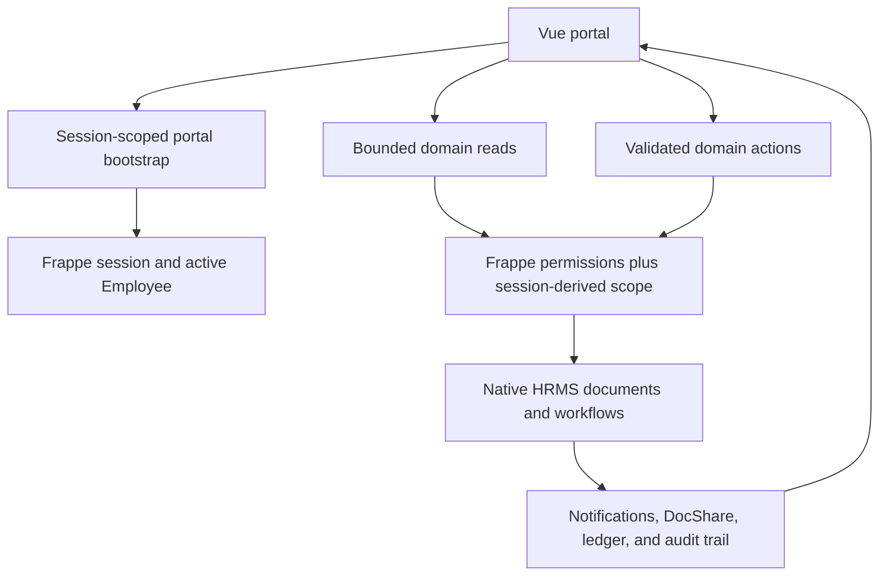
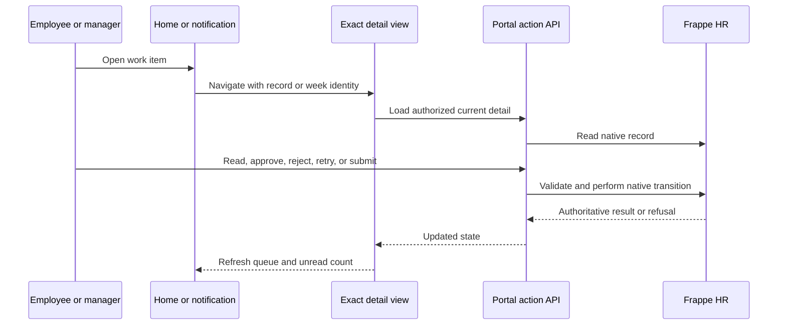
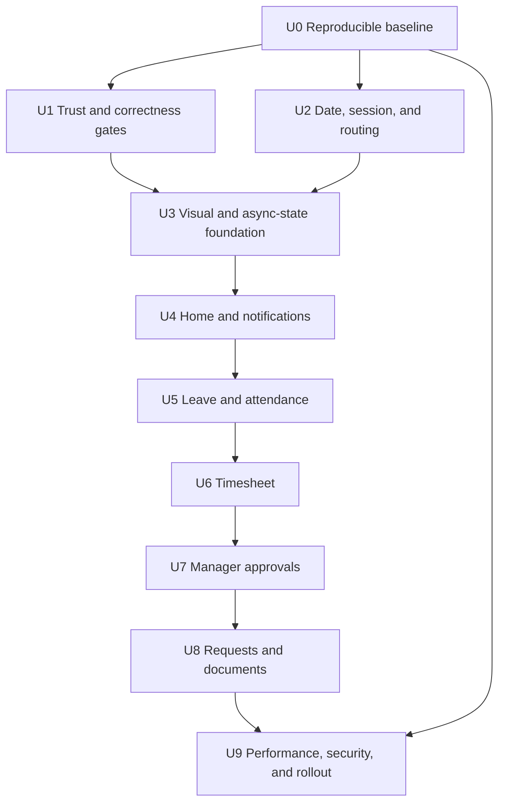

# HelixHR Portal Experience and Hardening - Plan

> **Identifier namespace.** R, KTD, U, and AE numbers in this plan are plan-local. The Phase 1 plan (`docs/plans/2026-09-02-001-feat-helixhr-portal-phase1-plan.md`) uses the same prefixes with different meanings, and about fifty code comments cite Phase 1 IDs (for example `R16` = attendance exceptions, `KTD7` = Timesheet workflow). Code, commit messages, and tests written for this plan must cite IDs as `P2-R12`, `P2-U6`, `P2-KTD7`; never bare. Never edit an existing Phase 1 citation to mean a Phase 2 ID.
>
> **File lists.** In each unit, files marked `(new)` do not exist yet. Everything else is an existing file to change.

## Goal Capsule

| Field | Direction |
|---|---|
| Objective | Employees and managers complete daily HR work quickly and confidently on a phone, with clear status, exact destinations, correct transactions, and no exposure outside their permitted records. |
| Means | Preserve the Signal visual identity and Frappe HR as the source of truth, fix trust defects first, deepen the existing workflows, then meet measured performance and security gates (KTD1-KTD9). |
| Authority | The user's confirmed scope, `PRODUCT.md`, this plan's Product Contract, Frappe permissions and native HRMS document lifecycles, then implementation convenience. |
| Execution profile | Deep phased work. Start correctness and authorization changes with failing integration tests. Keep visual changes inside Vue, frappe-ui, and the existing token layer. |
| Stop conditions | Stop if a change requires editing Frappe, ERPNext, or HRMS core; creates another system of record; weakens a permission boundary; or needs an unapproved payroll, team, HR administration, or AI surface. |
| Tail ownership | Implementation includes tests, documentation, performance evidence, and preflight changes. Production deployment and Entra tenant approval remain operator-owned. |

---

## Product Contract

### Summary

This plan turns the existing mobile-first portal into a coherent daily-work experience rather than replacing it.
It keeps the strongest current idea—the week spine and action queue—while making every workflow visually consistent, record-specific, correct, fast, and secure.

### Problem Frame

HelixHR already has a distinctive visual direction, a responsive shell, plain-language copy, and broad phase-one coverage.
The rendered screenshots are stronger than the public Frappe HR PWA evidence in brand character and home-screen hierarchy.
The remaining gap is not a missing theme.
It is uneven craft and incomplete task closure across the rest of the product.

Several findings are release blockers rather than polish opportunities.
Leave approval changes a status but does not submit the HRMS document, so it may not consume leave or create the ledger entry.
Document company scoping exists only in the browser query and can be bypassed.
Production's strict User Permission assumption is not represented in CI.
US users can see date-only values shifted to the previous day.
An invalid timesheet edit can fail to save while the stale saved draft still proceeds to submission.

The daily-work promise is also incomplete.
Dashboard rows, notifications, history items, and approvals often open a generic page instead of the exact record.
HR replies never leave the action queue.
Managers cannot inspect timesheet lines before approving.
Leave rejection reasons are hidden.
Request attachment failure can create a real request while telling the employee that sending failed.

Performance costs come from repeated identity calls, unbounded lists, duplicated dashboard work, a polling query that fetches every unread row, N+1 task queries, a remote font, and public production source maps.
Error paths often look like valid empty states, which makes outages and permission failures hard to detect.

### Key Decisions

- **Portal-only, evidence-bounded improvement scope.** (session-settled: user-approved — chosen over an unverifiable survey of private/abandoned apps and an HR Desk redesign: the user confirmed a survey of maintained public evidence and a strict employee/manager portal boundary.) Governs R1-R28.
- **Improve existing daily jobs before adding modules.** Correctness, task closure, approvals, requests, timesheets, leave, attendance, and notifications take priority over payslips, expenses, onboarding, social feeds, and team views. Governs R10-R19.
- **Keep Signal, but make it systematic.** The green field, warm paper, Archivo typography, measured contrast, and restrained yellow accent remain; the plan fixes inconsistency rather than replacing the brand. Governs R6-R9.
- **Security is part of the feature.** A screen is not complete when the happy path works but direct API access, cross-company reads, stale state, or partial failure remains unsafe. Governs R2-R5 and R22-R26.

### Actors

- A1. **Employee** uses the portal daily, mainly on a phone, to complete or understand work that concerns their own Employee record.
- A2. **Manager or leave approver** is also an employee and receives only the decisions they are authorized to make.
- A3. **HR Manager** works records in Frappe Desk and relies on the portal to create valid native records and clear employee-facing status.
- A4. **Operator** deploys the app, configures site security, runs preflight, and owns identity-provider and reverse-proxy settings.
- A5. **Maintainer** is one developer who needs thin boundaries, reusable existing components, and tests that expose upstream drift.

### Requirements

**Visual system and interaction quality**

- R1. Preserve the Signal palette and product identity while making surface depth, radius, spacing, status, and page width consistent across every route.
- R2. Every resource-backed region distinguishes loading, empty, unavailable, forbidden, and success states; an error must never masquerade as an empty list.
- R3. Every interaction works at the supported 360px, 768px, 1024px, and 1440px widths with no viewport overflow, hidden action, or conflict with safe areas and fixed navigation; WCAG reflow also works at 320px without two-dimensional scrolling.
- R4. Every keyboard and touch flow meets WCAG 2.2 AA, retains visible focus, uses semantic controls, works at 200% text zoom, and respects reduced motion.
- R5. Dates, counts, status words, errors, and actions use one plain-language vocabulary; date-only values are calendar values, and user-relative “today” and week bounds use the authenticated Frappe user's configured timezone with site timezone as the documented fallback.
- R6. Mobile forms use a full-height or bottom-sheet treatment where space is constrained; desktop uses bounded dialogs or inline detail without duplicating form logic.
- R7. Motion is limited to 150-300ms state and spatial transitions, with no decorative animation, gradients, glass effects, or new accent colors.
- R8. Visual hierarchy keeps urgent work first, reference information second, and creation shortcuts last; decorative cards must not give every fact equal weight.
- R9. A small set of shared state and status primitives replaces repeated page-local mappings, but generic record-card or design-framework abstractions are not introduced.

**Correct daily-work flows**

- R10. Native Frappe HR lifecycles remain authoritative: approved leave is submitted (`docstatus` 1) and reflected in leave ledger and balance, while rejected leave remains non-consuming. The portal shows "Approved" only for a submitted record; a `docstatus` 0 row with status Approved is a legacy defect state, surfaced to HR, never rendered as approved to the employee.
- R11. Home shows work the user can act on or must read, including pending leave and timesheet approvals; items waiting only on another person appear separately from “Needs you.”
- R12. Every queue, notification, history, request, leave, and approval item opens the exact record or week through an addressable URL that survives refresh and browser Back.
- R13. Reading an HR reply or notification can clear it, individual notification read state updates immediately, and the shell badge never waits for the next poll to become accurate.
- R14. Leave shows the manager's rejection reason, server-derived duration and non-working-day context, blocks submission when no approver exists, and keeps withdrawal or cancellation paths explicit.
- R15. Attendance shows reliable local-calendar data and lets an employee report a selected exception through a prefilled HR Request; check-in devices and attendance correction remain in Frappe HR.
- R16. Timesheet save and submit are one failure-propagating sequence, history opens the selected week, and entry includes day/week totals plus a low-risk copy-previous-week action.
- R17. Managers can inspect leave reasons and timesheet day/project/task/note rows before acting, with per-item busy state and a truthful stale/concurrent-action response.
- R18. Requests expose submitted details, status, HR response, creation time, and attachments in a record-specific detail view; request creation is idempotent across ambiguous network failure, and a later upload failure preserves the created request and offers attachment retry without duplication.
- R19. Document links are server-scoped to global plus the employee's company, validate safe URL schemes, and remain a policy-link catalog; generic Frappe list, get, count, resource, report, print, and export paths must not bypass that scope.

**Performance and reliability**

- R20. One session-derived portal bootstrap runs per hard load; route changes reuse it and rely on the global authentication handler plus server authorization on every domain API.
- R21. Initial Dashboard load needs no more than two application data requests, and later routes issue only the requests required for that route rather than repeating identity lookup.
- R22. Growing histories use bounded first pages with explicit load-more behavior; count-only UI uses count queries; server queries avoid per-record comment/task lookups.
- R23. Representative staging at the 75th percentile meets LCP at or below 2.5 seconds, INP at or below 200ms, and CLS at or below 0.1 on the fixed U0 mobile profile and interaction script.
- R24. Initial JavaScript transfer is reduced by at least 20% from the U0 production-build baseline, production CSS does not regress beyond that baseline, and no public source map or remote font request is required. The pre-U0 estimates (about 133KB gzip JavaScript, about 22KB gzip CSS) are unmeasured and are replaced by U0's recorded result identifiers.
- R25. API failures carry a section/action identifier into logs and the UI offers a bounded retry without losing valid user input; state-changing requests with ambiguous outcomes use an idempotency key or native concurrency token so a retry cannot repeat a committed write.

**Security and maintainability**

- R26. Production-like CI enables strict User Permissions and proves allow-and-deny behavior through both portal methods and generic Frappe APIs for Employee, Attendance, Employee Checkin, Leave Application, Timesheet, HR Request, private attachments, and company document links.
- R27. Context-sensitive reads and writes use thin session-scoped HelixHR methods when a caller-controlled generic Frappe request cannot enforce ownership, company, capability, field allow-lists, bounded input, or atomic expected-state validation.
- R28. Entra rollout, secure-cookie/proxy checks, least-privilege roles, upload content/type/size policy, meaningful per-user write limits, test-mode refusal, headers, source-map policy, and fixture drift are machine-checked where the site can observe them and documented where the host must verify them.

### Key Flows

- F1. **Portal entry and recovery**
  - **Trigger:** A1 or A2 opens any `/helixhr` URL.
  - **Steps:** Bootstrap distinguishes Guest, active Employee, unlinked user, and service failure; the router preserves the requested destination; domain APIs re-check authorization.
  - **Outcome:** The user sees the requested page, login, the unlinked state, or a retryable service error without a false account-setup diagnosis.
  - **Covered by:** R2, R12, R20, R21, R25.
- F2. **Employee action closure**
  - **Trigger:** A1 selects a Home or notification item.
  - **Steps:** The exact record opens; the user reads or acts; the server completes or refuses the native transaction; queue and unread state refresh from authoritative data.
  - **Outcome:** Completed work disappears and waiting work remains visible with the correct owner.
  - **Covered by:** R10-R16, R18.
- F3. **Manager decision**
  - **Trigger:** A2 opens a pending approval from Home, navigation, or notification.
  - **Steps:** The portal loads authorized detail on demand; the manager reviews it; approval or rejection executes once; stale or unauthorized actions are refused without false success.
  - **Outcome:** The native record and employee-facing status agree.
  - **Covered by:** R10, R11, R12, R17, R26, R27.
- F4. **Request with attachment**
  - **Trigger:** A1 sends an HR Request with an optional private file.
  - **Steps:** The request is created once; upload succeeds or becomes a recoverable attachment step; A3 responds in Desk; A1 deep-links to the response and clears the read obligation.
  - **Outcome:** No duplicate request is created and private data remains scoped to its owner and HR.
  - **Covered by:** R13, R18, R26-R28.

### Acceptance Examples

- AE1. **Leave approval consumes balance.** Given an open leave application with a valid allocation, when its authorized approver approves it, then the application is submitted, a leave ledger entry exists, and the employee's balance changes.
- AE2. **Cross-company document denial.** Given two employees in different companies, when one calls the portal method or any generic Frappe list/get/count/resource/report/print/export path, then another company's document links and fields are denied rather than relying on UI filters.
- AE3. **User-timezone date correctness.** Given a fixed instant crossing Sunday/Monday or midnight between Asia/Kolkata and America time zones, when the authenticated user's configured timezone is applied, then Home, Leave, Attendance, Timesheet, and Profile agree on that user's date and Monday-Sunday week; date-only `2026-09-03` always renders as September 3.
- AE4. **No stale timesheet submit.** Given an existing valid draft and invalid unsaved edits, when the employee selects Submit, then save fails, workflow submission does not run, and the persisted draft remains Draft.
- AE5. **Exact action destination.** Given two rejected timesheets from different weeks, when the employee opens the older Home item, then the older week opens with its rejection reason rather than the current week.
- AE6. **Approval with evidence.** Given a pending timesheet, when its manager expands it, then all time rows and totals are visible before Approve is enabled; an unrelated manager receives no data and cannot act.
- AE7. **Idempotent request and attachment recovery.** Given a request commit whose response is lost or a later file upload that fails, when the employee retries with the same client operation key, then the original request identity is returned, the same request receives any retried file, and no duplicate request exists.
- AE8. **Failure is not empty.** Given a request-list API failure, when Requests loads, then it shows a retryable unavailable state and never says that the employee has no requests.
- AE9. **Production permission parity.** Given CI with strict User Permissions enabled, when an unrelated employee directly calls every protected portal and generic list/get/count/resource/report/print/export/attachment/action path, then each read or write is denied and the authorized identity still succeeds.
- AE10. **Performance gate.** Given U0's fixed fixture cardinalities, browser version, network/CPU profile, cache policy, interaction script, run count, and percentile method, when the same production build protocol measures the baseline and final portal, then R21-R24 pass without disabling security checks or loading stale personal data from a service worker.

### Success Criteria

- No known transaction, authorization, cross-company, stale-submit, or date-shift defect in the research findings remains reproducible.
- Every actionable item has one exact destination and one observable completion/read rule.
- All routes use the same surface, status, loading, empty, error, focus, and mobile-overlay language.
- R21-R24 are reported with before/after evidence from the same production-like site and device profile.
- One maintainer can trace each screen to a native Frappe record, a thin portal boundary, and a focused test file without learning a new frontend framework or service.

### Scope Boundaries

#### In Scope

- The existing employee portal, manager Approvals, native Frappe HR records, Vue shell, design tokens, thin API methods, fixtures, tests, CI, preflight, and runbook.
- Correctness and security defects discovered during this research, even when they must land before visible polish.
- A manifest and install-friendly metadata only if they do not add offline personal-data caching or a new runtime dependency.

#### Deferred to Follow-Up Work

- Personal payslip viewing, expense claims, employee advances, shift requests, onboarding tasks, and performance goals.
- Push notifications, socket-based live updates, and background synchronization.
- A service worker or offline write queue.
- Personal document storage, e-signature, full-text search, document folders, and SharePoint integration beyond existing links.
- Automated visual-regression infrastructure or a third-party accessibility package; use existing Playwright and deterministic checks first.

#### Outside This Product's Identity

- HR administration, payroll processing, recruitment, reports, leave-policy setup, attendance-device integration, workflow design, accounting, team surveillance, AI assistants, social feeds, or a replacement for Frappe Desk.
- Core changes to Frappe, ERPNext, or HRMS.
- API keys or bearer tokens in the browser, client-side authorization, a second database, or a custom identity system.
- Dark mode, gradients, glass effects, decorative motion, or wholesale adoption of another product's visual identity.

### Sources

**Repository evidence**

- `README.md`, `PRODUCT.md`, `docs/architecture.md`, `docs/runbook.md`, and `docs/design-system.md` define the product, security model, operating constraints, and current visual system.
- `docs/plans/2026-09-02-001-feat-helixhr-portal-phase1-plan.md` records the original scope and deferred work.
- `.impeccable/review/` contains the rendered desktop, mobile, leave, attendance, profile, focus, and timesheet evidence used for the local visual assessment.

**External evidence**

- [Frappe HR repository](https://github.com/frappe/hrms) and its [PWA screenshot](https://raw.githubusercontent.com/frappe/hrms/develop/.github/hrms-pwa.png) establish the official mobile feature and interaction baseline.
- [Frappe Espresso](https://frappe.io/design/espresso) establishes the token-first, neutral-foundation, composable-component direction used by newer Frappe products.
- [Frappe CRM](https://github.com/frappe/crm) and [Frappe Helpdesk](https://github.com/frappe/helpdesk) provide the strongest publicly inspectable Frappe examples of compact navigation, filtered work lists, detail context, and activity timelines.
- [Reformiqo Portals](https://github.com/BUDEGlobalEnterprise/Reformiqo_Portals) provides broad Frappe HR v16 employee/HR portal coverage, but public screenshots and independent maturity evidence were insufficient for a visual verdict.
- [Nesscale ESS](https://github.com/nesscale-com/employee_self_service) provides an open GPL backend and broad mobile capabilities, but the mobile UI is proprietary and cannot serve as a verifiable visual reference.
- [Frappe Cloud Employee Self Service listing](https://frappecloud.com/marketplace/apps/employee_self_service) confirms the Nesscale marketplace surface.
- [Deel mobile](https://www.deel.com/mobile-app/) provides the clearest current public evidence for a mobile action-first employee/manager experience.
- [HiBob mobile](https://www.hibob.com/product-briefs/mobile-app/) provides useful evidence for quick actions, time off, timesheets, and visible task progress.
- [Vue performance guidance](https://vuejs.org/guide/best-practices/performance), [Vue Router lazy loading](https://router.vuejs.org/guide/advanced/lazy-loading), and [web.dev Web Vitals](https://web.dev/articles/vitals) govern the performance posture.
- [WCAG 2.2](https://www.w3.org/TR/WCAG22/), the [OWASP File Upload Cheat Sheet](https://cheatsheetseries.owasp.org/cheatsheets/File_Upload_Cheat_Sheet.html), the [OWASP CSRF Cheat Sheet](https://cheatsheetseries.owasp.org/cheatsheets/Cross-Site_Request_Forgery_Prevention_Cheat_Sheet.html), and [OWASP ASVS](https://owasp.org/www-project-application-security-verification-standard/) govern accessibility and security checks.

---

## Planning Contract

### Reference Verdict

No publicly inspectable Frappe HR portal qualifies as a single “beyond next level” visual reference.
The official HRMS PWA is active and functionally relevant, but its public screenshot is a conventional mobile list/detail UI and is visually less distinctive than HelixHR's current Signal dashboard.
Reformiqo is broad but has insufficient rendered evidence.
Nesscale's mobile UI is proprietary.
Forks and narrow marketplace add-ons do not establish a separate design standard.

The plan therefore uses a reference stack instead of copying one product:

| Reference | Use | Do not copy |
|---|---|---|
| Existing HelixHR Signal screenshots | Brand, week spine, action-first hierarchy, warm surfaces | Current page inconsistency, oversized mobile cards, generic links |
| Official Frappe HR PWA | Mobile list/detail/action-sheet patterns and native HRMS coverage | Generic visual identity or its narrower feature set |
| Frappe Helpdesk and CRM | Espresso discipline, compact work lists, detail context, activity timeline | Desktop density, kanban, CRM terminology |
| Deel mobile | Direct “upcoming actions” and manager review entry points | Payroll breadth, multi-client workspace complexity, proprietary styling |
| HiBob mobile | Quick actions, visible progress, human task context | Social feed, goals, culture features outside HelixHR's purpose |

External research is load-bearing for KTD1, KTD2, KTD6, KTD8, the deferred feature boundary, and the visual reference decision.

### Design Reference (approved 2026-09-05)

The approved redesign lives on the design canvas **HelixHR Portal Redesign**: https://claude.ai/code/artifact/29ad901f-dd11-4ee3-b1ad-881c449cbcf4 (18 artboards on two pages). It is the visual target for U3-U8; `docs/design-system/screens.md` is rewritten from it in U3 and becomes the in-repo source of truth. Before U3 starts, export every artboard as PNG into `.impeccable/review/redesign/` so the target survives without the link. Every artboard is built from the existing Signal tokens; no new colour, radius, type role, or elevation level is introduced.

Shared patterns the canvas establishes (U3 primitives):

- **Field block** (`bg-field`, `elev-2`, 12px radius) is the one anchored region per page: week spine on Timesheet, balances on Leave, month counts on Attendance, identity on Profile. Signal yellow appears only inside it.
- **Resting card** (`surface-white`, `elev-1`, 8px radius) for every list row; rows open the exact record with a trailing chevron.
- **Label** (11px / 700 / uppercase / +10% tracking) for section groups: Coming up / Past, Needs you / Open / Closed, Today / Earlier, For everyone / company.
- **Date tile** (56px, month label over a bold day number) wherever a row is about a date.
- **Bottom sheet** on phone for every form and detail (handle, title, close, sticky primary action above the tab bar); **inline detail panel** on desktop at the same URL (KTD5).
- **Muted ink floor** `#70675E`; **44px** on every button including small secondary ones; hours and balances always `.tabular`.

| Artboard | Unit | Decisions it settles |
|---|---|---|
| Timesheet · phone (day-first) | U6 | Week spine is the day picker; only the selected day's rows show; hours via +/- 0.25 steppers; "Copy Wednesday" per day; week total and status live on the spine; sticky Save / Submit week. Chosen over the project-first alternate (kept on the canvas for reference only). |
| Timesheet · desktop grid | U6 | Project × day grid, day-total bars, weekend columns dimmed, per-row note, "Copy last week", approver named next to Submit. |
| Past weeks · phone | U6 | Grouped by month; hours bar against 40h; manager's reason inline on sent-back weeks; each row opens that week. |
| Leave · phone, ask sheet, desktop | U5 | Balances in the field block with used/left bars; Coming up / Past grouping replaces filter pills; date tiles; rejection quoted inline with "Edit and resend"; ask sheet shows balance on type chips, server-derived working days, and the approver before sending; desktop opens the selected leave inline. |
| Attendance · phone + day sheet | U5 | Monday-first grid; month counts in the field block; legend under the grid; day sheet with check-in/out, late badge, and "Report a problem with this day". |
| Requests · phone, detail, new sheet, desktop | U8 | Conversation rows with HR reply as attributed bubble and attachment chip; Needs you / Open / Closed; detail timeline Sent → Picked up → Replied; truthful "request sent, file failed, Retry upload"; category as four explained tiles; desktop list + detail. |
| Documents · phone, desktop | U8 | Type icon, host name, For everyone / company grouping, search, "Ask HR" line; desktop three-column grid. |
| Approvals · phone, desktop | U7 | One mixed queue, oldest first, employee initials; desktop shows the full timesheet (rows, day totals, note) before Approve is available; Send back requires a reason inline; phone expands the item in place with a 7-day hours strip. |
| Notifications · phone | U4 | Today / Earlier grouping; icon per kind; unread rows carry a field-green icon tile; each row opens the exact record. |
| Profile · phone | U3 | Identity in the field block; read-only rows with Ask HR inline; one Save bar for all editable fields. |
| Dashboard | — | Not redrawn. Already the source of the patterns above; U4 changes its data and destinations, not its look. |

### Key Technical Decisions

- KTD1. **Retain Signal on top of frappe-ui and align it with Espresso discipline.** Keep token-level theming in `frontend/src/index.css` and `frontend/tailwind.config.cjs`; standardize semantic surfaces and states rather than restyling frappe-ui internals or importing another design system. Governs R1-R9.
- KTD2. **Use a reference stack, not a copied screen.** HelixHR owns the product hierarchy; official HRMS contributes native mobile patterns, Helpdesk contributes detail/timeline patterns, and Deel contributes action-card clarity. Governs R1, R6, R8, R11-R18.
- KTD3. **Correct native transactions and server authorization before visual rollout.** Leave submission, strict-permission CI, document scoping, least privilege, stale timesheet submission, and date correctness are release gates. Governs R5, R10, R19, R26-R28.
- KTD4. **Keep one public API boundary and serialize its changes.** `helixhr/api.py` remains the public portal boundary at this scale; domain sections and focused tests are preferred over a preliminary service/package refactor, and U4-U8 backend changes merge in order rather than concurrently editing the security-sensitive file. Split internal domain modules only if the file exceeds an agreed 1,500-line review threshold or a concrete test seam cannot remain isolated. Governs R17-R22 and R27.
- KTD5. **Make details URL-addressable.** Use stable record/week route parameters or query state so Home, Notifications, history, refresh, and browser Back resolve the same context; presentation may remain a responsive sheet on mobile and an inline/detail panel on desktop. Governs R12-R18.
- KTD6. **Reuse Frappe Notification Log as read state and emit record-specific HR-reply events.** Do not create a parallel generic task table or seen-state model; create a deterministic notification when an employee-visible `hr_note` changes even without a status change, then use that notification's read state for acknowledgement. The existing `HelixHR Request Status Changed` fixture Notification fires on a status Value Change only and cannot diff `hr_note`, so the reply event is code: an `HR Request` `on_update` doc event in `helixhr/events.py` that compares `hr_note` against `get_doc_before_save()` and inserts the Notification Log directly. Governs R11-R13.
- KTD7. **Bootstrap identity and capability once per hard load.** A thin portal boot response owns active-employee state, approval capability, and initial unread count; pages reuse `frontend/src/lib/session.js`, while every server method still resolves and authorizes the session independently. Governs R20, R21, R25.
- KTD8. **Measure before optimizing and enforce user-visible budgets.** U0 captures a reproducible baseline before U1 changes behavior; later units keep route lazy loading, batch duplicated reads, bound histories, stop hidden-page polling, self-host the chosen font, disable public production source maps, and validate against R21-R24. No cache may conceal actionable or permission-sensitive data. Governs R21-R25.
- KTD9. **Add no runtime dependency by default and no offline personal-data cache.** Use Vue 3, vue-router, frappe-ui, Tailwind, Frappe, Playwright, Vitest, and browser platform APIs already present; a dependency requires measured evidence that the existing stack cannot meet an R-ID. Governs R3, R4, R23, R24, R28.

### High-Level Technical Design

**Portal data and permission path**

**Action completion protocol**

**Delivery dependencies**

### Sequencing

1. Capture and commit U0's reproducible baseline before any behavior or bundle change.
2. Land U1 and U2 next because correctness, authorization, and date defects invalidate visual confidence; they may use isolated worktrees but must merge one at a time through `helixhr/api.py`.
3. Land U3 once routes, permissions, and session states have a stable foundation.
4. Land U4-U8 in order so the shared public API boundary and cross-flow notification/detail contracts remain reviewable; frontend preparation may overlap, but security-sensitive backend edits do not.
5. Capture the lightweight regression profile after each unit rather than waiting until the end.
6. Land U9 only after all feature units produce production-build evidence.

### Dependencies and Prerequisites

- A fresh Frappe v16 test site with ERPNext and HRMS `version-16`, strict User Permissions enabled, and the existing fixture users.
- A staging host over HTTPS for Entra, secure-cookie, security-header, Web Vitals, and realistic network validation.
- HR confirmation that existing HR Request categories and the Monday-Sunday timesheet policy remain correct.
- Operator access to reverse-proxy configuration and the Entra tenant.

### Risks and Mitigations

| Risk | Mitigation |
|---|---|
| Native leave submission triggers HRMS validations absent from the current fake-approved path | Start with ledger and balance integration tests on a fresh site; preserve HRMS validation errors in plain language. |
| Live sites hold `docstatus` 0 / Approved leave that never consumed balance | Patch lists them, preflight WARN counts them, portal shows "Waiting for HR"; HR resolves in Desk. No auto-submit (U1 step 4). |
| Manager lacks native submit permission on Leave Application | Prove HRMS approver DocShare / Leave Approver role grant on a fresh site before relying on it; document the shipped path (U1 step 2). |
| Phase 1 and Phase 2 IDs collide in code comments | All new citations use the `P2-` prefix (see Identifier namespace note). |
| Strict permissions break legitimate manager reads | Use on-demand server projections plus existing Pending-Approval DocShare; test the assigned and unassigned manager separately. |
| Shared UI primitives become an internal component framework | Limit shared work to repeated async state and status presentation; keep domain cards and forms local. |
| URL-addressable sheets create complex nested routing | Use one route convention and browser Back tests; do not maintain a second selection store. |
| Notification Log does not fire when only `hr_note` changes | Emit a deterministic record-specific employee notification from the HR Request update event and use its read state; test multiple revisions and unchanged-note saves. |
| A lost create response duplicates an HR Request | Store a unique client operation key through a dedicated create method and return the existing request on retry. |
| Approval races produce conflicting comments or transitions | Require expected state/`modified`, lock the native row before side effects, and test concurrent approve/reject. |
| Manager reassignment leaves stale Timesheet DocShare | Reconcile pending shares on Employee manager change and remove every obsolete share before granting the current manager. |
| Performance budgets become environment-sensitive | Freeze U0's fixture cardinality, browser/version, network/CPU profile, cache state, interaction script, run count, and percentile method; keep Web Vitals thresholds as the staging release gate. |
| Self-hosted font or chunk changes damage visual fidelity | Compare current and new screenshots at all four widths and preserve the design-system type roles. |
| Entra redirect behavior remains affected by the upstream Frappe issue | Keep the documented home-page fallback and verify the real round trip before disabling password login. |
| Existing E2E data mutations cause flaky or contaminated evidence | Use a fresh site for each release run; any faster local reset must exercise native cancellation and prove no orphan Leave Ledger Entry, altered allocation, Timesheet, Notification Log, File, or DocShare remains. |

### Documentation and Operational Notes

- Update `PRODUCT.md` only where the active portal behavior changes; keep deferred modules deferred.
- Update `docs/design-system.md` and `docs/design-system/screens.md` as the single visual/copy source of truth.
- Update `docs/architecture.md` for bootstrap, detail routes, and dedicated authorization projections.
- Update `docs/runbook.md` and `README.md` for strict-permission CI parity, Entra, headers, source maps, font assets, performance capture, and preflight.
- Replace the starter security advice in `frontend/README.md`; it currently recommends disabling CSRF in development without enough context.

---

## Implementation Units

### U0. Capture a reproducible quality baseline

- **Goal:** Preserve trustworthy before/after evidence before any implementation changes request count, bundles, behavior, or fixtures.
- **Requirements:** R21-R24; AE10.
- **Dependencies:** None.
- **Files:** `helixhr/tests/utils.py`, `frontend/tests/playwright.config.ts`, `frontend/tests/e2e/performance.spec.ts` (new), `docs/runbook.md`, `.impeccable/review/baseline/` (new).
- **Approach:**
  1. Add a deterministic non-production seed profile: 200 Employees in two companies; one employee with 365 Attendance rows, 260 Checkins, 52 Timesheets, 40 Leave Applications, 100 HR Requests, 75 visible/mixed-company document links, and 250 Notification Logs; one manager with 20 reports and 25 mixed pending approvals. This is two orders of magnitude above `setup_playwright_fixtures`; seed bulk rows with `frappe.db.bulk_insert` where no controller side effect matters (Attendance, Checkin, Notification Log, document links) and reserve full-document inserts for Timesheet and Leave Application, which need workflow and ledger state. The profile is a staging/local tool gated on `allow_tests`, not part of the CI test job.
  2. Pin the production build commit, browser/version, 360x800 viewport, 4x CPU slowdown, 1.6Mbps down/750Kbps up/150ms RTT network profile, cache state, and the Dashboard/primary-route interaction script.
  3. Run ten cold Dashboard loads and twenty scripted primary interactions; calculate the 75th percentile consistently and collect LCP, event-timing interaction latency, CLS, request count, transferred gzip bytes, font/source-map calls, console errors, and custom API durations.
  4. Save machine-readable results plus named screenshots and a short environment manifest; do not check secrets, cookies, traces containing personal data, or generated bulk fixture data into Git.
  5. Record a lightweight version of the same profile after each implementation unit and reserve the complete comparison for U9.
- **Patterns to follow:** Existing `setup_playwright_fixtures`, Playwright's browser APIs and Chromium DevTools session, Vite production build, and `.impeccable/review/` screenshot naming.
- **Test scenarios:**
  1. Two consecutive baseline runs on the same build produce the same fixture counts and no duplicate seed records.
  2. Cold and warm runs are labeled separately; only the declared cold run feeds LCP/transfer acceptance.
  3. A failed resource, console error, missing metric, or mismatched browser/environment invalidates rather than silently lowers the result.
  4. The captured artifact contains no employee-private values beyond deterministic synthetic fixtures.
- **Verification:** The baseline command and reset steps work from a fresh test site, the environment manifest is complete, and R21-R24 reference its exact result identifiers.

### U1. Restore native correctness and authorization boundaries

- **Goal:** Remove the known release-blocking transaction and access defects before feature or visual expansion.
- **Requirements:** R10, R19, R26-R28; AE1, AE2, AE9.
- **Dependencies:** U0.
- **Files:** `helixhr/api.py`, `helixhr/events.py`, `helixhr/hooks.py`, `helixhr/patches.txt`, `helixhr/patches/v1_0/report_unsubmitted_approved_leave.py` (new), `helixhr/helixhr/doctype/helixhr_document_link/helixhr_document_link.py`, `helixhr/helixhr/doctype/helixhr_document_link/helixhr_document_link.json`, `helixhr/helixhr/doctype/hr_request/hr_request.json`, `helixhr/fixtures/custom_docperm.json`, `helixhr/fixtures/leave_application_custom_docperm.json`, `helixhr/preflight.py`, `.github/workflows/ci.yml`, `helixhr/tests/test_api_approvals.py`, `helixhr/tests/test_hr_request.py`, `helixhr/tests/test_fixtures.py`, `helixhr/tests/test_preflight.py`.
- **Approach:**
  1. Make authorized leave approval execute the native submit lifecycle under an expected-state/`modified` precondition and native-row lock; verify ledger and balance effects, and keep rejection non-submitted and comment-bearing. Authorize first, then add the comment: today `act_on_approval` calls `add_comment` before `_act_on_leave_application` checks the approver, so an unauthorized caller leaves a comment on the record.
  2. Decide the submit-permission path explicitly. A manager holds only the Employee role; HRMS `share_doc_with_approver` already grants a DocShare with `submit=1` to `leave_approver` on every save, and HRMS auto-grants the Leave Approver role (see `tests/utils.py` around line 221). The portal method performs its own approver/HR check and then calls `doc.submit()` relying on that native grant; a test proves the grant exists on a fresh site. Fall back to `ignore_permissions` after the explicit check only if the native grant is absent, and record which path shipped in `docs/architecture.md`.
  3. Set and preflight-check the two HR Settings that carry R14 and self-approval natively: `leave_approver_mandatory_in_leave_application` on and `prevent_self_leave_approval` on. These are settings plus a preflight FAIL line, not code.
  4. Reconcile legacy defect rows. Any site that ran the pre-U1 portal may hold Leave Applications with `docstatus` 0 and status Approved that never consumed balance. Ship a patch that lists them (employee, dates, approver) into the patch log and a preflight WARN that counts them; HR resolves each in Desk by submitting or rejecting. Do not auto-submit in the patch: HRMS validations (balance, overlap, back-dated) may now refuse, and the decision is HR's.
  5. Enforce global-plus-own-company document visibility in both `permission_query_conditions` and `has_permission` (the controller is currently an empty `pass` and `hooks.py` registers neither), reject non-HTTP(S) link schemes before storage, and remove Employee generic report/print/export permission where it is unnecessary.
  6. Expose portal Documents only through the scoped method; explicitly deny direct `frappe.client.get_list`, `get`, `get_count`, `/api/resource`, report, print, and export attempts that are not covered by the DocType permission hooks.
  7. Remove unused Employee sharing capability from HR Request and Leave Application permissions unless a failing test proves a required native flow depends on it.
  8. Enable strict User Permissions in CI (`bench --site test_site set-config` is not enough; set `apply_strict_user_permissions` in System Settings before `run-tests`) and add direct allow/deny coverage for every portal record type and private attachment.
  9. Authorize and lock before adding comments, notifications, ledger entries, or other side effects in every approval path.
- **Execution note:** Start with failing integration tests for the false-approved leave and cross-company document access, then change behavior.
- **Patterns to follow:** Session-derived Employee lookup in `helixhr/api.py`, HR Request ownership in `hr_request.py`, Timesheet workflow guards in `helixhr/events.py`, and production checks in `helixhr/preflight.py`.
- **Test scenarios:**
  1. Covers AE1. Authorized approval submits the leave, writes the ledger, consumes the exact balance, and emits the expected status notification.
  2. Rejection stores the required plain-text reason, leaves `docstatus` unsubmitted, and does not consume balance.
  3. An unrelated manager and the employee cannot approve, reject, comment on, or submit the leave by direct endpoint or generic document route.
  4. Concurrent approve/approve produces one native transition and one ledger effect; concurrent approve/reject accepts one expected state and refuses the other without a conflicting comment or notification.
  5. Covers AE2. Own-company and global document links are returned; another company's link is denied through the portal method and direct list/get/count/resource/report/print/export paths.
  6. A `javascript:`, `data:`, malformed, or credential-bearing document URL is refused; valid HTTPS remains available.
  7. Covers AE9. Production-like strict permissions allow own Employee, attendance, check-in, leave, timesheet, request, attachment, and document access while denying the unrelated identity.
  8. Employees cannot create DocShare for leave or HR Request after least-privilege fixtures migrate.
  9. On a fresh site the approver's submit grant exists natively (Leave Approver role or HRMS DocShare) and the portal method submits without `ignore_permissions`; an employee whose approver is unset is refused by HR Settings, not portal copy alone.
  10. A seeded `docstatus` 0 / status Approved leave is listed by the patch, counted by preflight WARN, rendered to the employee as "Waiting for HR", and never consumes balance until HR submits it in Desk.
- **Verification:** Fresh-site Python integration tests prove native effects and denial, fixture export remains deterministic, and preflight passes with strict production-like settings.

### U2. Make dates, session bootstrap, routes, and failure identity reliable

- **Goal:** Establish one correct local-calendar and navigation foundation for all later visual and workflow work.
- **Requirements:** R2, R5, R12, R20, R21, R25, R27; AE3, AE8.
- **Dependencies:** U0; coordinate its boot payload with U1's permission rules.
- **Files:** `helixhr/api.py`, `frontend/src/lib/dates.js`, `frontend/src/lib/dates.test.js` (new; today `yarn test` runs with `--passWithNoTests` and only `errorMap.test.js` exists), `frontend/src/lib/session.js`, `frontend/src/lib/api.js`, `frontend/src/router.js`, `frontend/src/App.vue`, `frontend/src/pages/NotLinked.vue`, `frontend/tests/e2e/login-dashboard.spec.ts`, `frontend/tests/e2e/navigation.spec.ts`.
- **Approach:**
  1. Add one session-scoped portal bootstrap for active Employee, approval capability, and initial unread count; do not trust it as server authorization.
  2. Fetch bootstrap once per hard load and stop blocking every route on repeated current-employee calls.
  3. Distinguish Guest, unlinked Employee, forbidden route, unknown route, and transient service failure.
  4. Return the authenticated Frappe user's configured IANA timezone in bootstrap, falling back to the site timezone; server-derived “today” and week bounds use that value rather than a browser-supplied zone.
  5. Treat date-only strings as calendar values without UTC conversion, convert true timestamps into the authoritative user timezone, and centralize the same week-boundary rules in server and browser tests.
  6. Define one exact-detail route convention for request names, leave names, approval names, and timesheet week starts.
- **Execution note:** Add timezone characterization tests before changing date formatting, then test boot and routing in the browser.
- **Patterns to follow:** Global authentication/CSRF handling in `frontend/src/lib/api.js`, session state in `frontend/src/lib/session.js`, and route-level lazy imports in `frontend/src/router.js`.
- **Test scenarios:**
  1. Covers AE3. At fixed instants around midnight, DST, and Sunday/Monday, server “today,” Dashboard, route week, and browser rendering agree for Asia/Kolkata, America/New_York, and America/Los_Angeles; date-only values never shift.
  2. A hard load performs one bootstrap; seven route changes do not repeat employee or capability lookup.
  3. A Guest preserves the requested destination through login, an unlinked user sees the configured HR contact, and a server failure sees Retry rather than “not set up.”
  4. An unknown `/helixhr/...` route shows a useful not-found state with Home action.
  5. Refreshing an exact record/week route restores the same context, and browser Back returns to the prior list and scroll position where the router supports it.
  6. Session expiry during a domain action redirects to login; an ordinary permission denial remains an in-app error.
- **Verification:** Vitest proves local-calendar operations; Playwright proves one bootstrap, route restoration, failure differentiation, and login redirect behavior.

### U3. Standardize the visual system and asynchronous page states

- **Goal:** Extend the strongest Dashboard craft to every page without replacing the brand or creating a new component library.
- **Requirements:** R1-R9, R24.
- **Dependencies:** U1 and U2.
- **Files:** `frontend/src/index.css`, `frontend/tailwind.config.cjs`, `frontend/src/components/AppShell.vue`, `frontend/src/components/PageHeader.vue`, `frontend/src/components/AsyncState.vue` (new), `frontend/src/components/StatusBadge.vue` (new), `frontend/src/pages/*.vue`, `docs/design-system.md`, `docs/design-system/screens.md`, `frontend/tests/e2e/navigation.spec.ts`, `frontend/tests/e2e/visual-foundation.spec.ts` (new).
- **Approach:**
  1. Declare one semantic surface hierarchy for anchored regions, resting cards, inline rows, overlays, and destructive callouts; resolve the current `rounded-lg` versus `rounded-xl` drift.
  2. Add only two broadly justified primitives: one async-state region and one plain-language status badge mapping.
  3. Apply consistent page widths, section rhythm, skeletons, empty-state actions, error/retry panels, field help, and success feedback.
  4. Make mobile overlays clear the tab bar and safe-area inset, trap and restore focus, close with Escape, and become bounded dialogs or inline detail on desktop.
  5. Self-host the approved Archivo asset and license or select the existing local font after visual comparison; remove the Google Fonts request either way.
  6. Keep the bottom navigation at five destinations, but show More as a mobile sheet with current-route state and immediate unread updates.
  7. Build the Design Reference's shared patterns here: field block, resting card, label, date tile, bottom sheet / inline panel pair, and the status badge mapping. Rewrite `docs/design-system/screens.md` from the canvas and export the artboards to `.impeccable/review/redesign/`.
  8. Apply the Profile artboard: identity in the field block, read-only rows with Ask HR inline, and one Save bar for all editable fields replacing the per-field Save buttons (`frontend/src/pages/Profile.vue`, `update_my_profile` already accepts several fields at once).
- **Patterns to follow:** The Design Reference canvas, the Dashboard's priority hierarchy, `elev-1`/`elev-2`, token overrides in `frontend/src/index.css`, frappe-ui controls, and the measured focus/touch rules in `docs/design-system.md`.
- **Test scenarios:**
  1. Each route shows a skeleton while pending, a task-specific empty state for valid empty data, and an unavailable panel with Retry for a failed request.
  2. At 320px WCAG reflow and the supported 360px mobile width, every primary action remains visible above the tab bar, sheets stay inside safe areas, and no page or overlay creates two-dimensional scroll.
  3. At 200% text zoom and at 768px, 1024px, and 1440px, navigation switches once, content uses the intended width, and forms do not stretch into unreadable lines.
  4. Keyboard traversal reaches every control in a logical order; opening and closing each overlay moves focus predictably.
  5. Coarse-pointer targets remain at least 44px and status/meaning never relies on color alone.
  6. Reduced motion disables non-essential transitions while loading feedback remains understandable.
  7. Production network capture contains no Google Fonts request and visual screenshots preserve the Signal typography hierarchy.
- **Verification:** The existing deterministic UI audit returns zero unexplained contrast, focus, touch, overflow, heading, or console-error findings; screenshots at four widths show one coherent system.

### U4. Complete the Home action queue and notification loop

- **Goal:** Make Home and Notifications a reliable list of exact, clearable obligations rather than generic navigation.
- **Requirements:** R2, R5, R8, R11-R13, R17, R20-R22, R25, R27; AE5, AE8.
- **Dependencies:** U1-U3.
- **Files:** `helixhr/api.py`, `helixhr/events.py`, `helixhr/hooks.py`, `helixhr/fixtures/notification.json`, `frontend/src/pages/Dashboard.vue`, `frontend/src/components/NeedsYou.vue`, `frontend/src/components/WeekSpine.vue`, `frontend/src/pages/Notifications.vue`, `frontend/src/lib/unread.js`, `helixhr/tests/test_api_dashboard.py`, `helixhr/tests/test_api_dashboard_week.py`, `helixhr/tests/test_notifications.py`, `frontend/tests/e2e/login-dashboard.spec.ts`, `frontend/tests/e2e/action-queue-notifications.spec.ts` (new).
- **Approach:**
  1. Give every queue item a stable record identity, exact destination, urgency, owner, and action; use that identity as the Vue list key.
  2. Include both leave and timesheet approvals for authorized managers, with a direct destination to the exact decision.
  3. Move open leave that is only waiting on a manager out of “Needs you” into a quieter “Waiting on others” section.
  4. Emit one record-specific employee Notification Log when `hr_note` changes to a new employee-visible value, even if status is unchanged; deduplicate unchanged saves and let later revisions create a newer obligation without reopening already-read older rows. Implement as an `HR Request` `on_update` doc event in `helixhr/events.py` registered in `hooks.py` (per KTD6), not as a fixture Notification.
  5. Derive HR-reply obligations from that unread notification state so reading them clears the queue without a new seen model.
  6. Mark notification rows read individually on open, refresh the shared count immediately, and replace placeholder/raw workflow fixture copy with plain language.
  7. Consolidate duplicate Dashboard reads and batch rejection-comment lookup while preserving one browser Dashboard endpoint and explicit partial-failure metadata.
  8. Apply the Notifications artboard: Today / Earlier grouping, an icon per kind (leave, timesheet, request), unread rows with a field-green icon tile, each row navigating to the exact record route from U2. Dashboard keeps its current layout.
- **Patterns to follow:** Server-owned action ordering in `_get_needs_you`, the existing week-spine hierarchy, Frappe Notification Log, and the plain-word table in `docs/design-system.md`.
- **Test scenarios:**
  1. Covers AE5. Two rejected weeks produce two stable items; each opens its own week and reason.
  2. A manager with only pending Timesheet work sees Home and navigation approval entry; a leave approver with no direct reports also sees it.
  3. Open leave waiting on the manager does not appear as employee action work but remains visible under waiting status.
  4. Adding or revising an HR reply without changing request status creates one exact notification per new visible value; saving an unchanged note creates none.
  5. Opening a specific HR reply marks the matching notification read, removes the actionable row, and updates the shell count without waiting for polling while older read replies remain read.
  6. Mark All Read updates the list, Home queue, and badge in the same interaction.
  7. A failed attendance reference section leaves other Dashboard sections usable and labels only attendance unavailable with Retry.
  8. Queue ordering remains severity first and oldest first, with a disclosed overflow count.
- **Verification:** Python tests assert payload identity, ordering, capability, and read semantics; Playwright travels from Home/Notifications to exact records and proves immediate queue closure.

### U5. Improve Leave and Attendance without taking over HR administration

- **Goal:** Make leave and attendance understandable, corrective, and mobile-polished while native HRMS remains authoritative.
- **Requirements:** R1-R7, R10, R12-R15, R22, R25, R27; AE1, AE3, AE8.
- **Dependencies:** U4.
- **Files:** `helixhr/api.py`, `frontend/src/pages/Leave.vue`, `frontend/src/components/LeaveForm.vue`, `frontend/src/pages/Attendance.vue`, `frontend/src/lib/errorMap.js`, `helixhr/tests/test_leave_flow.py`, `helixhr/tests/test_api_attendance.py`, `helixhr/tests/test_attendance_read.py`, `frontend/src/lib/errorMap.test.js`, `frontend/tests/e2e/leave.spec.ts`, `frontend/tests/e2e/attendance.spec.ts` (new).
- **Already shipped, do not redo:** commit `8911589` added `helixhr.api.get_my_attendance`, the late/missing exception strip, `tracking_since`, and holiday exclusion. Check whether it already bounds the date span before scheduling step 6.
- **Approach:**
  1. Return record-specific leave detail with approver display name and permitted rejection reason through a session-scoped projection.
  2. Show server-derived requested days and holiday/non-working-day context before submission without duplicating HRMS eligibility logic in the browser.
  3. Keep half-day dates synchronized with the selected day and disable submission when type, approver, or required dates are unavailable.
  4. Split withdrawal by lifecycle. Open leave (`docstatus` 0) withdraws through a confirmed portal method that deletes or marks Cancelled, replacing today's browser call to `frappe.client.delete`. Approved leave is submitted after U1 and cannot be deleted; the portal offers "Ask HR to cancel" as a prefilled HR Request and never shows a withdraw button on a submitted row. Legacy `docstatus` 0 / Approved rows (U1 step 4) render as "Waiting for HR" with no action.
  5. Turn attendance day detail into the standard mobile sheet and add “Report a problem” with selected date/status context.
  6. Enforce a bounded attendance date span at the API and compute holidays once per request.
  7. Apply the Leave artboards: balances in the field block with used/left bars; Coming up / Past grouping replaces the four filter pills; date tiles on rows; rejection reason quoted inline with "Edit and resend"; the ask form becomes a bottom sheet whose leave-type chips show the balance, with server-derived working days and the approver's name shown before Send; desktop lists left and opens the selected leave inline at the same URL.
  8. Apply the Attendance artboard: Monday-first grid (today Sunday-first, inconsistent with the week spine), month counts in the field block, a legend under the grid, and the day sheet carrying check-in/out times, a late badge, and "Report a problem with this day".
- **Patterns to follow:** Existing plain leave error mapping, `_missing_attendance_days`, server-owned holiday logic, and Request query prefilling from Profile.
- **Test scenarios:**
  1. A rejected leave shows the authorized manager reason on Home, Leave list/detail, and its notification without exposing unrelated comments.
  2. A date range crossing holidays shows the same day count HRMS will submit; the browser does not override a server refusal.
  3. Half-day mode always submits the selected From date as the half-day date, including after multiple date changes.
  4. Missing approver blocks submission and offers Ask HR; no draft is created.
  5. Withdrawal requires confirmation, removes only the employee's open leave, and refreshes balances once.
  6. Attendance detail opens above mobile navigation, closes by button/Escape/backdrop, and restores focus to the selected day.
  7. Report a problem opens one request with the exact date and status prefilled.
  8. Reversed or over-limit attendance ranges are refused quickly; a valid month returns identical status and exception counts.
- **Verification:** Python tests prove native data and bounds; Playwright proves leave rejection/withdrawal and attendance correction on desktop and coarse-pointer mobile.

### U6. Make Timesheet entry safe and efficient

- **Goal:** Prevent stale submission and make weekly entry, history, correction, and review context fast enough for daily use.
- **Requirements:** R1-R7, R12, R16, R20-R22, R25, R27; AE3-AE5.
- **Dependencies:** U5.
- **Files:** `helixhr/api.py`, `frontend/src/pages/Timesheet.vue`, `frontend/src/pages/TimesheetHistory.vue`, `frontend/src/components/WeekGrid.vue`, `helixhr/tests/test_api_timesheet.py`, `frontend/tests/e2e/timesheet-approval.spec.ts`, `frontend/tests/e2e/timesheet-entry.spec.ts` (new).
- **Approach:**
  1. Propagate save failure so workflow submission cannot run after invalid edits. Today `saveDraft()` catches its own error and `submitWeek()` awaits it then submits regardless. Replace the browser's direct `frappe.model.workflow.apply_workflow` call with a portal `submit_my_week(week_start, expected_modified)` method that saves and transitions in one server transaction under a row lock and refuses a stale `modified`; this is what makes scenario 7 (double-tap) provable and satisfies R27. `Edit` (Rejected to Draft) may stay on the generic workflow call only if a test proves the workflow condition alone is sufficient.
  2. Open each history record by week identity in read-only detail and preserve the selected week through refresh and Back.
  3. Show per-day and weekly totals, expected progress context, inline validation, and dirty/saved state.
  4. Add Copy previous week as an explicit action that creates editable rows only when the target week is empty and never copies approval state.
  5. Batch project tasks by allowed project set and keep server-side project and task validation authoritative.
  6. Use stable client row identities, local-calendar dates, numeric input modes, and tab-bar-aware sticky actions.
  7. Make “Edit and resubmit” either complete the stated reopen/save/submit flow or rename it to the single action it performs.
  8. Apply the approved day-first phone design: the week spine (reused from the Dashboard) is the day picker and carries week total and status; only the selected day's rows render; each row is project, task, optional note, and an hours stepper in 0.25 steps; "Add time to <day>" and a per-day "Copy <previous day>" action; sticky Save / Submit week above the tab bar. `WeekGrid.vue` is replaced, not restyled. The project-first alternate on the canvas is not built.
  9. Apply the desktop grid at `lg:` and up: project × day cells, day-total row with bars, weekend columns dimmed, per-row note, "Copy last week", the approver's name beside Submit. One data model feeds both layouts; only presentation switches.
  10. Apply the Past weeks artboard: grouped by month, hours bar against 40h, the manager's reason inline on sent-back weeks, rows open the exact week.
- **Execution note:** Start with the stale-submit regression and server row validation tests before changing entry UX.
- **Patterns to follow:** One Timesheet per Monday-Sunday week, Frappe Workflow transitions, bookable Project enforcement, and the existing end-to-end employee-manager cycle.
- **Test scenarios:**
  1. Covers AE4. Failed validation leaves the native timesheet Draft and never calls Submit.
  2. A valid save then submit persists exactly the visible rows and moves to Pending Approval once.
  3. Copy previous week copies project/task/hours/note into a new empty week, does not alter the source, and refuses to overwrite existing target rows without confirmation.
  4. Day totals over 24, missing project, disallowed project/task, malformed rows, too many rows, and out-of-week dates are refused server-side.
  5. History pagination loads the newest bounded page and the selected historical week renders read-only detail.
  6. India and US time zones select the same Monday-Sunday dates.
  7. Double-tap Submit disables the item in flight and produces one workflow transition.
  8. A rejected week shows reason, permits edit, and returns to Pending Approval through the verb displayed to the user.
- **Verification:** Integration tests assert persisted rows and workflow state; Playwright proves entry, copy, history, rejection, and duplicate-action protection.

### U7. Give managers enough evidence to approve responsibly

- **Goal:** Turn Approvals into a trustworthy decision queue with exact scope, review detail, and concurrency handling.
- **Requirements:** R1-R7, R11-R13, R17, R20-R22, R25-R27; AE1, AE6, AE9.
- **Dependencies:** U6.
- **Files:** `helixhr/api.py`, `helixhr/events.py`, `helixhr/hooks.py`, `frontend/src/pages/Approvals.vue`, `frontend/src/lib/session.js`, `helixhr/tests/test_api_approvals.py`, `helixhr/tests/test_api_timesheet.py`, `frontend/tests/e2e/timesheet-approval.spec.ts`, `frontend/tests/e2e/approvals.spec.ts` (new). Step 6 adds a new `Employee` `on_update` doc event to `hooks.py`; none exists today.
- **Approach:**
  1. Return a bounded typed approval summary from the same server rules that determine action authorization and navigation capability.
  2. Load leave or timesheet detail only when selected, including reason, dates, totals, and timesheet child rows.
  3. Send the detail's expected `modified` and workflow state with each action; under one transaction, acquire a row lock, compare both values, authorize, then add comments and apply the native transition.
  4. Keep one primary decision per detail view, require a rejection reason, disable only the item being acted on, and explain stale, reassigned, or unauthorized outcomes without removing unrelated queue items.
  5. Preserve Timesheet Workflow plus Pending-only DocShare; do not create a second approval model or bulk approval.
  6. On an Employee `reports_to` change, reconcile every pending Timesheet share: remove obsolete manager shares and grant only the current manager before the transaction completes.
  7. Apply the Approvals artboards: one queue mixing leave and timesheets, oldest first, with employee initials and age; desktop shows the selected item's full evidence (timesheet rows, day totals, employee note, or leave dates, days, reason) on the right before Approve is enabled; "Send back" replaces "Reject" in copy and requires the reason inline; phone expands the selected item in place with a seven-day hours strip; a "Decided this week" group shows recent outcomes.
- **Patterns to follow:** `act_on_approval`, `timesheet_before_submit`, temporary DocShare, and Frappe Helpdesk's list-to-detail context pattern.
- **Test scenarios:**
  1. Covers AE6. Authorized Timesheet detail includes every row and total; an unrelated manager receives neither summary nor detail.
  2. Leave detail includes reason, dates, day count, and current status before approval.
  3. Approve executes once under rapid repeated taps and removes only the completed item.
  4. Reject without comment is blocked in UI and API; a valid rejection reason reaches the employee.
  5. Two real concurrent transactions attempting duplicate approve or approve-versus-reject permit one expected-state transition; the loser adds no comment/notification and receives a stale-state response.
  6. A leave approver with no direct reports sees Approvals navigation and only assigned leave.
  7. When a pending employee moves from Manager A to Manager B, A's DocShare and direct read/action access disappear and B receives both; no pending item remains shared to any older manager.
  8. DocShare exists only while a Timesheet is Pending Approval and is removed after approve, reject, cancel, or reassignment.
- **Verification:** Python tests prove scope and lifecycle effects; Playwright proves review-before-action, stale-state handling, and both manager capability shapes.

### U8. Turn Requests and Documents into trustworthy detail flows

- **Goal:** Make HR communication and policy links complete, exact, and honest under partial failure.
- **Requirements:** R1-R7, R12, R13, R18-R22, R25-R28; AE2, AE7-AE9.
- **Dependencies:** U7.
- **Files:** `helixhr/api.py`, `helixhr/events.py`, `helixhr/helixhr/doctype/hr_request/hr_request.py`, `helixhr/helixhr/doctype/hr_request/hr_request.json`, `frontend/src/pages/Requests.vue`, `frontend/src/components/RequestForm.vue`, `frontend/src/pages/Documents.vue`, `frontend/src/lib/api.js`, `helixhr/tests/test_hr_request.py`, `frontend/tests/e2e/requests-documents.spec.ts` (new).
- **Approach:**
  1. Add bounded request summaries and an exact request detail projection with details, HR note, dates, and authorized private attachments.
  2. Add a hidden, read-only, unique client operation key to HR Request, remove Employee generic create/write permission for the DocType, and create requests only through a field-allow-listed session-scoped method; generate the UUID with `crypto.randomUUID()` once per user attempt, and return that employee's existing request when the same key is retried.
  3. Treat request creation and private file attachment as two observable steps: keep created identity, report partial success truthfully, and retry upload against the same request.
  4. Preserve input and operation key across ambiguous response or upload retry and prevent repeated submit while either step is in flight; a new deliberate submission gets a new key.
  5. Open HR reply notifications directly to the matching request and clear their read obligation when detail is viewed.
  6. Read document links only through U1's server-scoped endpoint.
  7. Apply the Requests artboards: rows read as a conversation (category label, subject, sent/picked-up meta, HR reply as an attributed bubble with attachment chip, unread dot); Needs you / Open / Closed grouping; detail view with a Sent → Picked up → Replied timeline, the employee's text and attachments, the truthful partial-failure state with "Retry upload", HR's reply, and "Marked as read"; new request as a bottom sheet with four explained category tiles and the attachment rule stated up front; desktop lists left and shows detail right at the same URL.
  8. Apply the Documents artboards: type icon (PDF vs link, derived from the URL), host name under each title, For everyone / company grouping (the two scopes R19 enforces), a search field, and an "Ask HR" line for missing documents; desktop uses a three-column grid. Grouping and search ship regardless of count because the grouping is the permission model made visible.
- **Patterns to follow:** HR Request `before_insert`, private upload guard, session-scoped projections, and Frappe Helpdesk's activity/detail hierarchy without importing a ticketing system.
- **Test scenarios:**
  1. Covers AE7. A committed create whose response is lost returns the same request on retry with the same operation key; an upload failure then attaches the retried file to that request.
  2. Supplying another employee's operation key reveals nothing and returns a collision response that tells the caller to rotate the key; it never returns, changes, or attaches to the other request.
  3. A request-create failure keeps all form input and operation key and performs no upload; choosing a fresh submission after a terminal validation failure rotates the key.
  4. Request detail shows employee-submitted text, creation time, status, HR response, and only authorized private attachments.
  5. An unrelated employee cannot list, open, alter, share, or attach to the request by direct call.
  6. Opening an HR reply notification lands on that request and updates read state immediately.
  7. Covers AE2. Forged company filters and generic Frappe routes cannot widen Documents; unsafe links cannot be created or rendered.
  8. Histories use a bounded first page and Load More without duplicates or lost scroll position.
- **Verification:** Integration tests prove ownership, partial upload behavior, and company scope; Playwright proves create/retry/detail/notification and document navigation.

### U9. Enforce speed, security, accessibility, and rollout gates

- **Goal:** Convert the plan's quality targets into repeatable evidence and production controls without adding a monitoring service or test framework.
- **Requirements:** R1-R9, R20-R28; AE8-AE10.
- **Dependencies:** U0-U8.
- **Files:** `frontend/vite.config.js`, `frontend/index.html`, `frontend/public/`, `frontend/tests/playwright.config.ts`, `frontend/tests/e2e/performance.spec.ts`, `.github/workflows/ci.yml`, `helixhr/hooks.py`, `helixhr/preflight.py`, `helixhr/tests/test_preflight.py`, `helixhr/tests/test_upload_security.py` (new), `README.md`, `frontend/README.md`, `docs/architecture.md`, `docs/design-system.md`, `docs/runbook.md`.
- **Approach:**
  1. Compare final request counts, custom API timing, initial gzip transfer, font requests, console errors, and Web Vitals to U0 with the same build protocol and synthetic dataset.
  2. Stop unread polling while the page is hidden, refresh on visibility/focus, use count-only reads, bound histories, and confirm route chunks stay lazy.
  3. Disable public production source maps, use immutable caching for hashed assets, keep HTML/session data no-cache, and verify compression at the proxy.
  4. Add install-friendly manifest metadata only if it stores no employee data offline and does not require a service-worker cache.
  5. Set the employee upload policy to private files of at most 10MB and PDF, PNG, JPEG, DOCX, or XLSX only; reject SVG/HTML/scriptable, macro-enabled, legacy Office, extension/content-signature mismatch, malformed OOXML containers, and force download disposition for portal-uploaded documents.
  6. Extend the existing `rate_limit_per_user` helper in `helixhr/utils.py` (already applied to `update_my_profile` 20/min, `save_my_week` 30/min, `act_on_approval` 60/min) to every sensitive write: leave create/withdraw at 20/hour, HR Request create at 10/hour, request attachment at 20/hour, Timesheet save/transition at 30/minute, approvals at 30/minute (tightened from 60), and notification read mutations at 60/minute; adjust only from measured legitimate use. Limits on leave create/withdraw, HR Request create, and attachment are only enforceable once U5 and U8 route those writes through portal methods instead of `frappe.client.insert`/`delete`; this step depends on those units landing first.
  7. Make preflight validate the exact upload types/size, privacy, rate bounds, production password/test-mode state, and strict permissions—not merely setting presence—while retaining phase-aware Entra logic and human proxy checks.
  8. Verify `Secure`, `HttpOnly`, and appropriate `SameSite` session-cookie behavior; HSTS, CSP, `frame-ancestors`, content-type, referrer, and permissions headers; and CSRF on every mutation.
  9. Require the release E2E run on a fresh site; keep one-worker ordering, and make Chromium desktop plus mobile WebKit/coarse-pointer critical flows mandatory in CI.
  10. Record residual host-only checks and upstream Frappe limitations in the runbook rather than hiding them behind app code.
- **Execution note:** Treat this as measured optimization: use U0's frozen baseline and keep only changes that improve the named metric without weakening behavior.
- **Patterns to follow:** Existing Vite route chunks, `no_cache` website page, preflight PASS/WARN/FAIL contract, Playwright traces/screenshots, and the runbook's fresh-site/fresh-bench guidance.
- **Test scenarios:**
  1. Covers AE10. Dashboard meets R21-R24 on the agreed production-like mobile profile and representative record volume.
  2. Every primary route loads as a lazy chunk and performs no repeated employee lookup.
  3. Browser backgrounding stops polling; returning refreshes count once and does not duplicate timers.
  4. Built assets expose no `.map` files, remote font calls, mixed content, or unhashed long-cache JavaScript/CSS.
  5. HTML and personal API responses are not stored by a service worker or shared cache.
  6. Production preflight fails when `allow_tests` is on, strict permissions are off, upload types/size/privacy or any named per-user rate bound is missing/looser than policy, or auth mode is internally inconsistent.
  7. A safe file of each allowed type succeeds privately; oversized, SVG/HTML, macro-enabled, malformed, and extension/content-mismatched files are deleted/refused and cannot be served inline.
  8. Security-header and session-cookie checks pass over real HTTPS behind the proxy; login, logout, CSRF recovery, and Entra redirect continue to work.
  9. The full Playwright release suite passes on a fresh site in Chromium desktop and mobile WebKit/coarse-pointer; a faster local reset must prove no ledger, allocation, timesheet, notification, file, or share residue.
  10. At 320px reflow and 200% text zoom, the static UI audit reports no unexplained accessibility or AI-slop findings; the release checklist includes one documented screen-reader pass over navigation, errors, dialogs, status changes, and both primary mobile workflows.
- **Verification:** CI and staging evidence satisfy R21-R28, preflight has zero FAIL lines, host-only checks are signed off, and no runtime dependency was added without a recorded exception.

---

## Verification Contract

| Gate | Command or evidence | Applies to | Done signal |
|---|---|---|---|
| Python lint | `ruff check helixhr` | U1, U2, U4-U9 | No violations. |
| Frontend lint | `cd frontend && yarn lint` | U2-U9 | No violations or formatting drift. |
| Python integration | `bench --site test_site run-tests --app helixhr` on a fresh production-like site | U1, U2, U4-U9 | Native effects, permission denials, and preflight tests pass. |
| Frontend unit | `cd frontend && yarn test` | U2-U6 | Date, error, and pure presentation helpers pass. |
| Production build | `cd frontend && yarn build` | U3-U9 | Build succeeds; bundle/source-map/font budgets satisfy R24. |
| Browser flow | Seed fixtures, then `BASE_URL=http://localhost:8000 SITE_HOST=test_site yarn test:e2e -- --workers=1` | U2-U9 | Exact-record, mutation, retry, navigation, and accessibility scenarios pass. |
| Asset link/cache | `bench build --app helixhr` on a fresh bench, then serve the built portal | U9 | Hashed assets return 200 with compression and immutable caching; HTML is not long-cached. |
| Visual review | Existing deterministic audit plus 320px reflow, 200% text zoom, and screenshots at 360, 768, 1024, and 1440 | U3-U9 | Zero unexplained contrast, focus, touch, overflow, heading, loading, or console findings. |
| Design fidelity | Side-by-side of each shipped screen against its artboard export in `.impeccable/review/redesign/` at 390 and 1440 | U3-U8 | Structure, hierarchy, grouping, and copy match the approved artboard; deviations are listed in the change record with a reason. |
| Performance | U0's frozen production-build mobile protocol on the same seeded staging site before and after | U0-U9 | R21-R24 pass at the 75th percentile; raw metrics and environment manifest are attached to the change record. |
| Security | Direct allow/deny integration matrix, HTTPS cookie/header inspection, and `bench --site <site> execute helixhr.preflight.run` | U1, U9 | No unauthorized read/write, zero preflight FAIL, and all host-only checks signed off. |
| Final review | `/ponytail-review` followed by `/code-review` against a fixed base | All | No unresolved overengineering, standards, spec, correctness, or security finding. |

---

## Definition of Done

- Every R-ID is implemented, explicitly deferred, or removed through a reviewed Product Contract change.
- AE1-AE10 pass on a fresh site with strict User Permissions enabled.
- Leave approval submits the native record and changes the ledger and balance.
- Cross-company document access, unrelated-manager approval, request access, and attachment abuse are denied by the server.
- India and USA date-only behavior is identical at the calendar level.
- Home, Notifications, history, Requests, Leave, Timesheet, and Approvals open exact addressable context and preserve browser navigation.
- Every screen matches its approved artboard in the Design Reference (structure, grouping, copy), with any deviation recorded and justified.
- Visual treatment is consistent across every route and passes 320px reflow, supported 360px mobile, 200% text zoom, keyboard, touch, reduced-motion, contrast, and mandatory mobile WebKit checks.
- R21-R24 have reproducible before/after evidence from the same production-like environment.
- Entra, cookies, proxy headers, exact upload content/type/size rules, per-user rate bounds, source maps, test mode, fixtures, and frontend assets have explicit preflight or runbook coverage.
- The full repository verification set passes on a fresh site; any documented faster local reset passes the contamination invariants but is not the release gate.
- No Frappe, ERPNext, or HRMS core file is modified.
- No second system of record, generic task framework, offline write queue, or unnecessary runtime dependency is introduced.
- Dead branches, placeholder notification text, stale comments, superseded docs, temporary diagnostics, public source maps, and abandoned experiment code are removed.
- `README.md`, `PRODUCT.md`, `docs/architecture.md`, `docs/design-system.md`, `docs/design-system/screens.md`, `docs/runbook.md`, and `frontend/README.md` describe the final behavior without contradictions.
