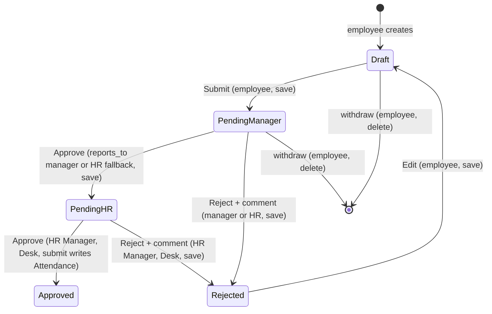
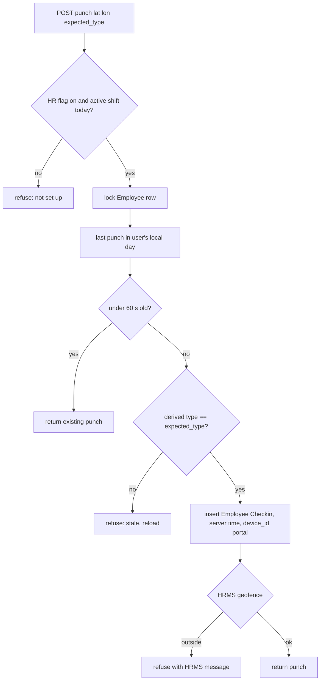

# feat: HRMS self-service bundle

**ID prefix.** Cite every ID in this plan as `P3-R1`, `P3-U4`, `P3-AE3`, `P3-KTD2` in code comments, commits and tests. Phase 1 IDs are bare (`R16`), Phase 2 IDs are `P2-`; never edit an existing citation.

## Summary

Phase 3 adds six self-service surfaces that HRMS already stores but the portal does not show: payslips with PDF download, a located check-in/check-out button, the employee's holiday list, an attendance request ("Fix a day") with a two-step manager-then-HR approval, and a team leave calendar for managers plus an employee directory for everyone. Every surface is a thin session-scoped `helixhr.api` wrapper over an HRMS doctype, rendered with the six shared Signal patterns. No HRMS core edits, no new doctype, no new dependency.

**Design reference.** Canvas **HelixHR Phase 3 Screens**: https://claude.ai/code/artifact/b358706d-0ba2-413f-b677-1a0a341017ea (14 artboards, two pages). Export the artboards to `.impeccable/review/phase3/` in U1 so the target survives without the link; `docs/design-system/screens.md` gains a note per screen in U9.

---

## Problem Frame

Employees today leave the portal for anything HRMS holds beyond leave, timesheets and HR requests: they ask HR for payslips by email, they cannot punch attendance from the portal even though the Attendance page reads punches, they do not know the holiday list they are on, a missed or work-from-home day can only be reported as a free-text HR Request, managers cannot see who on their team is out, and nobody can look up a colleague's manager or work email. HRMS ships every doctype and most of the server logic for all of it (`docs/frappe-hr-research.md`), so the cost is wiring and, for the attendance request, one workflow fixture.

Decisions taken with the product owner on 2026-09-09: payroll runs in ERPNext, so payslips are Salary Slips; check-in captures browser location; the attendance request is approved by the manager and then confirmed by HR (two steps, not either-or); the team calendar shows direct reports only; the directory shows name, role, department, manager and work email, with no phone numbers.

---

## Requirements

**Payslips**

- R1. An employee sees a list of their own submitted Salary Slips, newest period first, grouped by year, each row showing period, gross, deductions and net in the slip's own currency.
- R2. Opening a slip shows paid-on date, days paid, leave without pay, earnings rows, deduction rows and net; a Download PDF action returns Frappe's default Salary Slip print format for that slip.
- R3. Slips of any other employee are refused through the wrapper, through Frappe's generic print and PDF endpoints, through `/api/resource` and through report views (extends P2-AE9).
- R4. A `Withheld` slip is listed with a "Withheld, ask HR" badge and no PDF; cancelled slips are hidden; an amended slip shows "Revised".

**Check-in**

- R5. The Attendance page carries one Today strip inside the field block with the next punch action (Check in or Check out), the last punch time and whether location was captured.
- R6. A punch requires the browser's location; when location is denied, unavailable or times out, no Employee Checkin is created and the sheet explains how to allow location and points to Fix a day.
- R7. The server derives the punch type from the employee's last punch inside the shift window HRMS resolves for the moment of the punch, stamps server time, sets `device_id` to `HelixHR Portal`, and refuses a second punch within 60 seconds by returning the existing one.
- R7a. Coordinates are validated as finite numbers within range and not both zero; punches, edits and deletes of Employee Checkin through generic Frappe routes are refused to the Employee role.
- R8. The button is offered only when HR Settings allows check-in from the mobile app and HRMS resolves a shift window for now; outside the window the strip says when it opens, and with no shift at all it says check-in is not set up for them and names HR.
- R9. The day sheet lists the day's punches with location captured or not, and a day with punches but no Attendance row reads "Checked in, attendance not marked yet" rather than "No record".

**Holidays**

- R10. An employee sees the holidays HRMS resolves for them for a calendar year (employee assignment, falling back to company), weekly offs excluded, half-day holidays marked, with the next holiday and a countdown in the field block.
- R11. When no holiday list resolves, the page shows the same "cannot tell yet, ask HR" state the Attendance page uses, never an empty list.

**Attendance request**

- R12. From a day sheet or a Fix a day action, an employee creates an Attendance Request with reason Work From Home or On Duty, a date range, optional half day, and an explanation, and sends it.
- R13. Before sending, the sheet shows server-derived counts of days that will be marked, days skipped as holiday, weekend or approved leave, and days that already carry attendance; a request that would mark nothing or would overwrite an existing attendance day is refused, with the HR Request as the pointer for the overwrite case.
- R14. Sending requires an active manager from `Employee.reports_to`; without one the send is refused with the Timesheet's "Ask HR to set one" copy.
- R15. The request moves Draft to Pending Manager to Pending HR to Approved, or to Rejected from either pending state; only the final HR step submits the document and writes Attendance.
- R16. The manager sees the request as a third kind in Approvals with the explanation and what the calendar shows for those days, and can Approve (to HR) or Send back with a mandatory reason, guarded by the existing stale-decision token; HR confirms or sends back in Desk.
- R17. The employee sees the two steps on the request, gets a notification on every state change addressed to the employee's user even when HR raised the request, sees a sent-back request in Home's "Needs you" with the reason, and can withdraw while Draft, Pending Manager or Rejected.
- R17a. Outside Draft, no field other than the state changes through any route unless the caller is HR; deletion through any route follows the same states as withdraw; the final submit is possible only from Pending HR by HR.
- R18. A manager change moves the pending request's visibility and action rights to the new manager and away from the old one, including when the old manager's Employee is deactivated.
- R19. Days an approved request marks appear on the Attendance calendar as Work From Home or Present and are never counted as exceptions.

**Team and directory**

- R20. A manager with direct reports sees a Team page: who is out today, then a week strip with one row per active direct report showing approved and pending leave by type, weekends and the manager's holidays dimmed.
- R21. The team payload never carries a leave reason, and leave that is submitted but not yet Approved renders as waiting.
- R22. Every employee sees a Directory of active employees in their own company: name, designation, department, manager and work email taken from `company_email` only (omitted when empty), searchable by name, role or department, grouped by department, paged.
- R23. The directory and team endpoints are server projections with an explicit field allow-list; the generic Employee list remains denied to the Employee role under strict permissions.

**Cross-cutting**

- R24. Every new screen uses the six shared patterns, keeps signal yellow inside the field block, uses `AsyncState` states, 44px targets and `.tabular` numbers, and adds no new colour, radius or type role.
- R25. Every new read is bounded and paged; every new write has a rate-limit entry; every date is derived from the site or user zone through `lib/dates.js`.
- R26. Preflight reports the new operator requirements: the attendance workflow fixture, the two HR Settings check-in flags, at least one Shift Type with auto attendance, the effective `Permissions-Policy` allowing geolocation for self, and holiday list coverage.
- R27. `docs/deployment.md`, `docs/architecture.md`, `docs/runbook.md`, `docs/design-system/screens.md` and the README describe the new configuration, routes, vocabulary, the pre-deploy step for existing attendance requests, and the rollback.
- R28. Punch coordinates are erased by a daily job after a site-configured number of days and immediately when an employee's status becomes Left, including their Version history rows; the period is the only open value.

---

## Key Technical Decisions

- KTD1. **Thin wrappers, server-side scoping.** Each feature is a `helixhr.api` method that resolves the employee from the session and reads HRMS doctypes. Payslips and directory use `frappe.get_all` with an explicit field allow-list and an ownership or company filter because the Employee role lacks `report` on Salary Slip and User Permissions hide other Employees. Team leave also uses `frappe.get_all` filtered to a server-derived report set, so the result does not depend on the nested-set User Permission being present. Rationale: P2-R26 strict permissions; `hrms.api.*` methods take `employee` as a parameter and would loosen the convention.
- KTD2. **Own PDF endpoint.** `download_my_payslip(name)` is a GET whitelisted method that checks ownership and `docstatus == 1`, then calls `frappe.utils.print_format.download_pdf` with the doctype's default print format. Rationale: `hrms.api._download_pdf` is whitelisted but returns a base64 data URI for the PWA and adds no ownership check beyond `download_pdf`'s print permission; a GET lets the browser save the file natively; the Employee role already holds `print` on Salary Slip so no permission delta is needed.
- KTD3. **Punch is a server decision.** `punch_my_checkin(latitude, longitude, expected_log_type)` validates the coordinates (finite, latitude within 90, longitude within 180, not both zero) and the type, takes the Employee row lock (`_lock_employee`), derives the next type from the last punch inside the shift window HRMS resolves for now (a punch with no resolved window is refused), refuses a mismatch with `expected_log_type` as stale, returns the existing punch when the last one is under 60 seconds old, stamps server time and inserts Employee Checkin with `ignore_permissions` and `device_id = "HelixHR Portal"`. HRMS runs its own geofence when a Shift Location is assigned. Rejected: HRMS's `add_log_based_on_employee_field`, which trusts a caller-supplied employee and timestamp. Accepted: a biometric device path does not take the row lock. Rationale: HRMS only rejects same-second duplicates, and the PWA's client-side time and IN/OUT toggle produce wrong punches.
- KTD4. **Location is mandatory.** With HR Settings `allow_geolocation_tracking` on, HRMS refuses a checkin without coordinates, so the portal refuses the punch client-side when the browser gives none, and the fallback is Fix a day. Accuracy is shown in the sheet but not stored, since Employee Checkin has no field for it. The portal method requires coordinates itself, independent of the flag, and the flag is reported by preflight as information rather than a warning, because turning it on also makes HRMS refuse coordinate-less device and Desk punches on sites that have them. Rationale: no HRMS bypass without `ignore_validate`; India's DPDP legitimate-use basis covers a punch-moment snapshot, so no consent record is kept, and the sheet carries the plain-words notice. Upgrade path: a Custom Field fixture for accuracy if HR asks.
- KTD5. **Button visibility follows shift setup.** `get_my_attendance` returns `checkin` with `enabled`, a reason and the resolved shift window; enabled needs the HR Settings mobile check-in flag and a non-empty result from HRMS's `get_actual_start_end_datetime_of_shift` for now, with default shift considered, so the strip can say when the window opens. Rationale: HRMS resolves a punch to a shift by timestamp within the shift's grace window, not by date, and a punch outside it is stored `offshift` and never becomes Attendance, which would later read as a missing day.
- KTD6. **Two-step workflow as a fixture, mirroring Timesheet Approval.** Workflow `Attendance Request Approval`, state field `workflow_state` (Frappe creates the Custom Field on save), `send_email_alert` off. States in this order, because the order is the backfill order for rows that exist before the fixture lands: Draft (0), Pending Manager (0), Pending HR (0), Approved (1), Rejected (0); never reorder them in a later edit. Transitions: Submit Draft to Pending Manager for Employee with self-approval allowed; Approve and Reject from Pending Manager for Employee with the `reports_to` condition extended to require the manager's Employee status Active, self-approval off; Approve and Reject from Pending Manager and from Pending HR for HR Manager with self-approval allowed, so HR can confirm a request HR raised for someone else, and with a condition that the request's employee is not the session user's own Employee, so an HR Manager never approves their own request at either step; Approve from Draft to Pending HR for HR Manager, so drafts that predate the workflow are not dead ends; Edit Rejected to Draft for Employee. Action names reuse HRMS's Approve and Reject, so only the two new state names join the fixture filters. Cancel of an Approved request leaves the state Approved at docstatus 2, so status display keys Cancelled on docstatus. Rejected: a single manager step with HR editing after submit (Attendance would be written at the manager step); an HR-only workflow with a manager comment (the owner chose two steps). Rationale: Frappe validates transitions not states, so two docstatus-0 pending states are legal; the manager step is a `save`, the HR step is the real `submit` that writes Attendance; the Employee role has no `submit` on Attendance Request and does not need one.
- KTD7. **Portal acts on the manager step only.** `act_on_approval` for Attendance Request applies the workflow only when the state is Pending Manager, checked by `_assert_still_open`, and only for the manager `events._approver_user` returns or an HR Manager as fallback; Pending HR items are not listed in the portal queue. `_approver_user` is the single source for who the manager is, because it requires the manager's Employee to be Active, which the DocShare already assumes. Accepted: the same person can perform both steps in Desk. Rationale: the owner chose HR's step in Desk; an HR Manager who is also a line manager must not collapse the two steps from the portal.
- KTD8. **DocShare reconcile generalised, and the workflow guarded server-side.** `events._reconcile_share(doctype, name, employee, keep_user)` replaces the Timesheet-specific reconcile; Attendance Request shares `write=1` (no submit) during Pending Manager only, and `employee_on_update` reconciles both doctypes. The share is load-bearing: a manager's own User Permission does not reach a report's Attendance Request, so without it `get_transitions` fails on read. Frappe does not enforce a state's `allow_edit` on the server, so four doc events carry the rules: `validate` diffs only the doctype's own fields against `get_doc_before_save()` and refuses any change other than `workflow_state` and `shift` (HRMS fills `shift` in its own validate) outside Draft unless the caller is HR Manager or System Manager, and refuses Submit when no active manager exists (so the raw `apply_workflow` path refuses like the portal does); `on_update` reconciles the share; `before_submit` allows submit only when the stored state read through `get_doc_before_save()` is Pending HR (Frappe has already flipped the in-memory field to Approved by then) and only by HR Manager, System Manager or Administrator, which also stops a raw `frappe.client.submit` from jumping Pending Manager straight to Approved; `on_trash` allows delete only for the request's employee (matched by `Employee.user_id`, never `owner`, which is the HR user when HR raised it) in Draft, Pending Manager or Rejected, or for HR. None of these commit; a throw in `on_update` rolls the transition back. HR User is excluded from the HR step on purpose and the deployment doc says confirmers need HR Manager. Rationale: R17a, R18; P2-U7 step 8 pattern; the manager's transition is a save so write is enough.
- KTD9. **Notifications in code, reason by comment.** `attendance_request_on_update` writes one Notification Log row per state change to the employee's `user_id`, following `hr_request_on_update` (P2-KTD6), with plain subjects (with Priya, with HR, Counted, Sent back) and the rejection comment in the body. Rejected: a Notification fixture to `owner`, because the owner is the HR user when HR raises the request and the doctype has no user field. `_rejection_comments` is generalised by doctype. A Desk rejection without a comment renders "HR sent this back, ask HR for details". Rationale: the recipient must be the employee; a synchronous insert is testable and carries the comment without a template.
- KTD10. **Fix a day routes by reason.** Work From Home and On Duty create an Attendance Request; anything else keeps the existing prefilled HR Request. The day sheet offers both with one sentence each. Rationale: HRMS has exactly two reasons; a forgotten punch on an office day is HR's call.
- KTD11. **`has_reports` joins the bootstrap.** Team is gated on direct reports, not on `can_approve`. Rationale: a leave approver with no reports would otherwise see an empty Team page.
- KTD12. **Header change.** `Permissions-Policy` becomes `geolocation=(self)`; preflight checks the effective header on the public endpoint. Rationale: the current `geolocation=()` makes the browser report a denial indistinguishable from the user's choice.
- KTD13. **Two permission deltas, through the existing patch.** Role Employee loses create, write and delete on Employee Checkin, and loses share on Attendance Request, via `patches/v1_0/apply_permission_deltas.py` (idempotent, run by `after_install` on a fresh site) plus a new dated re-run line for the same module in `patches.txt` under `[post_model_sync]`, because Frappe skips a patch whose exact line is already in the Patch Log, so a migrated site would otherwise never apply the new deltas; `preflight.check_custom_docperm_coverage` FAILs when a doctype named in the delta table has no Custom DocPerm row at all. Rationale: with its shipped rights an employee can insert a backdated punch with any coordinates, edit or delete punches until the nightly job links them, and share their own request with `submit` to a colleague; the portal method is the create rule, as for HR Request. Salary Slip needs no change.
- KTD14. **Overwrite days are refused, not previewed away.** The preview buckets days into mark (no row, or an existing Absent row that the request replaces), skip (holiday, weekend, approved leave) and overwrite (an existing Present, Half Day, Work From Home or On Leave row); any overwrite day refuses the send with the HR Request as the pointer. The existing-row lookup queries Attendance by employee and date with `docstatus < 2` regardless of shift, and `create_my_attendance_request` sets `shift` from HRMS shift resolution when `get_active_shifts` finds nothing, because open-ended Shift Assignments leave it empty and HRMS's own lookup is shift-scoped. Rationale: auto attendance marks Absent overnight, so replacing an Absent is the feature's main case; HRMS rewrites any other existing row in place at HR's submit and cancels it outright on cancel, so a request over such a day can erase attendance rather than revert it.
- KTD15. **Coordinates have an erasure path from day one.** A daily scheduler job nulls latitude, longitude and geolocation, and the matching Version rows, on Employee Checkin rows older than the site-config key `helixhr_checkin_location_retention_days`; `employee_on_update` does the same immediately when status becomes Left; preflight warns while the key is unset. Rationale: DPDP section 8(7) erasure once the purpose is served; managers up the chain can read reports' punches, so the data is wider than one row. Rejected: Frappe's `user_data_fields` hook, which cannot target a doctype without a User link.
- KTD16. **Rollback deactivates, never deletes.** Rolling the feature back is a code change: the Workflow fixture with `is_active` off, doc events and routes removed, every remaining Attendance Request DocShare reconciled away; the `workflow_state` Custom Field and its values stay, and Attendance rows written by HR stay because they are real attendance. Rationale: a Desk toggle is undone by the next migrate; a leftover write share on a plain draft is a live grant.

---

## High-Level Technical Design

Attendance request lifecycle, who acts, and what each transition does:

DocShare to the manager exists only in PendingManager. Notification fixture fires on every state change to the owner. Home "Needs you" lists Rejected; "Waiting on others" lists both pending states with the owner named.

Punch decision, server side:

---

## System-Wide Impact

**Entry points that change shape.** The Approvals kind regex and `_APPROVAL_DOCTYPES`; the `if Timesheet else leave` branches in `act_on_approval`, `_assert_may_act_on`, `_assert_still_open`, `_assert_expected_workflow_state`, `get_approval_detail`, `_approval_summaries`, `_recently_decided` and `Approvals.vue`, which today treat "not leave" as timesheet and must become explicit per-kind maps before a third kind lands; `_get_needs_you` kinds and `NEEDS_YOU_ICON`; `StatusBadge` kinds with Cancelled keyed on docstatus; `Notifications.vue` route and icon maps; the bootstrap shape (`has_reports`); `SECURITY_HEADERS`; `RATE_LIMIT_POLICY`; preflight (`check_fixtures`, the header check asserting a value, HR Settings and Shift Type checks); the fixture filters in `hooks.py` (both document types, two new state names); `doc_events` for Attendance Request (`validate`, `on_update`, `before_submit`, `on_trash`) and Employee Checkin (`on_trash` for erasure on Left is on Employee); the permission-delta patch and its preflight coverage. Install and migrate paths are unchanged: fixtures sync on both, the delta patch runs on both, and no cache patch is needed because `Workflow.on_update` runs `frappe.clear_cache(doctype=document_type)` on fixture import, which drops the cached workflow name for Attendance Request.

**Failure propagation.** HRMS `validate` reruns on every save including the manager's transition, so overlap, approved-leave-after-send, inactive employee and multiple-shift errors surface through `act_on_approval`; one of them is an HTML table `msgprint`, which the error mapping in `lib/api.js` must flatten. Punch errors from HRMS (geofence, missing coordinates, strict log type) surface unchanged. A throw in `attendance_request_on_update` rolls back the transition and the share together because doc events run inside the request transaction and never commit.

**State lifecycle.** DocShare exists only in Pending Manager and is reconciled on every state change and on manager reassignment or deactivation. `workflow_state` follows the diagram; cancel keeps Approved at docstatus 2; amend copies nothing. Attendance rows are written only at HR's submit and are cancelled by HRMS on cancel; the `attendance_request` link on Attendance is what exempts those days from exceptions. Rows that exist before the fixture lands are backfilled by state order: docstatus 0 to Draft, docstatus 1 to Approved, cancelled rows keep a null state, so every queue filter tolerates null and HR gets a Draft to Pending HR transition for the old drafts.

**Parity surfaces.** HR's step is Desk only, through the workflow actions or a raw submit that the `before_submit` guard constrains to Pending HR. Employees and managers reach the doctype through `/api/resource` PUT and DELETE and through `apply_workflow`; the `validate`, `on_trash` and manager-required rules make those paths refuse exactly what the portal refuses. Employee Checkin becomes portal-only for employees after the delta; HR keeps Desk and device paths.

**Existing tests that change.** `test_api_approvals.py` (kind list, mixed queue, per-kind open checks, HR-in-portal-manager-step-only, unrelated manager), `test_fixtures.py` (strict-permission matrix rows for Salary Slip, Attendance Request and Employee Checkin; the customised-doctype set), `test_notifications.py` (HR-created request recipient), `test_upload_security.py` and the CI header grep (value, not presence), `test_preflight.py`, `hardening.spec.ts` lazy routes, `navigation.spec.ts` clicked paths, `icons.test.js` kinds, plus a first unit test for `StatusBadge`.

---

## Scope Boundaries

- No HRMS core edits, no new doctype, no new Python or Node dependency.
- No expense claims, travel, shift requests, comp-off, tax declarations, performance, onboarding (inventory of 2026-09-08; next phases).
- No phone numbers or photos in the directory; no leave reasons in the team view; no company-wide leave calendar.
- No storing of location accuracy or a consent record; the sheet notice is the disclosure.
- HR's confirmation step for attendance requests happens in Desk, not in the portal.
- Payslip email settings stay HRMS's own (Payroll Settings); the portal does not send slips.

### Deferred to Follow-Up Work

- AI assistant (`docs/ai-assistant-phase2.md`) after this bundle ships, with payslips, holidays and attendance requests available as tools.
- Manager notification when a request or timesheet arrives (parity gap that predates this phase).
- Geofence configuration UI; today it is HRMS Shift Location in Desk.
- The retention period for punch coordinates; HR and legal decide the number of days that goes into the site config key the job reads.
- The same `allow_edit` and cancel-share gaps exist for the Timesheet workflow today; file a follow-up rather than fix silently here.
- California risk assessment and notice-at-collection text for US employees; HR work, not code.

---

## Acceptance Examples

- AE1. **Payslip isolation.** Given two employees with submitted slips, when employee A lists, opens and downloads, only A's slips appear and download; A calling the wrapper, `download_pdf`, `/api/resource/Salary Slip/<B's slip>` and the report view for B's slip gets a permission error. Covers R1 to R3.
- AE2. **Currency and status.** Given one INR slip, one USD slip, one Withheld slip and one Cancelled slip for the same employee, the list shows three rows with their own symbols, the Withheld row has no PDF, and the cancelled one is absent. Covers R1, R4.
- AE3. **Punch derivation.** Given an employee with an active shift and no punch today, two punches 300 ms apart create one IN; a later punch is OUT; a punch with `expected_log_type=IN` when the server derives OUT is refused as stale. Covers R7.
- AE4. **Local day.** Given a user in America/New_York who checked in at 20:00 local (06:30 IST next day), the next punch is derived as OUT, not a new IN. Covers R7.
- AE5. **No location, no punch.** Given the browser denies location, no Employee Checkin is created and the sheet shows the allow-location state; a direct POST without coordinates, with `NaN`, with a latitude of 95, or with both coordinates zero is refused server-side. Covers R6, R7a.
- AE5a. **Generic punch routes closed.** Given an employee with a punch, `frappe.client.set_value` on its time, `frappe.client.delete`, and a `/api/resource` insert with a past time are all refused. Covers R7a.
- AE6. **Not set up.** Given the HR flag off or no active Shift Assignment, the Today strip shows the not-set-up copy and the API refuses a punch. Covers R8.
- AE7. **Request lifecycle.** Given an employee with a manager, sending a Work From Home request puts it in Pending Manager with a DocShare to the manager; the manager's Approve moves it to Pending HR, removes the share and writes no Attendance; HR's Approve in Desk submits and writes Attendance rows; the calendar shows Work From Home. Covers R12, R15, R16, R19.
- AE8. **Refusals.** Manager Reject without a comment is refused; an unrelated manager acting by the portal or by `apply_workflow` is refused; the employee cannot submit their own request; a request over only a holiday is refused before sending; a request over a day that already carries attendance shows an overwrite day and is refused. Covers R13, R14, R16.
- AE8b. **Absent is replaceable.** Given auto attendance marked yesterday Absent, a Work From Home request over it previews as one day to mark and is accepted; HR's submit flips the row to Work From Home. Covers R13.
- AE8a. **Pending is read-only.** Given a request in Pending Manager, the employee and the manager changing `from_date` through `/api/resource` are refused, the employee's delete through `frappe.client.delete` in Pending HR is refused, a colleague the employee tries to share with cannot be granted anything, and a raw `frappe.client.submit` from Pending Manager is refused. Covers R17a.
- AE9. **Reassignment.** Given a pending request and `reports_to` changed from A to B, A can no longer read or act, B can; deactivating B's Employee removes B's share and B's `apply_workflow` is refused by the condition. Covers R18.
- AE10. **Sent back.** Given the manager sends back with a reason, the employee's Home shows the request under Needs you with that reason, the Notification Log has a "Sent back" row, and Edit returns it to Draft. Covers R17.
- AE11. **Team scope.** Given manager M with active report X, a report Y with status Left, and a non-report Z, M's team payload lists X only, carries X's leave type and dates but no description, and a docstatus 0 Approved-status leave renders as waiting. Covers R20, R21, R23.
- AE12. **Directory scope.** Given employees in two companies, the directory returns own-company active employees only with the allow-listed fields, and `frappe.client.get_list("Employee")` as an Employee still returns only self. Covers R22, R23.
- AE13. **Header and preflight.** The public endpoint's effective `Permissions-Policy` contains `geolocation=(self)`; preflight fails when it does not, warns when no Shift Type has auto attendance, fails when the workflow fixture is missing, and warns while the retention key is unset. Covers R26.
- AE14. **Backfill.** Given one draft, one submitted and one cancelled Attendance Request before the fixture lands, after migrate they read Draft, Approved and null; HR can move the old draft to Pending HR; the employee cannot. Covers R15, R27.
- AE15. **Erasure.** Given punches older than the configured days and a punch of an employee whose status becomes Left, the daily job and the Employee event null the coordinates and their Version rows; newer punches of active employees keep theirs. Covers R28.

---

## Implementation Units

### U1. Shell, gates and reference

- **Goal:** Land the cross-cutting pieces every later unit depends on: navigation, routes, icons, bootstrap flag, header change, rate-limit entries, preflight checks, and the design reference export.
- **Requirements:** R24 to R27; AE13.
- **Dependencies:** none.
- **Files:** `frontend/src/components/AppShell.vue`, `frontend/src/router.js`, `frontend/src/lib/icons.js`, `frontend/src/lib/icons.test.js`, `frontend/src/components/StatusBadge.vue`, `frontend/src/components/StatusBadge.test.js` (new), `frontend/src/pages/Payslips.vue`, `frontend/src/pages/Holidays.vue`, `frontend/src/pages/Team.vue`, `frontend/src/pages/Directory.vue` (stubs), `helixhr/api.py` (`get_portal_bootstrap`), `helixhr/patches.txt`, `helixhr/utils.py` (`SECURITY_HEADERS`, `RATE_LIMIT_POLICY`), `helixhr/patches/v1_0/apply_permission_deltas.py`, `helixhr/preflight.py`, `helixhr/tests/test_preflight.py`, `helixhr/tests/test_upload_security.py`, `helixhr/tests/test_fixtures.py`, `frontend/tests/e2e/hardening.spec.ts`, `frontend/tests/e2e/navigation.spec.ts`, `.github/workflows/ci.yml` (header grep), `.impeccable/review/phase3/` (new PNG exports).
- **Approach:**
  1. Add Payslips, Holidays, Directory as non-primary nav items and Team as `managerOnly` driven by a new `has_reports` bootstrap value; add lazy routes `/payslips`, `/payslips/:name`, `/holidays`, `/team`, `/directory`, `/attendance/requests/:name`, and widen the approvals kind regex to include `attendance`.
  2. Add Lucide paths for wallet, sun, users, pin; extend `NEEDS_YOU_ICON` and the pinned kind set with `approval_attendance`, `attendance_request_rejected`, `attendance_request_waiting`.
  3. Add a `request` style `attendance` kind to `StatusBadge` mapping Pending Manager to Waiting for [manager], Pending HR to Waiting for HR, Approved to Counted, Rejected to Sent back, Draft to Draft.
  4. Change `Permissions-Policy` to `geolocation=(self)`; rewrite the comment; update the header test, CI grep and preflight to assert the value.
  5. Add rate-limit entries: `punch_my_checkin`, `create_my_attendance_request`, `send_my_attendance_request`, `withdraw_my_attendance_request`, `get_attendance_request_preview`, `download_my_payslip`, `get_directory`, `get_my_team_week`.
  5a. Add the two permission deltas (KTD13) to `helixhr/patches/v1_0/apply_permission_deltas.py`, extend `preflight.check_custom_docperm_coverage` and the strict-permission matrix in `test_fixtures.py` with Salary Slip, Employee Checkin and Attendance Request rows.
  6. Add preflight checks: workflow fixture present (in `check_fixtures`), HR Settings `allow_employee_checkin_from_mobile_app` (WARN when off) and `allow_geolocation_tracking` (informational), at least one Shift Type with `enable_auto_attendance`, and for each such shift a WARN when `process_attendance_after` is empty or when `auto_update_last_sync` is off and `last_sync_of_checkin` is empty or older than two days (without it no punch ever becomes Attendance), effective header value (FAIL).
  7. Add stub pages `Payslips.vue`, `Holidays.vue`, `Team.vue`, `Directory.vue` (heading plus an empty AsyncState) so the lazy routes build; U2, U3, U7 and U8 replace them; point the attendance request detail route at `Attendance.vue` until U6.
  8. Export the canvas artboards to `.impeccable/review/phase3/`.
- **Patterns to follow:** `NAV` array and `managerOnly` in `AppShell.vue`; `LAZY_ROUTES` in `hardening.spec.ts`; `_hr_setting()` helper and `check_fixtures` in `preflight.py`; the P2-U9 header comment style.
- **Test scenarios:**
  1. Bootstrap for a user with two active reports returns `has_reports: true`; with none, `false`; Team appears in nav only when true.
  2. Every new route is lazy and absent from the initial payload (hardening spec).
  3. Header test asserts `geolocation=(self)`; preflight FAILs on `geolocation=()`.
  4. `rate_limit_bounds` returns bounds for each new action; preflight passes with defaults.
  5. `icons.test.js` pins the extended kind set; `StatusBadge.test.js` maps the attendance states and keys Cancelled on docstatus.
  6. Covers AE5a. After the delta, an employee's generic insert, edit and delete of Employee Checkin are refused, and no standard role lost access to either customised doctype.
- **Verification:** Lint, unit and Python suites green; nav shows the four new destinations behind More on a phone and in the sidebar on desktop, with Team only for a manager.

### U2. Payslips

- **Goal:** Employees list, open and download their own salary slips.
- **Requirements:** R1 to R4; AE1, AE2.
- **Dependencies:** U1.
- **Files:** `helixhr/api.py` (`get_my_payslips`, `get_my_payslip`, `download_my_payslip`), `frontend/src/pages/Payslips.vue` (new), `frontend/src/lib/money.js` (new, thin `fmt_money` equivalent using the slip currency), `frontend/src/lib/money.test.js` (new), `helixhr/tests/test_api_payslips.py` (new), `helixhr/tests/utils.py` (salary structure and slip seeder), `helixhr/tests/test_fixtures.py` (strict-permission matrix rows), `frontend/tests/e2e/payslips.spec.ts` (new).
- **Approach:**
  1. `get_my_payslips(year, start, limit)` uses `frappe.get_all("Salary Slip")` filtered to the session employee and `docstatus == 1`, fields `name, start_date, end_date, posting_date, gross_pay, total_deduction, net_pay, currency, status, amended_from`, ordered by `end_date desc`, bounded like `_LEAVE_PAGE`.
  2. `get_my_payslip(name)` returns head fields, `payment_days`, `leave_without_pay`, and earnings and deductions child rows (`salary_component, amount`) after an ownership check with `PermissionError`.
  3. `download_my_payslip(name)` is `methods=["GET"]`, takes only `name`, answers one uniform not-found for a missing or foreign slip (slip names embed the employee id, so the leave pattern would be an existence oracle), requires `docstatus == 1` and `status != "Withheld"`, calls `download_pdf` with the doctype's default print format, and sets `Content-Disposition: attachment` and `Cache-Control: no-store` through `frappe.local.response_headers` after the call, since Frappe's PDF response writes `inline`; it is wrapped in Frappe's concurrency limiter on top of the per-user rate limit because PDF rendering is CPU-bound.
  4. Page: field block with latest net pay and PDF button; rows with a year-over-month tile; phone sheet and desktop inline panel share the breakdown component; Withheld badge; Revised label when `amended_from` is set.
  5. Amounts always formatted with the row's own currency; never summed across rows.
- **Patterns to follow:** `get_my_leave` paging and `get_my_leave_detail` ownership check; `Leave.vue` list plus inline detail; `attachToRequest` in `lib/api.js` for a non-JSON response.
- **Test scenarios:**
  1. Covers AE1. Own slips listed; another employee's slip refused by wrapper, `download_pdf`, `/api/resource` and report view.
  2. Covers AE2. INR and USD rows carry their currency; Withheld listed without PDF; Cancelled absent; amended slip flagged.
  3. Draft slip absent from the list.
  4. Paging clamps `limit` and returns `total`.
  5. `download_my_payslip` returns `application/pdf` with attachment disposition and no-store for an own submitted slip, refuses Withheld, and answers the same not-found for a missing name and a colleague's name.
  6. e2e: employee opens Payslips, sees the seeded slip, opens the detail, the PDF link responds 200 with `application/pdf`.
- **Verification:** Python and e2e specs pass on a fresh site; the AE9 matrix in `test_fixtures.py` includes Salary Slip.

### U3. Holidays

- **Goal:** Employees see their resolved holiday list for a year.
- **Requirements:** R10, R11.
- **Dependencies:** U1.
- **Files:** `helixhr/api.py` (`get_my_holidays`), `frontend/src/pages/Holidays.vue` (new), `helixhr/tests/test_api_holidays.py` (new), `frontend/tests/e2e/holidays.spec.ts` (new).
- **Approach:**
  1. `get_my_holidays(year)` resolves the employee's assignment per date range through `hrms.utils.holiday_list` (v16 Holiday List Assignment, employee then company), returns `list_name`, `known`, and rows `holiday_date, description (stripped), is_half_day`, weekly offs excluded, plus `next` with days until.
  2. Page: field block with next holiday and countdown; Coming up and Earlier this year groups with date tiles; year chip; footnote naming the list and stating weekly offs are not listed; `known: false` renders the Attendance page's cannot-tell state.
- **Patterns to follow:** `_holiday_dates` returning `None` for unknowable; `Leave.vue` date tiles and grouping.
- **Test scenarios:**
  1. Employee assignment wins over company assignment; company assignment used when none.
  2. Weekly-off rows excluded; half-day flagged; descriptions stripped of HTML.
  3. No assignment returns `known: false`, page shows the cannot-tell state.
  4. Year boundary: a list spanning two years returns only the requested year's dates.
  5. e2e: seeded holiday appears with its tile and the countdown matches the site's today.
- **Verification:** Python and e2e specs pass; the Attendance page's own holiday dots agree with this page for the same month.

### U4. Check-in

- **Goal:** Employees punch in and out from the Attendance page with location.
- **Requirements:** R5 to R9; AE3 to AE6.
- **Dependencies:** U1.
- **Files:** `helixhr/api.py` (`punch_my_checkin`, `get_my_attendance` gains `checkin`, `get_my_checkins` gains `has_location`), `frontend/src/pages/Attendance.vue`, `frontend/src/components/CheckInSheet.vue` (new), `frontend/src/lib/geolocation.js` (new), `frontend/src/lib/geolocation.test.js` (new), `helixhr/tasks.py` (new), `helixhr/hooks.py` (`scheduler_events`), `helixhr/tests/test_api_checkin.py` (new), `helixhr/tests/utils.py` (Shift Type and Shift Assignment seeders), `frontend/tests/e2e/checkin.spec.ts` (new), `docs/runbook.md`.
- **Execution note:** Implement the punch derivation test-first; the local-day and 60-second rules are easy to get subtly wrong.
- **Approach:**
  1. `get_my_attendance` adds `checkin: {enabled, reason, last: {log_type, time, has_location}}` where enabled requires the HR flag and an active Shift Assignment covering the user's today.
  2. `punch_my_checkin` per KTD3: rate limit, coordinate and type validation, enabled check, `_lock_employee`, last punch in the resolved shift window or the user's local day converted to site-zone bounds, 60-second idempotent return, expected-type check, insert with `ignore_permissions`, server time and `device_id`, HRMS validation errors surfaced as plain messages.
  2a. Erasure per KTD15: a daily `scheduler_events` job in a new `helixhr/tasks.py` reading `helixhr_checkin_location_retention_days`, an `employee_on_update` branch for status Left, a preflight WARN while the key is unset, and the notice copy in the sheet naming HR and managers as readers.
  3. `lib/geolocation.js`: `getPosition()` with a high-accuracy 10 s attempt then a low-accuracy 5 s retry, `maximumAge: 0`, error classification (denied, unavailable, timeout, unsupported, insecure context), never called on page load.
  4. Sheet: confirm state with accuracy and the plain-words notice; blocked state with how-to-allow and the Fix a day pointer; out-of-range state that shows HRMS's distance message with Try again and Fix a day, never the allow-location copy; locating state disables the button; result updates the strip and reloads the day sheet.
  5. Day sheet rows show a pin when the punch has location; a day with punches and no Attendance row reads "Checked in, attendance not marked yet".
- **Patterns to follow:** `submit_my_week` lock and atomic sequence; `confirmWithdraw` gating in `Leave.vue`; `Dialog` as bottom sheet; `user_today()` and `lib/dates.js` for day bounds.
- **Test scenarios:**
  1. Covers AE3. Two punches 300 ms apart yield one row; the next is OUT; a stale `expected_log_type` is refused.
  2. Covers AE4. New York user at 06:30 IST derives OUT against the previous local day's IN.
  3. Covers AE5. Missing, non-finite, out-of-range and zero-zero coordinates refused server-side.
  3a. Night shift: an IN at 23:00 and a punch at 01:00 inside the same shift window derives OUT.
  3b. Covers AE15. Old punches lose coordinates and Version rows; a Left employee's punches lose them at once; active recent punches keep them.
  4. Covers AE6. HR flag off, or no Shift Assignment, returns `enabled: false` and the punch is refused.
  5. Punch stores server time, not the client's, and `device_id = "HelixHR Portal"`.
  6. Shift Location with a radius: inside succeeds, outside returns HRMS's message unchanged.
  7. `geolocation.test.js`: error codes map to the four states; insecure context short-circuits.
  8. e2e (Chromium, `context.grantPermissions(['geolocation'])` and `setGeolocation`): punch creates a row and the strip flips to Check out; with permission denied, no row and the blocked sheet.
- **Verification:** Python and e2e specs pass; on a real phone over HTTPS a punch appears in Desk with coordinates and the portal device id.

### U5. Attendance request backend and workflow

- **Goal:** The two-step approval exists as fixture, guards, shares, notifications and employee-facing API.
- **Requirements:** R12 to R15, R17, R18; AE7 to AE10.
- **Dependencies:** U1.
- **Files:** `helixhr/fixtures/workflow.json`, `helixhr/fixtures/workflow_state.json`, `helixhr/hooks.py` (fixture filters, doc events), `helixhr/events.py` (`_reconcile_share`, `attendance_request_validate`, `attendance_request_on_update`, `attendance_request_before_submit`, `attendance_request_on_trash`, `employee_on_update`), `helixhr/api.py` (`get_my_attendance_requests`, `get_my_attendance_request`, `get_attendance_request_preview`, `create_my_attendance_request`, `send_my_attendance_request`, `withdraw_my_attendance_request`, `_get_needs_you` items, `_rejection_comments` generalised, `_approver_name` reuse), `helixhr/tests/test_attendance_request_workflow.py` (new), `helixhr/tests/test_fixtures.py`, `helixhr/tests/utils.py`.
- **Execution note:** Start with a failing integration test for the full lifecycle (AE7) before writing the fixture.
- **Approach:**
  1. Workflow fixture per KTD6 with the state order fixed; widen the `Workflow` filter to both document types and add `Pending Manager` and `Pending HR` to the Workflow State filter; no new action master, no cache patch (`Workflow.on_update` clears the doctype cache, including the cached workflow name, on fixture import).
  2. `events._reconcile_share(doctype, ...)` generalised from the Timesheet one; the four doc events of KTD8 (`validate` field-freeze and manager-required, `on_update` share and notification, `before_submit` state-and-role, `on_trash` state-and-owner); `employee_on_update` reconciles both doctypes and erases coordinates on Left.
  3. Notification Log rows per KTD9 to the employee's user with the four plain subjects and the rejection comment; Home items for Rejected (blocked, with reason) and both pending states (waiting, owner named); queue filters tolerate a null state.
  4. Employee API: preview buckets HRMS's `get_attendance_warnings` on an unsaved doc into mark, skip and overwrite, caps the range at 31 days and the explanation length, allow-lists the reason, and returns the Attendance page's `known: false` shape when no holiday list resolves so the sheet disables Send with the ask-HR copy instead of HRMS's exception; create writes a Draft with `half_day_date` derived server-side for one-day ranges; send applies Submit and refuses when the preview has an overwrite day or marks nothing; withdraw deletes while Draft, Pending Manager or Rejected and refuses otherwise with the Ask HR pointer.
  5. Pre-deploy step in the deployment doc: count docstatus-0 Attendance Requests and either have HR submit them before migrate or use the HR Draft to Pending HR transition afterwards.
- **Patterns to follow:** `helixhr/fixtures/workflow.json`; `_reconcile_timesheet_share` and `timesheet_before_submit`; `hr_request_on_update` for the notification shape and `get_doc_before_save` diffing; `apply_for_leave` half-day derivation; `_LEAVE_MAX_SPAN_DAYS` style bounds.
- **Test scenarios:**
  1. Covers AE7. Full lifecycle: share appears at Pending Manager, disappears at Pending HR, Attendance rows exist only after HR's submit.
  2. Covers AE8. Employee `frappe.client.submit` refused; unrelated manager `apply_workflow` refused; request over only a holiday refused at preview and at send; request over an existing Present day shows an overwrite day and is refused.
  2a. Covers AE8a. Field edits in both pending states refused for employee and manager through `set_value`; delete in Pending HR refused through `frappe.client.delete`; raw submit from Pending Manager refused; HR Manager submit from Pending HR succeeds; share by the employee refused after the delta.
  3. Covers AE9. Reassignment moves the share; deactivated manager loses it and the condition refuses them.
  4. Covers AE10. Rejection with comment produces the Notification Log row addressed to the employee's user, also when HR raised the request, and the Home item with the reason; Edit returns to Draft; Desk rejection without a comment yields the fallback text.
  5. No `reports_to`: send refused with the Ask HR copy through the portal and through `apply_workflow`; `workflow_state` stays Draft and no share exists.
  5a. Covers AE14. Pre-existing draft, submitted and cancelled rows read Draft, Approved and null after the fixture; HR moves the draft to Pending HR.
  6. Half day on a one-day range derives `half_day_date`; multi-day without an in-range date is refused.
  7. Withdraw allowed in Draft, Pending Manager and Rejected; refused in Pending HR and Approved.
  8. Fresh-site install has the workflow active (test through `get_workflow_name`).
  9. Cancel of an approved request leaves zero shares and removes only the Attendance rows the request created; HRMS's behaviour for re-pointed rows is documented, not tested.
- **Verification:** Python suite green on a fresh `--install-app` site and on a migrated site seeded with pre-existing Attendance Requests; `preflight.check_fixtures` lists the workflow.

### U6. Attendance request UI and Approvals third kind

- **Goal:** Employees raise and follow requests from the Attendance page; managers decide them in Approvals.
- **Requirements:** R12, R13, R16, R17, R19; AE7, AE8.
- **Dependencies:** U4, U5.
- **Files:** `frontend/src/pages/Attendance.vue`, `frontend/src/components/AttendanceRequestSheet.vue` (new), `frontend/src/components/StepStrip.vue` (new, the Sent, manager, HR, Counted stepper; a sent-back request stops at the rejecting step, tinted with the sent-back pair and labelled Sent back), `frontend/src/pages/Approvals.vue`, `frontend/src/pages/Notifications.vue` (route for the doctype), `frontend/src/components/NeedsYou.vue`, `helixhr/api.py` (`_APPROVAL_DOCTYPES`, `_approval_summaries`, `_recently_decided`, `get_approval_detail`, `act_on_approval`, `_assert_may_act_on`, `_assert_still_open`, `_assert_expected_workflow_state`), `helixhr/tests/test_api_approvals.py`, `frontend/tests/e2e/attendance-request.spec.ts` (new), `frontend/tests/e2e/approvals.spec.ts`.
- **Approach:**
  0. Convert the `if timesheet else leave` branches in `Approvals.vue` and the server helpers into explicit per-kind maps before adding the kind; flatten HRMS's HTML-table `msgprint` in the error mapping of `lib/api.js`.
  1. Day sheet offers Fix a day (Attendance Request) and Report a problem (HR Request) with one sentence each; the desktop page carries a Fix a day action in the header and a Requests column with the stepper per request.
  2. Sheet: two reason tiles, date range, half-day switch, explanation, server preview line, approver line naming both steps, Send disabled when no manager.
  3. Approvals: third kind in the queue with employee, reason, dates, explanation quote and what the calendar shows for those days; Approve label reads "Send to HR"; Send back requires a reason; Pending HR items are not listed and an HR Manager acting on one from the portal is refused (KTD7).
  4. Calendar legend and status map gain Work From Home; exceptions never count Work From Home or Present-by-request days.
- **Patterns to follow:** `Approvals.vue` `decide()` with `expected_modified` and `expected_state`; `LeaveForm.vue` sheet layout; `reportRoute` prefill; `StatusBadge` kinds.
- **Test scenarios:**
  1. Covers AE7. e2e: employee sends a request from a No record day, sees Waiting for [manager]; manager opens Approvals, sees the third kind with the quote, clicks Send to HR; the employee's request shows Waiting for HR.
  2. Covers AE8. e2e: Send back without a reason is blocked client-side and server-side; stale token after another decision shows the reload message.
  3. Preview line updates when the range includes a weekend or a holiday and disables Send when nothing would be marked.
  4. Sent-back request appears in Home Needs you with the reason and opens the request.
  5. `get_approval_detail` for an attendance kind refuses an unrelated manager with `PermissionError`.
  6. Pending HR requests are absent from the manager's and an HR Manager's portal queue, and `act_on_approval` on one is refused as already decided.
  7. An HRMS overlap error during the manager's Send to HR reaches the manager as one plain sentence, not HTML.
- **Verification:** e2e on Chromium employee and manager projects and Python approvals tests green; `docs/design-system/screens.md` notes any deviation from the artboards.

### U7. Team leave calendar

- **Goal:** Managers see who on their team is out this week.
- **Requirements:** R20, R21, R23; AE11.
- **Dependencies:** U1.
- **Files:** `helixhr/api.py` (`get_my_team_week`), `frontend/src/pages/Team.vue` (new), `helixhr/tests/test_api_team.py` (new), `frontend/tests/e2e/team.spec.ts` (new).
- **Approach:**
  1. `get_my_team_week(week_start)` derives active direct reports server-side, reads Leave Applications overlapping the week with `docstatus < 2` and status in Open or Approved via `frappe.get_all` with fields `employee, leave_type, from_date, to_date, half_day, half_day_date, status, docstatus`, marks `waiting` when not `docstatus == 1 and Approved`, adds the manager's holiday dates for column shading, and `out_today`.
  2. Page: field block with out-today count and names; week nav; desktop grid one row per report with tinted bars clipped to the week; phone day-grouped rows with date tiles; legend; footnote stating scope and that reasons are hidden.
- **Patterns to follow:** `get_week_bounds`; `_count_direct_reports` Active filter; `WeekGrid.vue` column layout; `Approvals.vue` initials avatar.
- **Test scenarios:**
  1. Covers AE11. Active report's leave present with type and dates and no description key; Left report absent; non-report absent; docstatus 0 leave flagged waiting.
  2. Half-day leave carries `half_day_date`; a leave spanning two weeks appears in both weeks clipped.
  3. Manager with no reports gets `PermissionError`; `has_reports` false hides the page.
  4. Holidays for the manager's list mark columns.
  5. e2e (manager project): seeded report leave shows as a bar; the out-today block names the report.
- **Verification:** Python and e2e specs pass; payload inspected in the e2e trace has no `description`.

### U8. Directory

- **Goal:** Everyone can find a colleague's role, department, manager and work email.
- **Requirements:** R22, R23; AE12.
- **Dependencies:** U1.
- **Files:** `helixhr/api.py` (`get_directory`), `frontend/src/pages/Directory.vue` (new), `helixhr/tests/test_api_directory.py` (new), `helixhr/tests/test_fixtures.py`, `frontend/tests/e2e/directory.spec.ts` (new).
- **Approach:**
  1. `get_directory(query, department, start, limit)` uses `frappe.get_all("Employee")` with `status == "Active"` and `company == session employee's company`, fields `name, employee_name, designation, department, reports_to, company_email`, resolves manager names in one query, returns work email from `company_email` only and omits it when empty (login identifiers never leave the server), caps `query` at 60 characters with a two-character minimum, searches on name, designation and department, orders by `employee_name`, pages at 50.
  2. Page: search input, department chips on desktop, grouped rows with initials avatars, person sheet on phone with manager link and email action, three-column cards on desktop.
- **Patterns to follow:** `get_my_documents` company scoping; `Documents.vue` grouping and desktop grid; `_get_employee_header` manager resolution.
- **Test scenarios:**
  1. Covers AE12. Other company's employees absent; Left and Inactive absent; fields limited to the allow-list; generic Employee list still returns only self.
  2. Search below two characters returns the unfiltered first page; search matches designation and department.
  3. Session employee with no company returns an empty result and the page shows the named empty state.
  4. Paging clamps and returns `total`.
  5. e2e: employee finds the manager fixture by name and opens the sheet; the email link is a `mailto:`.
- **Verification:** Python and e2e specs pass; AE9 matrix confirms Employee list denial unchanged.

### U9. Documentation, operations and final verification

- **Goal:** Operators can configure the new features and the docs match what shipped.
- **Requirements:** R27; AE13.
- **Dependencies:** U2 to U8.
- **Files:** `docs/deployment.md`, `docs/architecture.md` (routes table, page-to-method table, workflow section, permissions section), `docs/runbook.md`, `docs/design-system.md` (vocabulary rows), `docs/design-system/screens.md`, `README.md`, `CLAUDE.md` if verification commands change.
- **Approach:**
  1. Deployment: HR Settings flags, Shift Type with auto attendance and Shift Assignments, Shift Location for a geofence, Holiday List Assignments, payroll prerequisite for payslips, the reverse-proxy `Permissions-Policy` rule, the HTTPS requirement for location, the DPDP notice text and the open retention decision.
  2. Architecture: two-step workflow with the DocShare lifecycle, punch derivation, projection-over-permission reasoning for directory and team.
  3. Runbook: "location denied looks like a user choice" diagnosis, offshift punches, workflow cache clear, day-boundary rule for punches.
  4. Screens: one note per new screen with deviations recorded; vocabulary: Waiting for HR, Send to HR, Counted, Work From Home.
  5. Final run on a recreated `test_site`: lint, Python, unit, e2e with one worker, build, preflight.
- **Patterns to follow:** the README Verify section; P2-U9's documentation steps.
- **Test scenarios:** Test expectation: none, documentation and a verification run.
- **Verification:** All verification commands pass on a fresh site; preflight prints the new lines; `/ponytail-review` and `/code-review` against `main` run clean.

---

## Risks & Dependencies

| Risk | Impact | Mitigation |
|---|---|---|
| Reverse proxy sets `Permissions-Policy: geolocation=()` and wins over `setdefault` | Every punch reads as user-denied | Preflight checks the effective header on the public URL; deployment doc names the proxy rule |
| No Shift Type, no Shift Assignment, or a shift whose `last_sync_of_checkin` never advances | Punches never become Attendance | KTD5 hides the button until a shift window resolves; preflight WARN on the shift fields; deployment doc step |
| iOS home-screen PWA never shows the location prompt | Punch blocked on iPhone installs | Blocked-state copy suggests opening in Safari; runbook entry |
| Coarse "approximate" location on Android Chrome | Geofence false refusals | Sheet shows accuracy and offers Try again before Fix a day |
| HR Manager who is also a line manager | Two steps collapse | KTD7: portal lists and acts on Pending Manager only |
| Approved leave lands after Pending HR | HR's submit fails in Desk, employee waits | Preview at send time; runbook entry; HR sends back with reason |
| Frappe caches "no workflow" for the doctype | Workflow silently inactive after install | Frappe clears it on Workflow save and after install and migrate; test through `get_workflow_name` on a fresh site |
| Salary Slip default print format differs per site | PDF looks unlike HR's email | Doctype default respected; deployment doc says how to set it |
| Location data under DPDP and CPRA | Compliance exposure | Punch-moment snapshot only, notice in the sheet naming HR and managers as readers, erasure job and Left-erasure in place, only the period open |
| Coordinates are client-asserted without a Shift Location | Spoofed punch location | Named as a policy matter; a geofence via Shift Location is the HRMS answer |
| Existing Attendance Request drafts at migrate | Old drafts become employee-editable dead ends | State order fixed; HR Draft to Pending HR transition; pre-deploy count step |
| Leave type visible to the manager is health-adjacent | DPDP inference risk on Sick or Maternity types | Standard HR practice; owner decision recorded; reasons never shown |
| HRMS cancels re-pointed Attendance rows on request cancel | A day that was Present ends with no attendance | Overwrite days refused at send; deployment doc says re-mark by hand, never cancel and re-approve |

---

## Documentation / Operational Notes

- HR must set `allow_employee_checkin_from_mobile_app` and `allow_geolocation_tracking`, create Shift Types with auto attendance and assign shifts, optionally create Shift Locations with a radius, and confirm Holiday List Assignments cover every employee or company.
- Payroll must be run in ERPNext for payslips to appear; the page is empty until the first submitted slip.
- The reverse proxy must not set `Permissions-Policy` for geolocation, or must allow `self`.
- The portal must be served over HTTPS for the browser to offer location; the dev bench over a LAN IP will always report denial.
- Retention period for punch coordinates is HR and legal's decision; the job runs once the site config key is set, and preflight warns until then. Employee Checkin export from Desk carries coordinates and is HR Manager only.
- Confirmers of attendance requests need the HR Manager role; HR User is refused at the final step.
- Before the first migrate that ships the workflow, count draft Attendance Requests and decide whether HR submits them first or moves them to Pending HR afterwards.
- Rollback: ship the fixture with `is_active` off, remove the doc events and routes, reconcile away every Attendance Request DocShare; keep the Custom Field, its values and the Attendance rows.

---

## Sources & Research

- Portal conventions: `helixhr/api.py` (`get_my_leave`, `submit_my_week`, `act_on_approval`, `_get_needs_you`), `helixhr/events.py`, `helixhr/utils.py` (`RATE_LIMIT_POLICY`, `SECURITY_HEADERS`), `helixhr/preflight.py`, `frontend/src/components/AppShell.vue`, `frontend/src/pages/Attendance.vue`, `frontend/src/pages/Approvals.vue`, `docs/architecture.md`, `docs/runbook.md`.
- HRMS 16.17.1 internals verified in the dev bench: Salary Slip permissions (Employee read and print, no report) and print formats; Employee Checkin validation order, `validate_duplicate_log` exact-match only, `validate_distance_from_shift_location` requiring coordinates when tracking is on, `fetch_shift` storing `offshift=1`; Attendance Request reasons, validations and `on_submit` writing Attendance, Employee role without submit; `hrms.api.get_holidays_for_employee` and `hrms.utils.holiday_list`; Employee scoping by User Permission only; Frappe workflow validation of transitions, `apply_workflow` docstatus dispatch, `has_approval_access`, `get_workflow_name` cache.
- Prior plans: `docs/plans/2026-09-02-001-feat-helixhr-portal-phase1-plan.md` (KTD7, KTD9, R19), `docs/plans/2026-09-04-2319-feat-portal-experience-hardening-plan.md` (P2-R25, P2-R26, P2-U7, P2-U9).
- Geolocation and privacy: MDN Geolocation API and Permissions-Policy; Chrome one-time permissions and approximate location; Apple developer forum threads on standalone PWA prompts; DPDP Act 2023 sections 5, 7(i), 8(7) and DPDP Rules 2025; CPRA notice at collection and 2026 risk-assessment rules.
