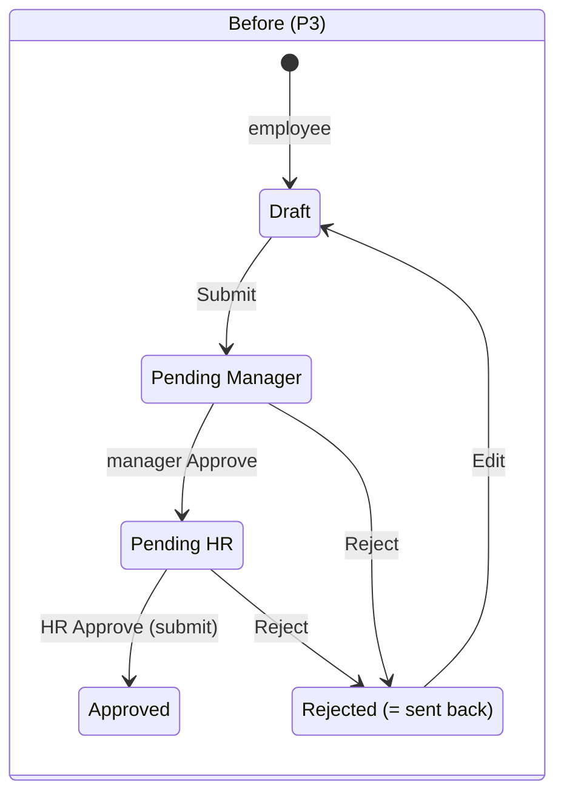
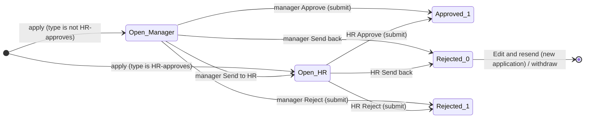
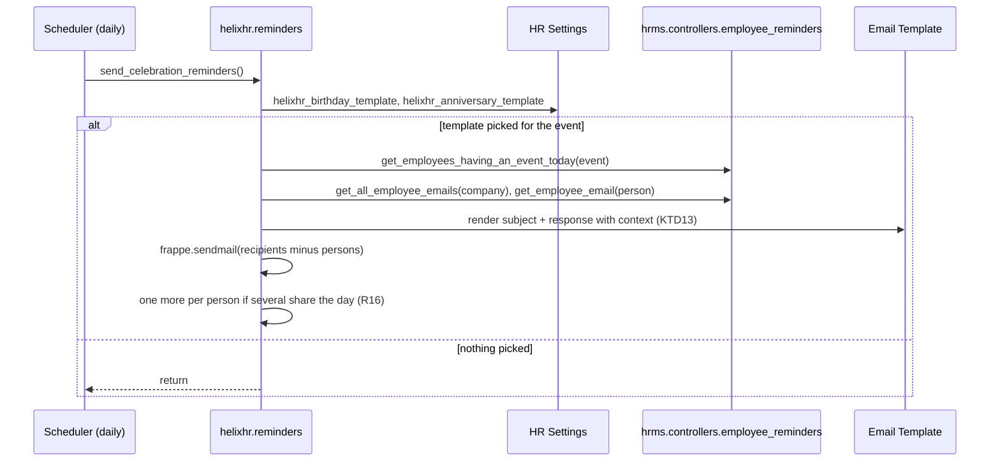

# feat: Four approval outcomes with an HR queue, and celebrations HR can word

## Summary

Every approver in the portal gets four distinct outcomes -- **Approve**, **Send back**, **Reject**, **Send to HR** -- with identical meanings on leave and attendance requests (timesheets get three; see KTD2). Attendance requests collapse to one reports-to approval; HR is involved only when the manager hands one over. A Leave Type can be marked *HR approves* so those requests bypass the manager. HR Managers work a shared queue inside the portal, land there on sign-in, and are emailed when something arrives. Home gains a "this month" panel of birthdays and work anniversaries. The stock HRMS birthday and anniversary emails are replaced by ones HR shapes in Desk's Email Template, switched on by two template pickers on HR Settings, without touching a line of Frappe, ERPNext or HRMS.

---

## Problem Frame

Today the Approvals screen offers two buttons: **Approve** and **Send back**. Under the hood "Send back" is the `Reject` action of each lifecycle, and on every kind it is recoverable: Leave stays at docstatus 0 with status Rejected and the employee sees "Edit and resend"; Timesheet and Attendance Request move to workflow state Rejected, from which `Edit` returns them to Draft. So the portal has a send-back and no reject, and the word "Rejected" is banned by the design system's copy table on purpose (P2-R5).

Three things the operator now needs are not expressible:

1. **A final no.** A request that should not be resent -- wrong leave type for the situation, an attendance claim HR has verified as false -- has no terminal outcome. The manager can only bounce it, and the employee can bounce it back.
2. **Escalation to HR.** Some decisions are HR's -- a special leave type, a Work From Home request that needs a policy check -- but the manager has no way to hand a request over, and HR has no queue in the portal at all. The attendance request compensates with a *mandatory* second HR step on every request, which is now too heavy: Work From Home and On Duty need one approval.
3. **Emails HR cannot word.** HRMS sends birthday and work-anniversary emails from a hardcoded subject, header and Jinja file (`hrms/controllers/employee_reminders.py`, `hrms/templates/emails/birthday_reminder.html`), gated only by two HR Settings checkboxes. There is no Email Template record to edit; the only way to change the copy is to edit HRMS, which the next `bench update` overwrites.

The portal also has nowhere that shows who is celebrating this month, which is the cheap half of the same feature.

---

## Requirements

### Approval outcomes

- **R1** Every approver sees, per request, exactly the outcomes that are legal for that request and that approver, from the server -- never a button the server would refuse.
- **R2** **Approve** keeps its current meaning on every kind (leave submits and consumes balance; a timesheet submits; an attendance request submits and writes Attendance).
- **R3** **Send back** keeps its current meaning on every kind -- the record returns to the employee with a required reason, and the employee can edit and resend or withdraw it. Existing sent-back records keep working.
- **R4** **Reject** is terminal, requires a reason, and exists on leave and attendance requests only. A rejected request is never editable or resendable; the employee sees it as *Rejected* with the reason, and may remove a rejected attendance request from their list so the same dates can be requested again -- the decision and its reason survive the removal (KTD3).
- **R5** **Send to HR** moves a request from the manager's queue into the HR queue with an optional note to HR. The employee sees *Waiting for HR*. Only a manager can send to HR; HR itself never has the button.
- **R6** Attendance requests are approved in **one step** by the reports-to manager for every reason (Work From Home and On Duty). HR decides only what was sent to HR, or what HR raised itself.
- **R7** A Leave Type can be marked **HR approves** in Desk. A request for such a type starts in the HR queue, never appears in the manager's queue, and the employee sees *Waiting for HR* from the moment they send it.
- **R8** Nobody decides their own request at any step, on any route. Today only the attendance request enforces this server-side (`attendance_request_before_submit`); `_assert_may_act_on` lets HR through before any per-kind check runs, and the Timesheet workflow's HR Manager transitions carry `allow_self_approval: 1`. All three kinds get the same explicit "requester's user is not the session user" check in the portal method, the workflow fixtures, and the submit hooks.
- **R8a** The HR queue is enforced where Frappe writes, not only where the portal draws: an employee cannot change their own stage through a generic write, and a manager cannot submit a stage-HR leave from Desk through the DocShare HRMS grants them.
- **R9** Every outcome the approver takes is refused if the record moved since the approver read it (the existing `expected_modified` / `expected_state` contract), and every reason or note is written before the transition so the employee's notification carries it.

### HR queue

- **R10** An HR Manager who signs in lands in the portal like any other employee, with Desk one click away (the shell already links it). System Managers and HR Users keep landing in Desk.
- **R11** The Approvals page shows an HR Manager everything waiting for HR across all three kinds, oldest first, marked as HR work and showing who sent it and their note, alongside anything waiting for them as a line manager of *their own* reports -- not every pending request in the company, which HR Manager's native read permission would otherwise surface through the workflow collectors.
- **R12** HR Managers are emailed when a request enters the HR queue, with a link that opens that request in the portal.
- **R13** The Approvals nav item is present for every HR Manager, empty queue or not.

### Celebrations

- **R14** Home shows, for the employee's own company, everyone with a birthday or work anniversary this month: name, day and month, and for anniversaries the number of years completed. No birth year, no age. Today's entries are marked. Employees with no date recorded are simply absent.
- **R15** The HelixHR birthday and work-anniversary emails go out from Frappe Email Templates HR edits in Desk -- custom subject, custom HTML, company logo, the people's names -- and cope with several people sharing a day.
- **R16** Recipients match HRMS today: every active employee in the company except the people celebrating; when two or more share a day, each of them is told about the others.
- **R17** HR switches the custom emails on by picking a template on HR Settings, per event. No template picked means HelixHR sends nothing for that event. HRMS's own reminders are unchanged and still available.
- **R18** A site cannot be left sending both the HRMS email and the HelixHR email for the same event: HR Settings refuses the save that would create the contradiction, and preflight fails if it exists anyway (a fixture import, a raw write). Preflight also fails when a picked template does not exist and warns when no default outgoing Email Account exists, since both the HR-queue emails and the celebration emails need one.
- **R19** Two default templates are created once on install or migrate and never overwritten afterwards, so HR's edits survive every deploy.
- **R20** No Frappe, ERPNext or HRMS file is modified. Everything ships as helixhr fixtures, patches, hooks and code.

### Existing rules that still hold

- **R21** No Frappe vocabulary on screen; the design-system copy table gains the two new words (*Rejected*, *Waiting for HR*) and records why "Rejected" is now allowed.
- **R22** Every write is a session-scoped whitelisted method with a per-user rate limit; every list is bounded; every resource region has an `AsyncState`.

---

## Scope Boundaries

**Not in this plan**

- Changing who counts as HR. `_is_hr` stays "HR Manager, System Manager, Administrator"; the HR queue is the HR Manager role.
- An HR-only settings screen inside the portal. Template pickers and the templates themselves live in Desk (HR Settings, Email Template); the portal gains no admin surface.
- Terminal reject for timesheets (KTD2).
- Any change to HR Request, the Documents page, or the Team calendar.
- Holiday reminders. HRMS's weekly/monthly holiday email keeps its stock format.
- A personal "happy birthday" email to the person, or an opt-out from appearing on Home (both deliberately declined during scoping).

### Deferred to Follow-Up Work

- Letting HR reassign a request back to a *different* manager (today "Send back" returns it to the employee, not to a manager).
- A per-department HR queue once more than one HR team exists.
- Surfacing the HR note on the employee's own request (today only HR sees the manager's note; the employee sees only the eventual outcome).
- An in-portal unread marker for HR-queue arrivals. R12 is email (channel Email on the fixture Notifications); the portal bell reads System Notification rows, so HR gets mail but no badge until a later unit adds one.

---

## Key Technical Decisions

- **KTD1 -- Two workflow states carry the two meanings, honestly named.** Timesheet and Attendance Request today use the shared state *Rejected* to mean "sent back". The plan renames that use to a new state **Sent Back** (docstatus 0, `Edit` → Draft) and gives *Rejected* its literal meaning (docstatus 0, terminal). Existing rows are renamed by a one-line idempotent patch per doctype, run before the fixture that installs the new transitions. *Alternative rejected:* adding a "Declined" state and leaving "Rejected" meaning sent back -- no data patch, but HR would read a Desk list where *Rejected* means one thing on Leave and the opposite on Timesheet.

- **KTD2 -- No Reject on timesheets.** A week is one Timesheet row (`_week_timesheet`, KTD10 of phase 1). A terminal state would lock that week; the hours still have to be recorded. Timesheets get Approve / Send back / Send to HR, and the reason is one sentence in the design-system copy table so nobody adds the button later.

- **KTD3 -- A rejected attendance request is removable by its employee, and the decision outlives the row.** HRMS's `validate_request_overlap` refuses a new request over any existing one at docstatus < 2, and a Workflow cannot move a document from docstatus 0 to 2, so a terminal Rejected row would block re-requesting the dates for ever. Rejected joins the states the employee may withdraw (`REQUEST_WITHDRAWABLE`), which deletes the row; the portal words this "Remove", not "Withdraw", because there is nothing left to withdraw from. *Terminal* therefore means terminal for the row, not for the dates. Because deleting a document deletes its Comments, the approver's reason is written to a Custom Field on the request itself, `helixhr_decision_reason`, at Send back and Reject time -- it travels into the Deleted Document snapshot Frappe keeps, and it also replaces the comment-scraping `_last_request_comment` as the source of `reason_sent_back`. Leave needs none of this: a final leave reject **submits** with status Rejected (HRMS's own `on_submit` accepts it), and HRMS's overlap rule already ignores Rejected.

- **KTD4 -- Leave gets a stage field, not a workflow, and the field is locked where Frappe writes.** KTD17 of phase 1 stands: Leave Application has no Workflow because HRMS's lifecycle is the correct one. "Send to HR" and "HR approves" are one Custom Field on Leave Application, `helixhr_stage` (Select: Manager / HR, default Manager), read by the collectors and by `_may_act_on_leave`. `leave_approver` stays the manager so HRMS's own validation and DocShare keep working; in the HR stage only `_is_hr` may act. Three guards make that true outside the portal too, because role Employee has write on its own open Leave Application and HRMS shares every application with its approver at `submit=1`: (1) the field sits at **permlevel 1**, with a permission delta giving HR Manager read/write there and nobody else -- the same lock `property_setter.json` and `apply_permission_deltas` already use for Employee fields, so a generic save by the employee or the manager resets it; (2) the portal writes it with `db_set` *after* its own authorization, since a permlevel-1 field set through `doc.save()` by a permlevel-0 user is silently reverted; (3) a `Leave Application` `before_submit` hook refuses a non-HR submitter while the *stored* stage is HR, mirroring `attendance_request_before_submit`, so the manager's DocShare cannot submit an escalated leave from Desk.

- **KTD5 -- The manager approves an attendance request by submitting it, and the overwrite gate moves to that moment.** Single step means the manager's `Approve` is now a docstatus 0 → 1 transition, the same shape as a timesheet approval. The manager's DocShare is upgraded from `submit=0` to `submit=1` while the request is Pending Manager, and `attendance_request_before_submit` accepts the approver user from a *stored* state of Pending Manager and HR from Pending Manager, Pending HR or Draft. The explicit "requester is not the session user" check applies to **both** branches, not only HR's -- today it sits inside the HR branch, and the manager branch is new. HRMS's `on_submit` overwrites existing Attendance in place; the P3-U6 preview refuses overwrites at *send* time, but auto-attendance can mark a day Present between send and approve, and the person now pressing submit is a line manager rather than HR. So the attendance `act` for Approve re-runs the preview on the stored range and refuses when any day would be overwritten -- "Some of those days now have attendance; send this to HR instead" -- leaving the overwrite decision with HR, who can see Attendance.

- **KTD6 -- Allowed actions are a server fact, and the workflow is their source where one exists.** `get_approval_detail` returns `actions: [...]`; `act_on_approval` validates against the same function; the screen draws exactly that list. For Timesheet and Attendance Request the list is *derived* from `frappe.model.workflow.get_transitions(doc)` -- the same roles and conditions `apply_workflow` will enforce -- filtered to the four action names and minus the self-request case, so an edit to a transition in Desk cannot make the button row and the server disagree. Only Leave, which has no Workflow, uses an explicit table (the HTD one). This is what lets one component serve three kinds and two roles without a second copy of the rules anywhere.

- **KTD7 -- One queue, tagged, and scoped to HR's own reports plus HR work.** HR sees one oldest-first list: requests from their own direct reports (as any manager) and everything in the HR stage, HR rows carrying an "HR" tag, the sender's name and note. Today `_timesheet_summaries` and `_attendance_request_summaries` are scoped by *permission*, which for an HR Manager means every pending request in the company; the collectors gain a `reports_to` filter when the caller is HR so the queue matches R6 and the leave collector, which HRMS already scopes by `leave_approver`. A second page or tab would give HR Managers who are also managers two backlogs to poll.

- **KTD7a -- The approver's reason lives on the record.** `helixhr_decision_reason` (Custom Field, Small Text, permlevel 1) on Attendance Request and Timesheet is written by `act_on_approval` at Send back and Reject; the Comment is still added for the timeline. Employee-facing surfaces read the field, not the newest comment, which removes the author-scoped comment scrape `_last_request_comment` and keeps the reason after a Rejected request is removed (KTD3). Leave keeps its existing `_leave_reason` comment read for now -- its rows are never deleted -- and is a candidate to move later.

- **KTD8 -- HR Managers land in the portal.** `portal_home_page` drops HR Manager from the roles that keep Desk; HR User, System Manager and Administrator keep it. The existing test that asserts HR keeps Desk flips to assert the opposite, with the reason. A `default_workspace` on the User still wins over the hook (Frappe's order), so an HR Manager who pinned a workspace keeps landing in Desk -- `check_portal_landing` already FAILs and names such users, and will now name HR Managers too; clearing the pin is a release step, not code.

- **KTD9 -- HR is notified by fixture Notifications, not code, and inserts are a separate event.** Frappe's Notification DocType sends to a role. Per doctype: event Value Change on the stage or `workflow_state` field with a condition on the new value, recipients "HR Manager", channel Email, message linking to the portal route. Frappe does not evaluate Value Change on insert (`run_notifications` skips it while `flags.in_insert`), and an HR-approves leave is *inserted* in stage HR, so Leave Application gets a second fixture on event New with the same condition -- the shape `HelixHR New Request For HR` already uses. Value Change fires once, on the save that changes the watched field, and not on later saves in the same stage, so no code fallback is needed. Same mechanism as the four notifications the app already ships.

- **KTD10 -- Reminders: a HelixHR job beside HRMS's, switched by template pickers.** Frappe collects `scheduler_events` from every app and offers no way to remove HRMS's daily job, so HelixHR registers its own daily job that reads two Custom Fields on HR Settings -- `helixhr_birthday_template` and `helixhr_anniversary_template` (Link to Email Template). Empty means HelixHR sends nothing. HRMS's two checkboxes keep working exactly as before. The contradiction -- a HelixHR template picked while the matching HRMS checkbox is on -- is refused at the point HR would create it, by an `HR Settings` `validate` doc event with one plain sentence naming both fields, and preflight FAILs on it as the post-deploy backstop; preflight alone would leave a window of double emails every morning between HR's save and the next operator run. *Alternatives rejected:* (a) shadowing `templates/emails/birthday_reminder.html` from helixhr -- works because Frappe's Jinja loader searches installed apps in reverse order, and it is the smallest possible change, but the subject and header stay hardcoded in HRMS Python and the file is not HR-editable; (b) monkeypatching `hrms.controllers.employee_reminders.send_birthday_reminder` at import -- keeps the HRMS switches, but a rename upstream silently reverts the format.

- **KTD11 -- Default templates are seeded once, not shipped as fixtures, on both install paths.** Fixtures re-import on every migrate and would overwrite HR's edits. A post-model-sync patch inserts "HelixHR Birthday Reminder" and "HelixHR Work Anniversary Reminder" only if absent, and does not set them on HR Settings -- switching on is HR's act. `bench new-site --install-app` marks every patch complete without running it (`helixhr/install.py` documents this), so the patch is also called from `after_install`, exactly as `apply_permission_deltas` is. Same insert-if-missing posture. A later change to the default HTML does not reach sites that never edited them -- acceptable, since the context contract (KTD13) is what is promised, not the markup.

- **KTD12 -- Recipient and person resolution is HRMS's.** The job imports `get_employees_having_an_event_today`, `get_all_employee_emails`, `get_employee_email` and `get_sender_email` rather than re-implementing them, so eligibility (Active, event date in the past, grouped by company) cannot drift from HRMS's. If HRMS renames one, the job fails loudly in the scheduler log and the test suite fails on the next upgrade -- preferable to a quiet second implementation. Two consequences are accepted and documented: HRMS falls back to `personal_email` for employees with no User or company email, so the branded email can reach a personal inbox; and the person's own address for the shared-day email is resolved with `get_employee_email` on both sides (HRMS's own code uses two different fallback orders for exclusion and for the personal send -- the job uses one).

- **KTD13 -- The Jinja context is small and documented.** Both templates receive `persons` (each with `name`, `first_name`, `image_url`, and for anniversaries `years`), `names` (comma-separated, "&" before the last), `count`, `company`, `logo_url` (absolute, from `Company.company_logo`), `date` and `portal_url`. That list is the contract HR writes against and lives in `docs/deployment.md`.

- **KTD15 -- The stepper stays, with an optional HR step.** `StepStrip.vue` keeps drawing the attendance request's journey -- Sent → Manager → Counted -- and adds an HR pill only for a request that is or was in Pending HR. A plain status line was considered and declined: the strip is how the employee reads *where* a request is, and the single-step change makes that shorter, not less useful.

- **KTD14 -- Celebrations are a projection, like the directory.** `Employee.date_of_birth` and `date_of_joining` are permlevel 1 (property setters), unreadable to the Employee role by design. The read runs server-side with the same posture as `get_directory` -- company-scoped, bounded, projecting only day, month and years -- and never the year of birth. It is a new section of `get_dashboard` so it shares Home's one request and per-section failure isolation.

---

## High-Level Technical Design

### Attendance Request lifecycle, before and after

```mermaid
stateDiagram-v2
    direction LR
    state "Pending Manager" as PendingManager
    state "Pending HR" as PendingHR
    state "Sent Back" as SentBack
    [*] --> Draft: employee
    Draft --> PendingManager: Submit
    Draft --> Approved: HR Approve (HR raised it)
    PendingManager --> Approved: manager Approve (submit, no overwrite)
    PendingManager --> SentBack: manager Send Back
    PendingManager --> Rejected: manager Reject
    PendingManager --> PendingHR: manager Send to HR
    PendingHR --> Approved: HR Approve (submit)
    PendingHR --> SentBack: HR Send Back
    PendingHR --> Rejected: HR Reject
    SentBack --> Draft: employee Edit
    Rejected --> [*]: employee Remove (delete; reason kept on the record)
```

Timesheet is the same shape minus the two `Reject` edges (KTD2) and with *Pending Approval* in place of *Pending Manager*.

### Leave: a stage beside HRMS's status

`Open_Manager` and `Open_HR` are both HRMS status *Open* at docstatus 0; the suffix is `helixhr_stage`. `Rejected_0` is today's send-back; `Rejected_1` is the new final reject. `_leave_state` gains one value, `rejected`, for docstatus 1 + Rejected.

### Who may do what, per state (the server table behind KTD6)

| Kind | State | Line manager | HR Manager |
|---|---|---|---|
| Leave | Open, stage Manager | Approve · Send back · Reject · Send to HR | Approve · Send back · Reject |
| Leave | Open, stage HR | -- | Approve · Send back · Reject |
| Timesheet | Pending Approval | Approve · Send back · Send to HR | Approve · Send back |
| Timesheet | Pending HR | -- | Approve · Send back |
| Attendance | Pending Manager | Approve · Send back · Reject · Send to HR | Approve · Send back · Reject |
| Attendance | Pending HR | -- | Approve · Send back · Reject |

"Line manager" means the reports-to user with an Active Employee record (`events._approver_user`); a manager who is also HR gets the union, minus Send to HR in the HR stage. Own requests: nothing, at any step. For the two workflow kinds this table is a *description* of the fixture -- the server derives the list from `get_transitions` (KTD6); for Leave the table is the implementation.

### Reminder job

HRMS's own `send_birthday_reminders` still runs in the same daily slot and still honours its checkbox; preflight is what stops both being on.

---

## Implementation Units

### U1. Workflow fixtures, the Sent Back rename, and single-step attendance

**Goal:** Both workflows carry the four outcomes with honest state names; attendance requests are approved in one step by the manager; existing rows keep their meaning.

**Requirements:** R2, R3, R4, R5, R6, R8, R20

**Dependencies:** none

**Files:**
- Modify: `helixhr/fixtures/workflow.json`, `helixhr/fixtures/workflow_state.json`, `helixhr/fixtures/workflow_action_master.json`, `helixhr/hooks.py` (fixture filters for the new state and action names)
- Create: `helixhr/patches/v1_0/rename_sent_back_state.py`; line in `helixhr/patches.txt` (post_model_sync, before fixtures sync -- Frappe runs patches, then `sync_fixtures`)
- Modify: `helixhr/events.py` (`REQUEST_*` constants gain `REQUEST_SENT_BACK`, and a `TIMESHEET_SENT_BACK` beside `PENDING_STATE`; `REQUEST_WITHDRAWABLE` becomes Draft / Pending Manager / Sent Back / Rejected -- today's tuple already names Rejected because Rejected *meant* sent back; `_reconcile_share(..., submit=1)` for Pending Manager; `attendance_request_before_submit` accepts the approver from stored Pending Manager and HR from Pending Manager / Pending HR / Draft, with the requester-is-not-the-session-user check on both branches; `_notify_attendance_request` and `attendance_request_subject` gain Sent Back, Rejected and Pending HR wording and read `helixhr_decision_reason` instead of `_last_request_comment`, which is removed; `attendance_request_validate` freeze exempts `helixhr_decision_reason` for approvers)
- Modify: `helixhr/api.py` -- every server read of the literal `"Rejected"` on a workflow kind now reads Sent Back: `_assert_week_is_still_sendable`, `_write_my_week` (the Rejected → Draft `Edit` before a rewrite), `get_my_week` (`rejection_comment`), `get_my_timesheet_history`, `_decided_timesheets` and `_decided_attendance_requests` (`["Approved", "Sent Back", "Rejected"]`), `_get_needs_you` (the two workflow `*_rejected` kinds), `_request_projection.can_withdraw`. Without this an employee cannot resend a sent-back week after the rename.
- Create: `helixhr/fixtures/custom_field.json` (`helixhr_decision_reason`, Small Text, permlevel 1, on Timesheet and Attendance Request -- KTD7a; `module: HelixHR`); `hooks.py` gains `{"dt": "Custom Field", "filters": [["module", "=", "HelixHR"]]}`. U1 owns this file's creation; U2 and U6 add fields to it.
- Modify: `helixhr/patches/v1_0/apply_permission_deltas.py` (HR Manager read/write at permlevel 1 on Timesheet and Attendance Request for the reason field; new dated `patches.txt` line, as P3-KTD13 did)
- Modify: `helixhr/preflight.py` (`check_fixtures` gains `("Workflow State", "Sent Back")` and the two new Workflow Action Masters -- the fixture import runs with `ignore_links`, which is why the list exists)
- Modify: `helixhr/fixtures/notification.json` (Timesheet subject: Sent Back / Pending HR wording)
- Test: `helixhr/tests/test_fixtures.py`, `helixhr/tests/test_attendance_request_workflow.py`, `helixhr/tests/test_api_timesheet.py`, `helixhr/tests/test_preflight.py`

**Approach:**
- Workflow State fixture adds **Sent Back**; Workflow Action Master adds **Send Back** and **Send to HR** (Frappe ships Approve and Reject). Fixture filters in `hooks.py` list the new names.
- Attendance Request Approval: states in the order Draft(0), Pending Manager(0), Pending HR(0), Approved(1), Sent Back(0), Rejected(0) -- Draft must stay first per docstatus because `Workflow.on_update` backfills null `workflow_state` from the first state of each docstatus. Transitions per the HTD table: Employee-role transitions carry the existing reports-to condition; HR Manager transitions carry the existing `user_id != session.user` condition; Draft → Approve → Approved for HR Manager replaces Draft → Approve → Pending HR.
- Timesheet Approval: the `Reject → Rejected` transitions become `Send Back → Sent Back`; add Pending Approval → Send to HR → Pending HR (Employee, reports-to condition) and Pending HR → Approve / Send Back (HR Manager). No Reject (KTD2). Every HR Manager transition on both workflows carries `allow_self_approval: 0` and the `user_id != frappe.session.user` condition -- today the Timesheet ones carry `allow_self_approval: 1` with no condition, so an HR Manager can approve their own week through the workflow (R8).
- `timesheet_before_submit` gains the same requester-is-not-the-session-user refusal, so a raw `frappe.client.submit` by an HR Manager on their own week is refused where the fixture is not consulted.
- Patch: `UPDATE tabTimesheet SET workflow_state='Sent Back' WHERE workflow_state='Rejected' AND docstatus=0`, same for Attendance Request; guarded on the workflow existing on this site; idempotent. Because it runs before `sync_fixtures`, the Workflow State record does not exist yet -- that is fine for a column update, and the fixture creates it moments later.
- `attendance_request_before_submit`: replace "only HR, only from Pending HR" with a table: approver user from stored Pending Manager; `_is_hr` from Pending Manager, Pending HR or Draft; anyone else refused. The explicit "requester's user is not the session user" throw runs before the table, for both branches -- today it sits inside the HR branch only, and a `reports_to` that points at oneself would otherwise reach the manager branch with only the `_approver_user` equality standing in the way. `attendance_request_on_update` grants the share with `submit=1` while Pending Manager (KTD5) and removes it otherwise, as now.
- `attendance_request_on_trash`: Sent Back and Rejected are withdrawable; Approved and Pending HR still refuse. The Rejected row's `helixhr_decision_reason` travels into the Deleted Document snapshot, so nothing extra is written at delete time.
- Timesheet Pending HR has no DocShare (`timesheet_on_update` removes approver shares outside Pending Approval); HR's Approve there relies on HR Manager's native submit on Timesheet, which `timesheet_before_submit` already assumes. This is a U1 test scenario, not an open question.

**Execution note:** Characterization-first on `test_attendance_request_workflow.py` -- the existing 800-line suite encodes the two-step model; capture which assertions flip (two-step → one-step) before changing the fixture, so the diff is a deliberate list rather than a surprise.

**Patterns to follow:** `helixhr/patches/v1_0/apply_permission_deltas.py` (idempotent, dated re-run line), `events.timesheet_on_update` (share reconcile with submit), `hooks.py` fixture comments naming which shared records are reused not owned.

**Test scenarios:**
- Fixture: both workflows import on a fresh site; every transition's action and next state match the HTD table; Draft is the first docstatus-0 state in both. (`test_fixtures.py`)
- Manager Approve from Pending Manager submits the request and writes Attendance **as the manager user, not Administrator** -- HRMS's cascaded `Attendance` insert must succeed under a role-Employee session; the employee's User Permission alone never reaches the request (the share is what grants submit).
- Manager Approve is refused when a day in the range was marked Present after the employee sent it, with the "send this to HR instead" sentence; HR Approve on the same request is allowed and overwrites (KTD5).
- Manager Send Back → Sent Back with the reason in `helixhr_decision_reason` and on the Notification Log; employee Edit → Draft; resend → Pending Manager; employee may also withdraw a Sent Back request.
- Manager Reject → Rejected; employee cannot Edit (no transition), *can* delete; the Deleted Document snapshot carries the reason; HRMS then accepts a new request over the same dates.
- An approver (role Employee) can write `helixhr_decision_reason` only through `act_on_approval`; a generic save by the employee leaves it unchanged (permlevel 1).
- Timesheet: HR Approve from Pending HR submits with no DocShare present; an HR Manager's Approve/Send Back on their *own* week is refused both through `apply_workflow` (condition) and through raw `frappe.client.submit` (`timesheet_before_submit`).
- Manager Send to HR → Pending HR; the manager's share is gone; the manager can no longer act; HR Approve submits.
- HR Manager Approve from Draft → Approved (HR raised it for someone).
- Nobody approves, sends back, rejects or escalates their own request -- manager who is the employee; HR Manager who is the employee.
- Raw `frappe.client.submit` from Pending Manager by a non-approver, and from Sent Back / Rejected / Draft by the employee, all refused.
- Patch: a site with docstatus-0 Rejected timesheets and attendance requests ends with them in Sent Back; docstatus-1 rows untouched; running it twice changes nothing.
- Timesheet: Send Back → Sent Back → Edit → Draft round-trips; Send to HR → Pending HR; HR Approve submits; no Reject transition exists on either pending state.
- Timesheet: an employee resends a Sent Back week through `submit_my_week` (the server-side rename in `_assert_week_is_still_sendable` / `_write_my_week`); `get_my_timesheet_history` and Home's needs-you list the week as sent back with its reason.
- Preflight `check_fixtures` FAILs when the Sent Back Workflow State or either new Workflow Action Master is missing.

**Verification:** Fresh-site Python suite green; a hand run in Desk shows the six states and the new actions on both doctypes; `bench --site <site> migrate` on a site with legacy Rejected rows leaves no docstatus-0 Rejected timesheet or attendance request.

---

### U2. Leave: stage field, HR-approved leave types, final reject

**Goal:** Leave supports the same four outcomes through HRMS's own lifecycle plus one stage field, and a Leave Type can route straight to HR.

**Requirements:** R2, R3, R4, R5, R7, R8, R8a, R20

**Dependencies:** U1 (owns `custom_field.json` and the permission-delta line this unit extends)

**Files:**
- Modify: `helixhr/fixtures/custom_field.json` (Leave Application `helixhr_stage` at **permlevel 1**; Leave Type `helixhr_hr_approves`; both `module: HelixHR`)
- Modify: `helixhr/patches/v1_0/apply_permission_deltas.py` (HR Manager read/write at permlevel 1 on Leave Application -- the same shape as the Employee permlevel rows; Employee gets nothing at level 1)
- Modify: `helixhr/api.py` (`apply_for_leave` sets the stage from the Leave Type with `db_set` after insert; `_leave_state` gains `rejected`; `_leave_projection` exposes `stage`; `_act_on_leave_application` handles Send Back / Reject / Send to HR; `_may_act_on_leave` respects the stage; `_LEAVE_FIELDS` gains `helixhr_stage`; `get_leave_form_context` marks HR-approved types so the sheet can say "goes to HR")
- Modify: `helixhr/events.py` + `helixhr/hooks.py` (`Leave Application` `before_submit`: refuse a non-HR submitter while the stored stage is HR; refuse anyone submitting their own application -- R8, R8a)
- Modify: `helixhr/fixtures/notification.json` (Leave Status Changed: word "Sent back" vs "Rejected" by `doc.docstatus`; one new employee-facing fixture on Value Change of `helixhr_stage` reading "Waiting for HR")
- Test: `helixhr/tests/test_leave_flow.py`, `helixhr/tests/test_api_approvals.py`, `helixhr/tests/test_fixtures.py`, `helixhr/tests/test_notifications.py`

**Approach:**
- Stage is a Select with options `Manager` / `HR`, default `Manager`, `allow_on_submit: 0`, **permlevel 1** (KTD4). Role Employee has write on its own open Leave Application and HRMS shares each application with its approver at `submit=1`, so a permlevel-0 field would be one `frappe.client.set_value` away from either of them; at permlevel 1 a generic save by anyone but HR silently resets it.
- Because a permlevel-1 field set through `insert()`/`save()` by a permlevel-0 user is reverted, the portal writes it with `db_set` after its own authorization: `apply_for_leave` inserts, then `db_set("helixhr_stage", "HR")` when `Leave Type.helixhr_hr_approves` is set; `Send to HR` in `act_on_approval` authorizes, adds the optional note as a Comment (R9), then `db_set`. `leave_approver` stays the manager (HRMS requires one and shares the doc with them); the manager's queue excludes stage HR (U3), and `_may_act_on_leave` refuses a non-HR user in the HR stage.
- `before_submit` on Leave Application: when the *stored* stage is HR and the session is not `_is_hr`, refuse -- the manager's DocShare can submit from Desk and never consults `_may_act_on_leave`. The same hook refuses a submitter whose User is the employee's `user_id` (Administrator exempt), the leave half of R8.
- Final reject: `doc.status = "Rejected"; doc.submit()` -- HRMS's `on_submit` accepts Approved and Rejected. `_leave_state`: docstatus 1 + Rejected → `rejected` (was `decided`). `_may_withdraw` unchanged (`rejected` is not withdrawable; nothing to withdraw).
- Send back: unchanged (`status = Rejected`, save, docstatus 0).
- Notifications: a submit **does** raise Value Change (`run_post_save_methods` runs `on_change` after submit; `test_approval_submits_writes_the_ledger_and_consumes_balance` already asserts the existing fixture fires on approve), so the existing `status` fixture is kept alone and its subject keys on `doc.docstatus` -- "Sent back" at 0, "Rejected" at 1. A Notification watches one field, so "Waiting for HR" is a second, employee-facing fixture on Value Change of `helixhr_stage` with condition `doc.helixhr_stage == "HR"`; Value Change evaluates once, on the save that changes the field.

**Patterns to follow:** `_act_on_leave_application` docstring (why approve submits), `apply_for_leave` (field allow-list posture), `fixtures/property_setter.json` for the module-scoped fixture shape.

**Test scenarios:**
- Applying for a normal type leaves stage Manager; applying for an HR-approves type sets stage HR (as the employee session, through `db_set`) and the manager's `_may_act_on_leave` refuses.
- Manager Send to HR flips the stage, keeps `leave_approver`, keeps status Open, and the manager is refused afterwards; HR is allowed.
- Raw routes: the employee's `frappe.client.set_value` on `helixhr_stage` is refused or reset (permlevel 1); the manager's `frappe.client.submit` on a stage-HR leave is refused by `before_submit`; HR's succeeds.
- HR Manager's `frappe.client.submit` on their own leave is refused by `before_submit`.
- Reject submits: docstatus 1, status Rejected, no Leave Ledger Entry, balance unchanged; `_leave_state` reports `rejected`; a new application over the same dates is accepted by HRMS.
- Send back still leaves docstatus 0; `_leave_state` still `sent_back`; withdraw still allowed.
- HR Manager acting on their own leave (as employee) is refused for every action.
- Custom Field fixture installs both fields on a fresh site with module HelixHR; `helixhr_stage` default is Manager on a leave HR files in Desk.
- Notification: an employee whose leave is rejected receives exactly one Notification Log reading "Rejected", not "Sent back" and not two rows; sent back reads "Sent back"; sent to HR reads "Waiting for HR" from the stage fixture.

**Verification:** `test_leave_flow.py` and the leave classes of `test_api_approvals.py` green on a fresh site; Desk shows the two fields, and the stage is read-only for a non-HR user; `bench --site <site> migrate` on an existing site adds them without touching data.

---

### U3. Four outcomes on the server, the HR queue, HR landing and HR email

**Goal:** `act_on_approval` accepts the four outcomes, `get_approval_detail` tells the screen which are legal, HR Managers see their queue and land in the portal, and are emailed when work arrives.

**Requirements:** R1, R5, R6, R8, R9, R10, R11, R12, R13, R22

**Dependencies:** U1, U2

**Files:**
- Modify: `helixhr/api.py` (`act_on_approval`: action set `Approve | Send Back | Reject | Send to HR`, reason required for Send Back and Reject and written to `helixhr_decision_reason`, note optional for Send to HR; new `_allowed_actions(doc, user)` -- `get_transitions` for the workflow kinds, the table for leave -- used by both the detail and the act; `_assert_may_act_on` gains the requester-is-not-the-session-user refusal *before* the HR short-circuit; the attendance `act` for Approve re-runs `_attendance_request_preview` and refuses overwrites (KTD5); `_APPROVAL_KINDS` gains `is_open` for the HR states and an `hr_state` collector; `_approval_summaries` adds HR collectors when `_is_hr(user)` and scopes `_timesheet_summaries` / `_attendance_request_summaries` to the caller's own reports for an HR caller (KTD7); `_leave_summaries` drops stage-HR rows after the HRMS call -- HRMS filters by `leave_approver` and returns its own field list, so this is one extra `get_all` on the returned names; `_summary_row` and `_decision_head` gain `for_hr`, `sent_to_hr_by`, `hr_note`; `_pending_approvals`/`_QUEUE_TITLE` word the HR rows; `get_portal_bootstrap.can_approve` is true for `_is_hr`)
- Modify: `helixhr/utils.py` (`DESK_ROLES` minus HR Manager; docstring says why)
- Modify: `helixhr/fixtures/notification.json` (four "Sent to HR" Notifications, channel Email, recipients by role HR Manager: Value Change on `helixhr_stage` / `workflow_state` with the HR-value condition for the three doctypes, plus event New on Leave Application for the HR-approves insert; message with the portal link `/helixhr/approvals/<kind>/<name>`)
- Modify: `helixhr/tests/utils.py` (`ensure_test_email_account()`: a default outgoing Email Account so Email-channel Notifications and `frappe.sendmail` do not throw inside a save on the test site -- `frappe.sendmail` throws without one, which `ensure_baseline_project` and `test_api_timesheet` already route around; `make_test_hr_manager_employee()`: HR Manager role **with** an Active Employee, which `ensure_hr_manager_user` deliberately lacks and which KTD8's landing and every portal read require)
- Test: `helixhr/tests/test_api_approvals.py`, `helixhr/tests/test_portal_landing.py`, `helixhr/tests/test_notifications.py`, `helixhr/tests/test_fixtures.py`, `helixhr/tests/test_preflight.py`

**Approach:**
- `_allowed_actions(doc, user)`: for Timesheet and Attendance Request, `frappe.model.workflow.get_transitions(doc)` filtered to the four action names -- the fixture's roles and conditions are then the only rule (KTD6); for Leave, the HTD table keyed on stage / is-approver / is-HR. Both minus everything when the requester is the caller. `act_on_approval` refuses any action not in that list with a plain sentence; `get_approval_detail` returns the same list as `actions`.
- `_assert_may_act_on` today returns early for HR; the self-request check moves in front of that return so it applies to all three kinds (R8). Attendance's `before_submit` and Timesheet's `before_submit` (U1) and Leave's `before_submit` (U2) cover the raw routes.
- HR collectors: Leave `status Open, docstatus 0, helixhr_stage HR`; Timesheet `workflow_state Pending HR`; Attendance Request `workflow_state Pending HR, docstatus 0` -- as `frappe.get_list` under the HR user (HR Manager has read on all three natively), excluding rows whose employee is the caller. Each row carries `for_hr: true`, the sender (the user whose save moved the record into the HR stage -- `Version` row or the last Comment by that user) and their note.
- The line-manager half of an HR Manager's queue is scoped to `Employee.reports_to == caller's Employee` on the two workflow collectors; without it HR Manager's native read returns every pending request in the company (KTD7, R6). Leave is already scoped by HRMS.
- `_is_open` for the HR states: leave Open in stage HR; timesheet/attendance Pending HR. `_assert_still_open` picks by the caller's queue.
- `can_approve`: `report_count > 0 or _is_hr(user) or pending`.
- `portal_home_page`: HR Manager with an Active Employee record → portal.
- The HR email is a Notification fixture (KTD9). Message names the employee, the kind, the dates and the sender's note if any, and links to the portal detail route. Four fixtures: one per doctype on the state change, and one on New for a leave inserted in stage HR.

**Patterns to follow:** `_APPROVAL_KINDS` table; `_leave_summaries` (collector shape); `_assert_may_act_on` (authorization before side effects); `notification.json` entries with `{{ doc.* }}` subjects.

**Test scenarios:**
- Detail for a manager on a Pending Manager attendance request lists the four actions; on a Pending Approval timesheet lists three (no Reject); for HR on a Pending HR *attendance request or stage-HR leave* lists three (no Send to HR) and on a Pending HR *timesheet* lists two; for the employee themself lists none and the act is refused.
- Editing a transition's condition in the Timesheet workflow (test fixture) changes the `actions` list without a code change -- proves the derivation.
- `act_on_approval` with `Send Back` and no comment is refused; with `Reject` and no comment refused; `Send to HR` with no comment accepted; an action not in the list is refused with the plain message even when the workflow would technically allow it.
- HR queue: a leave in stage HR, a Pending HR timesheet and a Pending HR attendance request all appear for an HR Manager, oldest first, with `for_hr`, the sender and note; none appear for the line manager; an HR Manager's own request never appears in their queue; a Pending Manager request from **another** manager's report does not appear in HR's queue.
- A stage-HR leave is absent from its `leave_approver`'s queue.
- `can_approve` is true for an HR Manager with no reports and an empty queue; false for an ordinary employee with nothing pending (unchanged).
- Landing: an HR Manager with an Active Employee lands on the portal; an HR User keeps Desk; System Manager keeps Desk; the existing HR-keeps-Desk test is inverted with a docstring. An HR Manager with `default_workspace` set is named by `check_portal_landing` (it already FAILs on pinned users; the set of users it reports grows).
- Notification fixtures: sending each kind to HR creates exactly one Email Queue row addressed to every HR Manager user; applying for an HR-approves leave type creates exactly one; a record moving to any other state creates none.
- Stale evidence: `expected_modified` from before a Send to HR is refused after it.

**Verification:** `test_api_approvals.py`, `test_portal_landing.py`, `test_notifications.py` green on a fresh site with `ensure_test_email_account` in place; `helixhr.preflight.run` on the dev site passes once any HR Manager's `default_workspace` is cleared; an HR Manager signing in on the dev site lands on `/helixhr`.

---

### U4. Approvals screen: four buttons from the server, HR tag; status words everywhere

**Goal:** The screen draws exactly the actions the server allows, asks for a reason where required, tags HR work, and every employee-facing surface words the new states.

**Requirements:** R1, R3, R4, R5, R11, R21, R22

**Dependencies:** U3

**Files:**
- Modify: `frontend/src/pages/Approvals.vue` (button row from `detail.actions`; one reason sheet reused for Send back and Reject with the button naming which; optional note field for Send to HR; `KIND.attendance.approve` returns "Approve N days" again -- the manager's approve is final now; HR tag, sender and note on HR rows and in the detail head)
- Modify: `frontend/src/lib/statusBadge.js` (attendance and timesheet: `'Sent Back'` → "Sent back", `Rejected` → "Rejected" (tone sentBack), `'Pending HR'` → "Waiting for HR" for timesheet too; leave: `rejected` lifecycle → "Rejected"; `resolveStatus` takes `docstatus` already -- leave Rejected at docstatus 1 reads "Rejected", at 0 "Sent back")
- Modify: `frontend/src/components/StepStrip.vue` (KTD15: steps Sent → Manager → Counted, with an HR step drawn only when the request is or was in Pending HR)
- Modify: `frontend/src/pages/Leave.vue` (a `rejected` application shows the reason and no Edit-and-resend; "Waiting for HR" when stage HR), `frontend/src/pages/Attendance.vue` and `frontend/src/components/AttendanceRequestSheet.vue` ("Remove" on a Rejected request; reason quoted), `frontend/src/pages/Timesheet.vue` (`'Sent Back'` in place of `'Rejected'` for the resend affordance; a Pending HR week is read-only and says so), `frontend/src/components/NeedsYou.vue` / `helixhr/api.py::_get_needs_you` (the three `*_rejected` kinds read Sent Back; rejected leave and attendance appear once as "Rejected" with the reason and no action)
- Modify: `frontend/src/lib/errorMap.js` if a new server sentence needs mapping
- Test: `frontend/src/lib/statusBadge.test.js`, `frontend/tests/e2e/approvals.spec.ts`, `frontend/tests/e2e/leave.spec.ts`, `frontend/tests/e2e/attendance-request.spec.ts`, `frontend/tests/e2e/timesheet-approval.spec.ts`

**Approach:**
- Button order on every kind: primary Approve; secondary Send back; tertiary Reject (destructive tone); Send to HR as a quiet link-style button -- it is a routing act, not a decision. Buttons not in `actions` are not rendered (not disabled).
- One reason surface: opening it from Send back or Reject sets which action it will fire, and the label says so ("Send back with a reason" / "Reject with a reason"). Switching from one to the other while the sheet is open clears the typed reason and its error and relabels the field, so a sentence written to send something back can never be submitted as a terminal rejection. Send to HR opens a smaller optional note field inline.
- HR rows: an "HR" chip beside the name, and a second line "Sent by Priya · 'needs policy check'". Detail head shows the same.
- `resolveStatus` already receives `docstatus`; the leave map keys on it for Rejected. No new colour: Rejected uses the existing sent-back pair (measured contrast), and the design-system table records the shared pair.
- Signal patterns unchanged: 44px targets, `.surface-field` for the reason field, `AsyncState` on the queue and detail.

**Patterns to follow:** `Approvals.vue` `decide()` (stale-token contract, double-tap guard, `toPlainMessage`), `KIND` map (one entry per kind), `statusBadge.js` header comment, design-system copy table.

**Test scenarios:**
- Unit: `resolveStatus({kind:'leave', status:'Rejected', docstatus:0})` → "Sent back"; `docstatus:1` → "Rejected"; attendance `'Sent Back'` → "Sent back", `Rejected` → "Rejected", timesheet `'Pending HR'` → "Waiting for HR".
- E2E (manager project): a Pending Manager attendance request shows four buttons; Reject without a reason is blocked with the sentence; Reject with a reason lands the row in Decided this week as Rejected; the employee project then sees "Rejected" with the reason and a Remove action, and can request the same dates again.
- E2E: Send to HR moves the row out of the manager's queue and the employee sees "Waiting for HR".
- E2E: a timesheet detail shows three buttons and no Reject.
- E2E (HR identity from `make_test_hr_manager_employee` -- U3 -- seeded in `setup_playwright_fixtures`, third storage state in `auth.setup.ts`; `ensure_hr_manager_user` has no Employee and cannot open the portal): the HR queue lists the escalated request with the HR chip, sender and note; HR has no Send to HR button; HR Approve completes it.
- E2E: opening the reason sheet from Send back, typing, then tapping Reject leaves an empty, relabelled field.
- E2E: a leave of an HR-approves type shows "Waiting for HR" to the employee immediately and never appears in the manager's queue.
- Visual foundation spec: the button row meets the 44px floor and the destructive button uses only the measured sent-back pair.

**Verification:** `yarn lint`, `yarn test`, Chromium e2e green with `--workers=1` (the HR identity is a third storage state, seeded like the other two); the P2 design tokens unchanged (no new colour in `tailwind.config.cjs`).

---

### U5. Celebrations on Home

**Goal:** Home shows this month's birthdays and work anniversaries for the employee's company, day and month only, years for anniversaries.

**Requirements:** R14, R22

**Dependencies:** none

**Files:**
- Modify: `helixhr/api.py` (`get_dashboard` gains `celebrations` section via `section()`; `_get_celebrations(employee, today)` with a bounded company-scoped read of `employee_name`, `first_name`, `image`, `date_of_birth`, `date_of_joining`, projecting `day`, `month`, `is_today`, `years`; sorted by day; empty `company` → empty lists, as `get_directory`)
- Create: `frontend/src/components/Celebrations.vue`; Modify: `frontend/src/pages/Dashboard.vue` (one card under the right-hand column, with `AsyncState`; hidden entirely when both lists are empty)
- Modify: `frontend/src/lib/dates.js` if a "9 Sep" day-month formatter is missing (check `dateTileParts` first)
- Test: `helixhr/tests/test_api_dashboard.py`, `frontend/tests/e2e/login-dashboard.spec.ts`, `frontend/src/lib/dates.test.js` if a formatter is added

**Approach:**
- One `frappe.get_all` (already `ignore_permissions`) filtered `status Active, company = employee's company`, then filtered in Python to entries whose day-month falls in the current month; birthdays exclude anyone whose year of birth is missing or is this year (HRMS's own rule); anniversaries require `date_of_joining` strictly before this year and report `today.year - joining.year`. Bounded by the company's active headcount, which the directory already reads whole.
- Projection never includes `date_of_birth` itself: only `day`, `month`. Anniversaries include `years`. Today's entries first, then by day.
- The card: two short lists with the same avatar-initials treatment as the directory; today's entries carry a small "today" chip; nothing is clickable (nothing to open).
- The card's `AsyncState` `error` prop reads `dashboard.failed_sections.includes('celebrations')`, exactly as the existing attendance section does, so a failed read shows the retry panel; the hide-when-empty rule applies only to a genuine zero-result month. (`AsyncState`'s own header names "a failed request shown as its empty state" as the bug it exists to prevent.)

**Patterns to follow:** `get_directory` (company scoping, projection posture, `_initials`), `get_dashboard` `section()` isolation, Dashboard right-column cards.

**Test scenarios:**
- Two employees in the company with birthdays this month, one last month, one with no DOB: the section lists exactly the two, ordered by day, with no year and no age in the payload.
- An anniversary today for someone who joined 3 years ago reports `years: 3` and `is_today`; someone who joined this year is absent.
- An employee in another company is absent; an Inactive/Left employee is absent.
- An employee whose record has no company gets empty lists and the card is hidden.
- A failure inside the celebrations read lands in `failed_sections` and the rest of Home renders (existing isolation); the card shows the retry panel, not nothing.
- E2E: with the seeded birthday fixture (an Employee whose DOB is set to this month in `setup_playwright_fixtures`), Home shows the name and day and not a year.

**Verification:** `test_api_dashboard.py` green; the Home screenshot in `docs/images/` regenerated with the card visible.

---

### U6. HR-editable birthday and anniversary emails

**Goal:** HelixHR sends both reminder emails from Email Templates HR edits, switched by two template pickers on HR Settings, seeded once, guarded by preflight -- with no change to HRMS.

**Requirements:** R15, R16, R17, R18, R19, R20

**Dependencies:** U1 (owns `custom_field.json`); U3 for `ensure_test_email_account`

**Files:**
- Modify: `helixhr/fixtures/custom_field.json` (HR Settings `helixhr_birthday_template`, `helixhr_anniversary_template`: Link → Email Template, in HRMS's existing *Reminders* section, `module: HelixHR`)
- Create: `helixhr/reminders.py` (`send_celebration_reminders()` daily entry; `_send_event(event, template_name)`; `_context(persons, company, event)`; imports the four HRMS helpers per KTD12)
- Modify: `helixhr/hooks.py` (`scheduler_events.daily` gains the job; `doc_events["HR Settings"]["validate"]`)
- Modify: `helixhr/events.py` (`hr_settings_validate`: refuse the save when a HelixHR template is picked while the matching HRMS checkbox is on, naming both fields -- R18, KTD10)
- Create: `helixhr/patches/v1_0/seed_celebration_templates.py` + `patches.txt` line (insert-if-missing the two Email Templates with a branded default: logo, names, one sentence; `use_html: 1`)
- Modify: `helixhr/install.py` (`after_install` calls `seed_celebration_templates.execute()` -- `--install-app` marks patches complete without running them; KTD11)
- Modify: `helixhr/preflight.py` (`check_celebration_reminders`: FAIL when a HelixHR template is picked *and* the matching HRMS checkbox is on; FAIL when a picked template does not exist; WARN when neither HRMS nor HelixHR sends for an event; PASS otherwise, naming which sends. `check_outgoing_email`: WARN when no default outgoing Email Account exists -- the HR-queue emails and these both need one)
- Modify: `docs/deployment.md` (the switch, the context contract of KTD13, the `personal_email` fallback HR should know about, how to preview with `frappe.sendmail(now=True)` from the console), `README.md` config table (two rows)
- Test: `helixhr/tests/test_reminders.py` (new), `helixhr/tests/test_preflight.py`, `helixhr/tests/test_fixtures.py`, `helixhr/tests/test_install.py`

**Approach:**
- The job runs daily; for each event it reads the picker; empty → skip. Otherwise: persons grouped by company from HRMS; per company, recipients = all employee emails minus the persons' (HRMS's own set arithmetic); render subject and body with `Email Template.get_formatted_email(context)`; `frappe.sendmail(sender=HRMS sender_email, recipients, subject, message, reference_doctype="Employee")`. When several share the day, one more email per person about the others (R16), same template.
- Context (KTD13): `persons` (name, first_name, image_url absolute via `frappe.utils.get_url`, `years` for anniversaries), `names` via `frappe.utils.comma_sep`, `count`, `company`, `logo_url` from `Company.company_logo` made absolute, `date` as the site's formatted date, `portal_url`.
- Default templates: minimal, on-brand HTML -- logo, a headline using `names`, one sentence, the portal link. Seeded by patch, never overwritten (KTD11). HR picks them on HR Settings to switch on.
- Nothing is monkeypatched and no HRMS template file is shadowed. HRMS's job still runs and still respects its checkboxes; preflight is the double-send guard.
- Date arithmetic uses `getdate()` (system time zone), the same clock HRMS's job uses, so both jobs agree on "today".

**Patterns to follow:** `helixhr/tasks.py` (scheduler job shape, per-batch commit posture, docstring naming the config that gates it), `preflight.check_checkin_settings` (report-don't-judge for the HRMS flag; FAIL only for the contradiction), `apply_permission_deltas` (insert-if-missing patch).

**Test scenarios:**
- No template picked: the job sends nothing even with a birthday today.
- Birthday template picked, one birthday today in company A, two other active employees: exactly one email to the two others, subject and body rendered from the template, the person absent from recipients, the logo URL absolute.
- Two people share a birthday: one company email naming both, plus one email to each naming only the other.
- Anniversary today, joined 5 years ago: `years` is 5 in the context; joined this year: absent.
- Two companies: recipients never cross companies.
- Template renders with `use_html` and a missing `logo` (Company without a logo): no exception, empty `logo_url`.
- Patch seeds both templates on a site without them; on a site where HR renamed the subject, the patch changes nothing; a freshly installed site (`test_install.py`) has both.
- HR Settings save with a HelixHR template picked and the matching HRMS checkbox on is refused with a sentence naming both fields; unticking the checkbox in the same save is accepted.
- Preflight: template picked + HRMS checkbox on → FAIL naming the event; picked template missing → FAIL; neither on → WARN; HelixHR only → PASS; HRMS only → PASS; no default outgoing Email Account → WARN.
- Scheduler hook registered (`frappe.get_hooks("scheduler_events")["daily"]` contains the job).

**Verification:** `test_reminders.py` and the preflight class green on a fresh site; on the dev site, picking the template, setting an employee's DOB to today and running `bench --site <site> execute helixhr.reminders.send_celebration_reminders` produces one Email Queue row with the custom subject and no HRMS row when the HRMS checkbox is off.

---

### U7. Docs, copy table, screenshots

**Goal:** Every document that describes the two-step attendance model, the send-back-only approvals, or the stock reminders is corrected, and the operator steps for the migration are written down.

**Requirements:** R21, plus the documentation half of R6, R10, R17

**Dependencies:** U1--U6

**Files:**
- Modify: `docs/architecture.md` ("Leave approval runs the native lifecycle" gains the stage; "Timesheet approval workflow" gains Sent Back / Pending HR; "Attendance requests: two steps, one share, four guards" is rewritten as one step plus an HR hand-off; a new short section "Who may act: one table"; a new section "Reminders: beside HRMS, not instead of it")
- Modify: `docs/design-system.md` (copy table: *Rejected* and *Waiting for HR* rows; the existing "Reject (the manager's button) | Send back" row is rewritten -- the button labelled Reject now means Reject, and the send-back button is "Send back" -- and the sentence "There is no 'Rejected' anywhere" is replaced by why there now is; KTD2 in one line under Approvals)
- Modify: `docs/design-system/screens.md` (Approvals: the four-button row; Fix a day: the stepper; Dashboard: the celebrations card)
- Modify: `docs/deployment.md` (migration note: the Sent Back rename is one-way and automatic, and a migrate that fails between the patch and the fixture sync is fixed by re-running migrate, never by hand-editing rows; HR Settings template pickers; HR Managers now land in the portal, and any HR Manager with a pinned `default_workspace` must have it cleared or preflight FAILs and they keep landing in Desk; the Notification fixtures need an outgoing Email Account), `docs/runbook.md` (what the HR Settings refusal and the preflight FAIL say when both reminder senders are on), `README.md` (config table rows for the two pickers and the HR-approves leave type; Release steps for the rename and for clearing HR Managers' pinned workspaces)
- Regenerate: `docs/images/portal-approvals.png`, `docs/images/portal-dashboard.png` via `frontend/tests/screenshots.mjs`
- Test expectation: none -- documentation and generated images.

**Approach:** Edit the sections named; do not restate the plan. Each corrected claim is checked against the code that shipped in U1--U6 before it is written (the phase 3 requirements trace caught a doc claim written ahead of the code; write these last).

**Verification:** Every `Pending HR is mandatory`-shaped sentence is gone (`grep -n "two-step\|two steps\|second step\|HR confirms" docs/ README.md` returns only the history in `docs/plans/`); the screenshots show the four-button row and the celebrations card.

---

## System-Wide Impact

- **Interaction graph.** `act_on_approval` is the only write path for all four outcomes on all three kinds; `_allowed_actions` is the only rule table; `_approval_summaries` is the only source for the queue, Home's count and the nav gate. Nothing new is introduced beside them.
- **Migration is one-way.** The Sent Back rename runs once at `bench migrate`; a rollback of the app would leave rows in a state the old fixture does not know. Document as a release step (U7).
- **Existing in-flight requests.** An attendance request already in Pending HR completes under HR as before -- the state and transitions still exist. One already in Pending Manager becomes single-step: the manager's next Approve submits it. Say so in the deployment note.
- **Permission surface.** The manager's DocShare on Attendance Request gains `submit`. It is granted only while Pending Manager and only to the Active reports-to user (`_approver_user`), the same scope Timesheet has had since phase 2.
- **Email volume.** Three new role Notifications (one email per HR Manager per escalation) and up to two daily celebration emails per company. Both need the outgoing Email Account the site already has.
- **Landing change.** HR Managers with an Employee record now land on `/helixhr`. Desk is one click away in the shell; their bookmarks still work.
- **Design system.** "Rejected" enters the copy table. No new colour or surface.

---

## Risks & Dependencies

| Risk | Mitigation |
|---|---|
| Frappe's Workflow fixture import re-creates transitions; a typo in a condition string breaks approvals site-wide at migrate | `test_fixtures.py` asserts every transition against the HTD table on a fresh site; CI installs from scratch |
| HRMS `validate_request_overlap` blocks a re-request over a Rejected row | KTD3: Rejected is removable by the employee; tested end to end |
| Manager's submit of an Attendance Request runs HRMS `on_submit`, which writes/overwrites Attendance -- previously only HR reached it | The Approve act re-runs the overwrite preview and refuses when a day would be overwritten, pointing the manager at Send to HR (KTD5); the cascaded Attendance write is tested under a manager session, not Administrator |
| Employee or manager changes `helixhr_stage` or submits a stage-HR leave through Desk or `frappe.client` | permlevel 1 on the field, HR-only write delta, `before_submit` hook (KTD4); raw-route tests in U2 |
| Two daily emails between HR's save and the next preflight | `HR Settings` `validate` refuses the contradiction at save time; preflight is the backstop (KTD10) |
| Email-channel Notifications throw inside saves on a site with no outgoing Email Account -- every Send to HR would fail on the test sites | `ensure_test_email_account` on both test sites; preflight WARN on production |
| HR Managers who are not employees have no portal identity | `portal_home_page` only moves HR Managers with an Active Employee record; the rest keep Desk |
| HR Managers with a pinned `default_workspace` keep landing in Desk after KTD8 | `check_portal_landing` already FAILs and names pinned users; clearing the pin is a release step in U7 |
| HRMS renames a helper the job imports | Import fails loudly in the scheduler log and in `test_reminders.py`; KTD12 accepts this over a silent fork |
| `Workflow.on_update` backfill order | Draft stays first per docstatus in both fixtures; asserted in `test_fixtures.py` |
| E2E suite needs a third identity (HR) that can open the portal | `make_test_hr_manager_employee` (HR Manager **with** an Employee) seeded by `setup_playwright_fixtures`; `auth.setup.ts` gains its storage state; the run stays `--workers=1` |

---

## Deferred to Implementation

- The default template's exact HTML; the context contract (KTD13) is fixed, the markup is not.
- How the HR-queue row names its sender: the `Version` row for the save that changed the stage, or the last Comment by that user -- whichever is cheaper in the collector; both are available.
- Whether `test_site`'s `mute_emails` setting leaves Email Queue rows assertable; if not, the notification scenarios assert on the queue with muting off for that class.

---

## Acceptance Examples

- **AE1** A manager opens a Work From Home request, picks Reject, is stopped until they type a reason, then rejects. The employee sees "Rejected · 'not on the WFH roster'" on their Attendance page, a Remove action, and can file a new request for the same dates. The removed request's snapshot in Deleted Document still carries the manager's reason.
- **AE2** A manager opens a timesheet: three buttons, no Reject. They Send to HR with the note "hours on Sunday". The employee's week reads "Waiting for HR". An HR Manager gets one email, opens the link, sees the HR chip, "Sent by Manager · 'hours on Sunday'", and Approve submits the week.
- **AE3** HR marks "Sabbatical" as *HR approves*. An employee asks for Sabbatical; the manager never sees it; the employee reads "Waiting for HR" at once; an HR Manager finds it in the portal queue.
- **AE4** An HR Manager who is also an employee signs in and lands on Home, with Approvals in the rail even though nothing is waiting.
- **AE5** It is 9 September. Home shows "This month" with two birthdays (day and month only) and one anniversary "· 5 years", today's marked. Nobody's birth year appears anywhere in the response.
- **AE6** HR picks "HelixHR Birthday Reminder" on HR Settings and leaves HRMS's checkbox on. Preflight fails: "Birthday: both HRMS and HelixHR would send -- untick Send Birthday Reminders in HR Settings or clear the HelixHR template." HR unticks it. The next morning everyone in the company except the two people celebrating gets one email with the company logo and both names; each of the two gets one about the other.
- **AE7** HR edits the template's subject in Desk. The next `bench migrate` leaves the edit in place.

---

## Sources & Research

Verified in the dev bench (Frappe / ERPNext / HRMS `version-16`, HRMS 16.17.1):

- `hrms/controllers/employee_reminders.py`: `send_birthday_reminders`, `get_employees_having_an_event_today`, `send_work_anniversary_reminders`, `get_sender_email`; subjects and headers hardcoded; template names `birthday_reminder`, `anniversary_reminder`.
- `hrms/hooks.py` `scheduler_events.daily` registers both; Frappe merges scheduler hooks across apps and offers no removal.
- `frappe/utils/jinja.py::_get_jloader`: apps searched in reverse install order (why template shadowing would work, and why it was not chosen).
- `frappe/email/doctype/email_template/email_template.py::get_formatted_email` renders subject and response from a context dict; fields `subject`, `response`, `use_html`, `response_html`.
- `hrms/hr/doctype/attendance_request/attendance_request.py::validate_request_overlap` refuses overlap at docstatus < 2 (KTD3).
- `hrms/hr/doctype/leave_application/leave_application.py`: `on_submit` accepts Approved and Rejected; `validate_leave_overlap` counts Open and Approved only; `on_update` shares with `leave_approver`.
- `frappe/migrate.py`: pre patches → sync → post patches → `sync_fixtures` (why the rename patch may run before the Workflow State exists).
- `frappe/workflow/doctype/workflow/workflow.py::on_update` creates the state field and backfills from the first state per docstatus.
- `frappe/model/document.py::run_notifications`: Value Change is not evaluated while `flags.in_insert` (why a leave inserted in stage HR needs a New-event fixture); `run_post_save_methods` runs `on_change` after submit too (why no Submit-event fixture is needed -- and `test_approval_submits_writes_the_ledger_and_consumes_balance` already relies on it).
- `frappe/model/document.py` higher-permlevel handling: a field at a permlevel the session lacks write on is reset on save/insert (why the portal sets `helixhr_stage` with `db_set`).
- `helixhr/install.py`: `install_app` marks every patch complete without running it; data patches are re-run from `after_install`.
- Repo: `_APPROVAL_KINDS`, `_act_on_leave_application`, `_leave_state`, `attendance_request_before_submit`, `_reconcile_share`, `portal_home_page`, `DESK_ROLES`, `statusBadge.js`, `Approvals.vue` `KIND`/`decide()`, `docs/design-system.md` copy table ("There is no 'Rejected' anywhere").
