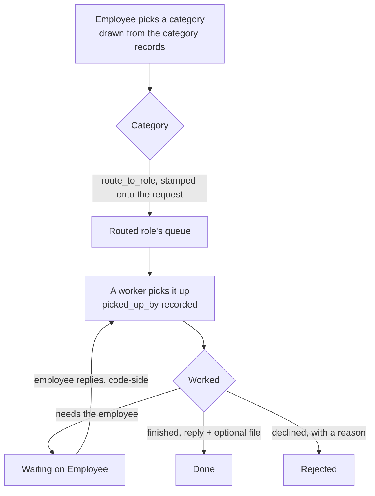

> **ID prefix.** This is phase 5. Cite every ID in this plan as `P5-R1`, `P5-U4`,
> `P5-AE3`, `P5-KTD2` in code comments, commits and tests. Phase 1 IDs are bare
> (`R16`, `U5`), phase 2-4 carry `P2-`/`P3-`/`P4-`. Never edit an existing
> citation.
>
> **Unit numbering.** U-IDs are stable, so the gaps at U7-U10, U12 and U15 are
> deliberate: a review pass cut or deferred those units and the surviving IDs
> were not renumbered. Nothing is missing.

## Summary

The portal is an employee product with an approvals screen bolted to the side.
Everyone else -- HR working a request, IT who has never been modelled at all,
an admin changing a leave type, management with no read of the organisation --
still lives in Desk, or lives nowhere.

This plan closes that. An HR Request becomes a first-class routed artifact with
a category that knows who works it; IT gets a role and a queue; requests join
the one approval queue that already exists; and the configuration HR touches
weekly moves onto a portal screen.

It ships as **four releases**. Release 1 is the reported bug, closed end to end
-- filing, routing, notifying, working and finishing a request. Desk stays the
fallback for the long tail: the portal covers the common 80% and does not
re-implement HRMS.

---

## Problem Frame

**What the user reported.** "Where do IT and HR requests go? I create one and I
cannot find it. I do not see any flow."

**What is actually true.** An `HR Request` is stored in `tabHR Request` and read
back on `/requests`, which already draws a small timeline. What does not exist
is anyone working the row:

- It is absent from `_APPROVAL_DOCTYPES` and `_APPROVAL_KINDS`
  (`helixhr/api.py:4133`, `:4801`), so it has **no decision surface in the
  portal**. HR's only tool is the Desk list view.
- The single HR-facing notification is channel *System Notification* -- a Desk
  bell. The four escalation notifications for leave, timesheets and attendance
  are all Email. An HR Manager who does not open the Desk bell never learns a
  request exists.
- Nothing records **who** took it. `picked_up_on` is a timestamp with no actor,
  and there is no staleness contract as `act_on_approval` has for the other
  three kinds. Two HR users can work the same row at once and neither is told.
- An `IT / Asset` request notifies `HR Manager`. There is no IT role, no IT
  queue, no IT notification. The category is a label, not a route -- and the
  four categories are a hardcoded array in `frontend/src/components/RequestForm.vue:29-34`,
  so HR cannot add a fifth at all.
- `status` has no "needs the employee to reply" value, so a request blocked on
  the employee still reads as HR's work.

**Above that.** There is no configuration surface in the portal, and no
management view. HR edits a notification template in Desk -- if they can: the
`Notification` and `Email Template` doctypes are System-Manager-only.

**Who is affected.** Employees (a request that ages unseen), HR (two people
working one row, in a second UI), IT (does not exist), admins (Desk forms for
weekly changes), management (no read of the organisation).

---

## Requirements

### Routed requests

- **P5-R1.** A request category is a record, not a Select option and not a
  hardcoded array. It carries the role that works it and whether it is still
  offered, and the employee's category picker is drawn from it.
- **P5-R2.** Creating a request routes it to the category's role. The routed role
  is notified **by email**, not only by a Desk bell.
- **P5-R3.** Category names existing today (`HR Letter`, `IT / Asset`,
  `Payroll Question`, `Other`) keep their exact spelling, so no stored request
  changes meaning or needs rewriting.
- **P5-R4.** An `IT Team` role exists, works only the categories routed to it,
  and reaches the portal -- never Desk.
- **P5-R5.** A holder of a routed role sees requests routed to that role, within
  their company, and nothing else. HR Manager and System Manager see their whole
  company. The requester always sees their own.
- **P5-R5a.** Enforced on the raw route too: `/api/resource/HR Request`,
  `frappe.client.get_list`, `frappe.client.get` and `frappe.client.set_value`
  obey the same scope.
- **P5-R5b.** Re-routing a category changes where **new** requests go. It never
  retroactively grants a role read of requests filed before the change.

### Working a request

- **P5-R6.** A request has a lifecycle with an explicit "waiting on the employee"
  state, so a request blocked on a reply is not counted as the worker's backlog.
- **P5-R7.** A worker picks a request up, which records **who** has it. A second
  worker is told it is already taken.
- **P5-R8.** Every decision carries the same staleness contract the other three
  kinds carry: the caller states the version it saw, and a write against a moved
  record is refused, not silently applied.
- **P5-R9.** Nobody works their own request. Refused in the workflow condition
  **and** on the raw route.
- **P5-R10.** A request and its replies read as one conversation to the employee.
  HR's reply, the employee's answer, and any file HR returns are all in it.
- **P5-R10a.** HR can attach a file to a reply. An `HR Letter` request whose
  output is a document must be completable without opening Desk.

### One queue

- **P5-R11.** Requests appear in the same queue as leave, timesheets and
  attendance requests, with the same shape, the same rules table and the same
  action contract.
- **P5-R12.** The queue separates what the viewer has picked up from what is
  waiting for anyone to take.

### Configuration

- **P5-R13.** HR configures request categories and their routing from the portal.
- **P5-R14.** HR edits the text the portal sends -- celebration reminders and
  request notifications -- from the portal, without a developer and without Desk.
- **P5-R15.** HR **never authors a template that is evaluated as code.** A
  template is text plus a fixed, documented set of substitution tokens.
- **P5-R16.** HR configures leave types, holiday lists and shift types from the
  portal, through a **named, deliberately short** field set per area -- not every
  field the underlying doctype has.
- **P5-R17.** A template edited by HR survives `bench migrate`.
- **P5-R18.** Every configuration write is permission-checked as the signed-in
  user against the record being written, and rate-limited. No configuration path
  uses `ignore_permissions`.
- **P5-R19.** A template subject longer than the storage limit is refused with a
  plain message, never truncated or silently lost.

### Management

- **P5-R20.** Management sees a read-only organisation view. It grants no power to
  act, and it discloses no more per person than the directory and team screens
  already do.

### Throughout

- **P5-R21.** Frappe, ERPNext and HRMS core are never modified.
- **P5-R22.** Every structural change (role, workflow, permission delta, fixture,
  doctype) gets a standing `preflight.py` guard.
- **P5-R23.** Every new read is bounded, every new write is in
  `RATE_LIMIT_POLICY`, and every new screen renders through `AsyncState.vue` on
  the shared card surfaces.

---

## Scope Boundaries

**In scope.** The four releases below.

**Not in scope -- Desk keeps these.** Payroll runs and salary structures.
Onboarding and separation. Recruitment. Appraisals. Creating and terminating
employees. Company, department and designation masters. Assigning roles to
users. Any field of a leave type, holiday list or shift type outside the named
sets in U13.

**Not in scope -- deliberately refused.**
- Management acting on another person's record (approving on behalf,
  overriding). U15 builds the read and stops; acting needs a delegation model
  and an audit trail, and is its own plan.
- HR authoring Jinja. See P5-KTD11 -- this is a security boundary, not a
  scheduling decision.

### Deferred to Follow-Up Work

Each of these is a real improvement that a review pass established does **not**
belong in a request-routing release. They are named here so they are deferred
on the record rather than forgotten.

- **Manager notifications.** No manager is notified of anything today -- not a
  leave application, not a timesheet, not an attendance request. Employees and
  HR are pushed to; managers are pull-only. This is a genuine routing hole and a
  single-unit change (a Notification Log to `events._approver_user` on three
  submit paths), but it touches the app's highest-traffic flows and is
  independent of everything here. **Release 4 below, alone.**
- **SLA and escalation.** `sla_days` is carried on the category record from U1
  so the shape exists, but no scheduler job ships. Once a request is visible in
  a queue with an age column it is no longer invisible, which was the actual
  complaint. Revisit when real queues have real backlogs.
- **Four pre-existing queue defects** the routing inventory surfaced: HR
  collectors carry no company scope (so an HR Manager on a multi-company site
  sees every company); `_decided_leave` does not apply `_decided_by_me()`, so an
  HR Manager gets no receipt for a handed-over leave; `_leave_reason`'s Comment
  read is unbounded; and several queue reads inherit a default sort that v16
  changed. Each has its own blast radius. The one piece pulled forward is an
  explicit `order_by` on the **new** request collectors, in U6.
- **Reopening a finished request.** `_assert_still_open` refuses any action on a
  decided record by design, and making it per-kind to allow a reopen would
  weaken the one-decision-per-record contract for all four kinds. A reopen is
  its own method and its own change.
- **Multi-assignee and team inboxes**, which is the only thing the framework's
  ToDo assignment buys over a `picked_up_by` field (P5-KTD6).
- Per-category custom fields on a request; request templates and canned replies.

---

## Key Technical Decisions

**P5-KTD1. A category is a DocType, autonamed by its own name.**
The category must be the target of a Link from `HR Request` so a stored request
cannot name a category that does not exist, and it must carry its own
permissions -- neither of which a child table row in a Single can do.
`HelixHR Request Category` is a normal DocType with
**`"autoname": "field:category_name"`**. That is not a detail: the default for a
new DocType is hash naming, and a hashed name would leave every stored
`HR Request.category` string pointing at nothing, collapsing P5-KTD2.

**P5-KTD2. Category records are named exactly as today's Select options.**
`HR Letter`, `IT / Asset`, `Payroll Question`, `Other`. `category` changes from
Select to Link; both fieldtypes are `varchar(140)`, so the schema sync rewrites
no rows and every stored string is already a valid Link target. Note `IT / Asset`
contains a forward slash -- legal in a Frappe name, but it appears in REST paths
and must be URL-encoded in tests and in any link the settings screen builds.

**P5-KTD3. No new Single DocType, and no settings store.**
`docs/architecture.md` says prefer site config over a new Single. Nothing here
needs either: categories are their own DocType, message text is its own DocType
(P5-KTD11), and leave types, holiday lists and shift types are HRMS masters that
already exist with their own permission model. The portal is a friendlier editor
over real records, not a parallel store -- which also sidesteps every
`tabSingles` pitfall (no unique constraint, DELETE-then-INSERT writes,
`doc.save()` replacing every field, two caches with different lifetimes).

**P5-KTD4. `HR Request` gets a Workflow whose `workflow_state_field` is the
existing `status`, and `Open` must be its first state.**
The queue already has two rule mechanisms -- leave uses a hand-written table,
the workflow kinds derive from `get_transitions` -- and a fourth kind must not
invent a third. Pointing the Workflow at `status` adds no field and leaves every
stored row meaningful.

State order **is** load-bearing here, more so than for the timesheet fixture.
`validate_workflow` runs on every save once a workflow exists; on insert there is
no `_doc_before_save`, so it takes `workflow.states[0].state` as the current
state and throws `WorkflowTransitionError` when the field disagrees.
`HR Request.status` has `"default": "Open"`, so unless `Open` is the first state
row, **every `create_my_request` throws**. A test asserts `states[0].state ==
"Open"` rather than leaving it to fixture ordering.

**P5-KTD5. The employee's reply is a code-side transition, not a workflow one.**
Role `Employee` has no `write` and no `create` on `HR Request` at all -- a
deliberate P2-U8 invariant -- and `status` is permlevel 1, so a permlevel-0
write would be silently reset anyway. `apply_workflow` calls `doc.save()` and is
therefore unreachable for the requester.

`reply_to_my_request` is a whitelisted method that checks ownership and the
stored state, then moves the state with `db_set` after authorising -- the same
shape `helixhr_stage` already uses. The lifecycle table marks `Reply` explicitly
as code-side so no implementer tries to build it as a Workflow Action Master.
This is a bounded exception to "the workflow is the rule table", and it is
bounded to the one transition the requester owns.

**P5-KTD6. Who has a request is a field, not a ToDo.**
The problem is one sentence long -- `picked_up_on` is a timestamp with no actor
-- and the answer is `picked_up_by`, a Link to User beside it. The framework's
`assign_to` API was considered and rejected on three counts: `assign_to.add` is
whitelisted and only checks *read* on the target, so any reader could hand a
request to any user; its auto-created DocShare **ORs past** both
`permission_query_conditions` and a denying `has_permission`, widening the
boundary U5 builds; and `set_status` on close flips the ToDo and removes no
share, so an ex-assignee keeps read through closure, reopen and re-routing, for
ever. It would also need a composite index patch on the core `tabToDo`. The only
thing it buys is multi-assignee, which is deferred.

**P5-KTD7. The route is denormalised onto the request at insert.**
`routed_to_role` is stamped from the category when the request is created, and
every scope check reads the stored value. Resolving the route live would mean
re-pointing a category retroactively grants the new role read of every request
ever filed in it -- an HR Manager moving `Payroll Question` to `IT Team` would
hand IT the entire payroll request history in one save (P5-R5b).

**P5-KTD8. Routing is resolved in code at insert, not by a Notification fixture.**
A Notification's `receiver_by_role` is static; it cannot vary per category, and
N categories would mean N fixtures re-created every time HR adds one. The insert
path resolves the role and sends. Both request-related Notification fixtures are
retired in the same unit -- the bell-only arrival one because it cannot route,
and the status-change one because its message is a hardcoded ladder over the
four current statuses that would tell an employee a `Waiting on Employee`
request "is open", and because leaving it in place would double every
employee-facing notification the new code path sends.

**P5-KTD9. Routed mail is queued and can never fail the employee's insert.**
An Email-channel Notification throws *inside* the document save when no default
outgoing Email Account exists -- which is why preflight already FAILs on that.
An employee filing a request must not be punished for a mail misconfiguration,
so the send is queued (not `now=True`, which in v16 no longer auto-commits) and
wrapped so a failure is logged and the request still exists.

**P5-KTD10. `IT Team` ships with `desk_access = 0` and keeps its self User
Permission.**
`Role.on_update` re-evaluates every holder's `user_type`; a `desk_access = 1`
role silently promotes portal employees to System User, which is both a Desk
door and a billable seat. So it is stated verbatim in the fixture, not defaulted.

The HR-Manager self-scope exemption is **not** copied to this role.
That exemption exists because a self User Permission beats the role read inside
`get_transitions` on Leave and Timesheet; `HR Request.employee` carries
`"ignore_user_permissions": 1`, so a self-scope does not empty an IT holder's
request queue. Copying the exemption would hand `IT Team` a read of every
employee record -- the opposite of this plan's answer to its own open question.
U2 verifies this on a real site rather than assuming it.

**P5-KTD11. HR never authors a template that is evaluated as code.**
This is the plan's single most important decision, and it reverses the obvious
design.

Granting HR write on `Notification` would be remote code execution. Frappe
renders `Notification.message` through Jinja with the *unrestricted* global set
-- `disable_render_safe_exec` defaults to enabled, which exposes
`frappe.get_doc`, `db.set_value`, `delete_doc`, `sendmail`, `enqueue` and
`call_whitelisted_function` to the template. A body containing a `Has Role`
insert makes its author a System Manager the next time the notification fires;
the sandbox blocks dunders only, and `.insert()` is an ordinary attribute. Even
with safe-exec restricted, the fallback globals still expose arbitrary `SELECT`
and an unchecked `get_doc`.

A Custom DocPerm grant cannot be narrowed to the seeded rows either -- it is
doctype-wide. HR Manager with write on `Notification` could create one on
`Salary Slip`, event Submit, recipient self, `attach_print = 1`, and mail
themselves every payslip in the company. No Jinja required.

So: **`Notification` and `Email Template` write stays System-Manager-only.**
HR edits a new app-owned `HelixHR Message Template` whose body is plain text
rendered by **fixed token substitution** (`{employee_name}`), never by
`frappe.render_template`. The token set per template is a documented contract,
enumerated in code and checked by preflight. This is a smaller surface than the
one it replaces, and the thing HR actually asked for -- "the default wording is
not good" -- is text, not logic.

**P5-KTD12. Configuration is a named short field set, not every writable field.**
"The fields that are safe to expose" is a permission criterion and resolves to
every permlevel-0 field -- which is the whole HRMS form, reskinned. The user's
stated goal is that common settings be *visually simplified*. Each area
therefore ships an explicit, short, named list in `helixhr/utils.py`, written
into this plan (U13) and into `docs/deployment.md`, with an acceptance example
that tests brevity rather than capability.

**P5-KTD13. Every new `has_permission` hook returns an explicit `True`.**
In v16 a controller permission hook returning `None` **denies**. A hook written
from any v15 example is a total lockout. Every branch returns a real boolean,
and a test asserts the allow path as the role, never as Administrator -- which
skips permission logic entirely.

**P5-KTD14. The decision reason field is `helixhr_decision_reason`.**
`DECISION_REASON_FIELD` is a single module constant (`helixhr/events.py:38`) and
`act_on_approval` writes it unconditionally for any kind in
`_DECISION_REASON_KINDS`. Naming HR Request's field anything else means
`act_on_approval` writes a field that does not exist.

**P5-KTD15. Configuration writes go through `doc.save()`, never `db_set`.**
`frappe.get_doc` does not check read permission and `db_set` checks nothing at
all. Each method checks permission explicitly, updates only allow-listed fields,
and saves -- so HRMS's own `validate` still runs and a leave type the portal
edits obeys the rules a Desk edit obeys.

**P5-KTD16. Permission changes are a patch; the Role itself is a fixture.**
`Meta.set_custom_permissions` replaces a doctype's entire permission list the
moment one Custom DocPerm row exists for it. This repo has lost roles that way
twice. New deltas are new dated lines against
`helixhr/patches/v1_0/apply_permission_deltas.py`, which snapshots the site's own
standard rows via `setup_custom_perms` first. The `Role` record carries no
permissions and is a safe fixture -- shipped with `desk_access: 0` and
`is_custom: 0` stated verbatim, because `role_query` hides custom roles from
link searches. Cited by U2 and U13.

---

## High-Level Technical Design

### Where a request goes, after this plan

### The request lifecycle

`status` is the workflow state field, and `Open` is `states[0]` (P5-KTD4). Every
state is docstatus 0 -- `HR Request` is not submittable.

| State | Meaning | Whose backlog |
|---|---|---|
| `Open` | Filed, nobody has taken it | the routed role's |
| `In Progress` | A named worker has it | that worker's |
| `Waiting on Employee` | Blocked on a reply | the employee's |
| `Done` | Finished | nobody's |
| `Rejected` | Declined, with a reason | nobody's |

| From | Action | To | Who | Mechanism |
|---|---|---|---|---|
| Open | Pick up | In Progress | routed role, not the requester | workflow transition |
| Open | Reject | Rejected | routed role, not the requester | workflow transition |
| In Progress | Need info | Waiting on Employee | the worker | workflow transition |
| In Progress | Done | Done | the worker | workflow transition |
| In Progress | Reject | Rejected | the worker | workflow transition |
| Waiting on Employee | Reply | In Progress | the requester | **code-side** (P5-KTD5) |

`Pick up`, `Need info` and `Done` are new Workflow Action Masters; `Reject` is
stock; `Reply` is **not** a Workflow Action Master and must not be built as one.
`Need info` and `Reject` require a reason, matching `_REASON_REQUIRED`.
Reopening a decided request is deferred (see Scope Boundaries) because
`_assert_still_open` refuses any action on a decided record for all four kinds.

### Who may see which request

| Viewer | Sees |
|---|---|
| The requester | their own, via the existing `if_owner` rows |
| A holder of a routed role | requests whose **stored** `routed_to_role` is a role they hold, within their company |
| HR Manager / System Manager | every request in their company |
| Everyone else | nothing |

Enforced by a `permission_query_conditions` hook (list routes) **and** a
`has_permission` hook (single-document routes). Both are needed: the first does
not fire for `frappe.get_doc`, the second does not fire for a list.

Neither hook can widen what the role already grants -- **but a DocShare can**,
ORing past both. This plan creates no DocShare on `HR Request` (P5-KTD6), which
is part of why assignment is a field.

### What is told to whom

| Event | Employee | Routed role |
|---|---|---|
| Request filed | -- | **email** (replaces the Desk bell) |
| Picked up | bell | -- |
| Need info | bell (+ reason) | -- |
| Employee replies | -- | **email** |
| Done / Rejected | bell (+ reason, + any file) | -- |

Every row is implemented and tested in U4, except the reply mail, which U6 owns
alongside `reply_to_my_request`.

### Configuration surface

| Section | Writes to | New permission delta |
|---|---|---|
| Request categories and routing | `HelixHR Request Category` | none (ours) |
| Message text | `HelixHR Message Template` | none (ours) |
| Leave types | `Leave Type` | none -- HR Manager already has it |
| Holiday lists | `Holiday List` | **verify first**, then HR User only if needed |
| Shift types | `Shift Type` | none -- HR Manager already has it |

`Notification` and `Email Template` are **absent by design** (P5-KTD11).

---

## System-Wide Impact

- **Permissions.** Two app-owned doctypes gain deltas, plus at most one HRMS
  doctype. Because `set_custom_permissions` replaces a doctype's whole permission
  list once any Custom DocPerm row exists for it, each delta goes through
  `setup_custom_perms` first. `check_custom_docperm_coverage` walks the patch's
  own `DELTAS`, so new keys are guarded automatically.
- **The queue's HR gate changes shape.** `_approval_summaries` gates its HR half
  on `_is_hr()`, which is Administrator / HR Manager / System Manager. An
  `IT Team` holder is none of those, so the gate becomes "is HR **or** holds a
  routed role" -- which also changes `get_portal_bootstrap`'s `can_approve`.
- **`_QUEUE_TITLE` is indexed, not `.get()`.** A fourth kind without an entry
  raises `KeyError` inside `_pending_approvals`, which the Home action queue
  calls. Home breaks, not just the queue.
- **`_APPROVAL_ACTIONS` and `_REASON_REQUIRED` are global tuples** shared by all
  kinds and doubling as the screen's draw order. Three new actions make one
  seven-element ordering for every kind.
- **Landing.** `IT Team` stays out of `DESK_ROLES`, and its holders need an
  Active Employee record to resolve a company.
- **`_session_company` is not where it looks.** It exists once, module-private to
  `helixhr_document_link.py`. U5 needs it in `api.py`, so it moves to
  `helixhr/utils.py` first.
- **Fixtures.** Two request Notifications are retired. The `Notification` fixture
  filter is unchanged -- nothing HR edits lives there any more (P5-KTD11).
- **CI.** A fourth Playwright identity (`it`) with a narrowly scoped project.
  U15 adds a fifth only if the organisation view needs an identity the other
  four cannot provide.
- **Docs.** `docs/architecture.md`'s "Adding a setting" guidance is written for
  scalars and would read as forbidding this configuration surface. Each release
  corrects the part of the docs it contradicts, rather than leaving it all to a
  terminal unit.

---

## Implementation Units

Ten units in four releases. U-ID gaps are deliberate (see the header note).

### Release 1 -- Requests actually work, end to end

Closes the reported bug: filing, routing, notifying, working, replying and
finishing. Nothing in this release is useful without the rest of it, which is
why U6 and U11 are here and not in a later phase.

#### U1. The category becomes a record

**Goal.** `HelixHR Request Category` exists, carries routing, and drives the
employee's picker -- with no stored request changed.

**Requirements.** P5-R1, P5-R3.

**Dependencies.** None.

**Files.**
- Create: `helixhr/helixhr/doctype/helixhr_request_category/` -- `category_name`, `hint` (the one-line copy the picker tile shows), `route_to_role` (Link Role), `sla_days` (Int, carried for a later escalation job, unused here), `is_active` (Check, default 1). `"autoname": "field:category_name"`, `"track_changes": 1`.
- Create: `helixhr/patches/v1_0/seed_request_categories.py` -- the four names verbatim with their existing picker copy, inserted only if absent.
- Modify: `helixhr/helixhr/doctype/hr_request/hr_request.json` -- `category` Select becomes Link.
- Modify: `helixhr/api.py` -- `_request_categories()` reads active rows; a whitelisted `get_request_categories()` for the picker; `create_my_request` validates against it.
- Modify: `frontend/src/components/RequestForm.vue` -- tiles drawn from the API instead of the hardcoded array at lines 29-34.
- Modify: `helixhr/utils.py` -- `RATE_LIMIT_POLICY` gains the new read.
- Modify: `helixhr/patches.txt`, `helixhr/install.py`.
- Test: `helixhr/tests/test_hr_request.py`, `helixhr/tests/test_fixtures.py`.

**Approach.** `autoname: field:category_name` is what makes P5-KTD2 true; without
it the doctype hash-names and every stored category string dangles.
`route_to_role` is validated against a reviewed set of workable roles in
`validate` -- not only in the UI picker -- so a broad role like `Employee` or
`All` cannot be selected and make every request in a category company-readable.

**Patterns to follow.** `helixhr/helixhr/doctype/helixhr_document_link/` for the
doctype shape; `helixhr/patches/v1_0/seed_celebration_templates.py` for
insert-if-absent seeding registered in both `patches.txt` and `install.py`.

**Test scenarios.**
- The seeded name equals the category string exactly -- asserted on `name`, not
  only on row count, because this is what P5-KTD2 rests on.
- Seeding twice leaves four rows.
- A request stored before the migration reads back with a category that resolves
  to a real record.
- `create_my_request` with an inactive category is refused; with an unknown
  category is refused, leaking nothing about what exists.
- The picker lists active categories only, and a newly added category appears in
  it without a deploy.
- `IT / Asset` round-trips through the REST path URL-encoded.
- `route_to_role` set to a broad role is refused in `validate`, not only in the UI.

**Verification.** A fresh site migrates, the four categories exist, and the
existing request tests pass unchanged.

---

#### U2. The IT Team role

**Goal.** An `IT Team` role exists, reaches the portal, and can read the requests
routed to it -- nothing more.

**Requirements.** P5-R4.

**Dependencies.** U1.

**Files.**
- Create: `helixhr/fixtures/role.json` -- `IT Team`, `desk_access: 0`, `is_custom: 0`.
- Modify: `helixhr/hooks.py` -- the `Role` fixture entry, filtered by name.
- Modify: `helixhr/patches/v1_0/apply_permission_deltas.py` -- `DELTAS` gains `HR Request` for `IT Team` (read/write at permlevel 0, and write at permlevel 1 **enumerated against the current permlevel-1 field inventory**: `status`, `hr_note`, `helixhr_decision_reason`) and `HelixHR Request Category` (read).
- Modify: `helixhr/patches.txt` -- a new dated line.
- Modify: `helixhr/preflight.py` -- a check that `IT Team` is absent from `DESK_ROLES`; a check that FAILs when an unreviewed field is added at permlevel 1 on `HR Request`.
- Modify: `helixhr/tests/utils.py` -- `make_test_it_user()`, role + Active Employee, **with** a self User Permission.
- Test: `helixhr/tests/test_preflight.py`, `helixhr/tests/test_portal_landing.py`.

**Approach.** `desk_access: 0` is stated verbatim, not defaulted (P5-KTD10). A
permlevel-0 row must exist for a role before any permlevel-1 row, which the
patch's two-pass shape already handles. The permlevel-1 grant is a *level*, not
a field set, so the preflight check is what stops a future field landing there
unreviewed.

The HR-Manager self-scope exemption is deliberately not copied. Verify on a real
site that an `IT Team` holder with a self User Permission still sees their queue
-- `HR Request.employee` carries `ignore_user_permissions: 1`, which is why it
should hold. If it does not, that is a finding to bring back, not a reason to
reach for the exemption.

**Execution note.** Add the preflight checks before the role, so they fail first
and prove they are wired.

**Patterns to follow.** `apply_permission_deltas.py`'s snapshot-then-delta shape;
`make_test_hr_manager_employee()` for the identity.

**Test scenarios.**
- After the patch, `HR Manager` still holds every standard right it held on
  `HR Request` -- the regression Custom DocPerm has caused twice here.
- An `IT Team` holder lands on the portal, not Desk, and is a Website User.
- An `IT Team` holder **with** a self User Permission still reads their routed
  requests.
- An `IT Team` holder cannot read an arbitrary Employee record.
- The patch is idempotent.
- Preflight FAILs when `IT Team` is added to `DESK_ROLES`, and when a new
  permlevel-1 field appears on `HR Request`.

**Verification.** `bench --site <site> execute helixhr.preflight.run` passes on a
fresh site with the role installed.

---

#### U3. The request lifecycle

**Goal.** A request has states that mean something, records who has it, and the
rules hold on every route.

**Requirements.** P5-R6, P5-R7, P5-R9.

**Dependencies.** U1, U2.

**Files.**
- Modify: `helixhr/fixtures/workflow.json` -- `HR Request Handling`, `workflow_state_field: status`, **`Open` first**.
- Modify: `helixhr/fixtures/workflow_state.json`, `workflow_action_master.json` -- `Waiting on Employee`; `Pick up`, `Need info`, `Done`.
- Modify: `helixhr/hooks.py` -- the `Workflow` fixture filter gains `HR Request`; `doc_events` gains `HR Request` `validate`.
- Modify: `helixhr/helixhr/doctype/hr_request/hr_request.json` -- `status` gains `Waiting on Employee`; `helixhr_decision_reason` (Small Text, permlevel 1); `picked_up_by` (Link User, permlevel 1, read-only); `routed_to_role` (Link Role, permlevel 1, read-only, set at insert).
- Modify: `helixhr/events.py` -- `hr_request_validate` refusing a self-decision and freezing fields outside the states that may change them; the stale HR User comment at `hr_request.py:66` corrected.
- Test: `helixhr/tests/test_hr_request.py`, `helixhr/tests/test_fixtures.py`.

**Approach.** The field name is `helixhr_decision_reason`, matching the module
constant `act_on_approval` writes (P5-KTD14). `picked_up_by` is stamped beside
the `picked_up_on` that already exists (P5-KTD6). `routed_to_role` is stamped
from the category at insert and is what every scope check reads (P5-KTD7).

The self-decision refusal lives in **both** the transition condition and the doc
event, because a Workflow condition does not run on a raw
`frappe.client.set_value`.

**Execution note.** Characterisation first: capture what the existing
`before_save` stamping does for each status transition, so `picked_up_on`,
`replied_on` and `closed_on` keep their current meaning.

**Patterns to follow.** `fixtures/workflow.json`'s Attendance Request workflow;
`events.attendance_request_validate` for the field freeze;
`events.attendance_request_before_submit` for the two-place self-decision refusal.

**Test scenarios.**
- **`workflow.states[0].state == "Open"`**, asserted directly -- `status`
  defaults to `Open` and every insert throws if the order is wrong.
- `create_my_request` still succeeds after the workflow exists. This is the
  regression the state-order assertion protects.
- Each transition is reachable by the routed role and refused for everyone else.
- A worker cannot act on a request they filed -- through `act_on_approval` and
  through `apply_workflow` directly.
- Administrator is exempt from the self-decision refusal, matching the other kinds.
- `picked_up_by` and `picked_up_on` are stamped together on the first move into
  `In Progress`.
- `routed_to_role` is stamped at insert and does not change when the category is
  later re-routed (P5-R5b).
- `Waiting on Employee` is not counted in the routed role's backlog.
- The workflow is found via `get_workflow_name`, exercising the negative-answer cache.
- The transition table in this plan and the fixture agree.

**Verification.** A request can be filed, picked up, and driven to every terminal
state by the routed role on a fresh site.

---

#### U4. Routed notification on arrival

**Goal.** The right role is emailed when a request arrives; the employee is told
what happened to it; and a mail failure never costs the employee their request.

**Requirements.** P5-R2.

**Dependencies.** U1, U3.

**Files.**
- Modify: `helixhr/events.py` -- `hr_request_after_insert` resolving the stamped role and queuing mail; employee-facing Notification Logs on `Picked up`, `Waiting on Employee`, `Done` and `Rejected`, carrying the reason.
- Modify: `helixhr/hooks.py` -- `HR Request` `after_insert`.
- Modify: `helixhr/fixtures/notification.json` -- retire **both** `HelixHR New Request For HR` (cannot route) and `HelixHR Request Status Changed` (its hardcoded status ladder would call a `Waiting on Employee` request "open", and it would double every employee notification the new path sends).
- Create: `helixhr/patches/v1_0/retire_request_notifications.py` -- disables both on sites that already have them; removing a row from a fixture does not delete it.
- Modify: `helixhr/preflight.py` -- `check_fixtures` gains the notifications it currently omits and the new workflow.
- Test: `helixhr/tests/test_notifications.py`, `helixhr/tests/test_preflight.py`.

**Approach.** Routing is resolved in code (P5-KTD8) from the **stored**
`routed_to_role`. A request whose role has no enabled holder falls back to
`HR Manager` and logs it -- an unroutable request must never be a silent drop.
Mail is queued and wrapped so the insert survives a mail failure (P5-KTD9).

Mail carries the subject, the category and a portal link. It never carries
`details` or `hr_note`: the fallback path can send to a role the employee's
category never routed to, and employee-authored text must not ride along.

**Patterns to follow.** `helixhr/reminders.py`'s `_send`;
`events._notify_attendance_request` for the employee-facing Notification Log.

**Test scenarios.**
- A request routed to `IT Team` queues mail to IT holders and nobody else.
  Assert on the delta of Email Queue names -- `frappe.sendmail` commits its own
  row, so a `reference_name` filter is unreliable.
- The mail body contains no `details` and no `hr_note`.
- A category whose role has no enabled holder falls back to HR Manager and logs it.
- With no default outgoing Email Account, `create_my_request` still returns the
  request and the failure is logged.
- The requester is never a recipient of their own arrival mail.
- Exactly **one** employee notification per status change -- the regression the
  retirement of `HelixHR Request Status Changed` prevents.
- A `Waiting on Employee` request is never described to the employee as "open".
- Preflight FAILs when a depended-on notification or the workflow is missing or
  disabled.

**Verification.** `test_notifications.py` asserts the channel of every HR-facing
notification is Email, extending the assertion that already exists for the
other four.

---

#### U5. Scoping the request to its role

**Goal.** A routed-role holder sees their requests and nothing else, on every
route.

**Requirements.** P5-R5, P5-R5a, P5-R5b.

**Dependencies.** U1, U2, U3.

**Files.**
- Modify: `helixhr/utils.py` -- `_session_company` moves here from `helixhr_document_link.py`, which now imports it.
- Modify: `helixhr/helixhr/doctype/hr_request/hr_request.py` -- `get_permission_query_conditions(user=None, doctype=None, **kwargs)` and `has_permission(doc, ptype=None, user=None, **kwargs)`.
- Modify: `helixhr/hooks.py` -- register both.
- Test: `helixhr/tests/test_hr_request.py`.

**Approach.** The query condition resolves the caller's roles and company in
Python and emits a parenthesised literal `in (...)` over the **stored**
`routed_to_role` -- never a correlated subquery, escaped with
`frappe.db.escape(..., percent=False)`. The controller hook returns an explicit
boolean on every branch (P5-KTD13). Both are needed: the query hook does not fire
for `frappe.get_doc`, the controller hook does not fire for a list. Per-request
work is resolved once per query and cached on `frappe.local`.

**Patterns to follow.**
`helixhr/helixhr/doctype/helixhr_document_link/helixhr_document_link.py:63-98`,
which already honours the `user` argument rather than assuming the session user,
and returns explicit `True`.

**Test scenarios.**
- An `IT Team` holder listing `HR Request` sees only requests stamped to their role.
- The same holder calling `frappe.client.get` on an HR request is refused.
- The same through `/api/resource/HR Request`, `frappe.client.get_list` and
  `frappe.client.set_value`.
- **Re-routing `Payroll Question` to `IT Team` does not give IT a single request
  filed before the change** (P5-R5b) -- the finding this unit exists to prevent.
- The requester still reads their own request in any category.
- An HR Manager sees every category within their company and none outside it.
- A user with no routed role and no ownership sees an empty list, not an error.
- The `has_permission` hook returns `True`, not `None`, on the allow path,
  asserted as the role rather than as Administrator.

**Verification.** Every scenario runs as the role via `frappe.set_user`;
Administrator skips permission logic entirely and would prove nothing.

---

#### U6. Requests join the approval queue

**Goal.** A request is a fourth kind in the existing queue, workable end to end,
with a conversation the employee can answer.

**Requirements.** P5-R8, P5-R10, P5-R10a, P5-R11, P5-R12.

**Dependencies.** U3, U5.

**Files.**
- Modify: `helixhr/api.py` -- `_APPROVAL_DOCTYPES`; `_APPROVAL_KINDS` with **all eight keys** (`state_field`, `detail`, `may_act`, `is_open`, `open_message`, `hr_state`, `hr_queue`, `act`); `_APPROVAL_ACTIONS` and `_REASON_REQUIRED` gain `Pick up`, `Need info`, `Done`; **`_QUEUE_TITLE` gains its entry**; `_hr_request_summaries` with an explicit `order_by`; `_may_act_on_hr_request`; `_request_queue_projection`; `_request_thread()`.
- Modify: `helixhr/api.py` -- `_approval_summaries`'s `_is_hr()` gate becomes "is HR or holds a routed role"; `get_portal_bootstrap`'s `can_approve` follows.
- Create: `helixhr/api.py` -- `reply_to_my_request(name, message, expected_modified)`; `attach_to_request_reply(name)` for HR's side.
- Modify: `helixhr/utils.py` -- `RATE_LIMIT_POLICY` gains both writes.
- Test: `helixhr/tests/test_api_approvals.py`, `helixhr/tests/test_hr_request.py`.

**Approach.** The kind derives its actions from `get_transitions`, so the workflow
fixture is the rule. `act_on_approval`'s ten-step check order is unchanged for
the worker-side actions; the employee's reply does **not** go through it
(P5-KTD5). The conversation is Comments read and projected as the server, the
pattern `_rejection_comments` already uses because the Employee role cannot read
Comment.

`reply_to_my_request` checks ownership, checks the **stored** status is
`Waiting on Employee`, bounds the message length as `create_my_request` bounds
`details`, is rate-limited (it triggers mail to the routed role, so an unbounded
reply is mail amplification), and moves the state with `db_set` after
authorising. If the reply Comment must be inserted with `ignore_permissions`,
that is a fourth documented exception to the ban and its docstring says so
explicitly.

`attach_to_request_reply` is `attach_to_my_request` with the ownership check
inverted: it is what makes an `HR Letter` completable in the portal, which is
otherwise the most common category and the one that would send HR back to Desk.

**Patterns to follow.** `_act_through_workflow` and
`_attendance_request_summaries`; `_rejection_comments` for server-side Comment
reads; `attach_to_my_request` (`helixhr/api.py:5193`) for the upload path.

**Test scenarios.**
- `get_approval_detail` returns exactly the actions `get_transitions` allows, and
  `act_on_approval` refuses anything absent from that list.
- An action without `expected_modified`, or with a stale one, is refused, and the
  refusal names the state the record is actually in.
- Two workers acting concurrently: the second is refused, not silently applied.
- **A second worker's `Pick up` is refused and names who has it.**
- `Need info` and `Reject` without a reason are refused; the reason is written
  before the transition.
- The employee's reply moves `Waiting on Employee` to `In Progress` and emails
  the routed role -- **the assertion P5-AE3 depends on**.
- A reply against a stored status that is not `Waiting on Employee` is refused.
- An over-long reply is refused; the rate limit is enforced.
- An employee cannot reply to somebody else's request.
- HR attaches a file to a reply; the employee can download it; a non-worker cannot
  attach.
- The thread contains no Frappe vocabulary and no internal handover prefixes.
- Home's action queue renders with a request pending -- the `_QUEUE_TITLE`
  `KeyError` regression.
- An `IT Team` holder's queue is populated -- the `_is_hr()` gate regression.

**Verification.** A request is filed, routed, picked up, questioned, answered and
finished without anyone opening Desk.

---

#### U11. The queue on screen

**Goal.** Requests are workable in the portal, in the shape the other three kinds
have.

**Requirements.** P5-R10, P5-R11, P5-R12, P5-R23.

**Dependencies.** U6.

**Files.**
- Modify: `frontend/src/pages/Approvals.vue` -- a fourth evidence block; three new decision buttons; a third `REASON_COPY` entry for `Need info`; the picked-up/unclaimed split with its own counts; the conversation with its reply and attachment affordances.
- Modify: `frontend/src/router.js` -- `/approvals/:kind` accepts `request`.
- Modify: `frontend/src/components/AppShell.vue` -- the nav gate reads `can_work_requests`.
- Modify: `helixhr/api.py` -- `get_portal_bootstrap` gains `can_work_requests`.
- Modify: `frontend/tests/e2e/auth.setup.ts`, `frontend/playwright.config.ts` -- the `it` identity and a narrowly scoped project.
- Modify: `helixhr/tests/utils.py` -- `setup_playwright_fixtures` seeds the IT identity and a routed category.
- Test: `frontend/tests/e2e/approvals.spec.ts`.

**Approach.** **This is the largest unit in the plan.** `Approvals.vue` is 1133
lines and does not generalise over kinds the way its `KIND` map suggests:
evidence rendering is a per-kind `v-if` chain at ten sites, the four decision
buttons are hand-written elements with per-action variants and fixed
`data-testid`s, `decide()` branches literally on action names, and the queue is
one flat list with no grouping. A fourth kind with three new actions, a split
queue and a conversation is real structural work, not a registration.

Extract the per-kind evidence block if the four kinds stop reading as one
screen. Do not refactor speculatively.

The nav gate is a bootstrap boolean and a `*Only` flag, matching `managerOnly` /
`reportsOnly` -- the frontend carries no role list, and the flag is a nav
decision, never a grant. Buttons render exactly `detail.actions`.

**Patterns to follow.** `Approvals.vue`'s existing kind handling; the
surface-card rules in `frontend/src/index.css`; the `hr` Playwright project's
narrow `testMatch`.

**Test scenarios.**
- An IT identity sees only IT requests, picks one up, asks a question, and
  finishes it after the employee answers.
- The employee replies from `/requests` and sees the thread.
- An employee identity has no queue nav item.
- The picked-up and unclaimed halves are separately labelled and counted.
- A stale action surfaces a plain message and refreshes.
- `visual-foundation.spec.ts` passes.

**Verification.** `cd frontend && yarn lint && yarn test`, then the chromium e2e
projects, on a site recreated for the run.

---

### Release 2 -- Configuration in the portal

#### U13. The configuration API and the message template

**Goal.** HR edits categories, message text and the short field set of three HRMS
masters -- safely.

**Requirements.** P5-R13, P5-R14, P5-R15, P5-R16, P5-R17, P5-R18, P5-R19.

**Dependencies.** U1.

**Files.**
- Create: `helixhr/helixhr/doctype/helixhr_message_template/` -- `template_key` (Select, one per message the portal sends), `subject` (Data), `body` (Text), `is_enabled`, `track_changes: 1`.
- Create: `helixhr/patches/v1_0/seed_message_templates.py` -- the default wording, inserted only if absent, never overwritten.
- Modify: `helixhr/reminders.py` and `helixhr/events.py` -- render through the new template when one is enabled, falling back to the current wording.
- Modify: `helixhr/utils.py` -- `render_tokens(text, tokens)`, a **plain substitution** over a fixed map; `TEMPLATE_TOKENS`, the documented token contract per `template_key`; the named editable-field sets below; `RATE_LIMIT_POLICY` entries for every new write.
- Modify: `helixhr/api.py` -- `get_portal_config()`; `save_request_category()`; `save_message_template()`; `save_leave_type()`; `save_holiday_list()`; `save_shift_type()`.
- Modify: `helixhr/patches/v1_0/apply_permission_deltas.py`, `helixhr/patches.txt` -- **only if** verification shows HR User lacks write on `Holiday List`.
- Modify: `helixhr/preflight.py` -- every token in `TEMPLATE_TOKENS` is supplied by its caller; every named editable field still exists on its doctype.
- Test: `helixhr/tests/test_api_config.py` (new), `helixhr/tests/test_reminders.py`.

**Approach.** `render_tokens` is `str.replace` over a fixed map. It must never
call `frappe.render_template`, and a test asserts that a body containing Jinja
syntax renders as literal text (P5-KTD11). `Notification` and `Email Template`
are not touched and gain no delta.

The named field sets are the whole of P5-KTD12, and are written here rather than
left to implementation:

- **Leave type** -- name, maximum days allowed, is carry-forward, is leave
  without pay, whether HR approves it (`helixhr_hr_approves`). Five fields, not
  the thirty HRMS ships.
- **Holiday list** -- name, from date, to date, weekly off day, and the holiday
  rows.
- **Shift type** -- name, start time, end time, and the check-in window.

Each method checks permission explicitly, updates only its named fields, and
saves, so HRMS's own `validate` still runs (P5-KTD15). A field above the caller's
permlevel is **silently reset** by Frappe rather than rejected, so the sets carry
permlevel-0 fields only and every test runs as the role.

Before writing the `Holiday List` delta, verify the shipped permissions on this
bench's installed `erpnext`. By P5-KTD16 the first Custom DocPerm row on a
doctype replaces its entire permission list, so a delta that turns out to be
unnecessary is pure risk with no benefit.

**Patterns to follow.** `update_my_profile` and its allow-list;
`seed_celebration_templates.py` for insert-if-absent seeding;
`preflight.check_fixtures` for the drift guard.

**Test scenarios.**
- **A template body containing `{{ frappe.get_doc(...) }}` renders as literal
  text and executes nothing.** The security test this design exists for.
- An unknown token is left alone rather than rendering empty or raising.
- Every token in `TEMPLATE_TOKENS` is actually supplied by its caller --
  asserted, and guarded by preflight.
- An edited template survives a simulated `sync_fixtures` run.
- The seed patch is idempotent and never overwrites an edit.
- Each method refuses a caller without write permission, with `PermissionError`.
- Each method ignores a field outside its named set.
- A leave type saved through the portal still runs HRMS's `validate`, proved by a
  value HRMS rejects being rejected here.
- A 141-character subject is refused with a plain message and nothing is written.
- Saving as an HR user, not Administrator, persists the value.
- Every new write is rate-limited.
- Deactivating a category in use does not orphan stored requests.
- Preflight FAILs when a named field no longer exists upstream.

**Verification.** Run `bench --site <site> migrate` twice against a site whose
seeded template has been edited; the edit is still there.

---

#### U14. The configuration screens

**Goal.** HR changes the common things in the portal, quickly.

**Requirements.** P5-R13, P5-R14, P5-R16, P5-R23.

**Dependencies.** U13.

**Files.**
- Create: `frontend/src/pages/Settings.vue` and a section component per area.
- Modify: `frontend/src/router.js` -- `/settings`, `/settings/:section`.
- Modify: `frontend/src/components/AppShell.vue` -- the nav entry, gated on `can_configure`.
- Modify: `helixhr/api.py` -- `get_portal_bootstrap` gains `can_configure`.
- Modify: `docs/deployment.md` -- the token contract per template, and what moved from Desk.
- Create: `frontend/tests/e2e/settings.spec.ts`.

**Approach.** Each section is organised around the question an admin is
answering, and shows only the named field set from U13 -- that is what makes this
a simplification rather than a Desk reskin. The template editor lists that
template's tokens beside the field, because an undocumented token silently
renders as itself.

**Patterns to follow.** `frontend/src/pages/Profile.vue` for save-and-confirm;
`AsyncState.vue` around every resource-backed region; `frontend/src/index.css`.

**Test scenarios.**
- An HR identity reaches `/settings`; an employee identity has no nav entry **and
  a direct navigation is refused by the server**, not merely hidden.
- Creating a usable leave type touches no more than the five named fields.
- Changing a category's routed role changes where the next request goes,
  asserted end to end.
- Editing a template and reloading shows the edit, and the next reminder uses it.
- A rejected save keeps the user's input.
- `visual-foundation.spec.ts` passes.

**Verification.** A request filed after a routing change lands in the new role's
queue, proved in the e2e run.

---

### Release 3 -- Management

#### U15. The organisation view

**Goal.** Management sees the state of the organisation and can do nothing with
it.

**Requirements.** P5-R20, P5-R23.

**Dependencies.** U6.

**Files.**
- Modify: `helixhr/api.py` -- `get_organisation_view()`, an explicit projection; `get_portal_bootstrap` gains `can_see_organisation`.
- Modify: `helixhr/utils.py` -- `RATE_LIMIT_POLICY` gains the read.
- Create: `frontend/src/pages/Organisation.vue`.
- Modify: `frontend/src/router.js`, `frontend/src/components/AppShell.vue`.
- Test: `helixhr/tests/test_api_organisation.py` (new), `frontend/tests/e2e/organisation.spec.ts` (new).

**Approach.** **The actor is HR Manager and System Manager** -- the roles that
already have company-wide read. No new role, no new permission delta, no new
Playwright identity: the existing `hr` identity covers it. That is the minimum
change that satisfies P5-R20, and it keeps the unresolved delegation question
(see Open Questions) out of this release.

Before building, check whether a role-scoped projection into the existing
`Dashboard.vue` covers it -- `Team.vue`, `Directory.vue` and the home-page
celebrations band already exist, and a fourth screen that restates them is not an
improvement.

**Absence is aggregate, never per person.** `get_my_team_week` is direct-reports
only and deliberately withholds `description` because a leave reason is not a
manager's to read (P3-R21). An org-wide list of who is away on which day is a
wider disclosure than any screen in the app today; a count per day is not. The
projection carries counts, ages and headcount, plus the celebrations already
public on the home page.

**Patterns to follow.** `_celebration_projection` for a projection that withholds
the underlying field; `get_directory` for company-scoped server-side filtering.

**Test scenarios.**
- The returned keys are asserted **exhaustively**, so a later addition cannot
  leak silently.
- No per-person absence appears in the payload.
- A caller without the capability is refused server-side, not merely un-navigated.
- Counts match directly computed figures on seeded data.
- The read is bounded on a large organisation and is rate-limited.
- `visual-foundation.spec.ts` passes.

**Verification.** The payload's key set is asserted, not sampled.

---

### Release 4 -- The manager notification hole

#### U10. Managers are told

**Goal.** A manager learns work arrived without opening the portal.

**Requirements.** None from this plan's set -- this closes a pre-existing gap the
routing inventory surfaced, shipped alone because it is independent of everything
above and touches the app's highest-traffic submit paths.

**Dependencies.** None.

**Files.**
- Modify: `helixhr/events.py` -- a Notification Log to the resolved approver on leave submit, timesheet submit and attendance request submit.
- Modify: `helixhr/hooks.py`.
- Test: `helixhr/tests/test_notifications.py`.

**Approach.** A Notification Log, not mail: managers are in the portal daily, and
three more emails per submission is how a channel gets ignored. The approver is
resolved with the Active-checked `events._approver_user`, which every share and
workflow path already uses.

**Test scenarios.**
- Submitting a leave application notifies the leave approver, once.
- Submitting a timesheet notifies the reports-to manager, once.
- Sending an attendance request notifies the reports-to manager, once.
- **A leave application** that skips the manager (an HR-approves leave type going
  straight to stage HR) notifies HR, not a manager.
- The submitter is never their own recipient.
- A manager whose Employee is Inactive is not notified, and the submission still
  succeeds.
- Re-saving a submitted record does not notify again.

**Verification.** `action-queue-notifications.spec.ts` gains a manager-side
assertion that the badge appears without a reload.

---

### U16. Standing guards

**Goal.** Every structural change has a deploy-time guard, and the docs do not
contradict the code.

**Requirements.** P5-R22.

**Dependencies.** Runs at the end of each release for that release's surface.

**Files.**
- Modify: `helixhr/preflight.py` -- a sweep that every new fixture, patch, role, workflow and doctype has a guard.
- Modify: `docs/architecture.md` -- the routed-request model, the new role, the token-template decision, and a corrected "Adding a setting" section.
- Modify: `docs/runbook.md` -- the new failure modes: a category whose role has no enabled holder, a workflow whose first state is not `Open`, a queue emptied by the `_is_hr` gate.
- Modify: `docs/design-system.md`, `README.md`.
- Test: `helixhr/tests/test_preflight.py`.

**Approach.** Doc edits land in the release that creates the contradiction, not
in a terminal unit -- every release claims independent shippability, and a
release that ships code contradicting `docs/architecture.md` is not shippable.
Only the final preflight sweep is terminal.

`docs/architecture.md`'s standing position is that Desk owns HR administration
and the portal does not re-implement HRMS rules. This plan partly reverses that,
deliberately and within bounds, and the document says so in those words with the
boundary written down.

**Test scenarios.** Every check in `CHECKS` has a test, which is the existing
standard.

**Verification.** `bench --site <site> execute helixhr.preflight.run` passes on a
freshly created site with no setup beyond the documented steps.

---

## Risks & Dependencies

| Risk | Mitigation |
|---|---|
| A template surface that evaluates HR input as code -- the finding that reshaped this plan. | P5-KTD11: `Notification` and `Email Template` keep System-Manager-only write; HR edits a token-substituted app-owned record; a test asserts Jinja in a body renders as literal text. |
| A Custom DocPerm delta silently strips a standard role -- the failure this repo has already had twice. | `setup_custom_perms` snapshots the site's own rows first; `check_custom_docperm_coverage` walks `DELTAS`; a test asserts the incumbent roles survive; the `Holiday List` delta is written only after verifying it is needed. |
| The workflow's first state is not `Open`, and every `create_my_request` throws. | P5-KTD4; asserted directly in U3, plus a test that request creation still succeeds after the workflow exists. |
| `_QUEUE_TITLE` raises `KeyError` and takes the Home screen down, not just the queue. | Named in System-Wide Impact, in U6's files, and tested. |
| The `_is_hr()` gate means the IT queue silently never runs. | Named in System-Wide Impact, changed in U6, tested as the IT role. |
| The category Select-to-Link change orphans stored requests. | P5-KTD1/KTD2: `autoname: field:category_name`, asserted on `name` rather than row count. |
| Re-routing a category retroactively exposes historical requests. | P5-KTD7: the route is stamped at insert; U5 tests exactly this. |
| `IT Team` ships with `desk_access` defaulted and promotes portal users to System User. | Stated verbatim; a test asserts a holder is a Website User. |
| A `has_permission` hook returns `None` and locks `HR Request` for everyone. | P5-KTD13; explicit returns; the allow path asserted as the role. |
| U11 is sized as a registration and turns out to be a rewrite. | The unit says plainly it is the largest in the plan, and names the ten `v-if` sites, the hand-written buttons and the missing queue grouping. |
| A permlevel-1 field added later is silently exposed to `IT Team`. | U2 enumerates the current inventory and adds a preflight FAIL on an unreviewed addition. |
| The configuration surface degrades into a Desk reskin. | P5-KTD12: the field sets are named in this plan, and U14's acceptance tests brevity. |

**Dependencies.** A default outgoing Email Account must exist before Release 1
ships -- routed mail is the point of U4, and preflight already FAILs without one.
The dev bench container must be running to verify the `Holiday List` permissions
in U13 and the `IT Team` self-scope question in U2.

---

## Deferred to Implementation

- The exact wording and token set of each seeded message template. The tokens
  follow from what each caller already passes, which is settled when U13 is
  written.
- Whether `Approvals.vue` needs the per-kind extraction and where the seam falls.
  U11 states the trigger; the answer needs the real diff.
- Whether the routed-role fallback should stay `HR Manager` or become
  configurable. U4 ships `HR Manager`.
- Whether U15 is a new screen or a projection into the existing Dashboard. U15
  requires checking before building.

---

## Open Questions

- **Can management act, or only read?** The plan builds a read-only view
  (P5-R20, U15) because approve-on-behalf and override need a delegation model,
  an audit trail of who acted as whom, and a rule for what happens to the
  original approver's queue. **Assumption recorded: read-only, gated on HR
  Manager and System Manager.** If acting is wanted, it is its own plan.
- **Should `IT Team` see the requester's employee record beyond the request?**
  The plan says no -- the projection carries the requester's name and nothing
  else, and P5-KTD10 keeps the role's self User Permission for that reason.
  Confirm before U6 ships the projection.

---

## Acceptance Examples

- **P5-AE1.** An employee files an `IT / Asset` request. Within a minute an email
  reaches every enabled `IT Team` holder and nobody in HR. The mail names the
  subject and links to the portal; it contains none of the employee's detail text.
- **P5-AE2.** An IT worker sees the request in the unclaimed half of their queue,
  picks it up, and it moves to their own half. A second IT worker is told who has
  it.
- **P5-AE3.** The IT worker asks a question. The request becomes Waiting on
  Employee, leaves the IT backlog, and the employee is notified. The employee
  replies in the portal; the request returns to In Progress and IT is emailed.
- **P5-AE4.** HR finishes an `HR Letter` request by attaching the letter to their
  reply. The employee downloads it from `/requests`. Nobody opened Desk.
- **P5-AE5.** An IT worker lists `HR Request` through `/api/resource` and receives
  only requests routed to IT. Requesting an `HR Letter` request by name is refused.
- **P5-AE6.** An HR Manager re-points `Payroll Question` at `IT Team`. The next
  payroll request reaches IT; not one of the requests filed before the change
  becomes readable to them.
- **P5-AE7.** A worker who filed their own request cannot decide it -- from the
  portal, and from a direct `apply_workflow` call.
- **P5-AE8.** An HR Manager opens `/settings`, adds a `Facilities` category routed
  to `IT Team`. An employee's request form offers `Facilities` on the next load,
  with no deploy.
- **P5-AE9.** An HR Manager creates a usable leave type touching five fields.
- **P5-AE10.** An HR Manager rewrites the birthday message in the portal. `bench
  migrate` runs. The next birthday mail uses their wording.
- **P5-AE11.** An HR Manager pastes `{{ frappe.get_doc(...) }}` into a message
  body. The recipient receives that text literally. Nothing executes, and the
  author gains no role.
- **P5-AE12.** An HR Manager enters a 150-character subject and is told plainly it
  is too long. Nothing is saved, and their text is still in the form.
- **P5-AE13.** An employee navigating directly to `/settings` is refused by the
  server, not merely shown no nav entry.

---

## Sources & Research

**Frappe v16** (frappe 16.33.0, erpnext 16.34.1, hrms 16.17.1, `version-16`):
- `frappe/utils/safe_exec.py:91` `is_render_exec_enabled` (defaults to the
  unrestricted global set), `:1014` `get_safe_globals`, `:724` `read_sql`; with
  `frappe/utils/jinja.py:9` `get_jenv` -- the chain that makes an HR-authored
  Notification template code execution (P5-KTD11).
- `frappe/permissions.py` -- `has_controller_permissions`:481 (a hook returning
  `None` denies); `get_valid_perms`:505; `setup_custom_perms`:684;
  `false_if_not_shared` (a DocShare grants read past a denying hook).
- `frappe/model/meta.py:640` `set_custom_permissions` -- replaces a doctype's
  whole permission list once one Custom DocPerm row exists; a no-op during
  `in_patch` / `in_install`.
- `frappe/model/db_query.py:1086-1089` -- shares OR past
  `permission_query_conditions`; `:1217` the default sort moved to `creation desc`.
- `frappe/model/document.py:1021` `validate_higher_perm_levels` -- silent reset,
  skipped for Administrator.
- `frappe/model/workflow.py` `validate_workflow` -- takes `states[0].state` as
  the current state on insert (P5-KTD4).
- `frappe/core/doctype/role/role.py:67-85` -- `desk_access` re-evaluates holders'
  `user_type`; `:127` `role_query` hides `is_custom` roles.
- `frappe/desk/form/assign_to.py:43` `add` (whitelisted, checks read only),
  `:212` `set_status` (removes no share); `frappe/desk/doctype/todo/todo.py`
  (`_assign` is an unindexed `Text` column) -- the basis for rejecting ToDo in
  P5-KTD6.
- `frappe/database/database.py:91` `VARCHAR_LEN` -- the 140-character subject cap
  is a column width, not a validation.
- `frappe/email/doctype/notification/notification.py:213` -- a standard
  Notification is unsaveable outside developer mode.
- [Migrating to version 16](https://github.com/frappe/frappe/wiki/Migrating-to-version-16),
  [PR #24253](https://github.com/frappe/frappe/pull/24253) (explicit-`True` hooks),
  [PR #24266](https://github.com/frappe/frappe/pull/24266) (`raise_exception` removed).

**Repo.** `helixhr/api.py` -- `_APPROVAL_DOCTYPES`:4133, `_APPROVAL_ACTIONS`:4144,
`_allowed_actions`:4166, `_assert_still_open`:4639, `act_on_approval`:4465,
`_act_through_workflow`:4555, `_APPROVAL_KINDS`/`hr_queue`:4801,
`_approval_summaries`:1565 (and its `_is_hr()` gate at :1597), `_QUEUE_TITLE`:1655,
`_rejection_comments`:931, `create_my_request`:5099, `attach_to_my_request`:5193,
`_request_categories`:5187, `get_portal_bootstrap`:173 (`can_approve` at :230).
`helixhr/events.py` -- `DECISION_REASON_FIELD`:38, `_approver_user`:46,
`_is_hr`:520, `hr_request_on_update`:336. `helixhr/utils.py` --
`DESK_ROLES`:70, `RATE_LIMIT_POLICY`:102. `helixhr/preflight.py` --
`check_employee_user_permissions`:111, `check_custom_docperm_coverage`:155,
`check_fixtures`:639, `CHECKS`:954.
`helixhr/helixhr/doctype/hr_request/hr_request.py:78` (the no-write invariant),
`hr_request.json` (`status` and `hr_note` at permlevel 1; `employee` carries
`ignore_user_permissions: 1`).
`helixhr/helixhr/doctype/helixhr_document_link/helixhr_document_link.py:63-98`
(the hook pattern), `:104` `_session_company`.
`helixhr/patches/v1_0/apply_permission_deltas.py`, `seed_celebration_templates.py`.
`frontend/src/components/RequestForm.vue:29-34` (the hardcoded categories),
`frontend/src/pages/Approvals.vue` (the per-kind `v-if` chain at 481/505/520/550/588/827/830/844/864/944, the decision buttons at 1085-1125, `decide()` at 195-215, `REASON_COPY` at 149-161).
