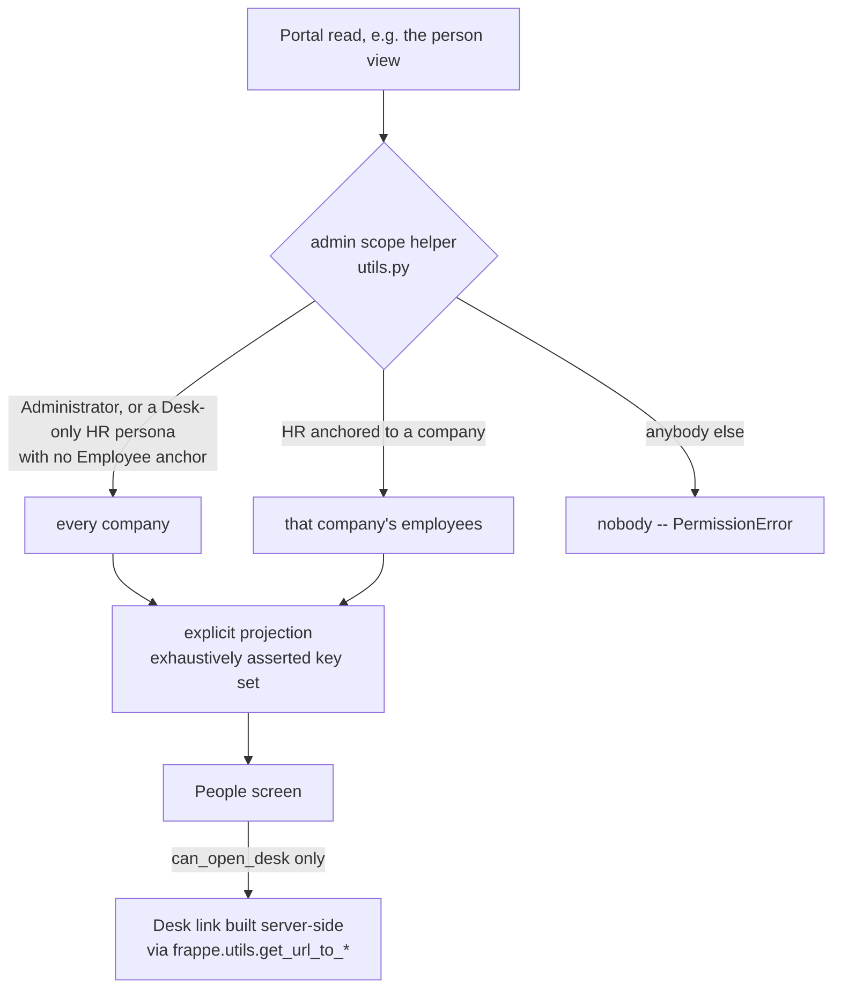

> **ID prefix.** This is phase 6. Cite every ID in this plan as `P6-R1`, `P6-U3`,
> `P6-KTD2`, `P6-AE4` in code comments, commits and tests. Phase 1 IDs are bare
> (`R16`, `U5`); phases 2-5 carry `P2-`..`P5-`. Never edit an existing citation.

## Summary

HelixHR is a finished employee product with an approvals queue and a thin
configuration layer. It has no way to act on -- or even look at -- **a person**.
Seventeen of its forty-nine whitelisted reads are named `get_my_*`; the only
exceptions are the direct-reports week (deliberately redacted) and the staff
directory, which is a phone book. "How much leave does Priya have left?" has no
answer inside the portal.

This plan closes that, and only that. It ships **one read-only surface** -- find
a person, see their state -- plus a **curated launcher into Frappe's own
reports**, pre-filtered to the person or period HR is looking at. It writes
nothing. That is what makes it the cheapest phase in the admin roadmap and the
right one to go first: every later phase (leave allocation, joiner/leaver,
attendance operations) needs a screen to hang its buttons on, and this is that
screen.

The company-scoping seam this needs is the same one the next three phases need.
It gets built and tested **once**, here.

---

## Problem Frame

**What HR does today.** Every question about another person -- a balance, an
absence, a shift, an open request -- is answered in Desk, where the Employee
form carries 70 fields to capture the 6 that are mandatory, and where the
Expenses workspace links to the general ledger.

**What the portal offers instead.** Nothing. `get_directory` returns name,
designation, department, manager and work email, bounded and company-scoped. It
is a phone book, by design (P3-R22, P3-R23). There is no route from a person to
their records.

**What phase 5 added, and did not.** Yesterday's work gave HR the *rules* layer:
request categories and routing, message templates, and a named short field set
on Leave Type, Holiday List and Shift Type. HR can now configure a shift type in
the portal and cannot assign it to anybody. The organisation view (P5-U15) is
aggregate-only by deliberate design -- counts, ages and headcount, never a name.

**The scoping question is already live.** `fix(requests): scope HR Manager and
System Manager to their own company` (2026-09-16) fixed a real defect where an
HR Manager read requests across every company. That was the first instance of a
question this phase asks again, and the next three phases ask about eight more
times: *which employees may this administrator act on?*

**Who is affected.** HR Manager and System Manager gain the surface. Employees
and managers see no change. `IT Team` holders gain nothing here and must not be
offered a Desk link at all -- they are Website Users (`desk_access: 0`, P5-KTD10)
and Desk would refuse them.

---

## Requirements

### Finding and seeing a person

- **P6-R1.** An HR administrator can find an employee by name, employee number or
  work email, within their own company, and open them.
- **P6-R2.** The person view answers, on one screen: leave balance by type,
  attendance for a month, open and recent requests, the assigned shift and
  holiday list, the reporting manager, and the joining date and employment
  status.
- **P6-R3.** The view is **read-only**. This plan introduces no write path of any
  kind, and no action button that mutates a record.
- **P6-R4.** The payload is an explicit projection whose key set is asserted
  exhaustively, so a later addition cannot widen disclosure silently -- the same
  discipline P5-R20 applies to the organisation view.
- **P6-R5.** The view discloses no more about a person than HR already reaches in
  Desk through the roles they hold. It is a friendlier front door to the same
  records, never a wider one.

### Scope

- **P6-R6.** Which employees an administrator may read is decided by **one
  helper, tested once**, and every administrative read in this plan calls it.
  No read re-derives the rule for itself.
- **P6-R7.** An administrator anchored to a company reads that company and no
  other. The Desk-only, employee-less HR persona keeps the unscoped read it has
  today (P3-KTD7, P4-KTD7, and the 2026-09-16 fix) -- this plan changes no
  existing behaviour, it names the rule in one place.
- **P6-R8.** A caller without the capability is refused **server-side**, not
  merely un-navigated.

### Reports

- **P6-R9.** HR reaches Frappe's own HR reports from the portal, as a curated,
  named list -- not the full report tree.
- **P6-R10.** A report opens **pre-filtered** to the person or period HR was
  looking at when they left the portal.
- **P6-R11.** The portal **never re-implements a report and never re-implements
  export**. Frappe's report view already exports to Excel and CSV; that is the
  export story, and the plan says so plainly rather than implying the portal
  downloads anything.
- **P6-R12.** A Desk link is shown **only** to a caller who can actually reach
  Desk. A Website User is never offered one.

### Throughout

- **P6-R13.** Every new read is bounded and rate-limited, every new screen renders
  through `AsyncState.vue` on the shared card surfaces, and every structural
  change gets a standing `preflight.py` guard (the phase-5 P5-R22/R23 standard).
- **P6-R14.** Frappe, ERPNext and HRMS core are never modified.

---

## Scope Boundaries

**In scope.** The six units below: one scope helper, a lookup, a person
projection, a Desk-link helper, one screen for people and one for reports.

**Not in scope -- later phases of the admin roadmap, each its own plan.**
- Leave allocation and balance administration (phase 7) -- the biggest pain, and
  the first *write* surface. It needs this screen to exist first.
- Joiner and leaver flows (phase 8).
- Attendance correction and shift assignment (phase 9).

**Not in scope -- its own plan, agreed 2026-09-17.** Projects and task
management. The portal already reads `Project` and `Task` to populate the
timesheet picker (`get_my_projects`), so the read seam exists -- but it serves
project managers rather than HR, and it is ERPNext rather than HRMS. It is not
blocked by this plan and does not block it.

**Not in scope -- deliberately refused.**
- **Any write.** See P6-R3. The moment this surface writes, it inherits the
  submit/cancel/amend semantics of 53 submittable doctypes and a much larger
  test surface. Phase 7 opens that deliberately; this plan does not.
- **Re-implementing reports or export in the portal.** See P6-KTD2.
- **Anything HelixHR should never compute** -- payroll, salary structures and
  their evaluated formulas, tax slabs, expense posting, gratuity, final
  settlement, and direct `Leave Ledger Entry` writes. Confirmed with the user on
  2026-09-17. The person view may *link* to a payslip in Desk; it computes
  nothing.

### Deferred to Follow-Up Work

- **An "everyone" list view** (all employees as a table, sortable, exportable).
  The curated report launcher covers the need in this phase -- `Employee
  Information` is a Report Builder report that already lists and exports. Revisit
  if HR asks for a portal-native list.
- **Saved report filters per user.** Frappe's report view holds its own filter
  state; a portal-side memory is a second source of truth for no gain yet.
- **A second Playwright identity for a non-HR System Manager.** The existing `hr`
  identity covers every scenario here.

---

## Key Technical Decisions

**P6-KTD1. One scope helper, in `helixhr/utils.py`, called by every
administrative read.**
The rule "which employees may this user administer" is currently expressed
per-call-site: `_session_company` in `utils.py`, `_company_scope_condition` and
`has_permission` in `hr_request.py`, `_is_hr()` gates scattered through
`api.py`. That is how the 2026-09-16 multi-company defect happened, and this
phase adds the first of roughly eight more callers.

The helper answers one question and returns a structured answer -- *every
employee*, *this company's employees*, or *nobody* -- rather than a SQL
fragment, so both a list read and a single-record check can use it without
re-deriving anything. `hr_request.py`'s existing hooks are **left alone** in this
plan: rewriting a permission path that shipped two days ago and is covered by
passing tests is a change with real risk and no user-visible benefit. The helper
is introduced for new callers, and existing callers move to it when a later phase
touches them anyway.

**P6-KTD2. Reports are deep-linked, never re-implemented.**
HRMS ships 20 HR reports and 12 payroll reports already built and maintained --
`Employee Leave Balance`, `Monthly Attendance Sheet`, `Leave Ledger`,
`Employee Exits`, `Shift Attendance`, `Employee Information`. Re-rendering any of
them in the portal would mean re-deriving balance logic the ledger owns, and
would rot the moment HRMS changes.

The portal contributes the thing Frappe does not: **a short, named list of the
reports HR actually uses, and a link that arrives pre-filtered.** Export is
Frappe's report view, which already writes Excel and CSV. The trade the user
accepted on 2026-09-17: the download happens in Desk, not the portal.

**P6-KTD3. Desk URLs come from Frappe's own helpers, never hand-built.**
Verified on this bench: `/app/query-report/<Name>` answers **301** and redirects
to `/desk/query-report/<Name>`, which answers 200. The canonical route in this
build is `/desk/`, and a frontend that hardcodes `/app/` is one Frappe release
away from breaking.

`frappe.utils.get_url_to_form`, `get_url_to_list`, `get_url_to_report` and
`get_url_to_report_with_filters` all exist and produce the correct route for the
installed version. The server builds every Desk URL through them and hands the
finished string to the client. The frontend concatenates no Desk paths.

**P6-KTD4. A Desk link is a capability, not a decoration.**
Verified role inventory on this bench:

| Role | `desk_access` | Holder's `user_type` | Can open Desk |
|---|---|---|---|
| HR Manager | 1 | System User | yes |
| HR User | 1 | System User | yes |
| Employee | 1 | System User | yes, but is routed to the portal |
| `IT Team` | **0** | **Website User** | **no** |

So a Desk link is correct for HR, pointless for an employee (who is deliberately
landed on the portal by `utils.portal_home_page`) and a **dead end** for an
`IT Team` holder, who would be refused. `get_portal_bootstrap` therefore gains a
`can_open_desk` flag, resolved from whether the caller is a System User holding a
desk-access role, and the link component renders on that flag alone -- never on
"is HR", which is a different question that happens to correlate today.

**P6-KTD5. The person projection reuses the portal's existing readers; it
computes nothing new.**
Leave balance comes from the same source `get_my_leave` already uses, attendance
from the same source as `get_my_attendance`, requests from the existing request
reads. The unit's work is *generalising the subject* from "the session user" to
"this employee, if the caller may administer them" -- not writing new
derivations. Where an existing reader is hard-wired to the session, the smaller
change is to lift the employee to a parameter with the session as its default,
so every current caller is unaffected.

**P6-KTD6. Read-only is a design constraint, not an omission.**
No `save_*`, no workflow action, no `db_set`, nothing in `RATE_LIMIT_POLICY` that
is not a read. This is what keeps the phase small, keeps its test surface
proportionate, and lets it ship before the write-heavy phases behind it. A
reviewer should be able to confirm the constraint by grepping the diff for
`.save(`, `db_set` and `frappe.delete_doc` and finding nothing.

---

## High-Level Technical Design

### Where an administrative read is decided

### What the person view carries, and what it deliberately does not

| Shown | Withheld, and why |
|---|---|
| Leave balance by type | The leave **reason** on another person's application -- `get_my_team_week` withholds it from managers on purpose (P3-R21). HR reaches it in Desk. |
| Attendance for a month | Check-in **coordinates**. The portal retains them under a policy (`helixhr_checkin_location_retention_days`); a browse screen is not a reason to surface them. |
| Open and recent requests | Request **attachments**. Linked, not inlined. |
| Shift, holiday list, manager, joining date, status | Salary, bank details, tax and anything at Employee permlevel 1 or 2. Out of the projection entirely. |

The rule behind the right-hand column: this screen is a faster route to what HR
already reaches, never a route to something new (P6-R5).

---

## System-Wide Impact

- **`get_portal_bootstrap` gains two flags** -- `can_see_people` and
  `can_open_desk`. The shell's nav gate reads them the way it already reads
  `can_work_requests`, `can_configure` and `can_see_organisation`. The frontend
  carries no role list; a flag is a nav decision, never a grant (the P5-U11
  precedent).
- **A third HR-gated nav entry.** People, Settings and Organisation are now all
  HR-only. Worth a look at whether they should group under one heading in
  `AppShell.vue` rather than sit as three peers -- a presentation question for
  U5, not a new abstraction.
- **`RATE_LIMIT_POLICY` gains two reads.** Both fan out per employee, which is
  the same reason `get_directory` and `get_my_team_week` are bounded.
- **Preflight gains two checks** -- that the curated report list names only
  reports installed on this site, and that every report named is reachable by
  the roles the portal offers it to. A renamed or removed upstream report
  otherwise becomes a dead link nobody notices.
- **Docs.** `docs/architecture.md` states that Desk owns HR administration, with
  phase 5 recorded as a bounded reversal. This phase widens that reversal to
  *reading* people and must say so in the same place, including the boundary
  that it writes nothing.
- **CI.** No new Playwright identity. The `hr` project gains two specs.

---

## Implementation Units

Six units. U1 is foundational; U2-U4 are server work that can proceed in
parallel once U1 lands; U5 and U6 are the screens.

### U1. One scope helper for administrative reads

**Goal.** "Which employees may this user administer" has exactly one answer, in
one place, with its own tests.

**Requirements.** P6-R6, P6-R7.

**Dependencies.** None.

**Files.**
- Modify: `helixhr/utils.py` -- the helper, beside the existing `_session_company`.
- Test: `helixhr/tests/test_api_people.py` (new).

**Approach.** The helper takes a user and returns a structured scope answer --
unscoped, company-scoped with the company named, or empty -- rather than a SQL
fragment, so a list read and a single-record check consume the same result
without re-deriving it. It preserves today's behaviour exactly: Administrator is
unscoped; an HR persona with no Employee anchor stays unscoped (P3-KTD7,
P4-KTD7); an HR persona anchored to a company is scoped to it (the 2026-09-16
fix); everyone else is empty.

Per P6-KTD1 this unit **adds** the helper and does not rewrite
`hr_request.py`'s existing hooks.

**Patterns to follow.** `helixhr/utils.py`'s `_session_company`;
`helixhr/helixhr/doctype/hr_request/hr_request.py`'s `_company_scope_condition`
for the shape of the answer it has to be able to produce.

**Test scenarios.**
- An HR persona anchored to a company resolves to that company's employees and
  not another company's.
- The Desk-only HR persona with no Employee record resolves to unscoped -- the
  behaviour `ensure_hr_manager_user` relies on, asserted so a later tightening
  cannot break it silently.
- Administrator resolves to unscoped.
- A plain employee, and an `IT Team` holder, resolve to empty.
- An HR persona whose company has no active employees resolves to empty rather
  than raising.
- Asserted as the role via `frappe.set_user`, never as Administrator, which skips
  permission logic entirely (the P5-KTD13 standard).

**Verification.** The helper's answers match the behaviour the existing request
scoping already ships, proven by tests that run as each persona.

---

### U2. Finding a person

**Goal.** An HR administrator can search their company's employees and get back
enough to choose one.

**Requirements.** P6-R1, P6-R8, P6-R13.

**Dependencies.** U1.

**Files.**
- Modify: `helixhr/api.py` -- a whitelisted, bounded search.
- Modify: `helixhr/utils.py` -- `RATE_LIMIT_POLICY` gains the read.
- Test: `helixhr/tests/test_api_people.py`.

**Approach.** Matches on employee name, employee number and company email, over
the scope U1 returns. Bounded and paged the way `get_directory` is; this is the
administrative sibling of that read, not an extension of it -- the directory
stays exactly as it is for employees.

The projection is deliberately thin: enough to disambiguate two people with the
same first name and click through. The record itself is U3.

**Patterns to follow.** `get_directory` (`helixhr/api.py`) for bounded,
company-scoped, server-side filtering and its page/limit clamping.

**Test scenarios.**
- An HR administrator finds a colleague by partial name, by employee number and
  by work email.
- An employee in another company is never returned, including when searched for
  by exact employee number.
- A plain employee calling the method is refused with `PermissionError`, as is an
  `IT Team` holder.
- A search shorter than the minimum is ignored rather than returning the whole
  company, matching `get_directory`'s existing rule.
- The page is bounded and reports its true total; a caller cannot raise the limit
  past the clamp.
- Left and Inactive employees are excluded by default -- HR looking somebody up
  means a current colleague unless they say otherwise.
- The read is rate-limited.

**Verification.** An HR identity searches and pages; a non-HR identity is refused
by the server.

---

### U3. The person view

**Goal.** One bounded projection answering what HR asks about a person.

**Requirements.** P6-R2, P6-R3, P6-R4, P6-R5, P6-R8.

**Dependencies.** U1.

**Files.**
- Modify: `helixhr/api.py` -- the projection.
- Modify: `helixhr/utils.py` -- `RATE_LIMIT_POLICY` gains the read.
- Test: `helixhr/tests/test_api_people.py`.

**Approach.** An explicit projection, assembled from the readers the portal
already has (P6-KTD5): leave balance from the source `get_my_leave` uses,
attendance from `get_my_attendance`'s, requests from the existing request reads,
plus shift, holiday list, manager, joining date and status off the Employee
record.

Where an existing reader is hard-wired to the session employee, lift the employee
to a parameter defaulting to the session, so no current caller changes behaviour.
Resolve the target employee **through U1's scope** before reading anything: a
caller who may not administer this person is refused before any record is
touched, not filtered afterwards.

Each section fails independently. A site with no shift configured, or an employee
with no holiday list, produces an absent section and a named reason -- not a
failed screen. `get_dashboard`'s `failed_sections` is the established shape.

**Execution note.** Write the exhaustive key-set assertion (P6-R4) before filling
the projection out, so the disclosure boundary is a test that exists from the
first commit rather than one added after the shape settles.

**Patterns to follow.** `get_organisation_view` for an explicit projection with an
exhaustively asserted key set; `_celebration_projection` for a projection that
deliberately withholds the underlying field; `get_dashboard` for independently
failing sections.

**Test scenarios.**
- The returned key set is asserted **exhaustively**, at the top level and for
  each section, so a later addition cannot leak silently.
- Leave balance matches what that employee's own `get_my_leave` returns for the
  same period -- HR sees the same number the employee does, not a second
  derivation.
- Attendance for a named month matches directly computed fixture data.
- No leave **reason**, no check-in **coordinates**, and no Employee field above
  permlevel 0 appears anywhere in the payload.
- An HR administrator in another company is refused, and the refusal does not
  disclose whether the employee exists.
- A plain employee and an `IT Team` holder are refused.
- An employee with no shift, no holiday list and no manager returns named absent
  sections rather than raising.
- A section whose read fails is named in the failure list while the rest of the
  payload still returns.
- The read is bounded and rate-limited.
- Asserted as the role, never as Administrator.

**Verification.** An HR identity opens a colleague and the payload matches
hand-computed fixture data; every other identity is refused server-side.

---

### U4. Desk links, built by Frappe

**Goal.** The portal can hand a caller a correct Desk URL, and only to a caller
who can use one.

**Requirements.** P6-R12, P6-R9, P6-R10.

**Dependencies.** None (U3 and U6 consume it).

**Files.**
- Modify: `helixhr/api.py` -- the link helper, and `get_portal_bootstrap` gains
  `can_open_desk` and `can_see_people`.
- Modify: `helixhr/preflight.py` -- the guards described below.
- Test: `helixhr/tests/test_api_people.py`, `helixhr/tests/test_preflight.py`.

**Approach.** Every Desk URL is produced server-side by
`frappe.utils.get_url_to_form`, `get_url_to_list`, `get_url_to_report` or
`get_url_to_report_with_filters` (P6-KTD3). Nothing concatenates a Desk path.

`can_open_desk` resolves from the caller actually being able to reach Desk -- a
System User holding a role with `desk_access` -- not from being HR (P6-KTD4). The
two are correlated today and will not stay that way.

The curated report list is a named constant in `helixhr/utils.py`, in the style of
the phase-5 `*_EDITABLE_FIELDS` sets: a short, deliberate list, not every report
installed. Start with `Employee Leave Balance`, `Employee Leave Balance Summary`,
`Monthly Attendance Sheet`, `Shift Attendance`, `Leave Ledger`,
`Employee Information` and `Employee Exits`; payroll reports are **excluded**
(P6-KTD2 scope boundary -- the portal does not route HR into payroll).

**Patterns to follow.** `helixhr/utils.py`'s named field-set constants;
`preflight.check_configuration_field_sets` for a drift guard over a constant that
names upstream objects.

**Test scenarios.**
- A generated record link resolves to the route this Frappe build actually serves
  -- asserted against `frappe.utils.get_url_to_form`'s own output rather than a
  hardcoded `/app/` or `/desk/` string, so a Frappe route change fails the helper
  and not the users.
- A report link carries its filters, and a report link for a named employee
  filters to that employee.
- `can_open_desk` is true for an HR persona, **false for an `IT Team` holder**
  (a Website User), and the refusal is on user type rather than on role name.
- A caller without `can_open_desk` is never handed a Desk URL by any method in
  this plan.
- Preflight FAILs when the curated list names a report that is not installed.
- Preflight FAILs when a named report is not readable by the roles the portal
  offers it to.

**Verification.** `bench --site <site> execute helixhr.preflight.run` passes on a
fresh site, and FAILs when a curated report is renamed.

---

### U5. The People screen

**Goal.** HR finds a person and reads them, in the portal.

**Requirements.** P6-R1, P6-R2, P6-R13.

**Dependencies.** U2, U3, U4.

**Files.**
- Create: `frontend/src/pages/People.vue`.
- Modify: `frontend/src/router.js` -- `/people`, `/people/:employee`.
- Modify: `frontend/src/components/AppShell.vue` -- the nav entry, gated on
  `can_see_people`.
- Modify: `frontend/src/lib/icons.js` -- one icon.
- Test: `frontend/tests/e2e/people.spec.ts` (new).

**Approach.** Search, then a person. The person's record is addressable by URL so
HR can send a colleague a link, matching the P2-R12 rule the rest of the portal
follows. Every resource-backed region renders through `AsyncState.vue`; sections
the server reported absent render as named empty states, not blanks.

The Desk link appears once per section that has a Desk counterpart, labelled for
what it opens rather than "open in Desk" everywhere -- and only when
`can_open_desk`. Keep the existing employee-facing `/directory` untouched; this is
a separate route with a separate gate.

**Patterns to follow.** `frontend/src/pages/Organisation.vue` for an HR-gated,
read-only screen on the shared surface; `frontend/src/pages/Directory.vue` for
search-and-open; `frontend/src/index.css` for the card surface rules.

**Test scenarios.**
- An HR identity reaches `/people`, searches, opens a colleague, and sees the
  balance, attendance and requests sections.
- An employee identity has no People nav entry, **and a direct navigation is
  refused by the server**, not merely hidden.
- An `IT Team` identity is refused the same way, and sees no Desk link anywhere.
- A person's URL survives a reload and can be opened directly.
- An employee with no shift or holiday list shows named empty states rather than
  a broken panel.
- A failed section shows the unavailable-panel treatment with Retry, and the rest
  of the page still renders (the P2-AE8 rule).
- `visual-foundation.spec.ts` passes.

**Verification.** `yarn lint && yarn test && yarn build`, then the chromium e2e
projects on a site recreated for the run.

---

### U6. The report launcher

**Goal.** HR reaches the report they need, pre-filtered, and exports it there.

**Requirements.** P6-R9, P6-R10, P6-R11, P6-R12.

**Dependencies.** U4.

**Files.**
- Create: `frontend/src/pages/Reports.vue`.
- Modify: `frontend/src/router.js` -- `/reports`.
- Modify: `frontend/src/components/AppShell.vue` -- the nav entry.
- Modify: `docs/architecture.md`, `docs/deployment.md` -- the widened boundary,
  the curated list, and where export actually happens.
- Test: `frontend/tests/e2e/reports.spec.ts` (new).

**Approach.** A short list of named reports, each with a sentence saying what
question it answers -- HR should not have to know that "the leave balance
question" is answered by a report called `Employee Leave Balance Summary`. Each
opens the Frappe report in a new tab, pre-filtered where the portal knows the
filter (the person being viewed, the current month).

The screen states plainly that the report opens in Frappe and that export happens
there. That is the accepted trade (P6-KTD2), and a screen that hides it produces a
support question instead of a download.

From the person view, the same links carry that employee as a filter -- which is
what makes this a launcher rather than a bookmark list.

**Patterns to follow.** `frontend/src/pages/Settings.vue` for an HR-gated screen
of sections; `frontend/src/pages/Documents.vue` for a list of links that leave the
portal, including its `target`/`rel` handling.

**Test scenarios.**
- An HR identity sees the curated list and every entry carries a destination
  built by the server.
- Every link opens in its own tab and carries `rel="noopener"` -- the rule
  `requests-documents.spec.ts` already enforces for external links.
- Opening a report from a person's view carries that employee as a filter.
- An employee identity has no Reports nav entry and a direct navigation is
  refused server-side.
- An `IT Team` identity sees no Desk-bound link.
- No payroll report appears in the list.
- `visual-foundation.spec.ts` passes.

**Verification.** An HR identity opens `Employee Leave Balance` from a person's
view and lands on that report filtered to that person.

---

## Risks & Dependencies

| Risk | Mitigation |
|---|---|
| An HR user who picks up a self-scoping User Permission on Employee goes silently blind to everybody else -- the P4-R11 trap. | Already guarded by `preflight.check_hr_manager_self_scope`, and `make_test_hr_manager_employee` exists precisely because of it. This phase adds callers, not a new failure mode; U1's tests assert the unscoped persona keeps working. |
| The scope helper subtly changes existing behaviour while "unifying" it. | P6-KTD1 confines it to new callers. `hr_request.py` is not rewritten here. U1's tests pin today's behaviour for all four personas before anything consumes it. |
| Disclosure creep -- the person view grows a field nobody reviewed. | P6-R4's exhaustive key-set assertion, written first (U3's execution note), and the explicit withheld-list in the design table. |
| A Desk link handed to somebody who cannot open Desk. | P6-KTD4: the flag resolves on user type, not role, and U4 asserts it is false for the `IT Team` Website User. |
| A curated report is renamed or removed upstream and the launcher rots. | U4's preflight guards FAIL on both an uninstalled report and one the offered roles cannot read. |
| `/app/` vs `/desk/` -- a hardcoded route breaks on a Frappe upgrade. | P6-KTD3: every URL comes from Frappe's own helper, and U4 asserts against the helper's output rather than a literal. |
| HR lands in Desk and is lost -- the confusion this whole roadmap exists to reduce. | The launcher names the question each report answers and says the report opens in Frappe. Deep links arrive pre-filtered, so HR lands on an answer rather than a filter form. |

**Dependencies.** None external. The dev bench must be running to verify the Desk
route shape and the role/user-type inventory in U4.

---

## Deferred to Implementation

- The exact shape of U1's scope answer (a small object, a tuple, a sentinel) --
  settled by writing the two consumers in U2 and U3.
- Whether the attendance section shows a month grid or a summary with a link to
  `Monthly Attendance Sheet`. Decide once the real payload is on screen in U5; the
  report link may make the grid unnecessary.
- Whether People, Settings and Organisation group under one nav heading. A
  presentation call for U5, once three HR entries sit together.
- Which reader in `api.py` is hard-wired to the session and needs its employee
  lifted to a parameter -- known to include the leave and attendance reads,
  enumerated properly when U3 is written.

---

## Open Questions

- **Should the person view show the employee's payslip list?** HR reaches payslips
  in Desk, and the portal already reads them for the employee themselves. Showing
  a *list* discloses no figure and would save a Desk trip; showing an *amount*
  crosses into the money boundary. **Assumption recorded: link to Desk, list
  nothing, until HR asks.**
- **Does HR want Left employees findable?** U2 excludes them by default. An
  offboarded person is exactly who HR looks up during a final settlement, so a
  filter may be wanted. **Assumption recorded: active only, with the filter
  deferred until asked.**

---

## Acceptance Examples

- **P6-AE1.** An HR Manager opens People, types three letters of a colleague's
  name, and opens them. The screen names their leave balance by type, this
  month's attendance, their open requests, their shift and their manager.
- **P6-AE2.** The same HR Manager, on a multi-company site, searches the exact
  employee number of somebody in another company and finds nothing.
- **P6-AE3.** An employee navigates directly to `/people` and is refused by the
  server, not merely shown no nav entry.
- **P6-AE4.** An `IT Team` holder -- a routed worker, not HR -- is refused the
  same way, and sees no Desk link anywhere in the portal.
- **P6-AE5.** From a colleague's page, an HR Manager opens `Employee Leave
  Balance` and lands on the Frappe report already filtered to that person, where
  they export it to Excel.
- **P6-AE6.** A report is renamed upstream. `preflight.run` FAILs and names it,
  before anybody clicks a dead link.
- **P6-AE7.** The person view's payload is extended by a later change without its
  key-set test being updated. The test fails.

---

## Sources & Research

Verified on this bench (`hrms` v16, `frappe` v16) on 2026-09-17:

- **Role and user-type inventory** -- `HR Manager`, `HR User` and `Employee` all
  carry `desk_access: 1` and their holders are System Users; `IT Team` carries
  `desk_access: 0` and its holder is a Website User. This is what P6-KTD4 rests
  on.
- **Desk routes** -- `/app/query-report/<Name>` answers 301 and redirects to
  `/desk/query-report/<Name>`, which answers 200; the same holds for record
  routes. `frappe.utils.data` provides `get_url_to_form`, `get_url_to_list`,
  `get_url_to_report` and `get_url_to_report_with_filters`.
- **Installed HR reports** -- 20 in `hrms/hr/report/`, 12 in
  `hrms/payroll/report/`, names read from their `Report` JSON.
- **HR Manager's own permissions** -- read *and* write at permlevel 0 on
  `Employee`, `Leave Application`, `Leave Allocation`, `Attendance`,
  `Employee Checkin`, `Shift Assignment` and `HR Request`. Two things follow:
  the person view's premise holds (HR can read every record it assembles), and
  P6-R5 is satisfied by construction -- the portal offers strictly **less** than
  the role already carries in Desk, where HR can also write all seven. Read-only
  here is a portal decision (P6-KTD6), not a permission limit.
- **The portal's current read surface** -- 49 whitelisted methods, 17 of them
  `get_my_*`; `get_directory`'s projection is name, designation, department,
  `reports_to` and company email.

Context for the phase ordering, and the boundary this plan honours, is the admin
roadmap reviewed with the user on 2026-09-17: HelixHR owns operations, Desk keeps
the ledger.
