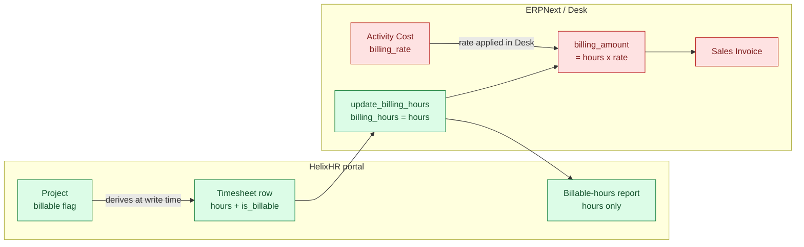
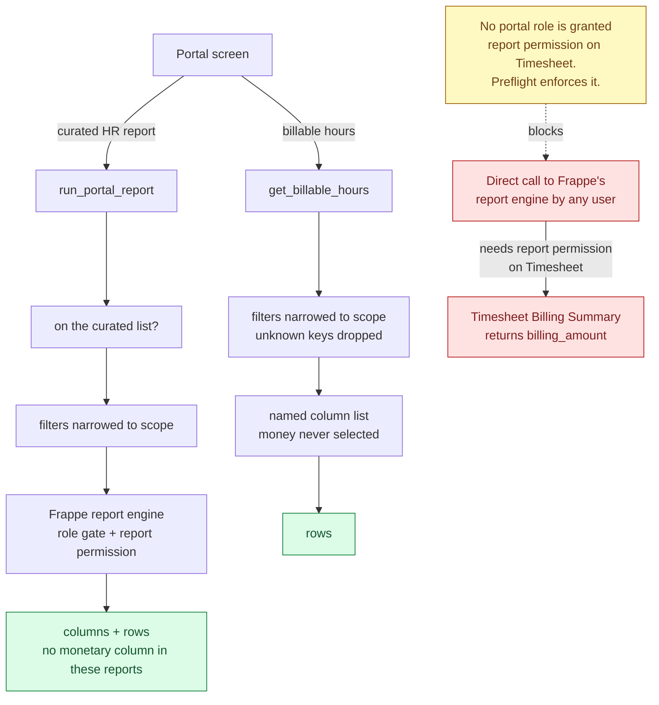
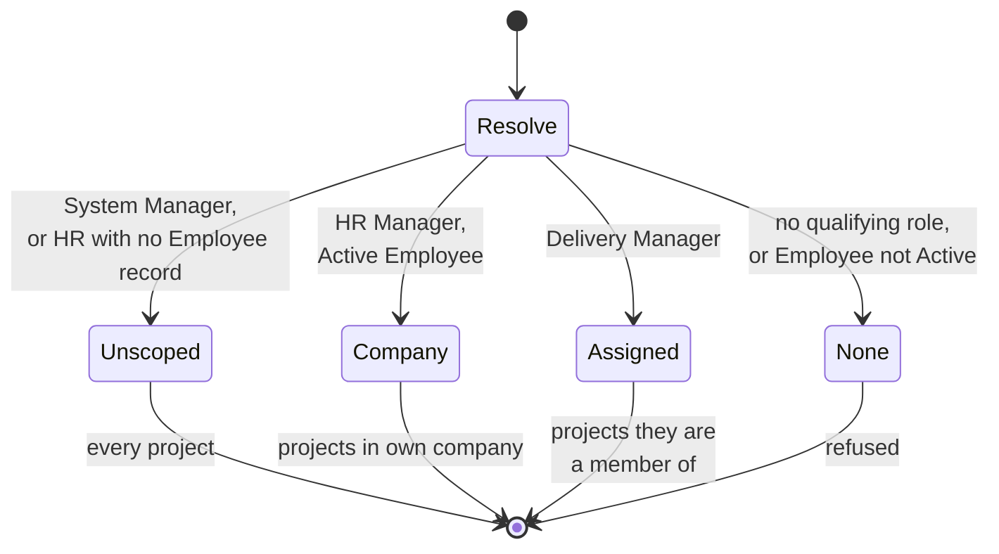

# feat: Projects, tasks, billable-hours capture, and in-portal reports

## Summary

Three capabilities, one dependency chain.

A portal-native **project surface** lets an authorised person create a project,
add tasks to it, and assign people — a thin slice over ERPNext's own Projects,
not a project-management product. A new portal-only **Delivery Manager** role
carries that access alongside HR and System Manager.

Timesheet rows gain **billable-hours capture without any money**. The portal
marks hours billable and lets ERPNext derive billing hours from them. It never
reads, writes, or renders a rate or an amount — those stay in Desk, where
`Activity Cost` is reachable by exactly one role today.

The curated **report launcher stops handing out Desk URLs** and renders results
inside the portal instead, alongside a billable-hours view — scoped and queried
by HelixHR itself — that filters by employee, project, and task.

Timesheet lines also gain a **per-day note**, replacing today's one note per
line per week.

---

## Problem Frame

The portal already *reads* Projects and Tasks — it is how the timesheet's
project and task pickers are populated, via ERPNext's `Project User` child
table and User Permissions. What it has never had is a way to **author** any of
that. Creating a project, adding a task, or putting someone on a project all
require Frappe Desk, which the people who actually run delivery do not have and
should not need.

Three consequences follow, and this plan addresses all three.

**Nobody in the portal can staff a project.** Assignment is a Desk operation on
a child table. Delivery leads either learn Desk or queue behind whoever has it.

**Consultant hours carry no billing signal at all.** ERPNext defaults every
timesheet row to non-billable, and the portal has never set the flag. Every hour
the portal has recorded since launch is `is_billable = 0`. A billing report run
today returns zeros for portal-created work — not because the report is wrong,
but because the data was never captured. Billing is a capture problem before it
is a reporting problem.

**Reports leave the portal.** The curated launcher shipped in the previous phase
opens Frappe's Desk report view in a new tab. For a System User that is merely a
jarring context switch; for a portal-only role it is a dead end, because Desk
does not load for them at all.

### The rate-sensitivity constraint

Billing rates are commercially sensitive and must stay visible to a small group.
This plan treats that as a hard boundary rather than a permission setting: the
portal never selects a monetary column in any query, so there is no rate or
amount for a future refactor, a widened role, or an export to leak. The portal
captures *how many hours are billable*; what those hours are worth is answered
in Desk by whoever already owns `Activity Cost`.

This was verified, not assumed — see Sources & Research.

---

## Requirements

**Projects, tasks, and assignment**

- R1. An authorised person can create a project from the portal, supplying at
  minimum a name; the company comes from their own record.
- R2. An authorised person can add, rename, and close tasks on a project they
  administer.
- R3. An authorised person can assign and unassign people to a project they
  administer, choosing from people rather than from Frappe users.
- R4. A person may only administer projects within their own scope; the scope
  rule is resolved server-side and is the same for every read and every write.
- R5. `Delivery Manager` is a portal-only role: it carries no Desk access, and
  a preflight check keeps it that way.

**Billable capture**

- R6. A project can be marked billable by someone who administers it.
- R7. Hours booked to a billable project are captured as billable hours, so
  ERPNext's own billing totals reflect portal-recorded work.
- R8. No portal endpoint, screen, report, or export exposes a billing rate,
  costing rate, billing amount, or costing amount.
- R9. Changing a project's billable flag does not retroactively alter hours
  already recorded.

**Timesheet notes**

- R10. An employee can record a distinct note against each day of a timesheet
  line, and read back the note they recorded for that day.
- R11. Notes already recorded against existing timesheets remain readable and
  are not silently reassigned to the wrong day.

**Reports in the portal**

- R12. A curated report renders inside the portal; no portal screen hands out a
  Desk URL as its primary path.
- R13. A billable-hours report filters by employee, project, task, and date
  range, and reports hours only.
- R14. Report access is enforced server-side, never by which reports a screen
  chooses to draw: curated HR reports by Frappe's own report permission model,
  and the billable-hours view by HelixHR's project scope.
- R16. No role this plan grants holds a doctype-wide `report` permission on
  `Timesheet`, and a preflight check fails the site if one acquires it.
- R15. A person who cannot reach Desk can still open every report the portal
  offers them.

---

## Key Technical Decisions

**KTD1. Billable is a flag the portal sets; money is a field the portal never
touches.** The portal writes `is_billable` on the timesheet row and lets
ERPNext's own `update_billing_hours` derive `billing_hours` from `hours`.
`billing_rate`, `billing_amount`, `costing_rate`, and `costing_amount` are never
read, written, or selected anywhere in this app. Verified on the bench: a
billable row on a site with no `Activity Cost` record persists
`billing_hours = 6.0` alongside `billing_rate = 0.0` and `billing_amount = 0.0`.
Hours survive; money stays zero until someone with rate access sets it in Desk.
This makes rate confidentiality a structural property rather than a permission
that has to hold.

**KTD2. Billable is a project-level decision, not a per-row one.** The person
who administers the project marks it billable; every hour booked to it is
captured as billable. Consultants do not decide what is invoiceable — which is
both the commercially correct default and consistent with keeping billing
control in few hands. ERPNext stores the flag per row, so the portal derives the
row value from the project at write time. Per-row override is deliberately
deferred, not designed around.

**KTD3. The billable-hours view is a scoped HelixHR query method, deliberately
**not** a Frappe Report record.** No native report carries a task dimension —
`Timesheet Billing Summary` filters on employee and project only,
`Daily Timesheet Summary` offers a date range only, and `Employee Hours
Utilization Based On Timesheet` has no task filter — so this data has to be
HelixHR's own query either way.

The important part is what it must *not* be. Registering it as a Frappe Report
on `Timesheet` would require granting the `report` permission on `Timesheet` to
every role that needs it, and that permission is doctype-wide, not report-wide.
Frappe's report engine is itself a whitelisted endpoint any signed-in user can
call directly, so that grant would hand the caller **every** Timesheet report,
including `Timesheet Billing Summary` and its `billing_amount` column. Verified
on the bench — see Sources. The curated list in HelixHR would be irrelevant,
because the bypass does not go through HelixHR at all.

So the billable-hours view is an ordinary whitelisted method that selects an
explicit list of columns from the timesheet detail rows. No `report` permission
is granted to the new role, no Report record is created, and the monetary
columns are absent because they were never named in the query. That is what
makes R8 structural rather than aspirational.

**KTD3a. Two reporting mechanisms, on purpose.** The existing curated HR reports
(leave balance, attendance, and the rest) keep running through Frappe's report
engine under KTD4 — their audience already holds the permissions, and none of
them carries a monetary column. The billable-hours view uses its own method
under KTD3. These are different things wearing the same word: one renders a
report Frappe owns, the other answers a question HelixHR scopes itself. A single
mechanism for both would mean either granting Timesheet-wide report access
(KTD3's bypass) or reimplementing leave and attendance reporting (which would
break the standing rule that HelixHR never computes what HRMS already owns).

**KTD4. Reports render in-portal by running Frappe's own report engine
server-side.** A whitelisted method calls `frappe.desk.query_report.run` and
returns its columns and rows; the portal draws them. HelixHR derives nothing —
it renders what the report returned. Frappe enforces the Report record's own
roles plus the `report` permission on the referenced doctype. Verified on the
bench: an HR Manager receives columns and rows; a plain employee is refused with
`PermissionError`. This preserves the standing rule that HelixHR never computes
an answer that Frappe or HRMS already owns.

**KTD5. Assignment keys on User, because ERPNext's `Project User` does.** The
portal's surface is people, so the write path resolves Employee to `user_id` and
refuses an employee who has no linked user, with an error that says so. The read
path resolves back to employee names, so no screen ever shows a raw login.

**KTD6. `Delivery Manager` follows the `IT Team` precedent exactly.** A Role
fixture pinned to `desk_access = 0`, permissions applied as deltas in the
existing migrate-time patch rather than shipped as Custom DocPerm fixtures, and
a preflight check that fails if the role drifts back into Desk. The reasoning
that made `IT Team` a patch rather than a fixture — Frappe replaces standard
DocPerms wholesale when any Custom DocPerm exists — applies unchanged.

**KTD8. A DocPerm grant is not a scope, so every grant needs a hook beside it.**
This app's scope helpers only run inside its own whitelisted methods. Frappe's
generic REST routes reach the same doctypes without passing through any of them,
and ERPNext ships no permission-query conditions for `Project` or `Task`. So
granting the new role plain read/write/create would let it list, read, and write
**every** project and task in the system regardless of membership — `Task` worst
of all, since it carries no company field to fall back on. Every DocPerm this
plan grants is therefore paired with a permission-query-conditions and
`has_permission` hook expressing the same rule as the scope helper, and with a
test that exercises the REST route rather than only the portal method. This is
the exact bug class the previous phase's review found on the `IT Team` role, so
it is a named decision here rather than an implementation detail.

**KTD9. Responses are built from explicit field allow-lists, never from a whole
document.** ERPNext's `Project` carries its own costing tab — estimated cost,
total costing amount, total billable amount, total billed amount, total sales
amount, and gross margin — which is more commercially sensitive than the
timesheet rates this plan is written to protect. Reading a project and returning
it wholesale would defeat R8 through a doctype the plan barely mentions. Every
response in this plan names the fields it returns. The string-grep test in U6 is
a backstop for one failure mode, not the mechanism; the allow-list is the
mechanism.

**KTD7. The per-day note changes the grid's line identity, not the storage.**
ERPNext already stores one description per timesheet row, and the portal already
round-trips it. Today the grid groups rows into a line keyed by project, task,
**and** note, which is what forces one note across the whole week. Dropping note
from that key and carrying it per day cell is a frontend regrouping; the write
path needs no change. Existing timesheets read back with each day carrying the
note its own row already held, so R11 holds without a migration.

---

## High-Level Technical Design

### Where money is, and is not

The boundary this plan defends. Everything left of the line is the portal;
everything right of it is Desk and stays there.

The portal reaches `billing_hours` and stops. No portal query selects a node in
the red band.

### Two report paths, and the one that must not exist

The red path is the one this plan exists to keep closed. It does not pass
through HelixHR at all — Frappe's report engine is directly callable by any
signed-in user, and the `Employee` role that every member of staff holds is
already on `Timesheet Billing Summary`'s permitted-role list. The only thing
standing between a staff member and `billing_amount` is the doctype-wide
`report` permission on `Timesheet`, so no role this plan grants receives it, and
a preflight check fails the site if one ever does.

For the curated HR reports, the scope narrowing in HelixHR and the permission
gate in Frappe are belt and braces on purpose: the first decides *which rows a
person should be asking for*, the second decides *whether they may run the
report at all*. Neither is trusted to do the other's job.

### Administering scope

Directional guidance, not implementation specification — the exact resolution
order is settled during U2 against the existing people-scope helper.

---

## Implementation Units

Grouped into three phases. Phase A is a hard prerequisite for Phase B's project
billable flag and for Phase C's report scoping. Phase B and Phase C are
independent of each other once Phase A lands.

### Phase A — Projects, tasks, and assignment

### U1. The Delivery Manager role and its permission deltas

**Goal:** A portal-only role exists with exactly the permissions the later units
need, applied the way this app already applies permissions.

**Requirements:** R5, and the access half of R1-R3.

**Dependencies:** none for the role, fixture, and deltas. The two permission
hooks call U2's scope helper, so land the role first, then U2, then return here
for the hooks rather than duplicating the rule.

**Files:**
- `helixhr/fixtures/role.json` — modify: add `Delivery Manager`, `desk_access: 0`, `is_custom: 0`
- `helixhr/patches/v1_0/apply_permission_deltas.py` — modify: add `Project` and `Task` delta rows for the new role
- `helixhr/project_permissions.py` — create: permission-query-conditions and `has_permission` hooks for `Project` and `Task`
- `helixhr/hooks.py` — modify: register both hooks
- `helixhr/preflight.py` — modify: add a role guard alongside `check_it_team_role`, and register it
- `helixhr/tests/test_fixtures.py` — modify
- `helixhr/tests/test_preflight.py` — modify

**Approach:** Mirror `IT Team` end to end, with one deliberate difference.

The role needs read/write/create on `Project` and `Task`. It needs **no**
`Employee` permission — the people picker resolves names through existing scoped
reads. It is granted **no `report` permission on `Timesheet`**, and this is the
unit's most important line: that permission is doctype-wide and would hand the
holder every Timesheet report through Frappe's own report endpoint, including
the one carrying `billing_amount` (KTD3). Phase C is designed so the role never
needs it.

Because a DocPerm carries no scope of its own and ERPNext ships no permission
query conditions for these doctypes, the grant is paired with hooks that express
U2's membership rule at the framework level (KTD8). The hooks are the real
boundary; the whitelisted methods are a convenience on top of them. The hooks
cannot be written before U2 defines the scope, so land U2 first and return here
— or write the hooks as thin wrappers that call U2's helper, which is the
preferred shape since it keeps one definition of the rule.

The preflight guard asserts the role stays out of Desk, holds no `report`
permission on `Timesheet`, and that both hooks are registered — a hook silently
dropped from the config is indistinguishable from an unscoped role at runtime.

**Patterns to follow:** `check_it_team_role` in `helixhr/preflight.py`; the
`HR Request` entries in the `DELTAS` dict; the existing
`get_permission_query_conditions` and `has_permission` pair in
`helixhr/helixhr/doctype/hr_request/hr_request.py`.

**Test scenarios:**
- The role fixture installs with `desk_access = 0` and `is_custom = 0`.
- After the patch runs, the role holds read/write/create on `Project` and on `Task`.
- After the patch runs, the role holds **no** `report` permission on `Timesheet` and no `read` on `Employee`.
- A Delivery Manager calling Frappe's report endpoint directly for `Timesheet Billing Summary` is refused.
- A Delivery Manager listing `Project` through the generic REST route sees only projects they are a member of — not every project.
- A Delivery Manager reading a single non-member `Project` by name through the REST route is refused.
- A Delivery Manager listing and reading `Task` through the REST route is confined to tasks on projects they are a member of.
- A Delivery Manager writing to a non-member `Project` or `Task` through the REST route is refused.
- Re-running the patch a second time writes no additional rows (idempotence).
- Preflight fails when `desk_access` is flipped to 1, when the role is absent, when a `report` permission on `Timesheet` appears, and when either hook is unregistered.
- A Delivery Manager holder is a Website User and `_can_open_desk` returns False for them.

**Verification:** `bench migrate` on a fresh site leaves preflight passing; a
Delivery Manager signs in without Desk loading; and every REST-route scenario
above is refused or narrowed as stated. The REST-route tests are the unit's
real acceptance criterion — the portal methods are not.

---

### U2. The project administration scope helper

**Goal:** One server-side answer to "which projects may this caller
administer", used by every read and every write that follows.

**Requirements:** R4.

**Dependencies:** U1.

**Files:**
- `helixhr/utils.py` — modify: add `resolve_project_scope(user)` and a companion project-filter helper
- `helixhr/tests/test_api_projects.py` — create

**Approach:** Return a small dict in the shape `resolve_admin_scope` already
uses — a `kind` plus its qualifier — so callers branch on one vocabulary across
both people and projects. System Manager resolves unscoped. HR Manager resolves
to their own company, reusing the people-scope helper rather than re-deriving
the rule. Delivery Manager resolves to the projects they are a member of.
Anyone else resolves to none.

Carry forward the offboarding lesson from the previous phase: a holder whose
Employee record exists but is not Active must resolve to none, never widen to
unscoped. Distinguish that from a holder with no Employee record at all, which
is the intentional Desk-only persona.

**Execution note:** Test-first. This helper is the authorization boundary for
every unit after it, and the previous phase's security review found a real
widening bug in the equivalent people-scope helper. Write the scope table as
tests before the implementation.

**Patterns to follow:** `resolve_admin_scope` and `admin_scope_employee_filters`
in `helixhr/utils.py`; the scope table in `helixhr/tests/test_scope_hardening.py`.

**Test scenarios:**
- System Manager resolves unscoped.
- An Active HR Manager resolves to their own company.
- An HR Manager whose Employee is Left resolves to none, not unscoped.
- An HR-role holder with no Employee record at all resolves unscoped.
- A Delivery Manager resolves to exactly the projects they are a member of.
- A Delivery Manager who is a member of no project resolves to an empty set, and the filter that expresses it does not produce an empty SQL `IN ()`.
- A plain employee resolves to none.
- A Delivery Manager whose Employee record is not Active resolves to none.

**Verification:** The scope table passes as written, and every branch is exercised by a named test.

---

### U3. Reading projects, tasks, and members

**Goal:** The portal can list the projects a caller administers and open one,
with its tasks and its people.

**Requirements:** R1-R4 (read half).

**Dependencies:** U2.

**Files:**
- `helixhr/api.py` — modify: add `search_projects` and `get_project`
- `helixhr/utils.py` — modify: add the rate-limit policy entries
- `helixhr/tests/test_api_projects.py` — modify
- `helixhr/tests/test_upload_security.py` — modify: mirror the new rate-limit entries into the pinned policy

**Approach:** Both methods resolve scope first and refuse before touching a
record, with one refusal message for "does not exist", "not yours", and "outside
your scope" — the uniform-refusal pattern the previous phase established, so
neither method becomes an existence oracle for project ids.

`get_project` returns a **named list of fields**, never the project document
(KTD9). ERPNext's `Project` carries a costing tab — estimated cost, total
costing amount, total billable amount, total billed amount, total sales amount,
gross margin — plus links to Customer and Sales Order. None of it belongs in
this response, and a whole-document read would carry all of it. The returned
set is: name, project name, status, the billable flag, expected start and end
dates, its open tasks, and its members. Customer is deliberately excluded until
someone asks for it; when they do, it is a decision, not a leak.

Members come back as people, never as logins (KTD5).

Both are reads and both fan out per project, so both take a rate-limit entry.
The policy dict is pinned by an exact-equality assertion in
`test_upload_security.py`; update it in the same commit or that test fails.

**Patterns to follow:** `search_people` and `get_person` in `helixhr/api.py`,
including their refusal shape and their scope-first ordering.

**Test scenarios:**
- A Delivery Manager lists exactly the projects they are a member of.
- An HR Manager lists projects in their own company and not another company's.
- A plain employee is refused by both methods.
- Opening a project outside the caller's scope raises the same error, with the same message, as opening one that does not exist.
- The refusal message names no project, no customer, and no person.
- `get_project` returns members as employee names, never as user logins.
- `get_project`'s response contains no field from the Project costing tab — not estimated cost, total costing amount, total billable amount, total billed amount, total sales amount, or gross margin — and no Customer or Sales Order link.
- Adding a new field to ERPNext's Project does not cause it to appear in the response (the allow-list is explicit, not a denylist).
- `get_project` on a project with no tasks and no members returns empty collections rather than failing.
- A project whose member has no linked Employee record is still readable, and that member is reported in a way the screen can render.
- Both methods appear in the rate-limit policy.

**Verification:** Every scope branch from U2 produces the expected list, and no refusal distinguishes absent from forbidden.

---

### U4. Creating projects and tasks, and assigning people

**Goal:** The three write operations, each gated by the same scope helper that
gates the reads.

**Requirements:** R1, R2, R3, R6.

**Dependencies:** U3.

**Files:**
- `helixhr/api.py` — modify: add `create_project`, `save_task`, and `set_project_members`
- `helixhr/fixtures/custom_field.json` — modify: add the project billable flag
- `helixhr/utils.py` — modify: rate-limit entries
- `helixhr/tests/test_api_projects.py` — modify
- `helixhr/tests/test_upload_security.py` — modify

**Approach:** All three are POST-only and rate-limited, consistent with every
other mutating method in this app. `create_project` takes a name and the
billable flag; company comes from the caller's own employee record, never from
the request. The creator is added as a member so that a Delivery Manager who
creates a project can still see it under U2's scope rule — without that, they
would create a project and immediately lose it.

`save_task` covers add, rename, and close; closing sets ERPNext's own status
rather than deleting, so recorded time keeps its task.

`set_project_members` takes employees, resolves each to a user, and refuses the
whole call if any employee has no linked user — naming which one, since that is
the caller's own directory data and not a disclosure. Replacing the member set
rather than patching it keeps the operation idempotent.

The billable flag is a custom field on `Project` shipped through the existing
fixture, so ERPNext's own Project doctype is not modified.

**Execution note:** Test-first for the authorization and validation cases. These
are the app's first write endpoints over a doctype it does not own.

**Patterns to follow:** the POST-only, rate-limited, scope-first shape of the
existing request and attendance write methods in `helixhr/api.py`; the custom
field entries in `helixhr/fixtures/custom_field.json`.

**Test scenarios:**
- A Delivery Manager creates a project and immediately appears as a member of it.
- The created project takes the caller's own company; a company supplied in the request is ignored.
- A plain employee is refused on all three methods.
- A Delivery Manager cannot add a task to a project they are not a member of.
- An HR Manager cannot write to a project in another company.
- Closing a task sets status rather than deleting the record, and time already booked to it is still readable.
- Assigning an employee with no linked user refuses the whole call and names that employee.
- Assigning the same set twice produces the same membership (idempotence).
- Removing a member does not delete or alter time they already recorded.
- Marking a project billable does not alter any timesheet row that already exists (R9).
- All three methods refuse a GET.
- All three appear in the rate-limit policy.

**Verification:** A Delivery Manager can create a project, add tasks, staff it, and mark it billable end to end without Desk; every cross-scope attempt is refused.

---

### U5. The Projects screen

**Goal:** One portal screen for the whole Phase A surface.

**Requirements:** R1-R3 (interface half).

**Dependencies:** U4.

**Files:**
- `frontend/src/pages/Projects.vue` — create
- `frontend/src/router.js` — modify
- `frontend/src/components/AppShell.vue` — modify: nav entry, desktop and phone
- `frontend/src/lib/icons.js` — modify
- `helixhr/api.py` — modify: add the bootstrap flag that reveals the nav entry
- `frontend/tests/e2e/projects.spec.ts` — create

**Approach:** Follow the People screen's structure: a list that narrows as you
type, and a detail region for the selected project carrying its tasks and its
people. Use the existing `AsyncState` region states so an empty scope, a
forbidden read, and a genuinely empty project each render as themselves rather
than as a spinner that never resolves.

The nav entry is revealed by a bootstrap flag derived from the project scope
helper — the same way the People entry is derived from the people scope — so the
entry is absent for someone who would only be refused by every method behind it.

**Patterns to follow:** `frontend/src/pages/People.vue` for the
list-plus-detail shape; `frontend/src/components/AsyncState.vue` for region
states; the `can_see_people` bootstrap flag in `helixhr/api.py`.

**Test scenarios:**
- A Delivery Manager sees the Projects nav entry; a plain employee does not.
- Creating a project from the screen shows it in the list without a reload.
- Adding a task shows it under the project.
- Assigning a person shows them in the member list by name.
- A Delivery Manager with no projects sees an empty state, not an error and not a spinner.
- The screen renders at phone width with no horizontal scroll.
- Marking a project billable persists across a reload.

**Verification:** `yarn lint`, `yarn test`, `yarn build` pass, and the e2e spec passes for the Delivery Manager and HR identities.

---

### Phase B — Timesheet capture

### U6. Billable-hours capture

**Goal:** Hours booked to a billable project are recorded as billable, with no
monetary field read or written anywhere.

**Requirements:** R6, R7, R8, R9.

**Dependencies:** U4 (the project billable flag must exist).

**Files:**
- `helixhr/api.py` — modify: derive the row flag in the week writer; surface the project's billable state in the projects payload the grid already fetches
- `helixhr/tests/test_api_timesheet.py` — modify
- `frontend/src/components/WeekGrid.vue` — modify: a non-interactive billable indicator
- `frontend/tests/e2e/timesheet-entry.spec.ts` — modify

**Approach:** The week writer already builds each timesheet row; it gains the
project's billable flag as the row's `is_billable`. ERPNext's own
`update_billing_hours` then derives `billing_hours` on validate — the portal
does not compute it and does not set it.

The flag is derived from the project at write time, never accepted from the
request, so a crafted payload cannot mark its own hours billable. The grid shows
which projects are billable as information only; it offers no control, because
under KTD2 the consultant does not make this decision.

Add an assertion to the existing test suite that the app's source contains no
reference to `billing_rate`, `billing_amount`, `costing_rate`, or
`costing_amount` — R8 is the kind of boundary that erodes quietly, and a test is
cheaper than a review.

**Execution note:** Test-first on the flag-derivation and the no-money
assertions. These encode the plan's central constraint.

**Patterns to follow:** `_write_my_week` and `_validate_rows` in
`helixhr/api.py`.

**Test scenarios:**
- Hours booked to a billable project persist with `is_billable = 1` and `billing_hours` equal to hours.
- Hours booked to a non-billable project persist with `is_billable = 0` and `billing_hours` of 0.
- A request that sets a billable flag directly on the row is ignored; the project's flag wins.
- A request that supplies a billing rate or amount is rejected or ignored, and nothing monetary is persisted from it.
- Marking a project billable afterwards leaves already-recorded rows unchanged (R9).
- The parent timesheet's total billable hours reflects the rows, and its total billable amount stays 0 on a site with no rate records.
- No module in `helixhr/` references `billing_rate`, `billing_amount`, `costing_rate`, or `costing_amount`.
- Submitting a week of billable hours still transitions through the existing workflow unchanged.

**Verification:** A week booked to a billable project shows non-zero billable hours and zero amount on the resulting ERPNext Timesheet, and the no-money assertion passes.

---

### U7. Per-day notes

**Goal:** Each day of a timesheet line carries its own note.

**Requirements:** R10, R11.

**Dependencies:** none (independent of U6; sequence after it only to keep the
timesheet surface changing one unit at a time).

**Files:**
- `frontend/src/pages/Timesheet.vue` — modify: drop note from the line key, carry notes per date
- `frontend/src/components/WeekGrid.vue` — modify: a note input per day cell
- `frontend/tests/e2e/timesheet-entry.spec.ts` — modify
- `helixhr/tests/test_api_timesheet.py` — modify: round-trip coverage

**Approach:** The storage already supports this — ERPNext holds one description
per row and the portal already round-trips it. The change is the grid's grouping
key, which today includes the note and therefore forces one note across the
week. Drop note from that key, hold notes in a per-date map beside the existing
per-date hours map, and send each day's note with its own row.

On a phone, a per-day note input on every cell is too much; put the note behind
the day's entry affordance rather than rendering seven always-visible inputs.

Reading back an existing timesheet must not merge two days' differing notes into
one line or drop either — that is R11, and it is the regression most likely to
slip through.

**Patterns to follow:** the existing per-date hours map in
`frontend/src/pages/Timesheet.vue`; the copy-a-day behaviour already in that
file, which must carry the right day's note after this change.

**Test scenarios:**
- Two days on one line carry different notes, save, and read back on the correct days.
- A line with a note on one day only reads back with the other days' notes empty.
- An existing timesheet written before this change reads back with each day's note intact (R11).
- Copying one day to another copies that day's note, not the line's first note.
- A day with a note but no hours is not saved as a phantom row.
- Clearing a note saves as empty rather than retaining the previous value.
- The phone layout exposes the per-day note without horizontal scroll.
- A note at the field's maximum length round-trips without truncation.

**Verification:** A week with seven distinct daily notes saves, submits, and reads back correctly, and an existing pre-change timesheet still renders its notes on the right days.

---

### Phase C — Reports inside the portal

### U8. The report runner and the billable-hours report

**Goal:** A server-side report runner, and the one report that needs a task
dimension.

**Requirements:** R12, R13, R14, R8.

**Dependencies:** U2 (scope). U6 is a sequencing preference, not a code
dependency — the report runs correctly against an empty result set, and only
returns interesting rows once U6 has captured some.

**Files:**
- `helixhr/api.py` — modify: add `get_billable_hours` and `run_portal_report`; retire `get_report_link`'s role as the primary path
- `helixhr/utils.py` — modify: the curated report list; rate-limit entries
- `helixhr/preflight.py` — modify: assert no role the portal grants holds `report` on `Timesheet`
- `helixhr/tests/test_api_reports.py` — create
- `helixhr/tests/test_preflight.py` — modify
- `helixhr/tests/test_upload_security.py` — modify

**Approach:** Two methods, because there are two different things here (KTD3a).

`get_billable_hours` is HelixHR's own scoped query over timesheet detail rows.
It accepts only four filter keys — employee, project, task, and a date range —
and ignores anything else in the request rather than forwarding it. It selects a
named column list: date, employee, employee name, project, task, task subject,
hours, billable hours. No monetary column is named, so none can be returned
(KTD3). Filters intersect with the caller's scope; they never replace it, so a
Delivery Manager naming someone else's project gets their own rows or none.

`run_portal_report` serves the existing curated HR reports only. It checks the
report is on the curated list, narrows filters to scope, and calls Frappe's
report engine, returning columns and rows unchanged (KTD4). It constructs its
own call with a fixed keyword set rather than forwarding the caller's dict —
Frappe's report engine accepts parameters beyond filters, including one naming
the user to run as, and none of those may come from the request.

Neither method grants nor requires `report` on `Timesheet`. The preflight check
asserts that stays true, because a later well-meaning grant is exactly how the
bypass in KTD3 would reopen.

**Execution note:** Test-first on filter narrowing, on the ignored-key
behaviour, and on the permission cases. A method that takes caller-supplied
filters and reaches a report engine is the shape that becomes a
data-exfiltration path when narrowing is got wrong.

**Patterns to follow:** `get_report_link` in `helixhr/api.py` for the
curated-list and scope checks; `check_curated_reports` in
`helixhr/preflight.py`; the uniform-refusal constant in `helixhr/api.py`.

**Test scenarios:**
- An HR Manager runs the billable-hours query and receives rows for their own company only.
- A plain employee is refused.
- A Delivery Manager receives only rows for projects they are a member of, even when passing a project filter naming another project.
- An HR Manager passing another company's filter receives their own company's rows.
- Filtering by task returns only that task's rows; filtering by employee only that employee's.
- The returned column set contains no rate, amount, or cost column — asserted against the literal returned keys, not by inspecting the source.
- A filter key the method does not recognise is ignored, and its presence never reaches the query.
- A request attempting to name a different user to run as has no effect on whose rows come back.
- An empty scope returns an empty result rather than failing or returning everything.
- A caller who cannot reach Desk still gets rows (R15).
- `run_portal_report` refuses a report not on the curated list, with the same message as one that does not exist.
- Preflight fails if any role the portal grants acquires `report` on `Timesheet`.
- Both methods appear in the rate-limit policy.

**Verification:** Each role receives exactly the rows its scope allows; no
returned column is monetary; a Website User holding Delivery Manager gets rows
from `get_billable_hours` and is refused by Frappe's report engine when calling
it directly for `Timesheet Billing Summary`.

---

### U9. Reports render in the portal

**Goal:** The launcher stops being a launcher.

**Requirements:** R12, R13, R15.

**Dependencies:** U8.

**Files:**
- `frontend/src/pages/Reports.vue` — modify: render results rather than opening Desk
- `frontend/tests/e2e/reports.spec.ts` — modify

**Approach:** Replace the Desk hand-off with a filter bar and a results table.
The table renders whatever columns the runner returned, using each column's
declared type for alignment and formatting — digits in columns get tabular
figures so hours line up.

Keep the table as markup inside this page rather than extracting a component.
Nothing else in the portal renders server-declared columns — the two existing
tables both hard-code theirs — so a generic renderer would have exactly one
call site. Extract it when a second screen needs it, not before.

Keep a Desk link as a secondary affordance for System Users only, for the cases
the portal deliberately does not cover, such as Frappe's own export toolbar. It
is no longer the primary path, and it is absent entirely for a portal-only role
since Desk would not load for them.

Large results need a stated ceiling rather than an unbounded table; settle the
exact treatment during implementation against how the existing approval queue
handles its own cap.

**Patterns to follow:** the existing curated list and its scope-derived
visibility in `frontend/src/pages/Reports.vue`; `AsyncState` region states.

**Test scenarios:**
- Running a report shows a table without leaving the portal.
- Changing a filter re-runs and updates the table.
- A refused report shows the refusal, not an empty table implying no data.
- A report with no matching rows shows an empty state distinct from the refusal state.
- No rendered column header or cell contains a currency value.
- The Desk link is absent for a Delivery Manager and present for an HR Manager.
- The table renders at phone width with the table itself scrolling, not the page.

**Verification:** `yarn lint`, `yarn test`, `yarn build` pass; the e2e spec passes across the employee, manager, HR, and Delivery Manager identities.

---

## Scope Boundaries

**Not in this plan**

- Any monetary field, anywhere in the portal. Rates, amounts, and costs stay in
  Desk. This is the plan's central constraint, not a deferral.
- Invoicing. The portal captures billable hours; Sales Invoice generation stays
  in ERPNext.
- Project management beyond create, task, and assign — no milestones,
  dependencies, Gantt, percent-complete, budgets, or costing.
- Per-row billable override by the consultant (KTD2).
- Editing another person's timesheet.
- Report export from inside the portal — Frappe's report view already has one,
  and a System User keeps the secondary Desk link to reach it.

**Deferred to follow-up work**

- Per-row or per-task billable override, if project-level proves too coarse in
  practice.
- A portal surface for `Activity Cost`, if rate ownership ever needs to move out
  of Desk. It would need its own permission design and is deliberately not
  sketched here.
- In-portal export, if the Desk link turns out to be insufficient for the people
  who need data out.
- Project-scoped timesheet approval, where a Delivery Manager rather than the
  reporting manager approves time on their project. This is a substantial
  change to the approval model and deserves its own plan.

**Explicitly removed from scope**

- The timesheet total rounding issue raised in an earlier session. It was fixed
  and deployed before this plan was written.

---

## Risks and Dependencies

| Risk | Likelihood | Impact | Mitigation |
|---|---|---|---|
| A monetary field reaches the portal through a later change | Medium | High — the constraint this plan exists to hold | Explicit field allow-lists (KTD9); U6's source assertion as a backstop; tests assert against returned keys, not source text |
| A later `report` grant on `Timesheet` silently reopens the money bypass | Medium | High — defeats R8 entirely | KTD3 forbids the grant; U8's preflight check fails the site if any portal-granted role acquires it |
| A DocPerm is added without a matching permission hook, leaving a doctype unscoped over REST | Medium | High | KTD8 pairs every grant with a hook; U1's acceptance criterion is the REST-route tests, not the portal methods |
| A later ERPNext upgrade adds a field to `Project` that lands in a portal response | Low | Medium | The allow-list is explicit, and U3 tests that a new Project field does not appear |
| Filter narrowing in the report runner is got wrong, widening what a caller can read | Medium | High | Test-first on narrowing; every scope branch has a named test; filters intersect with scope, never replace it |
| The per-day note change mis-reads existing timesheets and reassigns notes to wrong days | Medium | Medium — silent data misattribution | R11 has its own test against a timesheet written before the change |
| A Delivery Manager creates a project and immediately loses access to it | High if unhandled | Medium | U4 adds the creator as a member in the same operation; covered by a named test |
| Permission deltas for the new role disturb existing roles on a fresh site | Low | High | The existing patch mechanism snapshots each site's own standard rows first; idempotence is tested |
| The long-lived dev site's accumulated fixtures mask a real failure | High | Medium | Final verification on a fresh site, per the standing rule in the engineering notes |

**Dependencies**

- No new Python or JavaScript packages. Every capability uses Frappe, ERPNext,
  or the portal's existing frontend libraries.
- ERPNext's Projects module must be installed. It is, and the portal already
  reads from it.
- Phase B's billable capture depends on Phase A's project flag existing. Phase C
  depends on Phase A's scope helper and is only meaningful once Phase B has
  captured data.

---

## Open Questions

Deferred to implementation, not blocking the plan:

- The exact ceiling on report result size, and whether it pages or truncates
  with a stated count. Settle against the approvals queue's existing treatment.
- Whether the Delivery Manager's project scope should include projects they
  created but later removed themselves from. The plan assumes membership is the
  whole rule; U2's test table is where this gets decided.
- How the per-day note is exposed on the phone layout specifically — behind the
  day's entry affordance, but the precise interaction is a UI decision worth
  prototyping against the real grid rather than specifying here.

Worth a decision before Phase B ships, and flagged rather than assumed:

- Whether existing recorded hours on projects that are marked billable should be
  backfilled. The plan says no (R9), because retroactively changing what was
  invoiceable is a commercial decision rather than a technical one. If the
  answer is yes, it is a one-off script and its own small plan.

---

## System-Wide Impact

- **Permissions.** A new role changes the app's permission surface. The existing
  migrate-time delta patch and the preflight coverage check both extend to cover
  it, so a site that drifts is caught at runtime rather than discovered.
- **Navigation.** Two nav entries change: Projects appears, and Reports changes
  behaviour rather than location.
- **The report launcher's contract.** `get_report_link` stops being the primary
  path. It stays for the System-User secondary link, so nothing that depends on
  it breaks, but its role narrows.
- **Timesheet writes.** Every portal timesheet write gains a derived field.
  Existing timesheets are untouched.
- **Documentation.** `README.md`, `PRODUCT.md`, and `docs/deployment.md` each
  describe the portal's role coverage and its report behaviour; all three need
  updating. The showcase fixture and screenshot script gain a Projects screen
  and a rendered report, which are the two most visible additions since the
  README was rewritten.

---

## Verification

Per the standing engineering rules, from the bench root inside the dev
container, all passing before this is done:

- `ruff check helixhr`
- `cd frontend && yarn lint`
- `bench --site test_site run-tests --app helixhr`
- `cd frontend && yarn test`
- `cd frontend && yarn build && bench --site test_site clear-cache`
- Playwright across every identity, including a new Delivery Manager identity
- `bench --site <site> execute helixhr.preflight.run`

A long-lived local site accumulates fixture data that fails two tests by design.
The final run for this plan must be on a fresh site — this plan adds permission
deltas and a role fixture, which are exactly the things a drifted site reports
falsely.

---

## Sources and Research

Verified on the dev bench on 2026-09-20 rather than assumed. These findings are
load-bearing for KTD1 through KTD4.

- **Billable hours survive without a rate.** A timesheet row inserted with
  `is_billable = 1` on a site holding zero `Activity Cost` records persisted
  `hours = 6.0`, `billing_hours = 6.0`, `billing_rate = 0.0`,
  `billing_amount = 0.0`, with the parent's total billable hours at 6.0 and
  total billable amount at 0.0. This is the whole basis of KTD1.
- **`Activity Cost` is already narrow.** It carries exactly one DocPerm role on
  this site — `Projects User`. Rate confidentiality is an existing property, not
  something this plan has to create.
- **ERPNext derives billing hours itself.** `update_billing_hours` sets
  `billing_hours` from `hours` when the row is billable, and `validate` calls
  `update_cost` on every save. The portal setting only the flag is sufficient.
- **The report engine is callable and enforces permissions.** Running
  `Timesheet Billing Summary` server-side as an HR Manager returned columns
  `date, project, employee, employee_name, timesheet, hours, billing_hours,
  billing_amount`; the same call as a plain employee raised
  `PermissionError: You don't have permission to get a report on: Timesheet`.
  This is the basis of KTD4.
- **No native report carries a task dimension.** `Timesheet Billing Summary`
  filters on employee, project, date range, and a group-by of
  employee/project/date. `Daily Timesheet Summary` offers only from and to
  dates. `Employee Hours Utilization Based On Timesheet` exposes no task filter.
  This is the basis of KTD3.
- **The portal already reads Projects and Tasks.** Bookable projects resolve
  through `Project User` membership and User Permissions, with tasks fetched in
  one query for the whole allowed set. The authoring surface is the gap, not the
  read path.
- **The per-day note is a frontend constraint, not a storage one.** ERPNext's
  `Timesheet Detail` carries a `description` field per row, and the portal
  already writes and reads it. The grid's line key includes the note, which is
  what forces one note per week. This is the basis of KTD7.
- **`Project User` keys on User.** Its fields are user, email, image, full name,
  welcome-email state, attachment visibility, timesheet visibility, and project
  status — no Employee link. This is the basis of KTD5.
- **Granting `report` on `Timesheet` opens the money report — verified by
  exploit, not by reading.** `Timesheet Billing Summary` lists `Employee` among
  its permitted roles, and every member of staff holds `Employee`. A plain
  employee already passes the Report record's own role gate; the only thing
  stopping them today is the `report` permission on `Timesheet`. Granting that
  permission and re-running the call as that same plain employee returned the
  full column set including `billing_amount`. The grant is doctype-wide and
  Frappe's report engine is directly callable, so HelixHR's curated list offers
  no protection against it. This is why KTD3 refuses the grant and why U8 ships
  a preflight check for it.
- **ERPNext ships no permission scoping for `Project` or `Task`.** Neither
  doctype registers permission query conditions in ERPNext's hooks — the only
  related entry is a website-portal permission for `Project`, which is a
  different mechanism. A plain DocPerm grant on either doctype is therefore
  unscoped over Frappe's generic REST routes. `Task` has no company field at
  all, so there is not even an implicit boundary to fall back on. This is the
  basis of KTD8.
- **ERPNext's `Project` carries its own costing tab.** Estimated cost, total
  costing amount, total purchase cost, total sales amount, total billable
  amount, total billed amount, total consumed material cost, gross margin and
  gross margin percent all live on the Project doctype, alongside Customer and
  Sales Order links. Returning a project document wholesale would expose
  commercial data more sensitive than the timesheet rates this plan protects.
  This is the basis of KTD9.
- **Pre-existing, outside this plan's scope but worth knowing:** `HR Manager`
  and `HR User` already hold `report` and `export` on `Timesheet` today, and
  both roles can already open `Timesheet Billing Summary` in Desk and see
  `billing_amount`. It shows zero at present only because no `Activity Cost`
  record exists. Once rates are configured, HR will see amounts. Narrowing that
  is a separate decision about existing roles, not something this plan changes.
- **`IT Team` is the role precedent.** A Role fixture with `desk_access = 0`,
  permissions applied as deltas in a migrate-time patch rather than as Custom
  DocPerm fixtures, and a preflight guard asserting the role has not drifted
  into Desk. This is the basis of KTD6.
