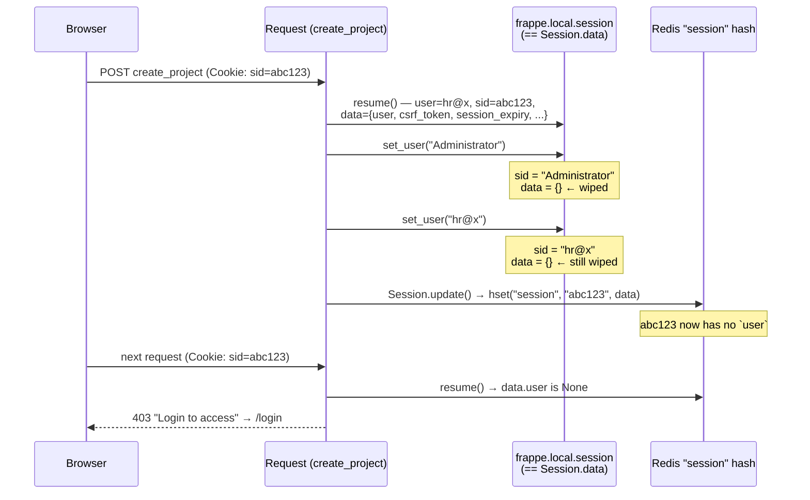
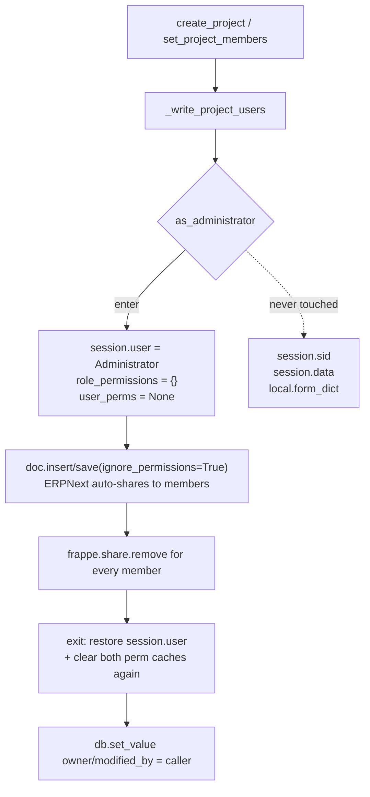
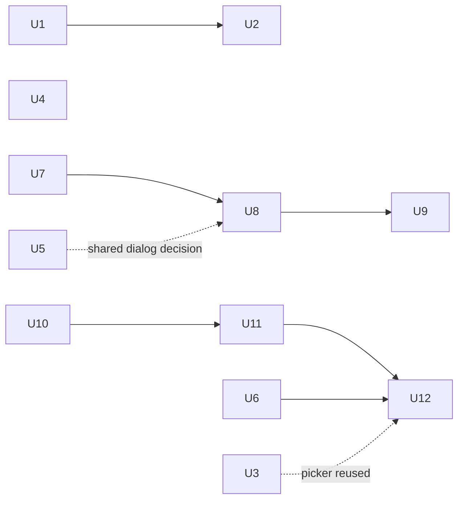

# fix: Session corruption on project writes, plus HR control gaps across the portal

## Summary

One verified defect and eight control gaps, reported together after using the portal
as an HR Manager and as an employee.

The defect is the important one: creating a project or assigning someone to a project
logs the caller out. It is not intermittent and it is not a session-timeout — the
write itself destroys the caller's server-side session record. The fix is one unit
with no dependencies and ships on its own.

The remaining work gives HR the controls the portal currently forces them into Desk
for: more fields on project creation, editable shift / approvers / joining / overview
on the person view, an "Open in Desk" escape hatch on every Settings section, a
portal-authored birthday and work-anniversary email with recipient selection, and a
less crowded Leave Type editor. Two employee-facing timesheet defects ride along —
a member search that does not match what its own placeholder promises, and a note
field that takes two clicks to focus and has no visible border.

---

## Problem Frame

### The defect (P8-R1)

`helixhr/api.py:6951` `_write_project_users` escalates to Administrator so ERPNext's
`Project.control_access_for_project_users` auto-share can run:

```python
caller = frappe.session.user
frappe.set_user("Administrator")
try:
    ...
finally:
    frappe.set_user(caller)
```

Frappe's `set_user` (`frappe/__init__.py:382`) is not a scoped identity swap. It
mutates `frappe.local.session` **in place**:

```python
local.session.user = username
local.session.sid  = username      # <-- clobbers the session id
local.session.data = _dict()       # <-- wipes user, csrf_token, session_expiry, creation
local.form_dict    = _dict()
```

And `frappe.local.session` *is* `Session.data` — `Session.__init__` assigns
`frappe.local.session = self.data` (`frappe/sessions.py`). So the mutation lands on
the live session object. At the end of the request `Session.update()` writes it back:

```python
frappe.cache.hset("session", self.sid, self.data)
```

`self.sid` (the `Session` slot) still holds the real sid, so the **real** cache entry
is overwritten with the gutted payload. The DB row escapes only by accident — the
`UPDATE ... WHERE sid = self.data["sid"]` now matches the caller's *email address*
and updates nothing — but Redis is read first.

On the next request `Session.resume()` → `get_session_data_from_cache()` returns the
inner `data` dict, which no longer has a `user` key, so:

```python
self.data.update({"data": data, "user": data.user, "sid": self.sid})   # user = None
```

The session resumes with no user. The portal's next call fails, `lib/api.js` matches
the "login to access" phrase, and the browser is sent to `/login`. That is the logout.

Both reported symptoms are this one bug: `_write_project_users` is called from
`create_project` (api.py:7056) and from `set_project_members` (api.py:7188) — "add a
project" and "add an employee to a project".

### The control gaps

| # | Gap | Where it is today |
|---|---|---|
| P8-R2 | Project creation asks only for name and billable | `Projects.vue` create form; `create_project` |
| P8-R3 | Person view is read-only — no shift, approvers, joining or overview edits | `get_person` (P6-R3, deliberate) |
| P8-R4 | Only the person view offers "Open in Desk"; Settings sections do not | `People.vue:108`; `Settings.vue` |
| P8-R5 | Celebration email copy is only editable in Desk, as an Email Template | `reminders.py`; HR Settings custom fields |
| P8-R6 | Celebration recipients are always "whole company minus celebrants" | `_send_company` |
| P8-R7 | Leave Type edit form is crowded and unanchored | `LeaveTypesSection.vue` |
| P8-R8 | Project member search promises matches it cannot make | `get_directory` vs. the field placeholder |
| P8-R9 | Timesheet note needs two clicks and has no visible border | `WeekGrid.vue:467` |

---

## Requirements

| ID | Requirement | Units |
|---|---|---|
| P8-R1 | A project write must never damage the caller's session. | U1 |
| P8-R2 | Project creation in the portal accepts name, priority and project type; company stays server-derived and is shown, not asked for. | U2 |
| P8-R3 | HR can edit a person's overview, joining details, approvers and default shift from the portal, within their existing admin scope. | U7, U8, U9 |
| P8-R4 | Every Settings section offers a server-built Desk link, drawn only for a caller who can actually reach Desk. | U6 |
| P8-R5 | HR authors the birthday and work-anniversary email subject and body from the portal; HRMS's own Desk switches cannot be turned on behind their back. | U10, U11, U12 |
| P8-R6 | Each celebration event sends either to the whole company or to an explicit employee list HR maintains. | U10, U11, U12 |
| P8-R7 | The Leave Type editor reads as one focused task, not a stack of checkboxes under a list. | U5 |
| P8-R8 | The project member picker matches what its own affordance promises, and says so when nothing matches. | U3 |
| P8-R9 | Opening a timesheet note puts the cursor in it, and the note field is visibly a field. | U4 |

---

## Key Technical Decisions

### KTD1 — Replace `frappe.set_user` with a narrow, restoring escalation helper

`frappe.set_user` is the wrong tool for a scoped privilege swap: it is built for CLI
and background contexts where there is no live session to damage. A new
`as_administrator()` context manager in `helixhr/utils.py` changes only
`frappe.local.session.user` and the two permission caches
(`frappe.local.role_permissions`, `frappe.local.user_perms`), restoring both on exit.
It never touches `session.sid`, `session.data` or `form_dict`.

The escalation itself stays, because there is no way to avoid it:
`frappe.share.add_docshare` only honours `flags={"ignore_share_permission": True}`
passed by its own caller, and ERPNext's `control_access_for_project_users` passes no
flags. **Upgrade path:** if ERPNext ever grows a flag or hook on that side effect,
drop the escalation entirely — the app deletes the resulting `DocShare` rows
immediately anyway.

*Rejected:* granting the caller `share` DocPerm on Project (widens every Delivery
Manager's standing permissions for the sake of one internal side effect);
monkeypatching ERPNext (AGENTS.md forbids touching core, and a patch is invisible at
the call site); inserting with an empty `users` table then writing child rows via
`db_insert` (skips child-table validation, and `set_project_members` still needs the
save path).

### KTD2 — `company` stays server-derived on project creation

Desk asks for Company; the portal must not. `create_project`'s docstring already
names this as a security boundary — the company comes from the caller's own Employee
record so a request body cannot steer which company a project lands in. The form
gains a read-only line naming the company the project will be created in, which
answers the same question without reopening the boundary.

### KTD3 — One `save_person` endpoint, four allow-lists, no new authorisation logic

The person-view writes reuse the existing gate exactly as the reads do:
`resolve_admin_scope` + `employee_in_admin_scope`, then `_apply_allowed_fields` with
a per-group allow-list, then `doc.save()` (not `ignore_permissions`) so Frappe's own
Employee permissions and ERPNext's own `Employee.validate` — the `reports_to` cycle
check, the joining/relieving date rules — still run. No field above permlevel 0 is
ever in an allow-list.

This reverses P6-R3 ("read-only… a faster route to what HR already reaches in Desk,
never a wider one"). That was the right call when the person view was a lookup
surface; it is being changed deliberately, and the scope helper means the write
surface is exactly as wide as the read surface already is.

### KTD4 — "Shift" means `Employee.default_shift`, not a Shift Assignment

HRMS models a shift change two ways: `Employee.default_shift` (a Link to Shift Type,
a plain permlevel-0 custom field) and dated `Shift Assignment` documents. The portal
sets `default_shift` only. `get_employee_shift` — the function this app's own
`_request_shift` already depends on — falls back to `default_shift`, so the change is
immediately visible everywhere the portal resolves a shift. A *dated* shift change is
scheduling work with its own overlap rules, and HR has the Desk link for it.

### KTD5 — Approvers are picked as people, resolved to users

`leave_approver`, `expense_approver` and `shift_request_approver` are Link-to-User
fields. The portal's surface is people, never logins — so the picker lists employees
and the endpoint resolves each to `Employee.user_id`, refusing with a named error
when the chosen person has no linked user. This is the same rule
`set_project_members` already applies, quoted rather than reinvented.

### KTD6 — Celebration reminders move to their own DocType

A per-event recipient list needs a child table, which HR Settings custom fields
cannot carry without stuffing JSON into a Small Text. A new
`HelixHR Celebration Reminder` DocType — one row per event, autonamed on `event` —
holds `email_template`, `is_enabled`, `recipient_mode` and a `recipients` child
table. The two existing HR Settings custom fields are superseded and carried across
by a patch.

*Rejected:* HR Settings custom fields plus a serialised employee list (unqueryable,
no referential integrity, and nothing stops it drifting as people leave).

### KTD7 — The portal edits the Email Template, and renders it with restricted globals

Keeping `Email Template` means HR's body is Jinja, evaluated server-side. Frappe's
`render_template` is sandboxed (`FrappeSandboxedEnvironment`), but the default global
set from `get_safe_globals()` still exposes `frappe.db.get_value`, `frappe.get_doc`
and friends — so an HR Manager authoring a template could read any record on the
site. `reminders.py` therefore renders with `restrict_globals=True`, which swaps in
`render_safe_globals()` instead.

This is a real widening of what an HR Manager can do, accepted because it is what was
asked for. The alternative — reusing the existing `HelixHR Message Template` pattern,
which is plain token substitution and never executes anything (P5-R15, P5-KTD11) —
would have been the safer engine, and remains the upgrade path if the Jinja surface
turns out to be more than HR needs.

### KTD8 — HRMS's own celebration checkboxes become read-only, not merely refused

`events.hr_settings_validate` already refuses a save that would turn HRMS's senders
on alongside HelixHR's. A Property Setter fixture making
`send_birthday_reminders` and `send_work_anniversary_reminders` read-only on the HR
Settings form turns a refusal-on-save into an affordance that is never offered —
which is what "disable it from Frappe desk because it doesn't look good" asks for.

---

## High-Level Technical Design

### The session defect, as it happens now



### The escalation boundary after U1



*Directional guidance for review, not implementation specification.*

---

## Implementation Units

### Phase 1 — Stop the session damage

### U1. Scope the Administrator escalation so it cannot damage the caller's session

**Goal:** Creating a project, or assigning anyone to one, leaves the caller signed in.

**Requirements:** P8-R1

**Dependencies:** none. Lands and deploys on its own.

**Files:**
- `helixhr/utils.py` — add `as_administrator()` context manager
- `helixhr/api.py` — `_write_project_users` uses it instead of `frappe.set_user`
- `helixhr/tests/test_projects.py` — session-integrity coverage

**Approach:** A `@contextmanager` that captures `frappe.local.session.user`, sets it
to `"Administrator"`, resets `frappe.local.role_permissions` and
`frappe.local.user_perms` (and `frappe.local.cache`, which `set_user` also clears and
which can hold user-scoped entries), then restores the original user and resets the
same caches again in `finally`. It must not read or write `session.sid`,
`session.data` or `frappe.local.form_dict`.

The helper's docstring carries KTD1's reasoning, including why the escalation itself
cannot yet be removed — a future reader will otherwise assume it is gratuitous and
delete it, reintroducing the `share`-permission failure the escalation exists for.

`_write_project_users`'s existing docstring keeps its explanation of *why* it
escalates and gains a sentence on *how*, pointing at the helper.

**Patterns to follow:** `helixhr/utils.py`'s existing module-level helpers with
long-form rationale docstrings (`rate_limit_per_user`).

**Test scenarios:**
- `create_project` as an HR Manager: after the call, `frappe.local.session.sid` is
  unchanged, `frappe.local.session.data` still carries the keys it had before
  (`user`, `csrf_token` where present, `session_expiry`), and
  `frappe.local.session.user` is the caller.
- `set_project_members` as a Delivery Manager: same three assertions.
- Regression, the actual symptom: with a real `Session` object in play, call
  `create_project`, run `Session.update(force=True)`, then read back
  `frappe.cache.hget("session", sid)` and assert `data["data"]["user"]` is the caller
  — this is the assertion that fails on `main`.
- `frappe.local.form_dict` is unchanged across the call.
- The caller is restored even when the inner write raises: force
  `doc.insert` to raise, assert the exception propagates *and*
  `frappe.session.user` is the caller, not Administrator.
- Existing behaviour preserved: the created Project's `owner` is the caller, and no
  `DocShare` row survives for any member named in `users`.
- Nested use is not introduced by this unit, but assert the helper restores to the
  *captured* user rather than to a hardcoded value, so a future nested caller is safe.

**Verification:** `bench --site test_site run-tests --app helixhr --module helixhr.tests.test_projects`
passes; manually creating a project in the portal and then navigating to another page
does not redirect to `/login`.

---

### Phase 2 — Project and timesheet fixes

### U2. Project creation accepts priority and project type, and names the company

**Goal:** The portal's create form asks for what Desk asks for, minus the field the
server must decide itself.

**Requirements:** P8-R2

**Dependencies:** U1 (the create path must be safe before it is widened)

**Files:**
- `helixhr/api.py` — `create_project` accepts `priority` and `project_type`;
  `search_projects` returns the option lists and the caller's company
- `frontend/src/pages/Projects.vue` — create form fields
- `helixhr/tests/test_projects.py`
- `frontend/tests/e2e/projects.spec.ts`

**Approach:** `create_project` gains two named parameters, both optional and both
allow-listed rather than swept in from `**kwargs` — `priority` validated against
`Project`'s own Select options by the doctype's `validate()` (not re-listed here, so
the two cannot drift), `project_type` a Link to `Project Type`. `company` keeps its
current derivation and its current docstring.

`search_projects`'s response grows `project_types` (from `frappe.get_all`) and
`company` (the caller's own, or `None` for the unscoped Desk-only persona), so the
page that hosts the create form needs no second request. Priority options come from
the doctype meta rather than being hardcoded in the Vue file.

The form shows the company as static text — "This project will be created in
&lt;Company&gt;" — not as an input.

**Test scenarios:**
- Creating with `priority="High"` and a valid `project_type` persists both and
  returns them in the projection.
- Creating with neither leaves ERPNext's own defaults in place (unchanged from today).
- An invalid `priority` is refused by the doctype's own validation, surfaced as a
  message the form can show.
- A `project_type` that does not exist is refused.
- A `company` in the request body is still ignored — the created Project's company is
  the caller's own. (Regression guard on KTD2.)
- `search_projects` returns `project_types` and `company`; for the Desk-only persona
  with no Employee record, `company` is `None` and the form says so instead of
  offering Create.
- e2e: fill name + priority + type, submit, land on the project page with all three
  rendered.

**Verification:** a project created from the portal opens in Desk with priority and
type set, and in the company the creator belongs to.

---

### U3. Make the project member picker match what it promises

**Goal:** Typing an employee number or a work email into "Add a person" finds the
person, and an empty result says so.

**Requirements:** P8-R8

**Dependencies:** none

**Files:**
- `helixhr/api.py` — `get_directory` `or_filters`
- `frontend/src/pages/Projects.vue` — picker states
- `helixhr/tests/test_directory.py`
- `frontend/tests/e2e/projects.spec.ts`

**Approach:** Four defects, one affordance:

1. The field's placeholder reads "Name, employee number or work email" but
   `get_directory`'s `or_filters` (api.py:6348) match `employee_name`, `designation`
   and `department` only. Add `name` (the employee id) and `company_email`, and drop
   `designation`/`department` from the *picker's* path — or keep them and correct the
   placeholder. Pick one and make the two agree; the `or_filters` change is shared
   with Directory.vue, so widening is the lower-risk half and the placeholder on the
   Directory page should be checked against the same list.
2. A one-character query silently returns an unfiltered page:
   `_DIRECTORY_QUERY_MIN` is 2, and below it no filter is applied at all. The picker
   must not show unfiltered results as if they were matches — either hold the
   dropdown closed below the minimum with a hint, or pass the minimum to the client
   in the response.
3. `@focus="memberResults.reload()"` re-runs with whatever `memberSearch` last held,
   which after `addMember` clears `memberQuery` is a stale needle.
4. `memberMatches` filters already-assigned people *after* the server's `limit: 8`,
   so a project with eight assigned members can show an empty dropdown while matches
   exist. Raise the limit and filter, or exclude server-side.

The dropdown gains a loading state and a "Nobody matches that" row. Today it simply
does not render, which is indistinguishable from a broken search — and is most of
what "not working properly" means here.

**Patterns to follow:** `People.vue`'s search debounce and `AsyncState`'s empty-region
wording.

**Test scenarios:**
- `get_directory(query=<employee id>)` returns that employee.
- `get_directory(query=<work email>)` returns that employee.
- `get_directory(query=<partial name>)` still returns them (no regression).
- A one-character query returns no *filtered* claim — assert the contract the
  frontend relies on, whatever shape U3 lands on.
- Cross-company isolation is unchanged: an employee id from another company returns
  nothing.
- Picker, e2e: type a work email, see one match, click it, see the person in the
  member list.
- Picker, e2e: type a string matching nobody, see the "Nobody matches that" row
  rather than a vanished dropdown.
- Picker: with eight members already assigned, searching a ninth person still shows
  them.
- Picker: after adding someone, focusing the field again does not re-show the
  previous query's results.

---

### U4. Timesheet note: focus on open, and make it look like a field

**Goal:** One click on "+ note" puts the cursor in the note. The note input is
visibly an input.

**Requirements:** P8-R9

**Dependencies:** none

**Files:**
- `frontend/src/components/WeekGrid.vue`
- `frontend/tests/e2e/timesheet.spec.ts`

**Approach:** `openNote` (WeekGrid.vue:143) flips a reactive flag and stops; the input
renders on the next tick with nothing focused, so the person clicks twice. Set the
flag, then `nextTick()` and focus the newly rendered input — a template ref keyed by
`noteKey(line, iso)`, or a `ref` callback that focuses on mount when the key matches
the one just opened.

The visual pass is the second half and is what the screenshot is about. The input is
`border-0 bg-transparent` (WeekGrid.vue:469) — against the row background it reads as
loose italic text, not a field, and there is no way to tell a typed note from a saved
one. Give it a real resting border and a focus ring consistent with the hours input
beside it, and keep the italic only for the read-only rendering at line 485.

While here: the phone layout's note input (line 240) has the same `bg-transparent`
treatment and should move with it, so the two layouts do not diverge.

**Patterns to follow:** the hours `<input>` in the same cell — it already has the
border, ring and sizing treatment the note should match. Reuse its classes rather
than inventing a second input style.

**Test scenarios:**
- e2e: click "+ note" on an empty day, type immediately without clicking again, and
  assert the text lands in that day's note.
- e2e: the note persists through save and reload on the correct date.
- e2e: opening a note on one day does not open it on any other day or row.
- e2e: a day that already has a note renders the input open, as today.
- Visual: the note input has a non-transparent border at rest (assert the computed
  class or a screenshot diff, whichever the repo's e2e suite already does).
- Read-only week: no "+ note" button and no input; the saved note still renders.
- Accessibility: the note input keeps its `aria-label`, and focus is not stolen when
  the grid re-renders for an unrelated reason.

---

### U5. Declutter the Leave Type editor

**Goal:** Editing a leave type reads as one focused task.

**Requirements:** P8-R7

**Dependencies:** none

**Files:**
- `frontend/src/components/settings/LeaveTypesSection.vue`
- `frontend/tests/e2e/settings.spec.ts`

**Approach:** The form renders *below* the whole list (LeaveTypesSection.vue:118),
so on a site with a dozen leave types the person clicks Edit and the form is
off-screen, with nothing indicating which row it belongs to. Five controls stack
vertically, three of them checkboxes with sentence-long labels.

Move the editor into a modal dialog titled with the leave type being edited. Group
the three flags under a "Rules" subheading and shorten the labels, keeping the full
sentence as help text rather than as the label itself. The `Name` field stays
disabled on edit, as today.

Check whether the portal already has a dialog pattern before introducing one —
`AttendanceRequestSheet.vue` and `CheckInSheet.vue` are the existing sheet/dialog
components and `lib/dialogA11y.js` already exists for focus trapping. Reuse, do not
add a component.

**Patterns to follow:** `frontend/src/lib/dialogA11y.js`; whichever of
`AttendanceRequestSheet.vue` / `CheckInSheet.vue` is the closer fit.

**Test scenarios:**
- e2e: click Edit on the last leave type in a long list; the editor is visible without
  scrolling and names that leave type.
- e2e: edit a name-disabled field — it stays disabled on edit, enabled on create.
- e2e: save a change and see it reflected in the row.
- e2e: cancel discards the change.
- e2e: Escape closes the dialog and focus returns to the Edit button that opened it.
- e2e: a save failure renders the error inside the dialog, not behind it.
- The `data-testid` hooks (`settings-leave-type-form`, `settings-leave-type-row`) are
  preserved so existing specs keep working.

---

### Phase 3 — Desk links

### U6. An "Open in Desk" link on every Settings section

**Goal:** HR reaches the full Desk form for whatever they are configuring, in one
click, from the section they are already on.

**Requirements:** P8-R4

**Dependencies:** none

**Files:**
- `helixhr/api.py` — `get_portal_config` returns `desk_urls`
- `frontend/src/pages/Settings.vue` — render the link for the active section
- `helixhr/tests/test_settings.py`
- `frontend/tests/e2e/settings.spec.ts`

**Approach:** `get_portal_config` gains a `desk_urls` map — one entry per settings
section, built with Frappe's own `get_url_to_list` (never a hand-concatenated Desk
path, P6-KTD3) — and returns `None` for the whole map when `_can_open_desk` is false.
That mirrors exactly what `get_person` already does with its single `desk_url`
(api.py:6778): the server decides, the frontend is never trusted to hide it.

Sections and their targets: Categories → `HelixHR Request Category`, Message text →
`HelixHR Message Template`, Leave types → `Leave Type`, Holiday lists →
`Holiday List`, Shift types → `Shift Type`. U12 adds Celebrations → `Email Template`.

The link renders in the section header, reusing the exact anchor markup from
`People.vue:108-116` — same classes, same `target="_blank" rel="noopener noreferrer"`.
If that markup is about to exist in three places, extract it to a small
`DeskLink.vue`; at two, leave it inline.

**Test scenarios:**
- `get_portal_config` as a System User HR Manager returns a `desk_urls` entry per
  section, each an absolute URL produced by Frappe's helper.
- `get_portal_config` as a Website User holding HR Manager returns no `desk_urls` —
  the role does not make Desk load for them (`_can_open_desk`'s own rule).
- A non-HR caller is still refused the whole method, unchanged.
- e2e as HR Manager: each of the five tabs shows an "Open in Desk" link pointing at
  the matching list view.
- e2e: the link opens in a new tab and carries `rel="noopener noreferrer"`.

---

### Phase 4 — HR edits on the person view

### U7. `save_person`: the scoped Employee write

**Goal:** One endpoint HR's person-view edits go through, no wider than the read.

**Requirements:** P8-R3

**Dependencies:** none (U8 and U9 depend on this)

**Files:**
- `helixhr/api.py` — `save_person`, `get_person_form_options`, field allow-lists
- `helixhr/utils.py` — `PERSON_EDITABLE_FIELDS` groups
- `helixhr/tests/test_people.py`

**Approach:** `save_person(employee, **fields)` runs `rate_limit_per_user`, then
`resolve_admin_scope` + `employee_in_admin_scope` — refusing with the same
"You are not authorised to view this person." wording `get_person` uses, so the
refusal never discloses whether the employee exists — then `_apply_allowed_fields`
against a module-level allow-list, then `doc.save()`.

The allow-list, all permlevel 0, all verified against ERPNext's `employee.json` and
HRMS's `setup.py` custom fields:

- **overview:** `designation`, `department`, `branch`, `company_email`
- **joining:** `date_of_joining`, `employment_type`, `grade`,
  `scheduled_confirmation_date`, `final_confirmation_date`, `status`
- **approvers:** `reports_to`, `leave_approver`, `expense_approver`,
  `shift_request_approver`
- **shift:** `default_shift`, `holiday_list`

The three approver fields are Link-to-User. The endpoint accepts *employee ids* and
resolves each to `Employee.user_id`, refusing by name when the chosen person has no
linked user — the rule `set_project_members` already applies (KTD5), quoted from
there rather than rewritten.

`doc.save()` rather than `ignore_permissions=True`: Employee's own `validate` carries
rules this endpoint must not skip (the `reports_to` cycle check, the joining-date
rules, the `status`/relieving-date interaction), and Frappe's Employee permissions
remain a second gate under the scope helper.

`get_person_form_options(employee)` returns the Link options each picker needs —
Designation, Department, Branch, Employment Type, Employee Grade, Shift Type, Holiday
List, plus a scoped employee list for `reports_to` and the three approvers — all
filtered to the caller's admin scope and to the target's company. One read, so the
edit UI needs no request per picker.

**Execution note:** implement test-first. This is a new write surface on Employee
reached by a role that previously had read-only access; the refusal cases are the
point of the unit, not a follow-up to it.

**Test scenarios:**
- HR Manager edits a person in their own company: each allow-listed field persists.
- HR Manager edits a person in *another* company: refused with the scope wording,
  and nothing is written.
- A caller with `scope["kind"] == "none"` is refused.
- A field outside the allow-list (`ctc`, `salary_mode`, any permlevel-1 field) passed
  in `**fields` is silently ignored and unchanged on the record — assert the stored
  value, not just the absence of an error.
- `reports_to` pointing at the employee themselves is refused by ERPNext's own cycle
  validation, surfaced as a message.
- An approver employee with no `user_id` is refused, naming that person.
- An approver employee outside the caller's scope is refused.
- `status` set to `Left` without a relieving date behaves exactly as Desk does
  (assert the same outcome, whichever it is — this endpoint must not diverge).
- `date_of_joining` cleared: refused, it is a mandatory field.
- Rate limiting: `save_person` has an entry in `RATE_LIMIT_POLICY` and is enforced.
- `get_person_form_options` returns options scoped to the caller; an HR Manager does
  not see another company's Departments.
- `get_person_form_options` is refused for a caller outside admin scope.

---

### U8. Person view: edit overview and joining details

**Goal:** HR changes designation, department, branch, work email, joining date,
employment type, grade, confirmation dates and status without leaving the portal.

**Requirements:** P8-R3

**Dependencies:** U7

**Files:**
- `frontend/src/pages/People.vue`
- `frontend/tests/e2e/people.spec.ts`

**Approach:** The two read-only cards become editable in place behind an Edit button
per card, saving through `save_person`. Reuse U5's dialog decision — if the Leave
Type editor became a dialog, these should be dialogs too, so Settings and People do
not diverge on how an edit feels.

`get_person` must return the fields the edit form binds to. `_person_profile`
(api.py:6475) currently selects eight; it needs the full overview and joining sets.
Extend its field list, not a second reader.

On success, refresh from the response rather than reloading the whole person view —
`get_person` fans out across six sections and a full reload for a one-field edit is
wasteful. Have `save_person` return the updated profile projection.

**Test scenarios:**
- e2e: edit designation, save, see the new value in the card and in the page header
  subtitle without a reload.
- e2e: edit joining date, save, see it reformatted through `formatDate`.
- e2e: set status to `Inactive` and see the status chip change.
- e2e: a server refusal (out-of-scope person) renders the message in the form, and
  the card keeps its original values.
- e2e: cancel restores the original values.
- e2e: a caller whose `desk_url` is absent (Website User) still gets the edit
  affordance — Desk access and edit capability are different questions.
- e2e: the failed-section banner behaviour (`sectionFailed`) is unchanged when the
  employee section itself fails to load — no edit button on a section that did not
  load.

---

### U9. Person view: edit approvers and default shift

**Goal:** HR sets the reporting manager, the three approvers and the default shift
from the person view.

**Requirements:** P8-R3

**Dependencies:** U7, U8 (shares the edit affordance U8 establishes)

**Files:**
- `frontend/src/pages/People.vue`
- `helixhr/api.py` — `get_person` returns current approvers and `default_shift`
- `frontend/tests/e2e/people.spec.ts`

**Approach:** A new "Approvers and shift" card. `get_person` already returns `shift`
(the *resolved* shift for today, via `_request_shift`) and `holiday_list`; neither is
the editable value. The card must show both — the resolved shift is what actually
applies, `default_shift` is what HR can set — and must not let them be confused. Show
`default_shift` as the editable field and the resolved shift as context beside it
when the two differ, with a line explaining that a dated Shift Assignment overrides
the default (and the Desk link for making one).

The four person pickers (reports_to and three approvers) all read from
`get_person_form_options`'s scoped employee list. An approver may be cleared.

**Test scenarios:**
- e2e: set a reporting manager, save, see the manager name in the card.
- e2e: clear an approver, save, see it empty.
- e2e: pick a person with no linked user as leave approver — the named refusal renders
  in the form.
- e2e: set `default_shift`, save, and see it reflected; where a dated Shift Assignment
  exists for today, the resolved shift still shows the assignment's shift and the
  explanatory line is present.
- e2e: with no Shift Assignment in play, resolved shift and default shift agree and
  the explanatory line is absent.
- e2e: the reports_to picker does not offer employees outside the caller's scope.
- e2e: setting the person as their own manager surfaces the cycle refusal.

---

### Phase 5 — Celebration reminders from the portal

### U10. `HelixHR Celebration Reminder` DocType and the migration off HR Settings

**Goal:** One record per celebration event, holding the template, the enable switch,
the recipient mode and the recipient list.

**Requirements:** P8-R5, P8-R6

**Dependencies:** none

**Files:**
- `helixhr/helixhr/doctype/helixhr_celebration_reminder/` — DocType, controller, test
- `helixhr/helixhr/doctype/helixhr_celebration_recipient/` — child table
- `helixhr/patches/` + `helixhr/patches.txt` — carry the two HR Settings fields across
- `helixhr/fixtures/` — Property Setters making HRMS's two checkboxes read-only (KTD8)
- `helixhr/events.py` — `hr_settings_validate` reads the new records
- `helixhr/preflight.py` — `check_celebration_reminders` reads the new records
- `helixhr/tests/test_reminders.py`

**Approach:** Autonamed on `event` (`birthday`, `work_anniversary`), so the two rows
are addressable by the same keys `reminders.EVENTS` already uses — `EVENTS` stays the
single source of the event vocabulary and gains the DocType name, losing
`template_field`. Fields: `event` (Select, read-only after insert), `email_template`
(Link, Email Template), `is_enabled` (Check), `recipient_mode` (Select: "All
employees" / "Selected employees"), `recipients` (Table, child rows linking Employee).

The patch reads `HR Settings.helixhr_birthday_template` and
`helixhr_anniversary_template`, creates the two records with
`recipient_mode = "All employees"` (today's behaviour) and `is_enabled` set from
whether a template was picked, then leaves the custom fields in place but unused —
removing them is a separate, later cleanup with its own patch, and this one must be
safely re-runnable.

`hr_settings_validate` and `check_celebration_reminders` currently quote
`EVENTS[...]["template_field"]`; both move to reading the new records. Their refusal
and preflight wording must keep naming something HR can act on — now the portal
Settings tab rather than an HR Settings field.

The Property Setter fixtures are the KTD8 half: `read_only: 1` on HRMS's
`send_birthday_reminders` and `send_work_anniversary_reminders`. Note in the fixture
comment that this is a Desk-form affordance change only —
`events.hr_settings_validate` remains the enforcement, because a Property Setter does
not stop a programmatic write.

**Test scenarios:**
- Patch on a site with both HR Settings templates set: two records created, templates
  carried, mode "All employees", enabled.
- Patch on a site with neither set: two records created, disabled, no template.
- Patch run twice: no duplicates, no overwrite of a record edited since the first run.
- `event` cannot be changed after insert.
- `recipient_mode = "Selected employees"` with an empty `recipients` table is refused
  by the controller's `validate` — an enabled reminder that can reach nobody is a
  misconfiguration, not a valid state.
- `recipient_mode = "All employees"` with rows in `recipients`: rows are ignored, not
  refused (HR may be switching modes back and forth).
- A `recipients` row naming a non-existent or inactive Employee is refused.
- `hr_settings_validate` still refuses enabling HRMS's birthday sender while
  HelixHR's birthday reminder is enabled, and the message names the portal tab.
- `hr_settings_validate` allows enabling HRMS's sender when HelixHR's is disabled.
- `preflight.check_celebration_reminders` FAILs when an enabled reminder points at a
  missing Email Template, PASSes otherwise.

---

### U11. Rewire the sender: recipient selection and restricted rendering

**Goal:** The daily job reads the new records, honours the recipient mode, and
renders HR's template without handing it the full Frappe globals.

**Requirements:** P8-R5, P8-R6

**Dependencies:** U10

**Files:**
- `helixhr/reminders.py`
- `helixhr/tests/test_reminders.py`
- `docs/deployment.md` — the template context contract and the recipient rules

**Approach:** `send_celebration_reminders` iterates the two records instead of the two
HR Settings fields, skipping any that are disabled or have no template.

`_send_company` (reminders.py:159) is where recipient mode lands. Today it is
`get_all_employee_emails(company) - celebrating`. For "Selected employees" it becomes
the configured employees' emails, intersected with that company, minus the
celebrating set — the exclusion of celebrants from their own announcement must hold
in both modes, and the "two people share a day, each hears about the other" branch
below it is unchanged in both.

Resolve each selected Employee's address with `get_employee_email`, the same HRMS
helper both sides of the existing set arithmetic use — P4-KTD12's rule is that
eligibility and addressing are HRMS's answer, never re-implemented here, and this
unit must not be where that drifts.

Rendering moves to `restrict_globals=True` (KTD7). `Email Template.get_formatted_email`
does not expose that parameter, so the render goes through `frappe.render_template`
directly against the template's `subject` and its body field — which body field
depends on `use_html`, exactly as `get_formatted_response` decides it. Keep that
branch; do not assume one.

**Execution note:** add a characterisation test for today's recipient set *before*
changing `_send_company` — the set arithmetic has two subtractions and a shared-day
branch, and the safest way to know the mode switch preserved "All employees" is to
have pinned it first.

**Test scenarios:**
- Mode "All employees": recipient set is byte-identical to today's, including the
  shared-day extra emails.
- Mode "Selected employees": only the configured people receive it.
- Mode "Selected employees" where a selected person is the one celebrating: they are
  excluded from the announcement, and still receive the shared-day email if someone
  else shares their date.
- Mode "Selected employees" with a person in another company: they are not mailed for
  this company's celebration.
- Mode "Selected employees" where every selected person is celebrating: no
  announcement is sent, and nothing raises.
- A disabled reminder sends nothing.
- An enabled reminder with a missing Email Template logs and continues to the other
  event (today's behaviour, preserved).
- A template whose body reads `frappe.db.get_value(...)` fails to render under
  restricted globals, the failure is logged per company, and the other event is
  unaffected. **This is the KTD7 assertion** — it must be a test, not a comment.
- A template using the documented context (`persons`, `names`, `count`, `company`,
  `logo_url`, `date`, `portal_url`) renders unchanged under restricted globals.
- Both `use_html` branches render.

---

### U12. Settings → Celebrations: author the email and pick who gets it

**Goal:** HR writes the birthday and anniversary email, and chooses its audience,
from the portal.

**Requirements:** P8-R5, P8-R6

**Dependencies:** U10, U11, U6 (the Desk link pattern)

**Files:**
- `helixhr/api.py` — `get_portal_config` returns celebration settings;
  `save_celebration_reminder`
- `frontend/src/components/settings/CelebrationsSection.vue`
- `frontend/src/pages/Settings.vue` — the new tab
- `helixhr/tests/test_settings.py`
- `frontend/tests/e2e/settings.spec.ts`

**Approach:** `get_portal_config` grows a `celebrations` key: the two reminder
records, each with its Email Template's `subject` and body, its recipient mode and
its recipient list resolved to employee names.

`save_celebration_reminder(event, subject, body, is_enabled, recipient_mode, recipients)`
writes both documents in one call — the Email Template (creating it, named
predictably per event, when the record has none yet) and the reminder record. It runs
`_assert_config_write` on both, exactly as the other config writes do.

The section renders one panel per event: enable switch, subject, body, recipient mode
radio, and — when "Selected employees" — an employee picker reusing U3's corrected
`get_directory` search. The documented template context is listed beside the body
field the way `TemplatesSection.vue` lists its `template_tokens`, so HR can see what
they may reference. A "Send a test to me" button is **out of scope** (see Deferred).

The tab gets U6's "Open in Desk" link, pointing at the Email Template list.

**Test scenarios:**
- `get_portal_config` returns both reminders with their template subject and body.
- `get_portal_config` returns them with `None` template content when no template is
  linked yet.
- `save_celebration_reminder` for an event with no template creates one and links it.
- `save_celebration_reminder` for an event with a template edits that template rather
  than creating a second.
- A non-HR caller is refused both methods.
- Saving `recipient_mode = "Selected employees"` with an empty list is refused, with
  the controller's message surfaced.
- Body containing a Jinja syntax error is refused at save time, not at 8am the next
  morning — validate by compiling the template on save.
- e2e: enable the birthday reminder, write a subject and body, save, reload the page
  and see them.
- e2e: switch to "Selected employees", add two people, save, reload, see both.
- e2e: switch back to "All employees" and the picker is hidden but the saved list is
  not silently destroyed.
- e2e: the Desk link is present for a System User and absent for a Website User.

---

## Scope Boundaries

### Deferred to Follow-Up Work

- **Removing the two superseded HR Settings custom fields.** U10's patch leaves them
  in place. A separate patch removes them once the new records are confirmed correct
  on every deployed site.
- **"Send a test celebration email to me."** The obvious next request once HR is
  authoring the copy, and genuinely useful — but it is a new send path with its own
  recipient rules, and U12 is already the largest UI unit here.
- **Dated Shift Assignment from the portal** (KTD4). The Desk link covers it.
- **Migrating celebration emails to `HelixHR Message Template`** (KTD7's upgrade
  path), if the Jinja surface proves wider than HR needs.
- **Extracting `DeskLink.vue`** if U6 leaves the anchor markup duplicated in only two
  places.

### Not in scope

- Accepting `company` from the request on project creation (KTD2 — a security
  boundary, not an oversight).
- Any change to HRMS's own celebration job beyond making its Desk switches read-only.
  P4-R20 stands: no HRMS file is touched.
- Widening the person view beyond permlevel 0. Salary, CTC and the rest stay in Desk.
- Editing Project after creation from the portal. The request was about the create
  form; a full project editor is its own piece of work.

---

## Risks

| Risk | Mitigation |
|---|---|
| U1's helper is later "simplified" back to `frappe.set_user`. | The regression test asserts the cached session payload directly, not just the in-request session object — the naive version fails it. The docstring says why. |
| U7 widens HR's write surface on Employee more than intended. | Explicit allow-lists, a test asserting an off-list field is *unchanged on the record*, and `doc.save()` rather than `ignore_permissions`. |
| KTD7's Jinja surface lets an HR Manager read arbitrary records. | `restrict_globals=True`, asserted by a test that a `frappe.db.get_value` template fails to render. Residual: HR Manager is already a trusted role, and the blast radius is read-only within the email body. |
| U10's patch runs against sites in different states. | Re-runnable, tested against both "templates set" and "nothing set", and it never overwrites a record edited after the first run. |
| U11 silently changes who gets today's email. | Characterisation test pinned before the change; "All employees" must be byte-identical. |
| U3's `or_filters` change also affects Directory.vue, which every employee uses. | The widening is additive (employee id and work email), cross-company isolation is unchanged and asserted, and the Directory placeholder is checked against the new list. |
| Local `test_site` drift masks a regression. | Per AGENTS.md and the fresh-site rule: the final run is on a recreated site with strict permissions, not the long-lived one. |

---

## Dependencies and Sequencing



U1 is the only unit with a deploy of its own. U3, U4, U5, U6, U7 and U10 have no
blocking predecessors and can run in any order after that.

---

## Open Questions

- **Shift Assignment vs. `default_shift` (KTD4).** If HR's actual need is "move this
  person to nights from Monday", `default_shift` is the wrong tool and U9 becomes a
  Shift Assignment editor. Worth confirming against one real case before building U9.
- **U3's filter direction.** Widening `get_directory`'s `or_filters` changes what
  every employee's Directory search matches, not just the picker's. If that is
  unwanted, the picker needs its own scoped search method instead — more code, less
  blast radius. Decide at implementation time with the Directory page in front of you.
- **U12's employee picker scope.** It reuses `get_directory`, which is the caller's
  own company. On a multi-company site an HR Manager configuring celebrations may
  need to pick people in a company they administer but do not belong to. Resolve when
  U12 starts; `get_person_form_options` from U7 may be the better source.

---

## Verification

Per `AGENTS.md`, all from the bench root inside `frappe_docker_dev-frappe-1`:

- `ruff check helixhr`
- `cd frontend && yarn lint`
- `bench --site test_site run-tests --app helixhr`
- `cd frontend && yarn test`
- `cd frontend && BASE_URL=http://localhost:8000 SITE_HOST=test_site yarn test:e2e -- --workers=1`
  (seed via `helixhr.tests.utils.setup_playwright_fixtures` first)
- `cd frontend && yarn build && bench --site test_site clear-cache`
- `bench --site <site> execute helixhr.preflight.run` — U10 and U11 change what
  `check_celebration_reminders` reads, so preflight is part of this plan's gate, not
  just its deploy.

Final run on a recreated site, not the long-lived local one.

---

## Sources

- `frappe/__init__.py:382` — `set_user`
- `frappe/sessions.py` — `Session.__init__`, `resume`, `update`,
  `get_session_data_from_cache`
- `frappe/utils/jinja.py:9,111` — `get_jenv(restrict_globals=)`, `render_template`
- `frappe/share.py:49` — `add_docshare` and its `ignore_share_permission` flag
- `erpnext/projects/doctype/project/project.py` — `control_access_for_project_users`
- `erpnext/setup/doctype/employee/employee.json`, `hrms/setup.py:183-270` — Employee
  field permlevels and HRMS's custom fields
