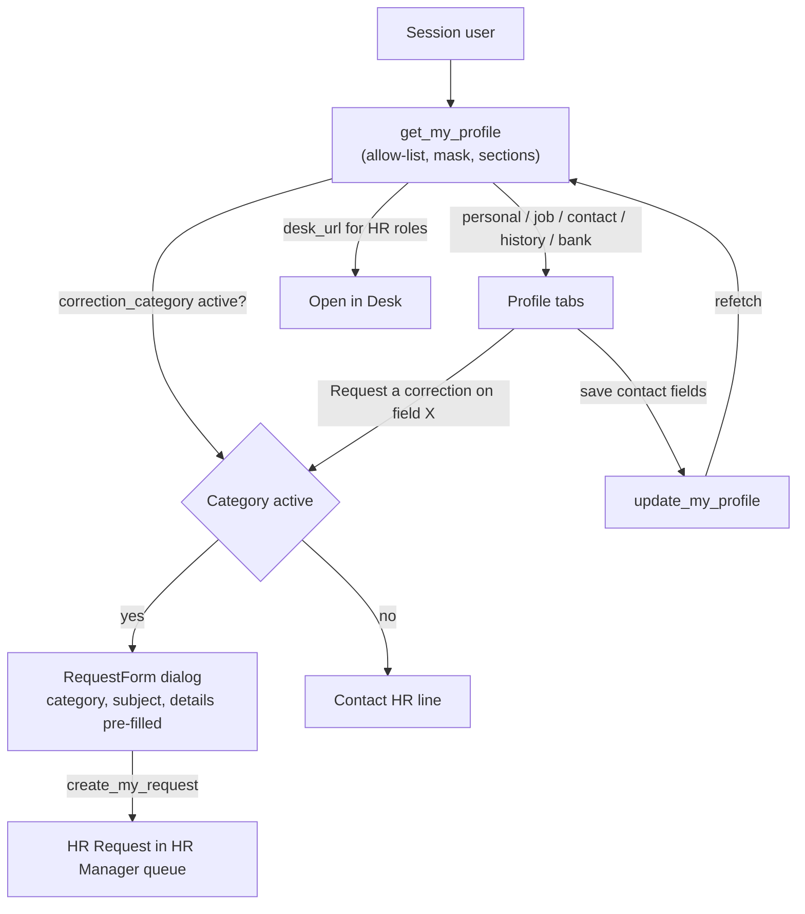

# feat: Tabbed employee profile with every HR-held detail and one-click correction requests

## Summary

Rebuild the portal Profile into five tabs — Personal, Job, Contact & Emergency, History, Bank & IDs — fed by one session-scoped server projection of the caller's own Employee record. Every tab offers "Request a correction", which files an HR Request in a new **Profile correction** category without leaving the page. Bank and ID numbers are masked on the server; salary and CTC stay off the page. HR and administrators get an "Open in Desk" link. The same change locks four regional payroll/ID fields that are currently employee-writable through Frappe's generic API.

---

## Problem Frame

An employee whose date of birth was wrong could not see it in the portal and only found it by opening Desk. Employees rarely go to Desk — for most, the portal host blocks it — so anything HR holds about them that the portal does not show is, in practice, invisible and uncorrectable. Today Profile shows eight read-only rows and seven editable contact fields; date of birth, job history, education, family background, bank and ID details are absent.

Research found two further problems the feature must not ignore:

- Profile reads the Employee through the generic `frappe.client.get` route, which `docs/architecture.md` lists as one of three generic routes the portal still depends on, and which silently drops permission-locked fields rather than erroring.
- On the dev site, `pan_number`, `ifsc_code`, `micr_code` and `provident_fund_account` (added by HRMS's India regional setup) carry no permlevel property setter, so they sit at level 0: any employee can overwrite their own PAN or IFSC through the raw API today.

---

## Requirements

**Visibility**
- R1. An employee sees, on the portal, every Employee detail in the allow-list below that HR has recorded about them, grouped into five tabs.
- R2. A field HR never filled shows "Not recorded"; a field that does not exist on this site is not shown at all; a section that failed to load says so and offers Retry.
- R3. Bank account, IBAN, PAN, passport, provident fund and health-insurance numbers reach the browser only as their last four characters.
- R4. Salary, CTC, salary currency, payroll cost center and advance accounts never appear.

**Corrections**
- R5. Every tab offers "Request a correction" for a chosen field, opening a request form pre-filled with the Profile correction category, a subject naming the field, and details carrying its label and displayed value.
- R6. For a masked field the form asks what is wrong in free text and says HR will verify against documents; it never asks the employee to type the full number.
- R7. When the Profile correction category is missing or inactive, correction actions are replaced by a plain "Contact HR" line, and preflight warns.

**Navigation and access**
- R8. Each tab is addressable (`/profile/<tab>`), survives refresh, and bare `/profile` opens Personal.
- R9. HR Manager, HR User, System Manager and Administrator see "Open in Desk" to the Employee form; nobody else does.
- R10. The existing self-edit of the seven contact fields keeps working and the tabs reflect a save without a reload.

**Integrity**
- R11. The four regional fields are locked at the HR-only level wherever they exist, and preflight fails on any other Employee data field left at level 0 outside the self-edit list.

---

## Scope Boundaries

- Profile stays self-only. HR viewing someone else already lives at `/people/:employee`; managers get nothing new.
- No new self-edit fields. Corrections go through HR; the editable set stays `PROFILE_EDITABLE_FIELDS`.
- Health details, exit fields (resignation, relieving, exit interview), biometric device id, job applicant link and `bio` are excluded.
- The photo stays the monogram; showing `Employee.image` raises private-file access questions not worth solving here.
- Site-only custom fields (the dev site's two SharePoint fields) are not rendered; preflight names them so HR can decide their level.

### Deferred to Follow-Up Work

- A per-field "correction pending" marker. It needs a field key on HR Request, which is a schema change plus a preflight permlevel-inventory update; subject-text matching is too brittle to ship.
- Multi-field corrections in one request. One field per request keeps the subject honest; the details box stays editable for anything else.
- An HR-configurable list of extra site custom fields to show on Profile.

---

## Field Inventory

The allow-list the projection returns. Optional fields render only where the field exists on the site (`pan_number` and friends come from HRMS's India regional setup and are absent elsewhere).

| Tab | Fields | Notes |
|---|---|---|
| Personal | salutation, first/middle/last name, employee number, gender, date of birth, marital status, blood group, date of joining, status | Date of birth and joining were the missing fields that started this |
| Job | Role: company, department, designation, grade, employment type, branch (shown as Location), reports to (name). Dates: final confirmation, contract end, notice days, retirement. Schedule: default shift, holiday list. Approvers: leave / expense / shift-request (names). Internal work history table | Approvers shown by person name, never login |
| Contact & Emergency | the seven self-edit fields (editable), company email, preferred contact email, current / permanent accommodation type | Existing save bar moves here |
| History | education table, external work history table, family background | Health details excluded |
| Bank & IDs | Bank: salary mode, bank name, bank account (masked), IFSC, MICR, IBAN (masked). Tax & IDs: PAN (masked), provident fund account (masked). Passport: number (masked), date of issue, valid until, place of issue. Insurance: provider, number (masked) | One-line note that numbers are masked; expired passport gets an "Expired" text badge |

---

## Key Technical Decisions

- KTD1. **One session-scoped projection replaces `frappe.client.get`.** Profile's generic read is dropped for a whitelisted `get_my_profile` that resolves the Employee from the session only, reads an explicit allow-list with `frappe.db.get_value`, and returns `_safe` sections plus `failed_sections` — the `get_person` / `get_dashboard` shape. Level-2 fields are HR-only by permission, so reading them for the owner is a deliberate projection; the allow-list and server-side masking are the whole boundary, and the tests prove it.
- KTD2. **Mask on the server, last four characters.** The full value never leaves Python. Values of four characters or fewer mask entirely. Unmasked non-numeric fields (IFSC, MICR, bank name) are shown as-is — they are routing identifiers, not secrets.
- KTD3. **Correction form opens in a dialog on Profile, not via a URL.** Reusing `RequestForm` in a dialog with a new initial-details prop keeps field values out of browser history and access logs, and keeps the employee on the page. The existing Requests deep-link (`?category=&subject=`) is left for other callers.
- KTD4. **Category seeded by a new insert-if-absent patch, routed to HR Manager.** Mirrors `seed_request_categories`; the applied patch is never edited. Also called from `after_install`, since `--install-app` marks patches done without running them. The projection reports whether the category is active so the page can fall back (R7).
- KTD5. **Tabs mirror Settings.** A fixed section list, a `/profile/:section(personal|job|contact|history|bank)` route named `ProfileSection`, `aria-current` tab buttons that wrap on narrow screens, one component per tab under `components/profile/`. No new tab library.
- KTD6. **Desk link decided on the server.** `desk_url` is `get_url_to_form("Employee", <caller's employee>)` when `_portal_desk_url` says the caller holds an HR/admin role, else null. `_portal_desk_url` supplies only the gate (it returns the Desk root); `_can_open_desk` alone would include every System User.
- KTD7. **Lock regional fields as fixture Property Setters.** Frappe applies a Property Setter only to a field of that name present in the meta and skips it silently otherwise (`frappe/model/meta.py` `apply_property_setters`; `PropertySetter.validate` never checks the field exists). So four permlevel-2 entries in `helixhr/fixtures/property_setter.json`, next to the existing Employee permlevel setters, lock the fields on every site — including one whose India setup adds them after install — with no patch. Preflight backstops anything else (R11).

---

## High-Level Technical Design

---

## Implementation Units

### U1. Lock regional payroll and ID fields

- **Goal:** No Employee data field outside the self-edit list is employee-writable on any site.
- **Requirements:** R11
- **Dependencies:** none
- **Files:** `helixhr/fixtures/property_setter.json`, `helixhr/preflight.py`, `helixhr/tests/test_employee_permlevel.py`, `helixhr/tests/test_preflight.py`
- **Approach:** Add four `Employee-<field>-permlevel` entries (value 2, module HelixHR) for `pan_number`, `ifsc_code`, `micr_code`, `provident_fund_account`, shaped like the existing Employee entries. New preflight check: every Employee value-holding field (any fieldtype but layout breaks) at effective permlevel 0 must be in `PROFILE_EDITABLE_FIELDS` or the reviewed exemption set — the nested-set fields `lft`, `rgt`, `old_parent`, which are what a fresh site actually leaves at level 0; anything else FAILs by name.
- **Patterns to follow:** existing Employee permlevel entries in `helixhr/fixtures/property_setter.json`; `check_it_team_role`'s reviewed-inventory check in `helixhr/preflight.py`.
- **Test scenarios:**
  - With the four fields created as Custom Fields in setUp (a fresh CI site has no Indian company, so they are absent by default) and removed in tearDown: each reads as permlevel 2 in the meta, and an employee's raw `frappe.client.set_value` on `pan_number` leaves the stored value unchanged.
  - On a site without the fields, the fixture imports and Employee meta loads without error.
  - Preflight passes on a clean site; adding a level-0 custom Data field to Employee makes it FAIL, naming the field.
- **Verification:** After migrate the dev site's four fields read as HR-only, and preflight names the two SharePoint fields for HR to decide.

### U2. Profile correction category

- **Goal:** A "Profile correction" category exists on every site, routed to HR Manager.
- **Requirements:** R5, R7
- **Dependencies:** none
- **Files:** `helixhr/patches/v1_0/seed_profile_correction_category.py` (new), `helixhr/patches.txt`, `helixhr/install.py`, `helixhr/preflight.py`, `helixhr/tests/test_request_categories.py` (or the existing category test module)
- **Approach:** Insert if absent with a hint such as "Wrong date of birth, name, bank or ID details" and route HR Manager; never overwrite HR's later edits. Preflight WARNs when the category is missing or inactive.
- **Patterns to follow:** `helixhr/patches/v1_0/seed_request_categories.py`; `check_request_category_routes`.
- **Test scenarios:**
  - A fresh site has the category active and routed to HR Manager.
  - HR renames the hint, and the patch re-run leaves it untouched.
  - HR deactivates it, and preflight WARNs.
- **Verification:** `create_my_request` accepts the category as an employee.

### U3. `get_my_profile` projection

- **Goal:** One read returns everything the tabs render, masked and allow-listed.
- **Requirements:** R1–R4, R7, R9
- **Dependencies:** U2
- **Files:** `helixhr/api.py`, `helixhr/utils.py` (allow-list constants, masked-field set, rate-limit entry), `helixhr/tests/test_api_profile.py`, `helixhr/tests/test_no_money_fields.py`
- **Approach:** Resolve the Employee from the session and ignore any argument (**kwargs dropped, like `get_dashboard`). Build five sections, each via `_safe`, from per-tab field tuples in `utils.py`; drop fields absent from the site's meta; resolve Link fields to display names (manager, approvers by person name); read each child table with `frappe.get_all` on its child doctype filtered by parent, using an explicit column tuple per table in `utils.py` — External Work History's `salary` column is never selected. Mask the masked set server-side. Return `correction_category` (name when active, else null) and `desk_url` (HR/admin set only). Add `get_my_profile` to `RATE_LIMIT_POLICY` at `(60, 60)`.
- **Patterns to follow:** `get_person` and `_person_profile` in `helixhr/api.py`; `_portal_desk_url`; `_safe` / `failed_sections` in `get_dashboard`.
- **Test scenarios:**
  - An employee gets their own date of birth, joining date, department and education rows.
  - Passing another employee's id as an argument still returns the caller's record.
  - The JSON-rendered response contains no full bank account, PAN or passport number, and contains their last four characters.
  - No `ctc`, `salary_currency`, `payroll_cost_center`, `employee_advance_account`, `health_details` or `salary` key appears anywhere in the response, child-table rows included (seed an external work history row with a salary).
  - On a site without `pan_number`, the Bank & IDs section omits it without error; with it created as a Custom Field in setUp, only its last four characters come back.
  - A field HR never filled comes back as null (the page renders "Not recorded").
  - A failing section appears in `failed_sections`, and the others still return.
  - `desk_url` is set for an HR Manager with an Employee record and null for a plain employee who is a System User.
  - `correction_category` is null when the category is inactive.
  - A user with no Active Employee is refused.
  - The call is rate-limited.
- **Verification:** Strict-permissions fresh-site run passes, and the test runs as an Employee Self Service user, not Administrator.

### U4. Correction request dialog

- **Goal:** Filing a correction takes one click from the field and never leaves Profile.
- **Requirements:** R5, R6, R7
- **Dependencies:** U2, U3
- **Files:** `frontend/src/components/RequestForm.vue`, `frontend/src/components/profile/CorrectionDialog.vue` (new), `frontend/src/lib/profileCorrection.js` (new), `frontend/src/lib/profileCorrection.test.js` (new)
- **Approach:** Add an optional initial-details prop to `RequestForm`. A pure helper builds subject ("Correct my date of birth") and details ("Date of birth — currently shown as 12 Mar 1990. What should it be?"); for masked fields the details say "currently shown as ••••1234" and ask what is wrong, noting HR verifies against documents. States: submitting disables Send; an error keeps the typed text and shows inline with Retry (including a category deactivated since load); success shows "Request sent" with a link to the request, announced via `aria-live`. The dialog traps focus, Esc closes it, and focus returns to the field's correction button. Masked values carry an accessible label ("ending in 1234").
- **Patterns to follow:** `RequestForm`'s existing initial-category/subject props; frappe-ui `Dialog` usage elsewhere in the portal.
- **Test scenarios:**
  - The helper produces the subject and details for a plain field and for a masked field.
  - A masked field's details never contain more than the masked value.
  - The subject stays within the 140-character limit for the longest label.
  - A null value renders as "Not recorded".
- **Verification:** A request filed from the dialog appears in Requests under Profile correction, with the pre-filled text.

### U5. Tabbed Profile page

- **Goal:** Five addressable tabs render the projection, with the save flow and fallbacks intact.
- **Requirements:** R1, R2, R7–R10
- **Dependencies:** U3, U4
- **Files:** `frontend/src/pages/Profile.vue`, `frontend/src/components/profile/` (one component per tab, new), `frontend/src/router.js`, `frontend/tests/e2e/profile-lock.spec.ts`, `frontend/tests/e2e/profile-tabs.spec.ts` (new)
- **Approach:** Route `/profile/:section(personal|job|contact|history|bank)` named `ProfileSection` with `props: true`; `/profile` renders Personal. The page owns one `get_my_profile` resource inside `AsyncState`, and each tab renders its section with "Not recorded", empty-table and failed-section states. The Contact tab hosts the existing editable form; a successful save refetches the projection. "Open in Desk" renders from `desk_url` in the page header. Every field row, "Not recorded" ones included, has an always-visible correction button (44px target, `aria-label` naming the field) that opens U4's dialog; a child-table section has one section-level action instead of one per row. When `correction_category` is null the buttons are hidden and one page-level banner says to contact HR, with the site's HR contact (`helixhr_hr_contact`). Tabs are router-links in a labelled `nav`; the page heading names the active tab. A failed section shows "Couldn't load this section" with Retry (refetches the projection); if Contact fails, editing is disabled with that message. A post-save refetch keeps current data on screen, with no skeleton. Child tables stack as cards below the small breakpoint. Dates use `lib/dates` formatting. Tabs wrap on phones the way Settings does.
- **Patterns to follow:** `frontend/src/pages/Settings.vue` sections and routing; `People.vue` for the desk-link placement; `docs/design-system.md` copy rules (branch → "Location", no Frappe words).
- **Test scenarios:**
  - Clicking through from the nav to Profile, then to Personal, shows the seeded employee's actual date of birth.
  - `/profile/bank` on refresh stays on Bank & IDs and shows the account number masked, never full.
  - Filing a correction on date of birth creates a Profile correction request with the pre-filled subject.
  - Saving a new mobile number on Contact shows it after save without a reload.
  - A plain employee sees no "Open in Desk"; the HR identity does.
  - An unknown section falls through to Not found, per router convention.
  - At 360px every tab is reachable and nothing scrolls horizontally.
  - `profile-lock.spec.ts` (existing) is updated: locked fields now offer "Request a correction" in place of today's "Ask HR" link, which deep-links to `/requests?category=HR Letter&subject=…`.
- **Verification:** Full e2e suite green on a recreated test_site, including mobile WebKit.

### U6. Documentation

- **Goal:** Docs describe the new projection, the category and the field lock.
- **Requirements:** all (documentation)
- **Dependencies:** U1–U5
- **Files:** `docs/architecture.md`, `docs/deployment.md`, `docs/runbook.md`, `README.md`
- **Approach:**
  - Remove Profile's `frappe.client.get` from the generic-routes list.
  - Add `get_my_profile` to the data-flow table.
  - Document the Profile correction category (HR can rename or reroute it in Settings).
  - Document the regional-field lock and the new preflight check, with the "decide the level of site custom fields" release step.
- **Test expectation:** none -- documentation only.
- **Verification:** No doc still describes Profile as eight rows plus an Ask HR link.

---

## System-Wide Impact

- **Employees:** gain full visibility and a one-click correction path; nothing they could edit before is removed.
- **HR:** a new request category lands in the HR Manager queue. Four regional fields become HR-only on sites that have them, so any employee-edited PAN or IFSC stays as-is but can no longer be changed by the employee.
- **Operations:** migrate runs one new patch (the category seed) and imports four new Property Setter fixtures. Preflight may newly FAIL on sites with extra level-0 custom Employee fields, which is intended and needs an HR decision per field.

---

## Risks & Dependencies

| Risk | Mitigation |
|---|---|
| The projection reads HR-only fields, so a mistake leaks bank/ID data | Allow-list constants, server-side masking, and JSON-level absence tests for full values and salary keys (U3) |
| New preflight FAIL blocks a deploy on a site with unreviewed custom fields | The FAIL names each field; the runbook fix is a permlevel Property Setter for it (Desk → Customize Form); reviewed exemptions live in one constant |
| HR deactivates the category and corrections silently break | Page falls back to "Contact HR", and preflight WARNs (R7) |
| Existing e2e specs assert the old Ask HR link | Updated in U5, and the new spec asserts real values, not labels |

---

## Open Questions

- Should HR be able to choose which site custom fields appear on Profile (the SharePoint folders on the dev site)? Deferred; U1's preflight surfaces them in the meantime.
- Exact label wording per tab and field is left to implementation within the design-system copy rules.

---

## Sources & Research

- Employee meta on ERPNext/HRMS version-16, and the dev site's Custom Field rows (regional India fields at permlevel 0).
- `helixhr/fixtures/property_setter.json` and `helixhr/patches/v1_0/apply_permission_deltas.py` for the permlevel map and grants.
- `docs/runbook.md` gotchas: permlevel reads return `{}` silently, and the HRMS Employee fields are Custom Fields.
- `docs/architecture.md` "Projections, not permissions" and the generic-routes list.
