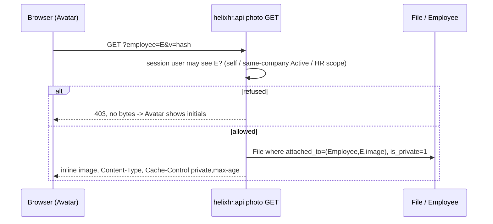

# feat: Employee profile photo and HR-editable shift roster

## Summary

Two features, planned together and built in two fresh sessions (Phase A, then Phase B).

- **Phase A (profile photo):** an employee uploads, replaces or removes their own photo from Profile. The file is stored private, attached to their Employee record. A scope-checked method serves it to colleagues, and every avatar that shows initials today shows the photo instead, falling back to initials.
- **Phase B (shift roster):** a week grid of who works which shift on each day, read from HRMS Shift Assignments. An employee sees their own row, a manager sees their direct reports, and HR sees everyone in their admin scope. HR can assign, change and end shifts from the grid.

---

## Problem Frame

Every avatar in the portal is an initials monogram. The profile-tabs plan held photos back on purpose (`docs/plans/2026-09-29-001-feat-employee-profile-tabs-plan.md`, "showing `Employee.image` raises private-file access questions"), and `docs/design-system/screens.md` says "No photos" for Directory and Celebrations. Under strict user permissions a colleague cannot read another Employee, so Frappe's own `/private/files` check returns 403 for a photo attached there. That is why photos never shipped, and this plan answers it.

Shifts exist only as `Employee.default_shift`. Dated Shift Assignments are left to Desk (`docs/plans/2026-09-20-002-fix-portal-session-and-hr-controls-plan.md`, KTD4), and that plan's Open Questions already expected a portal Shift Assignment editor. Check-in depends on a submitted, Active assignment (`docs/runbook.md`, "The check-in button is invisible until three things are true"). Today HR can only see or fix who works when by leaving the portal.

This plan reverses both earlier rulings on purpose, and U6 and U12 update the docs that record them.

---

## Requirements

**Profile photo**

- R1. An employee can upload a PNG or JPEG photo of 5 MB or less for themselves, replace it, and remove it. No one else's photo can be changed through the portal.
- R2. The stored photo is re-encoded on the server: EXIF (including GPS) is stripped, orientation is applied, and it is bounded to 512 px. Any other type, a spoofed extension or an oversized file is refused with one plain sentence.
- R3. The photo file is private. It is served only to signed-in users allowed to see that employee: themselves, Active colleagues in the same company (the Directory rule), and HR within admin scope. Everyone else gets a refusal and no bytes.
- R4. Every surface that shows an initials avatar today shows the photo when one exists and falls back to initials when there is none or it fails to load: Profile, the app shell, Directory, People, Team, Approvals, Projects, Celebrations and the leave approver chip.
- R5. A new photo shows up on the next page load without a hard refresh, and a removed photo never keeps being served from cache.
- R6. A private photo URL never lands in `User.user_image`, so it cannot leak through Frappe's User-attached File row.

**Shift roster**

- R7. A Roster page shows a Monday-first week, one row per employee and one cell per day. Each cell names the shift that is Active on that date, and leave and holidays show the way Team shows them.
- R8. Who appears: the employee's own row for everyone, direct reports for a manager, and every Active employee in admin scope for HR. The server applies the scope and the browser never widens it.
- R9. HR can assign a Shift Type to an employee for a date range, which is submitted in the portal. Overlaps are refused by HRMS's own validation and the refusal is shown as a plain sentence.
- R10. HR can end an assignment on a date by setting `end_date` on the submitted doc, and can change the shift from a date by ending the current assignment and assigning the new one. HR can cancel an assignment only when HRMS allows it, which is no check-ins or attendance.
- R11. Non-HR callers cannot write Shift Assignments through the portal, and nothing new reaches `frappe.client` or `/api/resource`.
- R12. The grid works at phone width. The grid scrolls inside its own container, or becomes a day list the way Team does, and the page never scrolls horizontally.

---

## Key Technical Decisions

- KTD1. **Serve photos through one whitelisted GET, never the `/private/files` URL.** Projections return a method URL that carries the employee and a version token, not the file URL. The method checks R3 scope, finds the File by (`attached_to_doctype="Employee"`, `attached_to_name`, `attached_to_field="image"`) without trusting any client path, and streams it with `frappe.response.type = "download"`, the real `content_type` and `display_content_as = "inline"`. Do not use `type="binary"`, which forces `octet-stream` plus attachment and breaks ``. The pattern to follow is `download_my_payslip`. Frappe's own File check follows Employee read, which colleagues do not have (see Sources).
- KTD2. **Cache with `private, max-age` plus a versioned URL.** The version is the File's `content_hash`, or its `modified`, so a replace changes the URL (R5). Never send `public`. The dev server forces no-cache, so caching is checked with a response-header test, not in the browser.
- KTD3. **Write `Employee.image` without triggering ERPNext's user sync.** `Employee.on_update` → `update_user` copies `image` into `User.user_image` and adds a second File row attached to User, and any user with User read could download through that row. The upload method sets the field with a targeted `db_set` (this field only, from the session employee) rather than `doc.save()`. The code comment states the reason, and a test asserts no User-attached File row and an unchanged `user_image` (R6). `Employee.image` is permlevel 1 (`fixtures/property_setter.json`), so a portal method is the only employee write path anyway.
- KTD4. **Reuse the existing upload chokepoint with a narrower image policy.** Add a photo policy (PNG/JPEG signatures and a 5 MB cap) beside `UPLOAD_POLICY` in `helixhr/utils.py`, validated through `validate_portal_upload`. Re-encode with Frappe's existing `frappe.utils.image` helpers (`strip_exif_data`, `optimize_image`) on PIL, which Frappe already depends on, so no new dependency. Extend `events.file_before_insert` so an Employee `image` File must be private and pass the photo policy even when created outside the portal.
- KTD5. **Keep `_force_download_portal_attachment` scoped to HR Request.** Avatars are served by KTD1's method, which sets inline itself. The hook stays as it is, and a test pins that it does not touch the photo method's response.
- KTD6. **One shared `Avatar` component.** Today each surface draws an inline monogram ``. U5 adds one component that takes the photo URL, initials, size and name. It renders `` with fixed width and height (no CLS) and swaps to the monogram on `error`. Surfaces switch to it one by one, with no visual change when there is no photo.
- KTD7. **Roster methods are HelixHR's own, over HRMS doctypes. Do not call `hrms.api.roster`.** HRMS ships a Roster at `/hr/roster`, but its dotted paths are HRMS-internal and can change. Its writes assume HR User/Manager DocPerms, and HR User lacks cancel. HelixHR's rule is session-scoped projections plus allow-listed writes through `doc.save()`/`submit()` (`docs/architecture.md`, §Extending). Reads use `get_all` with `ignore_permissions` over an explicit field list, scoped by our own helpers.
- KTD8. **Scope helpers are reused, not re-derived.** Employee rows come from `get_current_employee`, manager rows from the direct-report set `get_my_team_week` uses, and HR rows from `resolve_admin_scope` / `admin_scope_employee_filters`. Writes check `employee_in_admin_scope` and the caller's Shift Assignment `create`/`write`/`cancel` permission (the `_assert_config_write` idiom). The P4-R11 self-scope trap is already guarded by `preflight.check_hr_manager_self_scope`.
- KTD9. **"Change from date" is end plus assign, not an edit of `shift_type`.** `shift_type` is not `allow_on_submit`. The change is one method call in one transaction: end the current assignment on date−1, then insert and submit the new one. If HRMS refuses either step, the whole change rolls back.
- KTD10. **Week view only; recurring schedules are out.** Match Team's week model: the server clips to the week, and the week lives in component state. Shift Schedule Assignment (recurring) and swaps are deferred.
- KTD11. **The rate-limit and preflight inventory moves with each new method.** Every new write gets a `RATE_LIMIT_POLICY` entry, and the same commit updates the pinned table in `helixhr/tests/test_upload_security.py`. Shift Assignment needs no DocPerm delta for HR Manager, which already has write. U7 confirms the HR User cancel gap before deciding whether a delta is needed (Open Questions).

---

## High-Level Technical Design

Photo request path. The prose above governs if they disagree.

Upload path: session employee → photo policy (size, extension, signature) → strip EXIF, orient, resize → insert private File attached to (Employee, E, image) → delete the previous photo File → `db_set` `Employee.image` (no `on_update`, so no `user_image` sync) → return the new versioned URL.

Roster write lifecycle (Shift Assignment, submittable):

```mermaid
stateDiagram-v2
  [*] --> Active: assign (insert + submit, HRMS overlap check)
  Active --> Active: end on date (end_date, allow_on_submit)
  Active --> Ended: change from date (end D-1 + assign new, one transaction)
  Active --> Cancelled: cancel (only if no checkin/attendance; HRMS refuses otherwise)
  Active --> Inactive: nightly HRMS job after end_date
```

---

## Implementation Units

### Phase A — Profile photo

### U1. Photo upload policy and re-encoding

**Goal:** A validated, re-encoded image ready to store.
**Requirements:** R1, R2
**Dependencies:** none
**Files:** `helixhr/utils.py`, `helixhr/tests/test_upload_security.py`
**Approach:** Add a photo policy (PNG/JPEG, 5 MB) that reuses `validate_portal_upload`'s size → extension → signature order and its single refusal sentence. Add one helper that strips EXIF, applies orientation and bounds the image to 512 px through `frappe.utils.image`. Output stays PNG or JPEG.
**Patterns to follow:** `UPLOAD_POLICY`, `validate_portal_upload`, `TestPortalUploadPolicy`.
**Test scenarios:**
- A valid JPEG carrying EXIF GPS is accepted, and the output has no EXIF and a longest side of 512 px or less.
- A valid PNG under the cap is accepted.
- A PDF renamed `.png` is refused by its signature, with the standard refusal sentence.
- A file over 5 MB is refused before anything is decoded.
- `.gif`, `.svg` and `.webp` are refused.
- A truncated or corrupt JPEG with a valid signature is refused cleanly rather than raising a PIL error.
**Verification:** Policy tests pass, and `validate_portal_upload`'s existing behaviour for HR Request is unchanged.

### U2. Set and remove my photo

**Goal:** Session-scoped write of the caller's own photo.
**Requirements:** R1, R3, R6
**Dependencies:** U1
**Files:** `helixhr/api.py`, `helixhr/events.py`, `helixhr/utils.py` (`RATE_LIMIT_POLICY`), `helixhr/tests/test_api_profile.py`, `helixhr/tests/test_upload_security.py`
**Approach:**
- A POST upload method reads the file the way `attach_to_my_request` does and runs U1.
- It inserts a private File attached to (Employee, session employee, `image`) and deletes the caller's previous photo File.
- It sets `Employee.image` with `db_set` (KTD3) and returns the versioned photo URL.
- A POST remove method deletes the File and clears the field.
- Extend `events.file_before_insert` so any Employee-`image` File must be private and must pass the photo policy.
- Each method gets its own rate limit.

**Patterns to follow:** `attach_to_my_request`, `_enforce_upload_policy`, `update_my_profile`.
**Test scenarios:**
- The employee uploads: the File is private, attached to their own Employee with field `image`; `Employee.image` equals its URL; `User.user_image` is unchanged; there is no User-attached File row.
- Replacing the photo leaves exactly one photo File for that employee, and the old URL no longer resolves.
- Remove clears `Employee.image` and deletes the File, and a second remove is a no-op, not an error.
- There is no parameter for choosing the employee, so a forged `employee` argument is ignored.
- Inserting a public File attached to Employee `image` directly (the Desk/API path) is refused by the doc event.
- The rate-limit table in `test_upload_security.py` matches `RATE_LIMIT_POLICY`.
- A caller with no linked Employee gets the portal's standard not-linked refusal.

**Verification:** Tests pass on a fresh site with strict user permissions on.

### U3. Serve a photo to allowed viewers

**Goal:** Stream a photo inline to someone allowed to see it (KTD1, KTD2).
**Requirements:** R3, R5
**Dependencies:** U2
**Files:** `helixhr/api.py`, `helixhr/tests/test_api_profile.py`
**Approach:**
- A GET method takes an employee and a version.
- Allowed viewers: self; same-company Active colleagues, using the Directory's `_caller_company` rule; HR by `employee_in_admin_scope`.
- Resolve the File by its attachment, set the headers and stream inline.
- A missing photo and a refusal both return an error, with no bytes.
- A small helper builds the versioned URL for projections, or returns None when there is no photo.

**Patterns to follow:** `download_my_payslip`, `_directory_projection` scope.
**Test scenarios:**
- The owner fetches: the image bytes come back, `Content-Type: image/jpeg`, inline disposition, `Cache-Control` containing `private`.
- A same-company Active colleague is allowed.
- A colleague in another company is refused.
- A user with no Employee record is refused.
- An HR user in scope is allowed; an HR user scoped to company A asking about company B is refused.
- An employee whose status is Left is refused for colleagues and allowed for HR.
- No photo returns not found, never someone else's file.
- A photo set in Desk as a public `/files` URL is still served through this method, or is skipped. Pin the choice in Open Questions resolution.
- Guest is refused, and the method is absent from `frappe.guest_methods`. Do not use werkzeug Client (`docs/runbook.md`, U4 hang).
- `_force_download_portal_attachment` does not rewrite this method's disposition (KTD5).

**Verification:** Tests pass on a fresh site with strict user permissions on. `/private/files/<photo>` is still 403 for a colleague, which proves we did not widen Frappe's own check.

### U4. Photo URL in every avatar projection

**Goal:** Each projection that carries `initials` also carries `photo_url`.
**Requirements:** R4
**Dependencies:** U3
**Files:** `helixhr/api.py` (`get_my_profile`, `get_portal_bootstrap` session employee, `_directory_projection`, `_people_search_projection`, `get_my_team_week`, `_summary_row`, `_decided_row`, `_decision_head`, `_request_decision_detail`, `_celebration_projection`, `_project_members`, `get_leave_form_context` approver), related tests in `helixhr/tests/`
**Approach:** Put `photo_url` next to each `_initials` call site. Load the image values in one batched read per list, never one query per row, to hold the performance baseline (`docs/runbook.md`, Performance baseline). The leave approver is a User, so map it to its Employee first.
**Patterns to follow:** `_approver_names` batching.
**Test scenarios:**
- A directory list of 50 people costs one extra query, not 50.
- An employee with no photo gets `photo_url` None and `initials` unchanged.
- Each touched projection keeps its existing keys, so existing tests pass unmodified.
- The approval queue row for a requester with a photo carries a versioned URL.

**Verification:** Full Python suite passes, and the projection tests assert `photo_url` presence.

### U5. Avatar component and profile photo controls

**Goal:** Shared `<Avatar>`, plus the upload/replace/remove UI on Profile.
**Requirements:** R1, R4, R5
**Dependencies:** U2, U4
**Files:** `frontend/src/components/Avatar.vue` (new), `frontend/src/pages/Profile.vue`, `frontend/src/components/AppShell.vue`, `frontend/src/pages/{Directory,People,Team,Approvals,Projects}.vue`, `frontend/src/components/{Celebrations,LeaveForm}.vue`, `frontend/src/lib/api.js` (existing `uploadFile`), `frontend/tests/e2e/profile-photo.spec.ts` (new)
**Approach:**
- Avatar renders the `img` with fixed dimensions, `alt` set to the person's name, and `loading="lazy"`, and falls back to the monogram on error.
- Profile's identity band gets Change photo and Remove photo actions. The file input accepts PNG/JPEG, and a client-side type/size pre-check mirrors the `RequestForm.vue` idiom. After success, the session photo updates in place.
- Run `/impeccable` on the rendered result (AGENTS.md UI order). The design system already exists.

**Patterns to follow:** `RequestForm.vue` upload pre-check, `docs/design-system.md` avatar sizes (h-9 shell, h-16 profile).
**Test scenarios:**
- e2e: an employee uploads a JPEG, and the profile band and app-shell avatar show the image after reload.
- e2e: Remove brings the initials back.
- e2e: a wrong type shows the refusal sentence inline and nothing is uploaded.
- e2e: in Directory, a colleague with a photo shows an `img`, and one without shows initials.
- A broken image URL falls back to initials, via vitest if Avatar has pure logic or else an e2e route mock.
- Mobile WebKit: the profile band does not overflow at 375 px.

**Verification:** `yarn lint`, `yarn test`, `yarn build` and the e2e suite pass. The lightweight baseline run shows CLS of 0.1 or less and a Dashboard with 2 or fewer data requests.

### U6. Docs: photos policy

**Goal:** Record the reversal and the gotchas.
**Requirements:** R3, R6
**Dependencies:** U3
**Files:** `docs/architecture.md` (Security model: photo serving), `docs/runbook.md` (the user_image sync and the User File-row leak, and caching on the dev server), `docs/design-system/screens.md` (remove "No photos" in Directory and Celebrations)
**Test expectation:** none, docs only.

### Phase B — Shift roster

### U7. Roster read projection

**Goal:** One week of shift cells for the caller's scope.
**Requirements:** R7, R8
**Dependencies:** none (Phase B can start without Phase A; it uses `photo_url` if U4 has landed)
**Files:** `helixhr/api.py`, `helixhr/tests/test_api_roster.py` (new)
**Approach:**
- A GET takes a week start and an optional mode (`mine` / `team` / `hr`).
- The server picks the allowed mode and refuses a mode the caller does not hold.
- Rows: the employee list for the scope (KTD8), capped the way Team caps at 50 with a total.
- Cells: submitted, Active Shift Assignments overlapping the week, clipped per day, with shift name and times from Shift Type. Leave and holidays come from the same helpers `get_my_team_week` uses.
- An `assignment` id goes into each cell only for HR, so the browser can act.
- Also return `can_edit` and the Shift Type list for HR.

**Patterns to follow:** `get_my_team_week` (shape, clipping, holiday cache), `_line_manager_filter`, `admin_scope_employee_filters`.
**Test scenarios:**
- An employee sees only their own row, even when passing `mode=hr`, which is refused or downgraded; pin which.
- A manager sees their direct reports plus themselves, and not a report's reports.
- A company-scoped HR user sees only that company.
- An assignment from Wednesday to open-ended shows Wed–Sun, not Mon–Tue.
- Two back-to-back assignments in the week show each on its own days.
- An Inactive or cancelled assignment is not shown.
- No assignment on a day shows an empty cell, with `default_shift` shown as a hint if present (pin in implementation).
- Leave and holiday markers match `get_my_team_week` for the same employee and week.
- More than 50 employees returns 50 rows plus the true total.
- Query count does not grow per row (batched reads).

**Verification:** Tests pass on a fresh site with strict user permissions on.

### U8. Roster writes: assign, end, change, cancel

**Goal:** HR-only Shift Assignment writes through HRMS validation.
**Requirements:** R9, R10, R11
**Dependencies:** U7
**Files:** `helixhr/api.py`, `helixhr/utils.py` (`RATE_LIMIT_POLICY`), `helixhr/tests/test_api_roster.py`, `helixhr/tests/test_upload_security.py` (rate table)
**Approach:**
- Four POST methods: assign (employee, shift type, from date, optional to date); end (assignment, date); change (assignment, date, new shift type), which is one transaction per KTD9; and cancel (assignment).
- Each one checks `employee_in_admin_scope` and the Shift Assignment ptype, uses allow-listed fields only, and runs `insert`/`submit`/`save`/`cancel` so HRMS validation runs. Never use `db_set`.
- Company comes from the Employee, never from input.
- HRMS errors (overlap, `MultipleShiftError`, a cancel blocked by check-ins) map to plain sentences.

**Patterns to follow:** `save_shift_type`, `_assert_config_write`, `_apply_allowed_fields`.
**Test scenarios:**
- HR assigns: a submitted Active assignment exists, and the check-in window for that employee and date resolves to it (integration with `_shift_windows`).
- Assigning over an existing Active range is refused with the overlap sentence, and nothing is inserted.
- End on a date sets `end_date` on the submitted doc, and the docstatus stays 1.
- End before `start_date` is refused.
- Change from D: the old assignment ends D−1 and the new one starts D. If the new insert fails, the old `end_date` is unchanged (rollback).
- Cancel with no check-ins succeeds; cancel with an Employee Checkin in range is refused with a plain sentence.
- Employee and manager callers are refused (PermissionError) on all four.
- An HR user scoped to company A cannot write for a company B employee.
- An unknown or extra field in the payload is ignored or refused, and a company argument is never read.
- Rate-limit entries match the pinned table.
- An HR User without cancel either gets the plain refusal or, if a delta is chosen, can cancel (Open Questions).

**Verification:** Tests pass on a fresh site with strict user permissions on. Preflight is still clean.

### U9. Roster page (read)

**Goal:** The Roster page and nav entry.
**Requirements:** R7, R8, R12
**Dependencies:** U7
**Files:** `frontend/src/pages/Roster.vue` (new), `frontend/src/router.js`, `frontend/src/components/AppShell.vue` (`NAV`), `frontend/tests/e2e/roster.spec.ts` (new)
**Approach:** Copy Team's CSS-grid layout, week navigation and phone day-list. The nav entry is visible to everyone, with employees landing on "mine". Keep the Mon–Sun helpers in `lib/dates.js` and follow `/ui-ux-pro-max` → `/hallmark` → `/impeccable` for the new screen per AGENTS.md. AsyncState handles `forbidden`.
**Patterns to follow:** `Team.vue`, `docs/design-system/screens.md` Team section, `docs/design-system.md` wide-grid rule.
**Test scenarios:**
- e2e: the employee sees their own row and the shift name on assigned days.
- e2e: the manager sees their reports.
- e2e: previous and next week change the cells.
- Mobile WebKit at 375 px shows the day list, with no page-level horizontal scroll.
- An empty week shows an empty-state sentence, not a blank grid.

**Verification:** `yarn lint`, `yarn test`, `yarn build` and the e2e suite pass. The lightweight baseline shows no JS or CSS regression beyond the new route chunk.

### U10. Roster editing UI (HR)

**Goal:** HR assigns, ends, changes and cancels from the grid.
**Requirements:** R9, R10
**Dependencies:** U8, U9
**Files:** `frontend/src/pages/Roster.vue`, `frontend/src/components/RosterAssignSheet.vue` (new, only if the sheet doesn't fit inline; prefer the existing sheet pattern from `LeaveForm.vue`/`AttendanceRequestSheet.vue`), `frontend/tests/e2e/roster.spec.ts`
**Approach:**
- A cell or row action opens a sheet: shift type, from date, optional to date. For an existing assignment the sheet offers end, change from date and cancel.
- Server errors go through `errorMap`.
- The grid refetches after each write, with no optimistic cell edits.
- Destructive actions need confirmation, following withdraw-leave.

**Patterns to follow:** `LeaveForm.vue` sheet, `lib/errorMap`, the withdraw confirmation pattern.
**Test scenarios:**
- e2e: HR assigns a shift for next week and the cells show it.
- e2e: HR ends it mid-week and the later days clear.
- e2e: an overlapping assign shows the plain overlap sentence.
- e2e: an employee session shows no edit affordances.
- The keyboard can open the sheet and submit it; focus returns to the cell.

**Verification:** The e2e suite passes on all projects, and `/impeccable` critique is clean.

### U11. Seed and fixtures for e2e

**Goal:** Playwright can exercise photos and roster.
**Requirements:** R4, R7–R10
**Dependencies:** U2, U8
**Files:** `helixhr/tests/utils.py` (`setup_playwright_fixtures`, `assign_test_shift`)
**Approach:** Seed one colleague with a photo and one with an Active assignment this week. Keep it idempotent (no rollback between methods).
**Test expectation:** exercised by the U5, U9 and U10 e2e specs.

### U12. Docs: roster

**Goal:** Record the roster contract and reverse KTD4 of the 2026-09-20 plan.
**Requirements:** R8, R11
**Dependencies:** U8
**Files:** `docs/architecture.md` (method table and Extending), `docs/runbook.md` (end vs cancel, the nightly Inactive job, check-in interplay), `docs/design-system/screens.md` (Roster screen)
**Test expectation:** none, docs only.

---

## Scope Boundaries

- Out: cropping or editing in the browser, and photo moderation or approval.
- Out: HR setting another employee's photo from the portal. HR can still use Desk, which U2's doc event keeps private.
- Out: recurring Shift Schedule Assignment, shift swaps, shift requests from employees, and multiple shifts per day.
- Out: month view, and any change to attendance processing.

### Deferred to Follow-Up Work

- Month view for the roster (KTD10).
- Employee-initiated Shift Request from the roster, which reuses HRMS Shift Request plus the approvals queue.
- Bulk assign (many employees, one shift type), which is where HRMS's Shift Assignment Tool is the reference.
- A Desk-side guard or patch migrating existing public `Employee.image` files to private.

---

## Open Questions

- **Existing Desk-set photos.** Some Employees may already have a public `/files/...` image, and a matching `user_image`, set in Desk. Should U3 serve it through the method, or ignore it until it is re-uploaded? Recommendation: serve it, since it is already public, and flag it in preflight as WARN. Resolve at U3 start.
- **HR User cancel.** Stock HR User has no cancel on Shift Assignment. Options are to accept the refusal (only HR Manager cancels) or to add a delta in `apply_permission_deltas.py`. Recommendation: accept it and show the plain sentence, because end-dating covers most needs.
- **Manager depth.** Direct reports only (Team's rule), or the nested tree? The plan assumes direct reports. Revisit if managers ask.
- **An employee requesting `mode=hr`.** Refuse it or silently downgrade to `mine`? Decide in U7 to match the portal's existing `forbidden` handling.

---

## Risks & Dependencies

| Risk | Mitigation |
|---|---|
| ERPNext `update_user` still syncs `user_image` on any later full Employee save (HR edits in Desk, or `save_person`) | The U2 doc event, or an Employee `before_save` guard, blanks a private `image` URL out of the sync, or strips the User-attached File row. A test covers an HR `save_person` after an upload. |
| Avatars add requests on list pages | Lazy loading, a `private, max-age` cache, 512 px files, and a baseline rerun (U5). |
| Editing shifts while someone is checked in creates `offshift` punches | The runbook note (U12). End-date instead of cancel. The sheet warns when the edited date is today. |
| HRMS nightly job flips ended assignments to Inactive | The projection reads by dates plus docstatus, not by status alone, for past weeks. Pin with a past-week test in U7. |
| `api.py` size | It stays one module by decision (memory: api-boundary-single-module). New methods are grouped under one section header each. |

---

## System-Wide Impact

- Every list surface changes its projection shape (it gains `photo_url`). The change is additive, so existing consumers are unaffected.
- `events.file_before_insert` gains an Employee-`image` branch, so a Desk upload to an Employee image must be marked private or it is refused.
- The rate-limit inventory, the preflight `check_rate_limits` and the pinned test table all move together in U2 and U8.
- A new nav entry uses up nav space. It is not `primary`, because the tab bar allows at most 5.

---

## Sources & Research

- Frappe v16.33 `frappe/core/doctype/file/file.py` (`has_permission` → attached doc read), `frappe/utils/response.py` (`download` with inline vs `binary`), `frappe/app.py` (`response_headers` merge), and `frappe/utils/image.py` (`strip_exif_data`, `optimize_image`). All were read from bench source.
- ERPNext `setup/doctype/employee/employee.py` `update_user`: the one-way `image` → `user_image` sync plus the User-attached File row (KTD3).
- HRMS v16.17 `hrms/api/roster.py` (reference only, KTD7) and `hr/doctype/shift_assignment` (submittable, with `end_date`/`status` `allow_on_submit`, the overlap validation, and cancel blocked by check-ins).
- Repo: `download_my_payslip`, `attach_to_my_request`, `validate_portal_upload`, `get_my_team_week`, `save_shift_type`, `patches/v1_0/apply_permission_deltas.py`, and `docs/runbook.md` (test isolation, performance baseline, check-in window).
