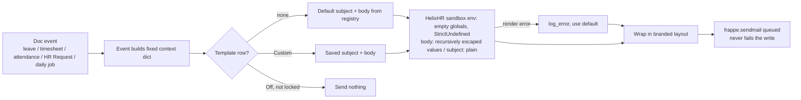
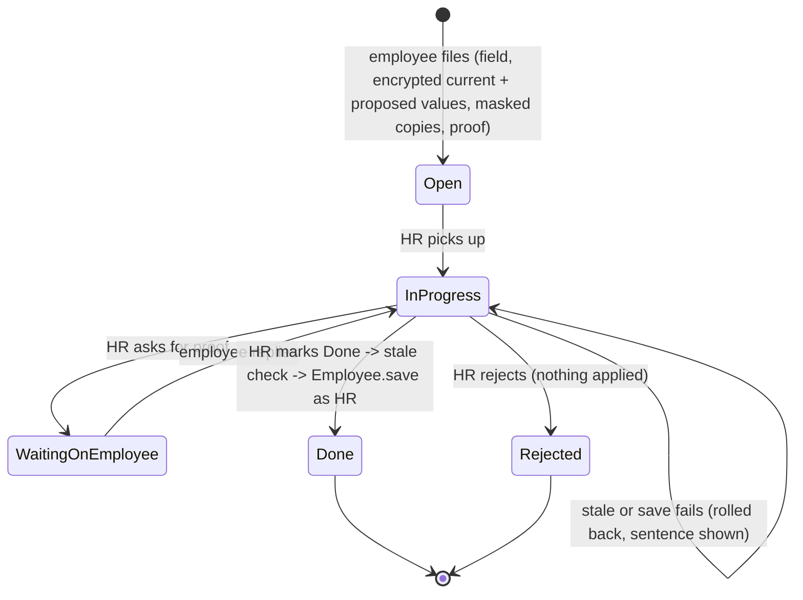
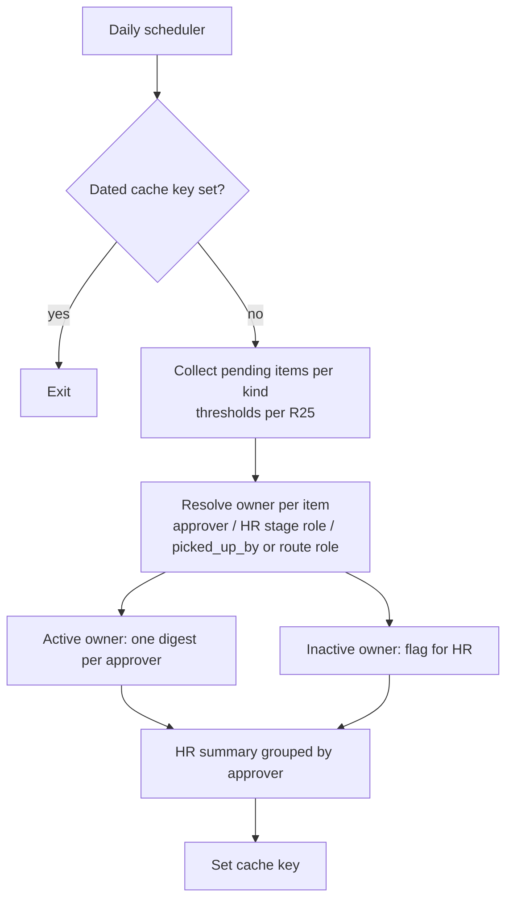

# feat: Notification center, leave rule fixes, approval queues and overdue reminders

## Summary

Six phases, each sized for its own fresh session. Phases 1–3 are independent of each other. Phases 5 and 6 build on Phase 4's template engine (U8):

1. **Leave rules.** The portal refuses leave that would overdraw the balance once pending requests are counted. The Leave Types editor sets Frappe's real consecutive-days limit. A HelixHR grace rule allows emergency backdated leave.
2. **Sidebar.** Navigation is grouped into labelled sections.
3. **Queues.** HR can see and decide leave whose manager is away or late. Home queues show 5 rows that scroll. Requests and Approvals filter by kind and category.
4. **Notification center.** A new `HelixHR Notification Manager` role owns one portal page where every portal email is edited. Templates use Frappe-style `{{ variable }}` syntax over a fixed, documented variable list per event, and render inside a branded layout. HRMS's duplicate leave mail is switched off.
5. **Overdue.** A daily digest goes to each late approver, a summary goes to HR, and HR gets an Overdue tab.
6. **Structured corrections.** A bank-detail correction carries the new value and applies itself when HR marks it Done, with fraud safeguards.

A ranked list of Frappe-native, low-code wins closes the plan. It is not built here.

---

## Problem Frame

**Templates printed their variables.** "Message text" (`HelixHR Message Template`) uses single-brace `{token}` substitution (`helixhr/utils.py` `render_tokens`). It never runs Jinja, on purpose (P5-KTD11). The user wrote Frappe-style `{{ doc.x }}` into it, so the variables came out literally. Only two request events can be edited at all. The other HR-facing emails are developer-owned fixture `Notification`s in Markdown (P4-KTD9). HRMS can send its own Desk-worded leave mail on top of HelixHR's (`HR Settings.send_leave_notification` defaults to 1). Template editing is not HR work, so it needs its own role.

**The leave "bugs" are not a validation bypass.** `apply_for_leave` runs a plain `doc.insert()`, and approval runs `doc.submit()`, so HRMS validates every path. Two different things are going wrong:

- **Negative balance.** HRMS deducts only *approved* leave (ledger, docstatus 1). Several Open requests can each fit the balance, and only the approver's Approve fails later. The portal preview also shows a negative "after" balance while Send stays enabled.
- **Max consecutive days.** The portal's "Maximum days allowed" edits `max_leaves_allowed`, the per-period *allocation* cap, which a Leave Application never checks. `max_continuous_days_allowed` cannot be edited from the portal at all. Only Casual Leave has a limit set on the bench.

**Approvals stall.** The server already lets HR decide manager-stage leave (`_leave_allowed_actions`), but HR's queue lists only HR-stage leave (`_hr_leave_summaries`). Home shows up to 8 rows per queue, which crowds HR's dashboard. Request categories store `sla_days`, but nothing computes overdue, and nobody is reminded.

**Backdated leave.** HRMS's `restrict_backdated_leave_application` checks the *session user's* role on every validate, approver submit included. Turning it on would stop managers approving late requests, and it has no grace period.

**Corrections are free text.** `CorrectionDialog` files a prose HR Request. HR then re-keys the value in Desk.

---

## Requirements

**Leave rules**

- R1. A leave request is refused at apply time when its days exceed the balance minus the employee's other pending (Open, unsubmitted) requests of that type. Exception: types with `allow_negative` or `is_lwp` set.
- R2. The R1 check runs on insert, on a date, type or half-day change, and on resend after a send-back. It never runs on approver submit, so a shrunken allocation cannot block Approve.
- R3. The leave preview returns the pending total, the type's consecutive-days limit and the earliest allowed start date (R6). It disables Send with one plain sentence when R1, the limit or the grace rule would refuse the request.
- R4. HR can set `max_continuous_days_allowed` and `allow_negative` from the Leave Types editor. `max_leaves_allowed` is relabelled as the per-period allocation cap.
- R5. HRMS's max-days refusal reaches the employee as one plain sentence, not stripped HTML.
- R6. An employee may start leave up to N working days in the past. N comes from site config, defaults to 1, and is counted against the employee's holiday list. HR Manager and one configurable exempt role are unlimited. The rule runs on insert and on date change, never on approver submit.
- R7. Preflight fails when HRMS's own `restrict_backdated_leave_application` is on while the grace rule is active, and when the configured exempt role does not exist.

**Sidebar**

- R8. Desktop navigation is grouped into labelled sections, and a section disappears when the user's roles hide all of its items. The admin sections collapse. The section holding the current route always opens, and collapsed state is remembered per device.
- R9. The mobile More dialog uses the same groups. The four primary bottom-bar items are unchanged.

**Queues and approvals**

- R10. HR's Approvals lists manager-stage leave within HR's admin scope when the approver is on approved leave today or the request is overdue (R25). Each item is tagged with the reason.
- R11. When HR decides such leave, the decision record names HR as acting for the approver, and the approver gets a bell notice.
- R12. Home's "Needs you" and "Waiting on others" lists each show 5 rows in a scroll container, plus a "View all (N)" link to the owning page.
- R13. Requests and Approvals filter by kind (leave, timesheet, attendance, request) and, for requests, by category, server-side. Each chip shows a count. Inactive categories that have past requests still get a chip.

**Notification center**

- R14. A new role, `HelixHR Notification Manager` (`desk_access 0`), opens a portal Email templates page. System Manager can open it too. HR Manager can no longer edit templates, and "Message text" leaves Settings.
- R15. The page lists every portal email event, grouped by audience. Each event shows its subject and HTML body, an Off / Default / Custom state, its variable list with descriptions and sample values, a live preview, a "send test to me" action, and a reset to default.
- R16. Templates use `{{ variable }}` and `` / `` over that event's fixed context only. A template can reach no `doc`, no `frappe` globals and no other records. Employee-typed values are HTML-escaped in bodies, including inside nested lists. Subjects are plain text.
- R17. Saving refuses a template that errors against the event's sample data or that names a variable outside the event's list; the refusal names the line or the unknown variable. At send time, a failing template falls back to the default wording and writes `log_error`, and the email still goes out with no error shown to the user who triggered it.
- R18. Security notices (bank-change requested, bank-change applied) cannot be switched off. Their core sentence is developer-owned. The Notification Manager can only add an optional extra paragraph.
- R18a. Template edits are audited: `track_changes` is on, and save and reset write a comment naming the actor.
- R19. Every email renders inside one developer-owned branded layout (logo, heading, action button, footer). The editable part is the inner content only.
- R20. Existing Message Template rows migrate to the new syntax without changing meaning. Disabled rows, which today mean "use default", become Default.
- R21. HelixHR is the only sender of leave email. HRMS `send_leave_notification` is turned off, HR Settings refuses re-enabling it, and preflight fails if it is on. HelixHR covers HRMS's three sends: the approver on a new request, the employee on a decision, and the employee on a cancellation.
- R22. The HR-facing fixture email Notifications are retired in favour of templated sends hung on doc events. Desk decisions therefore still email. The bell (System Notification) fixtures stay.

**Overdue**

- R23. A daily job sends each approver one digest email listing every item they are overdue on. It repeats each day until the items are acted on, and a same-day rerun sends nothing.
- R24. HR Managers get one daily summary grouped by approver. It includes items whose owner is disabled or inactive.
- R25. Overdue is defined per kind:
  - Leave, timesheets and attendance requests are overdue when pending longer than `helixhr_approval_overdue_days` (site config, default 2, calendar days).
  - HR Requests are overdue when Open or In Progress longer than the category's `sla_days`. A value of 0 means no SLA, and "Waiting on Employee" never counts.
- R26. HR's Approvals has an Overdue tab showing who is sitting on what, how long, and against which threshold, within admin scope.

**Structured corrections**

- R27. From Profile, an employee can propose a new value for an HR-locked correctable field. The first set is bank name, bank account number and IBAN. The value is entered twice, and a proof attachment is required.
- R28. The proposed value is stored encrypted, appears masked in lists, queues and email, and is revealed in full only to the HR user handling an open request. The correction fields cannot be changed after filing, by anyone, through any route.
- R29. When HR marks the request Done, the value is written to Employee in the same transaction, as HR (`doc.save()`, no `ignore_permissions`). It is refused, and the request stays open with one sentence, if the field changed since filing or the save fails.
- R30. A bank-change request emails the employee's company address and personal address when it is filed and again when it is applied. Done is refused while the employee's personal email changed less than 72 hours ago.
- R31. The profile correction category is pinned to HR Manager routing, and reroute is refused.
- R32. When a correction is Done or Rejected, the encrypted proposed and current values are deleted. Only the masked display values remain.

---

## Key Technical Decisions

**Leave**

- KTD1. **Add a pending-aware balance rule; don't touch HRMS.** `events.leave_application_validate` gets the R1 check, built from HRMS's own `get_leave_balance_on` and `get_leaves_pending_approval_for_period`, excluding the document itself. Living in a doc event, it also covers Desk. It is stricter than HRMS on purpose and is limited to R2's triggers. That one condition is what keeps it off the approver's path.
- KTD2. **Fix the editor, not HRMS's consecutive-days rule.** HRMS already throws on insert for `max_continuous_days_allowed`. The defect is that the portal edits the wrong field. HRMS's exact-adjacency chaining, which a weekend gap breaks, matches Frappe and stays as it is (Scope Boundaries). Widening `LEAVE_TYPE_EDITABLE_FIELDS` reverses P5-KTD12's list on purpose.
- KTD3. **Use a HelixHR grace rule instead of HRMS's backdated block.** HRMS checks the session user at submit, which would block late approvals. The HelixHR rule checks only R6's triggers. N and the exempt role live in site config, per the scalar-flag convention in `docs/architecture.md` → Extending; P5-KTD3 forbids a new Single. Working days avoid the "Friday sick, applied Monday" refusal.

**Queues**

- KTD4. **Add a filter to HR's queue; leave the permission alone.** `_leave_allowed_actions` already lets HR decide manager-stage leave. U4 adds a collector slice for away or overdue approvers, and that slice is not narrowed by `_line_manager_filter`. "Away" means a submitted, Approved Leave Application covering today on the approver's Employee, half days included.
- KTD5. **Home keeps the urgency sort.** The server raises the shown limit to 20 and still returns `more`. The client caps the visible area at 5 rows.

**Notifications**

- KTD6. **Use one HelixHR template system on a HelixHR-owned Jinja sandbox, not `frappe.render_template`.** `restrict_globals=True` does not isolate templates. `render_safe_globals()` still exposes `frappe.get_all` (with `ignore_permissions`), `frappe.db.get_value`, `frappe.db.sql` and `frappe.get_doc`, and `test_reminders.py` already pins that for P8-KTD7. Frappe's environment also uses `DebugUndefined`, which prints unknown names literally, and `guess_is_path` loads a one-line `*.html` or `*.txt` string as a file. So the renderer is a `jinja2.sandbox.ImmutableSandboxedEnvironment` built in `helixhr/utils.py`. It has empty globals, `StrictUndefined`, no loader and no app jinja hooks, and compiles only through `env.from_string`. jinja2 already ships with Frappe, so there is no new dependency. This is P5-KTD11's intent kept for a non-HR role: the Notification Manager gets no DocPerm on `Notification` or `Email Template`, and no template can read a record. The celebration Email Template keeps its accepted exception until its own migration (Deferred).
- KTD7. **Event definitions live in code; customizations live in the DB.** A registry in `helixhr/utils.py` names each event: key, label, audience, recipients, variables with description and sample, default subject and body, and a locked flag. A `HelixHR Message Template` row exists only for a customized or switched-off event. No row means Default, `is_enabled=1` means Custom, and `is_enabled=0` means Off. Locked events ignore Off.
- KTD8. **Sends live in doc events, not portal routes.** One helper renders, wraps the result in the layout, and queues `frappe.sendmail`. It never fails the triggering write (P5-KTD9). On a render failure it falls back to the default and logs; nothing reaches `message_log`. Recipients are resolved from the document, using `Employee.user_id` and never `owner`. Desk and portal actions therefore email the same way. The single send helper is justified by roughly ten call sites.
- KTD8a. **Leave routing comes from the Leave Type, and stage moves need `on_change`.** At insert, `leave_submitted` vs `leave_for_hr` is chosen from `Leave Type.helixhr_hr_approves`. `helixhr_stage` is still Manager when the insert hooks run (`apply_for_leave` sets it afterwards with `db_set`), and Desk inserts never set it. "Send to HR" is a `db_set`, which runs only `on_change`, so a new `Leave Application.on_change` handler sends `leave_for_hr` when the stage moves to HR.
- KTD9. **This reverses P4-KTD9 for HR-facing email.** The four HR email fixture Notifications are retired by a patch plus a preflight check, mirroring `retire_request_notifications`. Fixture sync never deletes, which is why the patch is needed. The bell fixtures stay as they are.
- KTD10. **Turn off HRMS leave mail with a guard.** A patch sets `send_leave_notification=0`. `hr_settings_validate` refuses to re-enable it, and preflight fails if it is on. This copies the `turn_off_hrms_celebration_senders` pattern.
- KTD11. **The preview renders in a sandboxed iframe** (`srcdoc`, an empty `sandbox` attribute), never `v-html`. That way a template cannot script the portal.
- KTD12. **A new role, following the IT Team pattern.** A fixture Role with `desk_access: 0` (P5-KTD10), a dated `apply_permission_deltas` line granting write on `HelixHR Message Template`, and HR Manager removed from that doctype's own permissions. The bootstrap flag is `can_manage_notifications`, and the nav gate stays a boolean, never a role list. System Manager grants the role in Desk.

**Overdue**

- KTD13. **Run our own daily job, not Notification "Days After".** Days After fires once, and the user chose a repeating digest. The job follows the `reminders.py` pattern: idle until configured, a try/except per approver, `log_error`.
  - **Rerun guard:** a dated cache key, registered in `hooks.persistent_cache_keys` with a roughly 36-hour expiry. `bench migrate` and `clear-cache` therefore do not reset it.
  - **Waiting-since:** a `helixhr_pending_since` Datetime custom field on Leave Application, Timesheet and Attendance Request. It is set on insert and on every move into a pending stage or state. `modified` is not used, because Desk saves and HRMS's own in-flight writes bump it.
  - HR Requests count from `creation`.
  - The overdue predicate is one helper, introduced in U4 and reused by U11 and U12.

**Corrections**

- KTD14. **Only HR-locked fields are correctable.** The contact, address and emergency fields the user listed are already self-service (`PROFILE_EDITABLE_FIELDS` via `update_my_profile`), so they stay on that path. The `PROFILE_CORRECTABLE_FIELDS` allowlist starts with `bank_name`, `bank_ac_no` and `iban`. The bench has no IFSC field because India Compliance is not installed.
- KTD15. **Proposed and current values go in Password-type fields.** Encrypted at rest, the doc row and Version log hold only `*` padding, which reveals the length only. They stay out of list views and API reads. The proposed value is revealed by an explicit HR-only method that writes a comment and refuses closed requests. The full current value is used only for the stale check. A separate masked copy is kept for display. Both encrypted entries are deleted on Done or Rejected.
- KTD15a. **The correction fields are write-once and validated in the controller.** `hr_request_validate` checks the allowlist, the proof attachment and the double entry. After insert it refuses any change to the `correction_*` fields from any route, whether Desk, `/api/resource` or `frappe.client`. `create_my_request` is therefore not the only gate.
- KTD16. **Apply runs in the Done transition, in one transaction.** It runs only when all of these hold: the request is HR-routed, the full current value still equals the live Employee value for that field (not `Employee.modified`), and the personal email has not changed in the last 72 hours. Any failure rolls back the Done.

---

## High-Level Technical Design

The prose above governs if a diagram disagrees.

**Notification send path (U8, U9)**



**Structured correction lifecycle (U13)**



**Overdue job (U11)**



---

## Implementation Units

### Phase 1 — Leave rules

### U1. Pending-aware balance rule and gating preview

**Goal:** Refuse an overdraw once pending requests are counted, and tell the employee before they press Send.

**Requirements:** R1, R2, R3

**Dependencies:** none

**Files:**
- `helixhr/events.py` (`leave_application_validate`)
- `helixhr/api.py` (`get_leave_day_count`)
- `frontend/src/components/LeaveForm.vue`
- `helixhr/tests/test_leave_flow.py`
- `frontend/tests/e2e/leave.spec.ts`

**Approach:**
- In validate, skip the check when the type is `allow_negative` or `is_lwp`, and when none of R2's triggers apply. Detect triggers with `is_new()`, `has_value_changed` on dates, type and half day, and a stored `status` of Rejected moving to Open.
- Pending = Open, docstatus-0 applications of this employee and type, `name != doc.name`, overlapping the Leave Allocation period that covers `doc.from_date`. That is the window HRMS's `get_leave_details` uses. A window of the request's own dates would find nothing, because HRMS already refuses overlaps.
- Balance = `get_leave_balance_on(..., consider_all_leaves_in_the_allocation_period=True, for_consumption=True)`, matching `validate_balance_leaves`.
- A portal "Edit and resend" is a new insert, so `is_new()` covers it. The stored Rejected→Open check covers Desk status edits only.
- The preview returns `pending`, `max_continuous` and a `blocked_reason` sentence. Its docstring changes from "never a gate" to "advisory gate; HRMS and the validate rule decide".

**Execution note:** Start with failing integration tests for two Open requests that each fit the balance but together do not.

**Patterns to follow:** `events.leave_application_validate`'s existing refusals. `errorMap` in `LeaveForm.vue`.

**Test scenarios:**
- Balance 3, Open request of 2 exists, new request of 2: the insert throws a sentence naming the 2 pending days.
- Same setup, new request of 1: accepted.
- Half day counts as 0.5 against a balance of 0.5: accepted. A second half day: refused.
- `allow_negative` type and LWP type: never refused by this rule.
- An approver submits a request after its allocation was reduced below the request: the R1 rule does not fire (HRMS's own check still applies).
- A sent-back request is resent while another pending request now consumes the balance: refused.
- A request does not count itself: editing an Open request's description passes.
- An Open request in March and a new request in June, both in the same allocation period, together exceed the balance: the June request is refused.
- Preview with an overdraw: `blocked_reason` is set and Send is disabled in the e2e test.

**Blocked-reason copy** (rendered next to the disabled Send, in an `aria-live` region):
- Balance: "You have {balance} days left and {pending} already waiting for approval, so {days} more won't fit."
- Limit: "{leave_type} allows at most {n} days in one request."
- Grace (U3): "Leave can start no earlier than {earliest_date}. For older dates, ask HR."

**Verification:** The two-pending-requests overdraw can no longer be created from either portal or Desk.

### U2. Leave Types editor fields and the max-days sentence

**Goal:** HR can set the limit HRMS really enforces, and labels say what each field does.

**Requirements:** R4, R5

**Dependencies:** none

**Files:**
- `helixhr/utils.py` (`LEAVE_TYPE_EDITABLE_FIELDS`)
- `helixhr/api.py` (`save_leave_type`, `get_portal_config`)
- `frontend/src/components/settings/LeaveTypesSection.vue`
- `frontend/src/components/LeaveForm.vue` (`errorMap`)
- `helixhr/tests/test_api_config.py`
- `frontend/tests/e2e/settings.spec.ts`

**Approach:**
- Add `max_continuous_days_allowed` ("Longest single request, in days; 0 = no limit") and `allow_negative` ("Allow balance to go below zero").
- Relabel `max_leaves_allowed` as "Most days allocated per leave period".
- Map HRMS's max-days throw (it contains an HTML link) to "This leave type allows at most N days in one request."

**Test scenarios:**
- Save `max_continuous_days_allowed=3`, then a 4-day request from the portal is refused with the plain sentence.
- `allow_negative` saved on is reflected in HRMS's behaviour: a warning, not a refusal.
- An unknown field in the save payload is still refused (the allowlist holds).
- A non-HR caller cannot save.

**Verification:** The settings e2e test sets the limit and the leave e2e test sees the refusal.

### U3. Backdated grace rule

**Goal:** Emergency leave can be applied a day late without opening backdating to everyone.

**Requirements:** R6, R7

**Dependencies:** none. Preferred after U1, because both touch the same validate hook.

**Files:**
- `helixhr/events.py`
- `helixhr/preflight.py`
- `helixhr/tests/test_leave_flow.py`
- `helixhr/tests/test_preflight.py`
- `docs/runbook.md`

**Approach:**
- Read `helixhr_backdated_leave_grace_days` (default 1) and `helixhr_backdated_leave_exempt_role` from site config.
- Count working days between `from_date` and today with the existing `_holiday_dates` helper. When it returns `None` (no resolvable holiday list), count calendar days. "Today" is `getdate()` in the system timezone.
- The preview (U1) computes the same earliest allowed date, so Send is disabled before the insert refuses.
- HR Manager and the exempt role skip the rule.
- Preflight: FAIL when HRMS's restriction is on, FAIL when the exempt role is missing, INFO showing the effective N.
- Document the "sent back with wrong dates past grace: withdraw and ask HR" path.

**Test scenarios:**
- N=1, Friday is a working day and today is Monday: leave starting Friday is accepted (the weekend is not counted).
- N=1: leave starting last Thursday is refused with a sentence naming the limit.
- An exempt-role user files 10 days back: accepted.
- A manager approves a backdated request after the grace window passed: accepted (the rule is not on submit).
- An unrelated field edit on an old Open request does not trigger the rule.
- Employee with no holiday list, N=1: yesterday is accepted, two days ago is refused (calendar days).
- Preview with a too-old start date: Send is disabled with the grace sentence.
- Preflight FAILs with HRMS `restrict_backdated_leave_application=1`.

**Verification:** Grace and exemption behave per R6, and preflight covers both misconfigurations.

### Phase 2 — Sidebar

### U15. Grouped navigation

**Goal:** Navigation fits without scrolling as screens are added.

**Requirements:** R8, R9

**Dependencies:** none. U10 adds its nav entry into the Admin group.

**Files:**
- `frontend/src/components/AppShell.vue`
- `frontend/tests/e2e/navigation.spec.ts`

**Approach:**
- Add a `group` key to each `NAV` entry and render headed sections. The existing flags still filter; empty groups are dropped.
- Proposed groups:
  - pinned: Home, Notifications (the existing bell inbox)
  - My work: Leave, Timesheet, Attendance, Requests
  - Pay & policies: Payslips, Holidays, Documents
  - People & team: Directory, Team, Roster, Approvals
  - HR: People, Reports, Organisation, Projects (collapsible)
  - Admin: Settings, Email templates (collapsible)
  - pinned bottom: Profile
- Collapsible headings are `<button aria-expanded aria-controls>` with a chevron. Collapsed state goes in `localStorage`, wrapped in try/catch. Landing on a route forces its group open for that view only; it does not overwrite the stored state.
- The mobile More dialog renders every group expanded, with headings and no collapse control.
- Run `/impeccable` on the rendered shell after it is built, as AGENTS.md's UI order requires.

**Test scenarios:**
- An employee sees no HR or Admin headings.
- HR sees the HR group. Collapsing it, reloading, and it stays collapsed. Navigating to `/people` while it is collapsed opens it.
- Mobile More dialog shows the same headings. The bottom bar is unchanged.
- Existing navigation spec links are still found by accessible name inside `nav[aria-label="Main"]`.

**Verification:** No vertical scroll in the desktop rail for an HR plus System Manager user at 800 px height.

### Phase 3 — Queues

### U4. HR sees away or overdue manager-stage leave

**Goal:** Leave is not stuck when the approver is away.

**Requirements:** R10, R11

**Dependencies:** none

**Files:**
- `helixhr/api.py` (`_hr_leave_summaries` or a sibling collector, `_queue_item`, `act_on_approval` decision record, the overdue predicate)
- `helixhr/fixtures/custom_field.json` (`helixhr_pending_since` on Leave Application, Timesheet, Attendance Request)
- `helixhr/events.py` (stamp `helixhr_pending_since` on entry to a pending stage or state)
- `helixhr/patches/v1_0/backfill_pending_since.py`, `helixhr/patches.txt`
- `frontend/src/pages/Approvals.vue`
- `helixhr/tests/test_api_approvals.py`
- `frontend/tests/e2e/approvals.spec.ts`

**Approach:**
- Introduce the overdue predicate here as one helper (R25 threshold over `helixhr_pending_since`, KTD13), including the custom field and the patch that backfills it from `modified` for rows already pending. U11 and U12 reuse it.
- New slice: Open, docstatus-0 leave at Manager stage, in admin scope, where the approver is away (KTD4) or the request is overdue. Tag it `approver_away` or `overdue`.
- When HR decides, `helixhr_decision_reason`'s comment records "decided by HR for <approver>", and a Notification Log goes to the approver.
- The existing `expected_modified` guard handles the race with the manager.

**Test scenarios:**
- Approver has approved leave today: HR's queue lists the report's request tagged "approver on leave".
- Approver has only an Open, unapproved leave today: not listed as away.
- Request pending since 3 days ago with threshold 2: listed as overdue.
- A Desk save of an unrelated field on a pending request does not reset `helixhr_pending_since`. Send to HR does reset it.
- HR approves: the request is submitted, the decision record names HR acting for the approver, and the approver gets a bell row.
- The manager approves first and HR then acts on a stale row: HR gets the existing "already decided" refusal.
- An employee outside HR's admin scope is not listed.

**Verification:** An HR e2e test approves a report's leave while the fixture approver is on leave.

### U5. Five-row Home queues

**Goal:** HR's dashboard stops flooding.

**Requirements:** R12

**Dependencies:** none

**Files:**
- `helixhr/api.py` (`_QUEUE_LIMIT`)
- `frontend/src/components/NeedsYou.vue`
- `helixhr/tests/test_api_dashboard.py`
- `frontend/tests/e2e/login-dashboard.spec.ts`

**Approach:**
- Raise the shown limit to 20. Keep `more` and the urgency sort.
- The list container's max height equals 5 rows, with `overflow-y-auto`, a visible scroll affordance, and keyboard-focusable rows.
- "View all (N)" links to Approvals or Requests.

**Test scenarios:**
- 12 items: 5 are visible, scrolling reveals the rest, and "View all (12)" goes to Approvals.
- 3 items: no scroll container chrome.
- `more` is still correct past 20.

**Verification:** The dashboard e2e test with seeded HR load sees 5 visible rows.

### U6. Kind and category filters

**Goal:** Requests and Approvals are navigable by type.

**Requirements:** R13

**Dependencies:** none

**Files:**
- `helixhr/api.py` (`get_my_requests`, `get_my_approvals`)
- `frontend/src/pages/Requests.vue`
- `frontend/src/pages/Approvals.vue`
- `helixhr/tests/test_api_approvals.py`
- `helixhr/tests/test_hr_request.py`
- `frontend/tests/e2e/requests-documents.spec.ts`

**Approach:**
- Optional `kind` and `category` params, validated against known kinds and existing categories (active or not). Unknown values are refused.
- The response carries `counts` per kind and category, computed in the caller's existing scope.
- Chips render above each list. The selected chip goes in the URL query so a link reproduces the view.

**Test scenarios:**
- HR filters Approvals to Requests → IT / Asset: only those rows appear, and the total matches the chip count.
- An inactive category with past requests appears as a chip.
- An unknown category value is refused with a sentence.
- Pagination ("Show more") keeps the filter.
- An employee's own Requests chips count only their requests.

**Verification:** The e2e test filters by a URL-encoded category such as `IT / Asset` (P5-KTD2).

### Phase 4 — Notification center

### U7. Notification Manager role and gating

**Goal:** A separate, non-HR role owns templates.

**Requirements:** R14

**Dependencies:** none

**Files:**
- `helixhr/fixtures/role.json`
- `helixhr/hooks.py` (fixture filter)
- `helixhr/patches/v1_0/apply_permission_deltas.py`
- `helixhr/patches.txt`
- `helixhr/helixhr/doctype/helixhr_message_template/helixhr_message_template.json` (permissions)
- `helixhr/api.py` (bootstrap `can_manage_notifications`)
- `frontend/src/lib/session.js`
- `frontend/src/router.js`
- `helixhr/preflight.py`
- `helixhr/tests/test_fixtures.py`
- `helixhr/tests/test_preflight.py`

**Approach:**
- Add the Role fixture with `desk_access: 0`.
- Add a new dated `patches.txt` line re-running the deltas with the new role's DocPerm. Do not edit the applied entry.
- The doctype JSON drops HR Manager and keeps System Manager.
- Preflight: WARN when no enabled user holds the role. Check the role's `desk_access` like `check_it_team_role`.
- A user with `can_manage_notifications` and no Employee record lands on the Email templates page, and the nav shows only that entry. Implementation checks this path through `get_portal_bootstrap`.

**Test scenarios:**
- A Notification Manager's bootstrap has `can_manage_notifications` true and `can_configure` false.
- HR Manager calling the save method is refused.
- After migrate, the role has `desk_access` 0.
- Preflight WARNs when nobody holds it.
- A Notification Manager with no Employee record signs in and lands on Email templates.

**Verification:** Role and permission tests pass on a fresh site with strict permissions.

### U8. Event registry, restricted renderer, layout and migration

**Goal:** One safe, documented template engine for every portal email.

**Requirements:** R16, R17, R18, R19, R20

**Dependencies:** U7

**Files:**
- `helixhr/utils.py` (registry, render and send helper; replaces `TEMPLATE_TOKENS` and `render_tokens` callers)
- `helixhr/templates/emails/helixhr_layout.html`
- `helixhr/helixhr/doctype/helixhr_message_template/helixhr_message_template.json` (`template_key` options, body fieldtype)
- `helixhr/patches/v1_0/migrate_message_templates_to_jinja.py`
- `helixhr/patches.txt`
- `helixhr/preflight.py` (`check_template_tokens` rewritten)
- `helixhr/tests/test_notifications.py`
- `helixhr/tests/test_api_config.py`

**Approach:**
- The registry follows KTD7. Its event catalog is the appendix below.
- The renderer is the KTD6 environment. It is never `frappe.render_template`.
  - Body context: every registry variable present (None when empty), with string values HTML-escaped recursively through lists and dicts.
  - Subject context: raw strings, with newlines stripped.
- Save-time validation compiles the template, then refuses:
  - any name `jinja2.meta.find_undeclared_variables` returns that is not in the event's list, naming that variable,
  - a template that errors against the sample data, naming the line.
- Locked events render a developer-owned core sentence from the layout. The editable template is only an optional extra paragraph.
- `HelixHR Message Template` gets `track_changes: 1`. Save and reset add a comment naming the actor.
- The migration patch:
  - escapes literal `{{`, `{%` and `{#` in existing rows,
  - converts `{token}` to `{{ token }}` for that event's known tokens only,
  - deletes `is_enabled=0` rows, which today mean "default".
- Changing `body` from Text to Code keeps the data.

**Execution note:** Write the sandbox test first. It must prove that `{{ frappe.db.get_value(...) }}`, `{{ frappe.get_all(...) }}`, `{{ doc }}`, `{{ _ }}` and `".__"` attribute access all raise on the HelixHR environment. Under `StrictUndefined`, none of them renders empty or literally.

**Test scenarios:**
- `{{ employee_first_name }}` renders. An `` block is omitted when the reason is empty.
- `{{ frappe.session.user }}` raises on save and is refused.
- A misspelled `{{ employe_name }}` is refused on save with the variable named.
- A one-line subject `Report.html` renders as literal text, not as a file path.
- An HR Request subject of `<a href=x>` is escaped inside the digest's `items[].title` and inside `owners[].items`.
- A reason of `<script>` is escaped in the body. A subject containing `&` is not double-escaped.
- Saving a template with a syntax error is refused with the line number.
- At send, a template that errors on real data falls back to the default and writes an Error Log row, and `frappe.get_message_log()` is empty afterwards.
- A locked event's core sentence renders even when its extra paragraph is blank. Off is refused for a locked event.
- A template save writes a Version row and an actor comment.
- Migration: `Request {category} arrived` becomes `Request {{ category }} arrived`. A row containing a literal `{{` keeps it literal. A disabled row is deleted.

**Verification:** Every registry event renders its default with sample data in a parametrized test.

### U9. Wire events to templated sends; retire HR fixtures; HRMS leave mail off

**Goal:** Every portal email goes through U8, from doc events, once.

**Requirements:** R21, R22

**Dependencies:** U8

**Files:**
- `helixhr/events.py` (leave, timesheet, attendance and HR Request hooks; `hr_settings_validate`)
- `helixhr/api.py` (`reply_to_my_request` email moves to the helper)
- `helixhr/fixtures/notification.json` (remove the four HR email rows)
- `helixhr/patches/v1_0/retire_hr_email_notifications.py`
- `helixhr/patches/v1_0/turn_off_hrms_leave_notification.py`
- `helixhr/patches.txt`
- `helixhr/install.py`
- `helixhr/preflight.py`
- `helixhr/tests/test_notifications.py`
- `helixhr/tests/test_preflight.py`
- `helixhr/tests/test_fixtures.py`

**Approach:**
- Each hook builds its event's context and calls the send helper. Recipients come from document fields, never `owner`.
- Leave routing follows KTD8a. Insert picks the event from `Leave Type.helixhr_hr_approves`. A new `Leave Application.on_change` handler sends `leave_for_hr` when `helixhr_stage` moves to HR, compared against `get_doc_before_save()`. `on_cancel` sends `leave_cancelled`.
- Patches retire the four fixture emails and set `send_leave_notification=0`. Each is also called from `install.py` (P4-KTD11 pattern).
- The preflight FAIL lists follow the `check_retired_request_notifications` and celebration-sender precedents.

**Test scenarios:**
- Employee applies: the approver gets one HelixHR email, and HRMS sends none.
- Leave approved in Desk (not the portal): the employee gets the "leave approved" email.
- HR-approves type filed in the portal and filed in Desk: in both cases the manager gets no email (P4-R7 holds) and HR gets "new leave for HR".
- Manager clicks Send to HR (a `db_set`): HR gets "new leave for HR" through `on_change`.
- HR cancels approved leave: the employee gets "leave cancelled".
- Re-enabling `send_leave_notification` in HR Settings is refused.
- The retired fixture Notification rows are gone after migrate, and preflight FAILs if one is re-created.
- A mail queue failure does not fail the leave insert.
- An event set to Off (not locked) sends nothing. The bell row still appears.

**Verification:** A full leave, timesheet, attendance and request cycle produces exactly one email per event per recipient.

### U10. Email templates page

**Goal:** The Notification Manager edits, previews and tests every email without Desk.

**Requirements:** R15, R18

**Dependencies:** U8, U15

**Files:**
- `frontend/src/pages/NotificationSetup.vue`
- `frontend/src/components/AppShell.vue` (Admin group entry)
- `frontend/src/router.js`
- `frontend/src/pages/Settings.vue` (remove the Message text section)
- `frontend/src/components/settings/TemplatesSection.vue` (delete)
- `helixhr/api.py` (`get_notification_setup`, `save_message_template` revised, `reset_message_template`, `preview_message_template`, `send_test_message`, one shared `_assert_can_manage_notifications` guard; `_SETTINGS_DESK_DOCTYPES` sync)
- `helixhr/tests/test_api_config.py`
- `frontend/tests/e2e/notification-setup.spec.ts`

**Approach:**
- The left list shows events grouped by audience (Employee, Approver, HR, Security), each with an Off / Default / Custom badge.
- The editor has a subject field, a body field and a variable panel. Clicking a variable inserts `{{ name }}`. Each variable shows its description and sample value, and there are copyable example snippets.
- The preview is a sandboxed iframe rendered by the server with sample data (KTD11).
- "Send test to me" is rate-limited and goes to the caller only.
- Every method above calls the shared guard first: Notification Manager or System Manager, otherwise refuse.
- Layout: list, editor and preview side by side on desktop. Below the desktop width they stack as list → editor → preview, with a back control. The nav entry is "Email templates".
- States:
  - list loading and empty
  - save refused: an inline error under the subject or body naming the line or the unknown variable, and Save stays enabled
  - preview loading, and a "Preview failed: <sentence>" fallback
  - test-send toasts for success, rate-limited and failed
  - an unsaved-changes guard when switching events
  - a reset confirmation dialog
- Accessibility: badges carry text, not colour alone. The iframe has a `title`. Variable buttons are keyboard-operable, insert at the caret and return focus to the editor.
- Settings.vue's `SECTIONS` drops templates, and the `test_api_config.py:173` sync assertion is updated with it.

**Test scenarios:**
- The Notification Manager opens the page, edits "Leave approved", previews it, saves it, and the badge shows Custom. Reset returns it to Default.
- A locked event shows no Off control.
- A preview body containing `<script>alert(1)</script>` runs nothing in the portal origin (e2e asserts no dialog).
- HR Manager sees no nav entry, and the route redirects.
- An Employee and an HR Manager calling each setup method directly (get, save, reset, preview, test-send) are refused.
- Saving a template with an unknown variable shows the inline error naming it.
- A test send goes only to the caller's email. A burst of 10 is rate-limited.

**Verification:** The e2e test runs as a Notification Manager identity, added to Playwright fixtures via `setup_playwright_fixtures`.

### Phase 5 — Overdue

### U11. Daily overdue digests

**Goal:** Late approvers get nudged every day until they act. HR gets the full picture.

**Requirements:** R23, R24, R25

**Dependencies:** U8 (`approval_overdue_digest` and `hr_overdue_summary` events), U4 (overdue predicate and `helixhr_pending_since`)

**Files:**
- `helixhr/reminders.py`
- `helixhr/hooks.py` (`scheduler_events` daily)
- `helixhr/preflight.py` (INFO for the threshold, WARN when the scheduler is disabled)
- `helixhr/tests/test_reminders.py`

**Approach:**
- The collectors use U4's overdue predicate and share one function with U12, so the email and the tab never disagree.
- The rerun guard follows KTD13: a persistent cache key with an expiry.
- Owners per kind:
  - leave: `leave_approver` at Manager stage, HR Manager holders at HR stage
  - timesheet and attendance: the existing "who may act" resolution
  - HR Request: `picked_up_by`, else route-role holders
- Owners who are disabled or inactive go to the HR summary only.
- An HR Manager who is also an approver gets the summary with their own items marked, not a separate digest.

**Execution note:** Use characterization tests on the existing celebration job's idle and error behaviour before adding the new job beside it.

**Test scenarios:**
- Approver with 2 overdue leaves and 1 overdue timesheet: one email listing 3 items.
- The job reruns the same day: no second email. The same holds after `frappe.clear_cache()` between the two runs.
- The next day, the items are still pending: another digest.
- An item acted on: it drops out of the next digest.
- HR Request with `sla_days=0`: never overdue. "Waiting on Employee": not overdue.
- Approver user disabled: the item appears in the HR summary under "no active owner".
- An exception on one approver: the others still get theirs, and an Error Log row is written.

**Verification:** A seeded overdue fixture produces the expected digest and summary through the mail queue.

### U12. HR Overdue tab

**Goal:** HR sees who is past due and can follow up.

**Requirements:** R26

**Dependencies:** U11 (shared collector). Preferred after U6 (filter chips), not blocking.

**Files:**
- `helixhr/api.py` (`get_overdue_approvals`)
- `frontend/src/pages/Approvals.vue`
- `helixhr/tests/test_api_approvals.py`
- `frontend/tests/e2e/approvals.spec.ts`

**Approach:**
- One row per item: owner name, kind, item, age in days and threshold, sorted by age descending and grouped by owner with counts.
- HR-only, within admin scope.
- Each row links to the item. HR can act directly on leave items through U4.

**Test scenarios:**
- HR sees an overdue timesheet owned by a manager, with the correct age.
- A non-HR user is refused.
- An item outside admin scope is hidden.
- The tab's counts equal the digest's counts for the same day.

**Verification:** The e2e test opens the Overdue tab as HR with a seeded late item.

### Phase 6 — Structured corrections

### U13. Correction fields, encrypted value and apply-on-Done

**Goal:** A bank-detail correction lands on Employee when HR approves it, safely.

**Requirements:** R27, R28, R29, R30, R31, R32

**Dependencies:** U8 (security notice events)

**Files:**
- `helixhr/utils.py` (`PROFILE_CORRECTABLE_FIELDS`)
- `helixhr/helixhr/doctype/hr_request/hr_request.json` (`correction_field`; `correction_current` and `correction_proposed` as Password; `correction_current_masked` and `correction_proposed_masked` for display)
- `helixhr/helixhr/doctype/hr_request/hr_request.py`
- `helixhr/helixhr/doctype/helixhr_request_category/helixhr_request_category.py` (pin the profile correction category's route)
- `helixhr/events.py` (`hr_request_validate`, Done transition)
- `helixhr/api.py` (`create_my_request` gains correction params, `reveal_correction_value`)
- `helixhr/tests/test_hr_request.py`
- `helixhr/tests/test_api_profile.py`

**Approach:**
- At insert, `hr_request_validate` (which covers every route, KTD15a):
  - checks the field against the allowlist,
  - checks that the double-entered values match,
  - requires an attachment,
  - stores the full current value and the proposed value encrypted, plus masked copies,
  - sends the "bank change requested" notice to the company and personal emails.
- After insert, `hr_request_validate` refuses any change to `correction_*` fields.
- On the transition to Done:
  - verify the route is HR Manager,
  - compare the decrypted current value with the live Employee value,
  - check that the personal email has not changed in the last 72 hours (Version history),
  - set the field and run `employee.save()` as the session user,
  - send the "applied" notice,
  - delete both encrypted entries.
- Rejected also deletes both encrypted entries.
- Any exception rolls back the whole transition and returns one sentence.
- `reveal_correction_value` is HR-handler only, refuses closed requests, is rate-limited, and writes a comment "revealed by X".

**Execution note:** Write the security tests first: masking, permission refusal and rollback.

**Test scenarios:**
- Employee proposes a new `bank_ac_no` with proof. HR marks Done, Employee is updated, and both notices are queued.
- Employee proposes without an attachment: refused.
- `bank_ac_no` changed in Desk after filing, even to a value with the same last four digits: Done is refused with a "changed since requested" sentence and the request stays In Progress.
- The owner calls `frappe.client.set_value` on `correction_proposed` after filing: refused.
- Personal email changed 1 day before Done: Done is refused with a sentence naming the 72-hour hold.
- After Done or Rejected, the encrypted entries are gone and reveal is refused.
- An unrelated Employee save after filing (photo sync, for example) does not block the apply.
- The category was rerouted to IT Team: the save of the category is refused (R31).
- An IT Team user cannot mark it Done.
- The plaintext of `correction_proposed` and `correction_current` never appears in `get_my_approvals`, list views or the Version log (only `*` padding there), and the queue shows the masked copy.
- The reveal call by a non-handler is refused. A handler's reveal writes a comment.
- Employee save raises a validation error: the request is not Done and nothing is partially written.
- A field outside the allowlist is refused.

**Verification:** A fresh-site test run with strict permissions covers the full happy path and the refusals.

### U14. Correction dialog and HR handling view

**Goal:** The employee types the new value; HR sees old → new, plus the proof.

**Requirements:** R27, R28

**Dependencies:** U13

**Files:**
- `frontend/src/components/profile/CorrectionDialog.vue`
- `frontend/src/lib/profileCorrection.js`
- `frontend/src/lib/profileCorrection.test.js`
- `frontend/src/pages/Approvals.vue` (request detail)
- `frontend/tests/e2e/profile-tabs.spec.ts`

**Approach:**
- Correctable fields get "New value" and "Type it again" inputs, with an inline mismatch error, plus the attachment control showing upload progress and failure. Other fields keep today's free-text draft.
- The employee's own filed request shows the masked new value read-only.
- HR detail shows the field label, masked current value, masked proposed value, a "Reveal" button, the proof link, and a note that marking Done applies the value.
- A revealed value re-masks when the user navigates away.
- A Done refusal (stale value, 72-hour hold, save error) shows as an inline sentence. Reject asks for a reason.

**Test scenarios:**
- The bank account row's Correct button opens a dialog with New value, Type it again and a required proof attachment. Mismatched entries show an inline error and Send stays disabled.
- Date of birth (not correctable) still opens the free-text draft.
- HR sees masked values, Reveal shows the full value, and Done applies it (e2e).
- Vitest: `correctionDraft` for a correctable field returns structured params.

**Verification:** Profile e2e covers the employee half and Approvals e2e covers the HR half.

### Closing

### U16. Docs and decision records

**Goal:** Future sessions don't re-derive or contradict these choices.

**Requirements:** all

**Dependencies:** whichever units shipped

**Files:**
- `docs/architecture.md` (P5-KTD11 reading, P4-KTD9 reversal, leave rules, overdue job, corrections)
- `docs/runbook.md` (site config keys, grace troubleshooting, retired notifications, granting the role)
- `README.md` (HR and Notification Manager rows)

**Approach:** Update each phase's docs in that phase's last commit. This unit is the checklist, not a separate commit.

**Test expectation:** none (documentation only).

**Verification:** The architecture "Who may act" table and the Extending section name the new role and site config keys.

---

## Appendix: Notification event catalog (first cut)

Every event has the shared variables `company`, `portal_url`, `logo_url` and `recipient_first_name`. Implementation finalizes the names. This table is the variable reference the setup page will show.

| Event key | Audience | Extra variables |
|---|---|---|
| `leave_submitted` | Approver | `employee_name`, `leave_type`, `from_date`, `to_date`, `days`, `half_day`, `reason`, `balance_after`, `action_url` |
| `leave_for_hr` | HR | same as `leave_submitted`, plus `manager_name` |
| `leave_approved` | Employee | `leave_type`, `from_date`, `to_date`, `days`, `approver_name`, `decision_note`, `balance_after` |
| `leave_rejected` | Employee | `leave_type`, `from_date`, `to_date`, `approver_name`, `decision_note` |
| `leave_sent_back` | Employee | `leave_type`, `from_date`, `to_date`, `approver_name`, `decision_note`, `action_url` |
| `leave_cancelled` | Employee | `leave_type`, `from_date`, `to_date`, `days`, `cancelled_by` |
| `timesheet_for_hr` | HR | `employee_name`, `week_label`, `total_hours`, `action_url` |
| `timesheet_decided` | Employee | `week_label`, `total_hours`, `state`, `approver_name`, `decision_note` |
| `attendance_for_hr` | HR | `employee_name`, `date_range`, `reason`, `action_url` |
| `attendance_decided` | Employee | `date_range`, `state`, `approver_name`, `decision_note` |
| `request_arrival` | Route role | `employee_name`, `category`, `subject`, `action_url` (migrated) |
| `request_status_changed` | Employee | `category`, `subject`, `state`, `reason` (migrated) |
| `request_reply` | Route role | `employee_name`, `category`, `subject`, `reply_excerpt`, `action_url` |
| `approval_overdue_digest` | Approver | `items` (list: `kind`, `title`, `employee_name`, `age_days`, `url`), `count` |
| `hr_overdue_summary` | HR | `owners` (list: `owner_name`, `inactive`, `items`), `count` |
| `bank_change_requested` | Employee (locked) | `field_label`, `masked_new_value`, `requested_on` |
| `bank_change_applied` | Employee (locked) | `field_label`, `masked_new_value`, `applied_by`, `applied_on` |

Example body for `leave_approved`:

```text
<p>Hi {{ recipient_first_name }},</p>
<p>{{ approver_name }} approved your {{ leave_type }}:
   {{ days }} day(s), {{ from_date }} – {{ to_date }}.</p>
<p>Note: {{ decision_note }}</p>
<p>Balance after: {{ balance_after }}</p>
```

`{{ doc.employee_name }}`-style Frappe syntax will not work here. Every value is a plain named variable.

---

## Scope Boundaries

- Bell (in-app) notification wording stays developer-owned. Only email is editable.
- HRMS's exact-adjacency rule for consecutive leave, where a weekend gap breaks the chain, matches Frappe and is not extended.
- No HR "apply leave on behalf" screen in the portal. HR and exempt roles can file backdated leave in Desk.
- No Notification or Email Template DocPerm for any non-System-Manager role.
- Contact, address and emergency fields keep their direct self-edit. They are not routed through corrections.
- The celebration Email Template exception (2026-09-20-002 KTD7) is not migrated in this plan.

### Deferred to Follow-Up Work

- Migrating celebration reminders onto the U8 engine. This is the upgrade path KTD7 of 2026-09-20-002 already names.
- Extending `PROFILE_CORRECTABLE_FIELDS` beyond bank fields (candidates: date of birth, marital status, blood group, passport). Each needs an HR policy call.
- Working-day overdue thresholds, and per-category reminder cadence.
- The native wins below.

---

## Native Frappe wins (research only, not built)

Ranked by time saved per effort. None is used in HelixHR today.

| # | Win | What it saves | Effort |
|---|---|---|---|
| 1 | Turn off HRMS leave mail (`send_leave_notification`) | Duplicate, Desk-worded leave emails | In this plan (U9) |
| 2 | Earned leave (`Leave Type.is_earned_leave`, frequency) | Manual monthly allocations | Config in Desk; optional editor field |
| 3 | Leave Policy, Policy Assignment, Leave Control Panel | Bulk yearly allocation; real balances | Config only |
| 4 | Compensatory Leave Request | The "comp-off listed but refused" gap | Zero-code as a request category; proper version is a small API, a sheet and an Approvals kind |
| 5 | Letter Head and Salary Slip Print Format | Branded payslip PDFs | Config only |
| 6 | Notification "Days Before" on `Employee.scheduled_confirmation_date` and `Leave Application.from_date` | Probation-end and "leave starts tomorrow" heads-ups | One fixture row each |
| 7 | Leave Block List | Blocks leave in release or year-end weeks | Config, plus showing block dates in the preview, since a block otherwise fails approval silently |
| 8 | "Grievance" request category routed to HR | A confidential channel | Settings → Categories |
| 9 | Leave encashment (`auto_leave_encashment`) | Year-end encashment admin | Config in Desk (payroll stays in Desk) |
| 10 | Shift Request | Self-service shift change | Small–medium. Reverses the roster plan's exclusion, so it needs an explicit call |

Not recommended:
- **Assignment Rule / ToDo:** P5-KTD6 rejected it because DocShare leaks access.
- **Energy Points:** removed in v16.
- **Workspace / Number Card:** HR lands in the portal.
- **Employee Grievance doctype:** a second request system.

---

## Open Questions

- Which HR-locked fields, beyond bank, should become correctable? This is deferred, and each one is a policy decision.
- Should overdue thresholds count working days instead of calendar days? This plan starts with calendar days and records the upgrade path.

---

## Risks & Dependencies

- **Sandbox isolation is load-bearing for KTD6.** Frappe's `restrict_globals` is known not to isolate (`test_reminders.py`, P8-KTD7), so U8 uses its own environment. If the sandbox test shows any route to `frappe` or record reads, stop before any template ships.
- **Retiring fixture Notifications touches preflight and fixture tests** that assert the old set (`test_notifications.py:693`, `preflight.check_fixtures`). Change them in the same commit.
- **The R1 rule is stricter than HRMS.** Existing Open requests that already overdraw will refuse a resend. Release notes need to say so.
- **Bank correction is a payroll-diversion surface.** The mitigations are:
  - double entry and a proof attachment,
  - write-once correction fields,
  - filing-time notices to two addresses,
  - a 72-hour hold after a personal-email change,
  - encryption at rest, purged on close,
  - a logged reveal,
  - HR-only Done.
  A second-approver step is not included; reconsider it if HR volume allows.
- **Fresh-site verification is the gate** (memory: fresh-site-is-the-real-gate). Run each phase's final verification on a new site with strict permissions.

---

## System-Wide Impact

- **Permissions:** a new role, HR Manager losing template write, a correction-apply write to Employee as HR, and an HR-only reveal method. Every new write gets a `RATE_LIMIT_POLICY` entry, and the pinned table in `test_upload_security.py` is updated.
- **Email volume:** employees start receiving decision emails, and approvers get daily digests. The Notification Manager can switch off non-locked events.
- **Data:** a migration patch on Message Template, new HR Request fields, and two settings patches. No applied patch is edited.
- **Scheduler:** one new daily job beside the celebration job.

---

## Sources & Research

- HRMS v16 `leave_application.py`: `validate_balance_leaves` and `show_insufficient_balance_message` (ledger-only balance), `validate_max_days` and `get_consecutive_leave_details` (exact adjacency), `validate_dates` (backdated check against the session user on every validate), `notify_leave_approver` and `notify_employee` gated by `send_leave_notification`, and `get_leaves_pending_approval_for_period`.
- Frappe v16 `notification.py`: Days After fires once over `date_changed`. Write access is System Manager only. Rendering uses `FrappeSandboxedEnvironment`.
- Frappe `notification_settings.py`: Alert-type Notification Logs never email, so the bell rows send no mail today.
- HelixHR: `api.py` `apply_for_leave`, `_act_on_leave_application`, `_leave_allowed_actions`, `_hr_leave_summaries`, `_QUEUE_LIMIT`, `get_my_approvals`, `get_my_requests`. `utils.py` `render_tokens`, `TEMPLATE_TOKENS`, `PROFILE_EDITABLE_FIELDS`, `LEAVE_TYPE_EDITABLE_FIELDS`. `events.py` `hr_request_after_insert`. `fixtures/notification.json`. `patches/v1_0/retire_request_notifications.py`.
- Prior decisions: P5-KTD11, P4-KTD9, P5-KTD10, P5-KTD12, P5-KTD6, P4-KTD11, and 2026-09-20-002 KTD7 (`docs/plans/2026-09-15-001-feat-portal-for-every-role-plan.md`, `docs/plans/2026-09-20-002-fix-portal-session-and-hr-controls-plan.md`).
- Bench data (test_site): only Casual Leave sets `max_continuous_days_allowed` (3). The only violating Leave Application is the `db_insert` test fixture `_TEST-P3U7-TEAM-LEAVE`.
