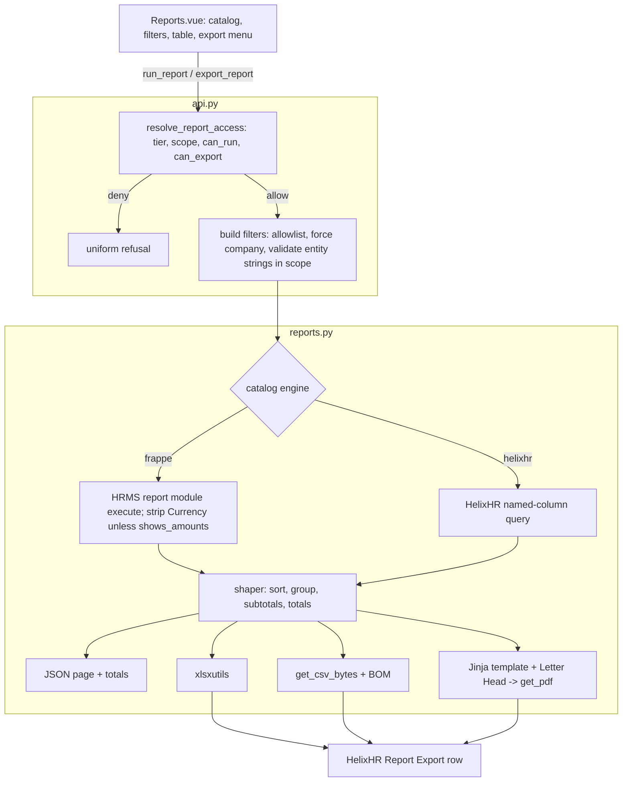
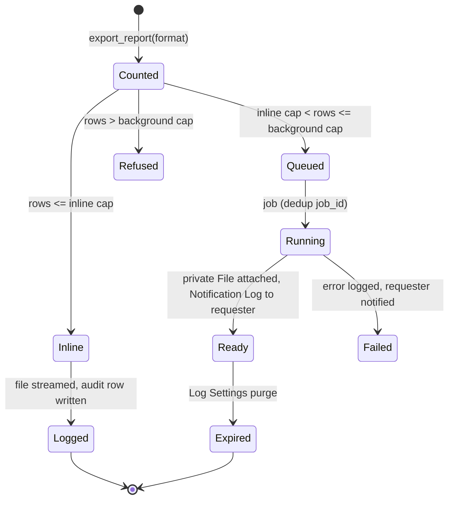

# feat: Report system -- searchable catalog, totals, Excel/CSV/PDF export, per-report access

## Summary

Rebuild Reports into the portal's HR report system. A curated catalog covers Time & projects, Attendance & shifts, Leave, and People & lifecycle. Every report gets scoped typeahead filters, grouping with server-computed subtotals and totals, and server-side Excel, CSV and branded PDF export.

The flagship report is a customer-ready monthly project timesheet: a task × day grid followed by per-day detail, approved hours only, on the company Letter Head.

Access becomes a per-report matrix. HR Manager, System Manager and a new portal-only `HelixHR Report Manager` role reach everything in their company. HR Manager decides, per report, whether HR User and Delivery Manager may run it and export it. Saved views and background exports complete the set.

---

## Problem Frame

Reports today (`frontend/src/pages/Reports.vue`) render seven curated HRMS reports and a billable-hours view inside the portal. That is all they do:

- Filters are free-text ID boxes ("Employee ID", "Project ID"). HR has to know internal names.
- The table stops at 100 rows, has no sorting, grouping or totals, and nothing can leave the portal except through Desk's toolbar. Portal-only roles cannot reach Desk.
- `get_billable_hours` counts draft timesheets (`docstatus != 2`). Nothing produces a document HR can send to a customer.
- Only HR Manager and System Manager pass `resolve_admin_scope`. HR User has no portal reach at all. Delegating "this person may see leave reports but not export them" is impossible.
- Several HR questions have no HRMS report at all: monthly hours per project for a customer, missing timesheets, headcount trend, joiners and leavers, late-arrival counts, who is out.

There is also a standing architecture rule (`docs/architecture.md`, *Phase 6* paragraph; plan 2026-09-17-001 P6-R11 / P6-KTD2): "the portal never re-implements a report or an export path." This plan reverses that rule on purpose and within bounds (KTD1). The reversal must be visible in the docs, not quietly bypassed.

---

## Requirements

**Catalog and running**

- R1. Reports offers a curated catalog in four families: Time & projects, Attendance & shifts, Leave, People & lifecycle. Each entry is named by the question it answers. Payroll is excluded.
- R2. Where HRMS ships a report, the portal runs HRMS's own logic. HelixHR writes a query only where HRMS has no report.
- R3. No catalog entry exposes a billing or costing rate or amount. Currency columns are removed from wrapped output, except on entries declared to show expense amounts.
- R4. A search box on the Reports page filters the catalog by name and question text.

**Filters and search**

- R5. Every entity filter (employee, project, task, department, branch, designation, leave type, shift type, request category) is a typeahead picker. It only offers records inside the caller's scope.
- R6. Date filters offer presets: This month, Last month, This quarter, Last quarter, Custom. Monthly reports use a month picker.
- R7. The URL carries the report, its filters and its grouping. Opening a link reproduces the view for anyone allowed to run that report, narrowed to their own scope.

**Results and calculations**

- R8. A report can be grouped by up to two catalog-allowed dimensions, with subtotals per group and a grand total. Totals are computed on the server over the full result. The screen and every export show the same numbers.
- R9. Results sort by any column and paginate. Above the screen cap, the page says how many rows exist and offers export.
- R10. Hours show as decimal with two places. Each row is rounded once and the rounded values are summed, so column totals always add up to the grand total.

**Export**

- R11. A caller with the export right can export any report they can run as Excel, CSV or PDF. Run and export are separate rights.
- R12. A PDF carries the company Letter Head (falling back to logo and name), the report title, a filter summary, generated-by and generated-at, and "Page X of Y".
- R13. CSV neutralises formula injection and opens correctly in Excel. Excel cells are typed: numbers as numbers, dates as dates, IDs as text.
- R14. Every export is recorded: who, which report, the normalised filters, format, row count, and whether it ran inline or in the background. HR Manager can read this log in the portal.
- R15. An export above the inline cap runs in the background. The requester gets a portal notification. Only the requester can download the file, and it expires.

**Monthly project timesheet (flagship)**

- R16. Choosing a project and a month produces a task × day grid with row and column totals. A per-day detail section follows (date, employee, task, note, hours), with daily subtotals and a grand total.
- R17. Only approved timesheets count. Hours still awaiting approval in that month are stated as excluded, never silently dropped. No money appears.
- R18. The grid marks weekends and company holidays and prints landscape. The PDF ends with a sign-off block.

**Access**

- R19. HR Manager, System Manager and HelixHR Report Manager can run and export every catalog report, scoped to their company.
- R20. HR Manager and System Manager set, per report, whether HR User and Delivery Manager may run it and whether they may export it. A report with no setting is denied.
- R21. Delivery Manager can only be granted reports that support project scope. Their results cover only projects they are a member of.
- R22. Every check runs on the server. A report that does not exist and a report the caller may not run get the same refusal.
- R23. HelixHR Report Manager is portal-only, and preflight keeps it that way. No portal role gains a doctype-wide `report` permission on Timesheet.
- R24. HR User's new reach is reports only. People, Settings and the other admin screens stay closed to them.

**Saved views**

- R25. A user can save a named view of a report (filters, grouping, sort, hidden columns) as private or shared.
- R26. A shared view runs as the viewer, narrowed to the viewer's scope. The page says so when filters were narrowed.
- R27. Owners edit and delete their own views. HR Manager can delete any shared view.

**Documentation**

- R28. `docs/architecture.md` records the reversal of the "never re-implements a report or export" rule, and the bounds that still hold.

---

## Key Technical Decisions

- KTD1. **The portal shapes and exports; HRMS still computes HR facts.** HelixHR owns grouping, totals, layout and export. It never re-derives what HRMS owns: leave balances, attendance status, ledger effects. Those come from HRMS's own report logic (R2). This is the bound that keeps the reversal of P6-KTD2 honest.

- KTD2. **Gate in HelixHR, then execute the native report's module directly. Never call `frappe.desk.query_report.run` as the portal user.**
  - `run` enforces Report roles and `has_permission(ref_doctype, "report")`. A portal-only role holds neither. Granting them would open Desk's report endpoint to every report on that doctype, the Timesheet exploit class (plan 2026-09-20-001 KTD3).
  - HelixHR resolves access (KTD5), builds the filter dict from an allowlist, forces company, validates entity filters as plain in-scope strings (the existing `run_portal_report` hardening), then invokes the report's `execute` through Frappe's Report object.
  - The path must avoid `execute_script_report`'s timing wrapper. That wrapper permanently flips a report to `prepared_report` after one 15s run, after which the portal would get no rows.
  - Preflight asserts every wrapped report exists, is a standard Script Report, is enabled, and has `prepared_report` off.

- KTD3. **Anything over Timesheet is a HelixHR query with a named column list.** This carries plan 2026-09-20-001 KTD3 forward. `Timesheet Billing Summary`, `Project Profitability` and `Project-wise Stock Tracking` sit on a deny list that preflight enforces. `Employee Hours Utilization` and `Daily Timesheet Summary` are money-free and may be wrapped, but only for company-scoped tiers. They have no project scope, so Delivery Manager never gets them.

- KTD4. **Catalog in code, access in data.**
  - Each catalog entry is a code constant: key, family, label, question, engine, filter specs and their mapping, group-by options, totals spec, scopes it supports, PDF orientation, and `shows_amounts`.
  - Adding a report is a release. That matches `ADMIN_REPORTS` and the `*_EDITABLE_FIELDS` posture.
  - The run/export matrix for HR User and Delivery Manager is data HR edits: one `HelixHR Report Access` record per report key. A missing record means deny.

- KTD5. **One resolver: `resolve_report_access(user, report_key)`.** It returns the tier, the company scope, the project scope, `can_run` and `can_export`. Every report endpoint consumes it, and it reuses `resolve_admin_scope` and `resolve_project_scope` rather than re-deriving either. A user with several roles gets the union of rights. Scope comes from the widest tier they hold.

- KTD6. **Report Manager and HR User need an Active Employee anchor.** The anchor's company is their scope. No anchor, or an inactive one, resolves to none. HR Manager's anchorless Desk-only persona stays unscoped as today, but that exception is not extended to the new tiers.

- KTD7. **One server-side shaper feeds every output.** One function takes rows, columns, group-by and the totals spec. It returns ordered rows with typed subtotal and total rows. The screen, CSV, Excel and PDF all render that output (R8, R10). The client never computes a total.

- KTD8. **Export engines: Frappe's own, no new dependencies.**
  - Excel: `frappe.utils.xlsxutils.make_xlsx` (xlsxwriter in v16). Own the workbook to get title rows and multiple sheets.
  - CSV: `frappe.desk.utils.get_csv_bytes`, which escapes formulas, with a UTF-8 BOM.
  - PDF: `frappe.utils.pdf.get_pdf` (wkhtmltopdf) from a server-rendered Jinja template in `helixhr/templates/reports/`. Templates use tables only, since QtWebKit has no flex or grid.
  - Images are inlined as base64. Page numbers use wkhtmltopdf's `footer-center` option, because footer JS is disabled.
  - The Chrome generator is the upgrade path once Chromium is provisioned.

- KTD9. **Letter Head resolution, and its content stays static.**
  - Order: `Company.default_letter_head`, then the default Letter Head, then `Company.company_logo` plus the company name, then the name alone.
  - Letter Head `content` and `footer` are inserted as static HTML. They are not evaluated as Jinja (lesson: `restrict_globals` is not a sandbox). Image sources are rewritten to data URIs, and Letter Head scripts are dropped.

- KTD10. **Inline downloads for small exports, a background job above the cap. One doctype is both audit log and file holder.**
  - Inline exports use a GET endpoint, following the `download_my_payslip` pattern: `Content-Disposition: attachment`, `no-store`, a concurrency limit.
  - Above the cap, `frappe.enqueue` uses a deduplicating `job_id`.
  - Every export writes a `HelixHR Report Export` row. Background exports attach a private File to it.
  - DocPerm is owner-only for every role, so File download (which keys on read of the attached doc) stays requester-only. HR Manager reads the audit log through a portal method that returns metadata, never the file.
  - Old rows and their files are purged through the `default_log_clearing_doctypes` hook (Log Settings), not a custom scheduler.

- KTD11. **Saved views are a small HelixHR doctype and always run as the viewer.** Frappe's `Report` (global names, Desk-visible, creation restricted) and `User Settings` (no names, no sharing) do not fit. A saved filter only ever narrows the viewer's own scope. Out-of-scope entity values are dropped, and the response flags it (R26).

- KTD12. **Endpoints stay in `helixhr/api.py`; report logic moves to a new `helixhr/reports.py`.** The catalog, the HelixHR queries, the shaper and the exporters are roughly 1,500 lines of non-endpoint logic. `project_permissions.py` is the precedent. `api.py` stays the single authorization boundary (memory: api-boundary-single-module).

- KTD13. **`run_report` replaces `run_portal_report` and `get_billable_hours`.** Their only frontend caller is `Reports.vue`. Their security tests in `helixhr/tests/test_api_reports.py` (operator-shaped filters, ignored kwargs, run-as, forced company, money columns) are ported to the new endpoint before the old ones go. `get_report_link` stays for a System User's secondary "Open in Frappe" on wrapped reports.

- KTD14. **Caps are named constants.**
  - Screen: up to 2,000 rows, with totals over the full set; the client sorts and pages within that.
  - Inline export: CSV/Excel 10,000 rows, PDF 1,500 rows.
  - Background export: CSV/Excel 100,000 rows, PDF 10,000 rows.
  - Above the background ceiling the request is refused with "narrow the filters".
  - These numbers are tunable during implementation; the shape is not.

- KTD15. **Report Manager gets company-pinned read DocPerms, never `report` or `export`.**
  - Some wrapped HRMS reports read through permission-aware APIs (`frappe.get_list`, match conditions): Employee Leave Balance, Shift Attendance, Employee Analytics, Employees Working on a Holiday. Run as a role with no read DocPerm, they return nothing.
  - Report Manager therefore gets `read` on exactly the doctypes those reports read. The grant goes through `apply_permission_deltas.py`. Each doctype is paired with `permission_query_conditions` and `has_permission` hooks that pin rows to the role holder's company (plan 2026-09-20-001 KTD6/KTD8 pattern).
  - HR User already holds these reads upstream. Delivery Manager never runs wrapped reports, so neither needs a grant.
  - The direct module call is `Report.execute_module`, which skips the prepared-report watcher (`frappe/core/doctype/report/report.py`, `execute_script_report`).

---

## High-Level Technical Design

### Request path



### Access decision

| Caller holds | Scope | Reports reachable | Run / export |
|---|---|---|---|
| Administrator, System Manager, HR Manager | `resolve_admin_scope` (company, or unscoped when anchorless) | All | Always |
| HelixHR Report Manager | Active Employee's company, otherwise none | All | Always |
| HR User | Active Employee's company, otherwise none | Those HR Manager granted | Per matrix |
| HelixHR Delivery Manager | `resolve_project_scope` projects | Project-scoped entries HR Manager granted | Per matrix |
| Anyone else | none | none | Uniform refusal |

### Export lifecycle



---

## Native Frappe HR report inventory and disposition

HRMS 16.18 and ERPNext 16.34 ship 22 non-payroll HR or project reports. Their disposition:

| Native report | Disposition | Why |
|---|---|---|
| Monthly Attendance Sheet | Wrap | Month/year adaptor; company required |
| Shift Attendance | Wrap | Late entry / early exit per row |
| Employees Working on a Holiday | Wrap | |
| Employee Leave Balance | Wrap | Ledger owns balances (KTD1) |
| Employee Leave Balance Summary | Wrap | |
| Leave Ledger | Wrap | |
| Employee Analytics | Wrap | Headcount by one dimension |
| Employee Exits | Wrap | Exit Interview based; HelixHR's joiners/leavers covers exits without an interview |
| Employee Hours Utilization | Wrap, company tiers only | Money-free, no project scope (KTD3) |
| Daily Timesheet Summary | Not offered | Covered by HelixHR hours report, which has project scope |
| Unpaid Expense Claim | Wrap, `shows_amounts` | Expense data, not billing rates |
| Employee Advance Summary | Wrap, `shows_amounts` | |
| Employee Information | Replace | Report Builder with no filters; a HelixHR directory query with filters |
| Employee Birthday | Replace | A HelixHR celebrations report adds anniversaries and hides birth year |
| Timesheet Billing Summary | Deny list | `billing_amount` |
| Project Profitability | Deny list | Salary and cost columns |
| Project-wise Stock Tracking | Deny list | Stock costs, not HR |
| Project Summary, Delayed Tasks Summary | Not offered | Project management, not HR |
| Appraisal Overview, Recruitment Analytics, Daily Work Summary Replies, Vehicle Expenses | Not offered | Outside the four requested families |

HelixHR queries fill the gaps HRMS leaves:

- Monthly project timesheet
- Hours by project, task and employee
- Missing timesheets
- Late and early summary
- Leave taken by type and month
- Who is out
- Employee directory
- Headcount trend
- Joiners and leavers with attrition
- Celebrations
- HR request aging

---

## Complexity assessment

The work is substantial but has no unknown technology. Every engine is already in the bench.

| Area | Complexity | Why |
|---|---|---|
| Access model | High | A new role, a new HR User tier, a per-report matrix, and bypassing Frappe's report permissions means HelixHR owns authorization end to end. This is where a leak would come from, so it is tested first. |
| Wrapping HRMS reports | Medium-high | Each report has its own filter quirks and output shape, and that shape can change on an HRMS upgrade. Per-report contract tests guard it. |
| PDF | Medium | wkhtmltopdf limits: no flex/grid, page numbers through options, images inlined, patched-Qt build required. Multi-page output needs visual checking. |
| Flagship timesheet | Medium | A 31-day grid in landscape, holiday marking, and the pending-hours footnote. |
| Background exports | Medium | The app's first `frappe.enqueue` use. Owner-only files, purge, notification. |
| Gap reports | Low-medium each | Plain SQL. Headcount trend and attrition need care with rehires and dates. |
| Saved views | Low | A small doctype, run as viewer. |

---

## Output Structure

```text
helixhr/
  reports.py                               # catalog, HelixHR queries, shaper, exporters (KTD12)
  templates/reports/
    report.html                            # generic PDF
    project_timesheet.html                 # flagship PDF
  helixhr/doctype/
    helixhr_report_access/                 # per-report matrix (KTD4)
    helixhr_report_export/                 # audit + file holder (KTD10)
    helixhr_report_view/                   # saved views (KTD11)
  patches/v1_0/seed_report_access.py
  tests/
    test_reports_access.py
    test_reports_catalog.py
    test_reports_shaper.py
    test_reports_export.py
    test_reports_project_timesheet.py
    test_report_views.py
frontend/src/
  components/reports/
    ReportCatalog.vue
    ReportFilters.vue
    EntityPicker.vue
    ReportTable.vue
    ExportMenu.vue
    SavedViews.vue
  components/settings/ReportAccessSection.vue
  lib/datePresets.js (+ .test.js)
  lib/reportQuery.js (+ .test.js)          # URL <-> filters
```

---

## Implementation Units

Units are grouped into four phases. Phase A is the foundation everything depends on. U2 lands before any new report is exposed.

### Phase A -- Foundation

### U1. Report Manager role, access matrix doctype, and resolver

**Goal:** Add the role, the per-report matrix, and `resolve_report_access`. Leave every existing report behaviour intact.

**Requirements:** R19, R20, R21, R22, R23, R24

**Dependencies:** none

**Files:**
- `helixhr/fixtures/role.json`
- `helixhr/hooks.py` (fixture role filter; permission hooks for KTD15)
- `helixhr/patches/v1_0/apply_permission_deltas.py`
- `helixhr/project_permissions.py` or `helixhr/utils.py` (company-pinning query conditions; follow where existing hooks live)
- `helixhr/helixhr/doctype/helixhr_report_access/` (json, controller)
- `helixhr/utils.py` (role constant, `resolve_report_access`)
- `helixhr/patches/v1_0/seed_report_access.py`
- `helixhr/patches.txt`
- `helixhr/install.py`
- `helixhr/preflight.py`
- `helixhr/tests/test_reports_access.py`
- `helixhr/tests/test_preflight.py`
- `helixhr/tests/utils.py`

**Approach:**
- Add `HelixHR Report Manager` with `desk_access: 0`.
- `HelixHR Report Access` is keyed by `report_key` and has four checks: HR User run, HR User export, Delivery Manager run, Delivery Manager export. Export without run is invalid, and the doctype validates that.
- DocPerm: HR Manager and System Manager read and write. No other role.
- The controller refuses Delivery Manager grants on entries that do not support project scope. That check reads the catalog, so it is wired in U2; U1 ships the field-level validation only.
- Seed defaults with an idempotent patch that `install.py` also calls:
  - HR User: run on attendance, leave and people reports without amounts; export off.
  - Delivery Manager: run and export on project-scoped time reports.
- `resolve_report_access` follows the decision table above.
- Grant Report Manager company-pinned `read` per KTD15. Add a dated `apply_permission_deltas` line and the paired hooks in `helixhr/hooks.py`. The doctype list is the set U2's wrapped reports read through permission-aware APIs; U1 starts with Employee, Attendance, Leave Application, Leave Allocation, Leave Ledger Entry, Shift Assignment and Shift Type, and U2 adjusts it.
- Extend preflight:
  - Add `check_report_manager_role`, modelled on `check_notification_manager_role`. It also fails if the role holds `report`, `export`, `write` or `create` on any doctype.
  - Widen `check_no_timesheet_report_permission` to cover every HelixHR fixture role, including Notification Manager, which it currently misses.

**Patterns to follow:** `check_delivery_manager_role` and `check_notification_manager_role` in `helixhr/preflight.py`; `resolve_admin_scope` in `helixhr/utils.py`; `apply_permission_deltas.py` for any DocPerm.

**Test scenarios:**
- HR Manager anchored to company A resolves to company A with run and export on every key. An anchorless HR Manager is unscoped.
- Report Manager with an Active Employee in company B is company B, full rights. With a Left Employee, or no Employee, they resolve to none.
- HR User with a matrix row granting run only: `can_run` is true and `can_export` is false. With no row, both are false.
- Delivery Manager granted a project-scoped entry gets project scope only. Saving a Delivery Manager grant on a company-only entry is refused.
- A user holding HR User and Delivery Manager gets the union of rights, and the scope comes from the HR User tier.
- An unknown `report_key` and a denied key return identical refusals.
- HR User still gets none from `resolve_admin_scope`: People and `get_person` are refused (R24).
- Preflight FAILs when Report Manager gains `desk_access`, `report` or `export` on any doctype, and when any fixture role holds `report` on Timesheet.
- Report Manager in company B calling `/api/resource/Employee` lists only company B employees, and `/api/resource/Employee/<company A id>` is refused. Same for Attendance and Leave Application.
- Report Manager calling `frappe.desk.query_report.run` for any HRMS report is refused (no `report` DocPerm).
- Saving a row with export on and run off fails validation.

**Verification:** The resolver tests pass for every tier. Preflight passes on a fresh site. Existing report tests are unchanged and still pass.

### U2. Catalog, runner, and shaper

**Goal:** Introduce `helixhr/reports.py` with the catalog, both engines and the shaper, and expose `run_report`. Retire `run_portal_report` and `get_billable_hours`.

**Requirements:** R1, R2, R3, R8, R9, R10, R22

**Dependencies:** U1

**Files:**
- `helixhr/reports.py`
- `helixhr/api.py` (`run_report`; remove the two old endpoints)
- `helixhr/utils.py` (`RATE_LIMIT_POLICY`; `ADMIN_REPORTS` removed or derived from the catalog)
- `helixhr/preflight.py` (`check_curated_reports` generalised)
- `helixhr/tests/test_reports_shaper.py`
- `helixhr/tests/test_api_reports.py` (ported)
- `helixhr/tests/test_upload_security.py` (rate-limit mirror)

**Approach:**
- Each catalog entry declares its filters by portal type (employee, project, task, department, date range, month, select) and how each maps to the engine's filter keys.
- The `frappe` engine follows KTD2: gate, allowlist, force company, then execute the module and strip Currency columns unless `shows_amounts`.
- The `helixhr` engine calls a named query function that receives the resolved scope.
- `run_report(report_key, filters, group_by, sort)` returns `{columns, rows (<= screen cap), total_rows, totals, groups_applied, narrowed}`.
- The shaper emits rows typed `row` / `subtotal` / `total`. It rounds hours per row before summing.
- Port the existing billable-hours behaviour as the first `helixhr` entry, now with an approved-only default (see U8). Port the seven curated reports as the first `frappe` entries.
- Preflight:
  - checks each `frappe` entry exists, is a standard Script Report, is enabled, and has `prepared_report = 0`;
  - checks no deny-listed report is in the catalog.

**Execution note:** Port the existing `TestRunPortalReport` and `TestGetBillableHours` security cases to `run_report` first, then remove the old endpoints.

**Patterns to follow:** the `run_portal_report` hardening comments in `helixhr/api.py`; `_BILLABLE_HOURS_FIELDS` as the named-column pattern; `_REPORT_NOT_OFFERED` for refusals.

**Test scenarios:**
- Happy path: HR Manager runs Employee Leave Balance for an in-scope employee and gets rows and columns. Totals are present for numeric columns.
- An HR User granted Leave Ledger runs it with no Leave Ledger Report role grant or `report` DocPerm added to HR User.
- Report Manager (a Website User) runs Monthly Attendance Sheet and gets rows. This proves `run` is not on the path.
- An `employee` filter shaped `["in", [...]]` is refused before execution.
- A `company` naming another company is overwritten with the caller's own.
- Extra keys, including one naming a user to run as, are ignored.
- A deny-listed report key gets the uniform refusal.
- Unpaid Expense Claim (`shows_amounts`) keeps its Currency columns. A wrapped report without the flag loses them.
- Shaper: group by employee then project yields subtotals per level. The grand total equals the sum of row values. Rows of 0.333 + 0.333 + 0.334 hours round per row and the totals agree.
- A result larger than the screen cap returns the cap's rows, the true `total_rows`, and totals over the full set.
- A report that raises inside HRMS returns a plain error sentence and logs it, and does not 500 the page.
- Preflight FAILs when a catalog report is disabled, renamed, or has `prepared_report` on.

**Verification:** Every ported security assertion passes against `run_report`. `test_no_money_fields` still passes. No caller of the removed endpoints remains in `frontend/src` or `helixhr/tests`.

### U3. Scoped filter options and the filter bar

**Goal:** Add one scoped typeahead endpoint, a reusable picker, date presets, and URL state.

**Requirements:** R5, R6, R7

**Dependencies:** U2

**Files:**
- `helixhr/api.py` (`search_report_options`)
- `helixhr/reports.py` (option sources per filter type)
- `helixhr/utils.py` (`RATE_LIMIT_POLICY`)
- `frontend/src/components/reports/EntityPicker.vue`
- `frontend/src/components/reports/ReportFilters.vue`
- `frontend/src/lib/datePresets.js`, `frontend/src/lib/datePresets.test.js`
- `frontend/src/lib/reportQuery.js`, `frontend/src/lib/reportQuery.test.js`
- `helixhr/tests/test_reports_access.py` (options scoping)

**Approach:**
- `search_report_options(report_key, filter, query)` resolves access for that report first.
- It only serves filter types the entry declares, and returns at most 20 `{value, label, description}` within scope. Employees are limited to the company scope. Projects and tasks are limited to project scope for Delivery Manager.
- Minimum query length 2, debounced 250 ms, following the People.vue and Projects.vue pattern.
- Presets are computed client-side in the user's calendar. Time reports default to Last month.
- `reportQuery.js` round-trips filters, grouping and sort to the route query.

**Patterns to follow:** `search_people` (`helixhr/api.py`) and its People.vue debounce; `get_directory` usage in Projects.vue.

**Test scenarios:**
- An HR User searching employees for a granted report gets only their company's Active employees. For an ungranted report, the uniform refusal.
- Delivery Manager searching projects gets only member projects. Searching employees on a project report returns only members of those projects.
- A filter type the entry does not declare is refused.
- Results are capped at 20, and a one-character query returns nothing.
- `datePresets`: "Last month" on 2026-01-15 gives 2025-12-01..2025-12-31. "This quarter" on 2026-05-20 gives 2026-04-01..2026-06-30. Leap-year February is handled.
- `reportQuery`: filters with arrays and dates survive a round trip. Unknown query keys are dropped.

**Verification:** Pickers work for every tier in e2e (U6). Unit tests pass.

### U4. Reports page rebuild

**Goal:** Replace `Reports.vue` with catalog search, family sections, the filter bar, a sortable grouped table, and correct nav gating.

**Requirements:** R1, R4, R7, R8, R9, R10, R24

**Dependencies:** U2, U3

**Files:**
- `frontend/src/pages/Reports.vue`
- `frontend/src/components/reports/ReportCatalog.vue`
- `frontend/src/components/reports/ReportTable.vue`
- `frontend/src/components/AppShell.vue` (nav gate)
- `frontend/src/lib/session.js`
- `frontend/src/router.js`
- `helixhr/api.py` (bootstrap `can_run_reports`; `get_report_catalog`)
- `frontend/tests/e2e/reports.spec.ts`

**Approach:**
- `get_report_catalog` returns only the entries the caller may run, with `can_export` per entry and filter specs. The page never decides access.
- Bootstrap gains `can_run_reports`, and the nav item gates on it rather than `peopleOnly`. This fixes Delivery Manager's missing nav entry.
- The table:
  - is a real `<table>` with a caption;
  - has a sort button inside each `th` with `aria-sort`;
  - renders subtotal rows with distinct styling;
  - has a sticky header and a sticky grand-total row with `scroll-padding`;
  - paginates 50 per page client-side within the screen cap;
  - announces result counts in an `aria-live` region.
- Empty state distinguishes "no data in this period" from "filters matched nothing". Errors keep AsyncState's retry.
- A System User keeps "Open in Frappe" for `frappe`-engine entries via `get_report_link`.
- People.vue's report entry still deep-links with `?employee=`.

**Patterns to follow:** `AsyncState.vue`, `PageHeader.vue`, `lib/navGroups.js`, the existing phone-scroll treatment in `Reports.vue`.

**Test scenarios:**
- HR Manager sees four families. Searching "late" narrows the list to the late-and-early entry.
- HR User sees only granted entries and has no People nav item. Delivery Manager sees a Reports nav entry with only project reports.
- Opening a link with filters in the URL runs the report with them. An HR User opening an HR Manager's link for an ungranted report sees the refusal state.
- Sorting by hours descending orders rows within each group. Subtotal rows stay attached to their group.
- A 2,500-row result shows 2,000 rows, states the true total, and offers export.
- Numeric cells are right-aligned and tabular. The table scrolls inside its container on a phone viewport.
- An employee and an IT Team user see no Reports nav entry, and the route shows the no-access card.

**Verification:** e2e covers HR Manager, HR User, Delivery Manager and employee. `yarn lint` and `yarn build` are clean.

### U5. Inline export: CSV, Excel, generic PDF, audit log

**Goal:** Export any runnable report inline as CSV, Excel or a branded PDF, and record every export.

**Requirements:** R11, R12, R13, R14

**Dependencies:** U2, U4

**Files:**
- `helixhr/reports.py` (exporters, Letter Head resolution)
- `helixhr/api.py` (`export_report` GET; `get_export_log`)
- `helixhr/templates/reports/report.html`
- `helixhr/helixhr/doctype/helixhr_report_export/`
- `helixhr/hooks.py` (`default_log_clearing_doctypes`)
- `helixhr/utils.py` (`RATE_LIMIT_POLICY`)
- `frontend/src/components/reports/ExportMenu.vue`
- `helixhr/tests/test_reports_export.py`

**Approach:**
- `export_report(report_key, format, filters, group_by, sort)` resolves access and requires `can_export`. It runs the same runner and shaper path as the screen, with no screen cap, then branches by row count (KTD14).
- Excel: one sheet. Title rows (report, company, period, filters, generated at) sit above the header. Subtotal and total rows are bold. Numbers and dates are typed.
- CSV: `get_csv_bytes` plus a BOM. Subtotal rows are labelled in the first column.
- PDF:
  - The generic template has a Letter Head header repeated per page, a title, a filter summary, and a table with a repeated `thead`.
  - Footer carries generated-by, generated-at with timezone, and Page X of Y.
  - Orientation comes from the catalog entry, defaulting to landscape when there are more than six visible columns.
- Filename: `helixhr_<report-key>_<period>_<YYYYMMDDTHHMM>.<ext>`. ASCII only, no person names, RFC 5987 `filename*`.
- The audit row stores user, report key, normalised filters, format, row count and `mode = inline`.
- `get_export_log` is HR Manager and System Manager only, paginated, and returns metadata.

**Patterns to follow:** `download_my_payslip` (`helixhr/api.py`) for the GET response headers and `frappe.concurrent_limit`; `_logo_url` in `helixhr/reminders.py` for the company logo lookup.

**Test scenarios:**
- An HR User with run but not export is refused export. With export, they receive a file and an audit row exists.
- CSV starts with a BOM. A note `=HYPERLINK("x")` is written escaped. Negative and decimal hours stay numeric.
- Excel totals equal screen totals for the same filters (same shaper). A date column is a date cell.
- PDF:
  - With Company A's default Letter Head, the PDF contains that header. With none, the company logo and name. With no logo, the name only.
  - A Letter Head containing Jinja syntax is rendered literally, not evaluated.
  - A Letter Head image stored as a private file is embedded, not linked.
- PDF bytes start with `%PDF`. Multi-page output includes page numbering in the wkhtmltopdf options.
- The response has `Content-Disposition: attachment` and `Cache-Control: no-store`.
- Export of a deny-listed or unknown report gets the uniform refusal.
- `get_export_log` is refused to HR User and Report Manager.
- When the PDF generator is missing, the user gets a plain error sentence and the error is logged. The existing preflight check already reports this.

**Verification:** Exports open in LibreOffice/Excel with the expected types. PDF visual check on a two-page report. The audit rows are correct.

### U6. Access matrix in Settings

**Goal:** HR Manager edits who may run and export each report.

**Requirements:** R20, R21

**Dependencies:** U1, U2

**Files:**
- `helixhr/api.py` (`get_report_access`, `save_report_access`)
- `frontend/src/components/settings/ReportAccessSection.vue`
- `frontend/src/pages/Settings.vue`
- `helixhr/tests/test_reports_access.py`
- `frontend/tests/e2e/reports.spec.ts`
- `helixhr/tests/utils.py` (HR User and Report Manager Playwright identities)

**Approach:**
- Rows are catalog entries grouped by family. Columns: HR User run/export and Delivery Manager run/export.
- Cells that the catalog forbids (Delivery Manager on company-only entries) render disabled with a reason.
- Turning export on also turns run on. Turning run off also turns export off.
- `save_report_access` takes a batch of rows. It allows HR Manager and System Manager only, uses an allow-listed field set, and calls `doc.save()` so validation runs.
- HR Manager and Report Manager rights are shown as fixed, read-only.

**Patterns to follow:** `save_request_category`, `_assert_config_write`, `_apply_allowed_fields` in `helixhr/api.py`; `CategoriesSection.vue`.

**Test scenarios:**
- HR Manager grants HR User export on Leave Ledger. The HR User's next catalog call shows `can_export`, and the export succeeds.
- Revoking run removes the entry from the HR User's catalog. A direct `run_report` call is refused.
- Report Manager and HR User calling `save_report_access` are refused.
- A batch containing an unknown key or a forbidden Delivery Manager cell is rejected whole, with no partial save.
- e2e: HR Manager toggles a cell. A second identity (HR User) sees the change after reload.

**Verification:** Matrix changes take effect immediately, server-side. e2e passes.

### Phase B -- Flagship

### U7. Monthly project timesheet

**Goal:** A customer-ready monthly timesheet per project on screen, in Excel and as a PDF.

**Requirements:** R16, R17, R18, R10, R12

**Dependencies:** U2, U5

**Files:**
- `helixhr/reports.py` (query, grid shaping)
- `helixhr/templates/reports/project_timesheet.html`
- `frontend/src/components/reports/ReportTable.vue` (grid mode)
- `helixhr/tests/test_reports_project_timesheet.py`
- `frontend/tests/e2e/reports.spec.ts`

**Approach:**
- Filters: project (picker, scoped) and month (required). An "Hours basis" option chooses all hours or billable hours, defaulting to all.
- The query reads `Timesheet Detail` joined to `Timesheet` with `docstatus = 1`, on a named column list: date, employee name, task subject, description as the note, hours, billing hours. A separate count sums `docstatus = 0` hours for the footnote.
- Rows with no task group under "(No task)".
- The grid is tasks × days 1..N of the month, with row totals, a day-total row and a grand total. Detail rows are grouped by date with daily subtotals.
- Weekends are shaded. Holidays from the project company's default Holiday List are marked "H" with a legend, and the marking survives greyscale.
- PDF:
  - Landscape A4. Grid on the first page or pages, then the detail section.
  - Header: Letter Head, project name, `Project.customer` when set, period.
  - Ends with "Prepared by" (the generator, with date) and a blank "Customer approval" signature block.
  - Footnote: "N h awaiting approval are not included" when N > 0.
- Excel has two sheets, Grid and Detail. CSV is the detail rows only.
- Delivery Manager can run this for member projects when granted (default granted).

**Technical design (directional):** The grid is a pivot of detail rows: `key = (task, day)`, `value = Σ hours`. Row totals are `Σ` over days. Column totals are `Σ` over tasks. Grand total is `Σ` of rows and must equal `Σ` of the detail. One shaped structure feeds the screen, Excel and PDF (KTD7).

**Test scenarios:**
- Happy path: two employees, two tasks, three days, approved. Grid cells, row totals, column totals and the grand total match. The detail grand total equals the grid's grand total.
- A draft timesheet in the same month is excluded from all figures, and the footnote states its hours.
- A timesheet row with no task appears under "(No task)".
- A month with 28, 30 and 31 days renders the right number of columns.
- A row whose `from_time` falls on the last day of the month counts in that month. A row on the next month's first day does not.
- A company holiday is marked in the grid header. A weekend is shaded.
- "Billable hours" basis sums `billing_hours`.
- A Delivery Manager asking for a non-member project gets the uniform refusal. A member project works.
- No money: no column or template variable carries a rate or amount (`test_no_money_fields` covers the source).
- A note containing `<script>` renders escaped in the PDF.
- A project with no approved hours in the month shows an empty state, and the export says "No approved hours in this period."

**Verification:** A visually checked PDF for a 31-day month with about 8 tasks fits the grid on one landscape page. Excel opens with two typed sheets.

### Phase C -- Catalog

### U8. Time and projects reports

**Goal:** Add the remaining time reports.

**Requirements:** R1, R2, R3, R17, R21

**Dependencies:** U2

**Files:**
- `helixhr/reports.py`
- `helixhr/tests/test_reports_catalog.py`

**Approach:**
- **Hours by project, task and employee.** Replaces billable hours. Group-by options are employee, project, task and date. It shows hours and billable hours. "Include pending approval" is off by default, and when on, pending rows are marked.
- **Missing timesheets.** For each Active in-scope employee who is a member of any project (toggle), and each Monday–Sunday week in the period (KTD10 of plan 2026-09-02-001), it shows hours logged, the timesheet state (none, draft, pending, approved), and approved leave days that week.
- **Employee Hours Utilization.** Wrapped. Company tiers only.

**Test scenarios:**
- Hours by project for a Delivery Manager covers only member projects. With "include pending" off, a draft row is absent. With it on, the row is present and marked.
- Missing timesheets lists an employee with no timesheet in a week as "none". An employee with approved leave all week shows the leave days alongside.
- Employee Hours Utilization is absent from a Delivery Manager's catalog, and a direct `run_report` call is refused.

**Verification:** Each entry runs for HR Manager and for one restricted tier in tests.

### U9. Attendance and shifts reports

**Goal:** Wrap the native attendance reports and add a late-and-early summary.

**Requirements:** R1, R2, R6

**Dependencies:** U2

**Files:**
- `helixhr/reports.py`
- `helixhr/tests/test_reports_catalog.py`

**Approach:**
- **Monthly Attendance Sheet.** The month picker maps to `filter_based_on = Month` with month and year. Company is forced.
- **Shift Attendance** and **Employees Working on a Holiday**: wrap them, mapping filters.
- **Late and early summary (HelixHR).** Per employee per month, it counts submitted Attendance with `late_entry` and with `early_exit`, grouped by department.

**Test scenarios:**
- Monthly Attendance Sheet for a month returns per-day columns with no company supplied by the client.
- A Date Range over 90 days on any wrapper that forwards to HRMS's limit returns HRMS's message as a plain sentence.
- Late and early summary counts two late entries and one early exit for a seeded employee. Cancelled attendance is not counted.

**Verification:** Each entry runs for HR Manager and for a granted HR User.

### U10. Leave reports

**Goal:** Wrap the native leave reports and add leave-taken and who-is-out.

**Requirements:** R1, R2, KTD1

**Dependencies:** U2

**Files:**
- `helixhr/reports.py`
- `helixhr/tests/test_reports_catalog.py`

**Approach:**
- **Employee Leave Balance**, **Leave Balance Summary** and **Leave Ledger**: wrap them. HelixHR never recomputes a balance.
- **Leave taken by type and month.** Counts approved, submitted Leave Applications by type and the month of `from_date`. The page states that limitation in the report's description (see Deferred).
- **Who is out.** Approved leave overlapping the date range, one row per person per application. A toggle adds pending applications, marked as pending.

**Test scenarios:**
- Leave Balance figures for a seeded allocation equal HRMS's own report output for the same filters, which proves no re-derivation.
- Leave taken counts a rejected application zero times and a cancelled one zero times.
- Who is out shows leave that starts before the range and ends inside it. It excludes leave that ended before the range.

**Verification:** Each entry runs for HR Manager and for a granted HR User.

### U11. People and lifecycle reports

**Goal:** The directory, headcount, joiners and leavers, exits, celebrations, request aging, and expense and advance reports.

**Requirements:** R1, R2, R3

**Dependencies:** U2

**Files:**
- `helixhr/reports.py`
- `helixhr/tests/test_reports_catalog.py`

**Approach:**
- **Employee directory.** A fixed allowlisted column set: Employee Information's twelve fields, all permlevel 0. Filters: department, designation, branch, employment type, status.
- **Headcount.** Wraps Employee Analytics.
- **Headcount trend.** Month-end counts over a range: employees with `date_of_joining <= month_end` and no `relieving_date`, or one after `month_end`.
- **Joiners and leavers.** Lists by period. Summary: joiners, leavers, and attrition = leavers / average of start and end headcount.
- **Employee Exits.** Wrapped.
- **Celebrations by month.** Birthday as day and month only, never year or age. Work anniversary with years of service.
- **HR request aging.** Open HR Requests by category, status, routed role and assignee, with age-in-days buckets. It never reads `details`, `hr_note` or any `correction_*` field.
- **Unpaid Expense Claim** and **Employee Advance Summary.** Wrapped with `shows_amounts`.

**Test scenarios:**
- The directory never returns a field outside its allowlist, even when the client requests a column.
- Headcount trend: an employee joining mid-month counts from that month-end. One relieved mid-month stops counting at that month-end.
- Attrition with a starting headcount of 0 reports "n/a", not a division error.
- Celebrations output contains no year of birth.
- HR request aging rows contain no `details` or `correction_*` keys. A closed request is excluded.
- Expense claim output keeps amounts. Headcount output contains no Currency column.

**Verification:** Each entry runs for HR Manager and for a granted HR User.

### Phase D -- Saved views, background export, docs

### U12. Saved views

**Goal:** Named private or shared views per report, run as the viewer.

**Requirements:** R25, R26, R27, R7

**Dependencies:** U4

**Files:**
- `helixhr/helixhr/doctype/helixhr_report_view/`
- `helixhr/api.py` (`list_report_views`, `save_report_view`, `delete_report_view`)
- `helixhr/utils.py` (`RATE_LIMIT_POLICY`)
- `frontend/src/components/reports/SavedViews.vue`
- `helixhr/tests/test_report_views.py`

**Approach:**
- Fields: `report_key`, `label` (unique per owner and report), `query` (the same shape as the URL state from U3), `visibility` (Private or Shared).
- Listing returns the caller's own views plus shared views for reports the caller can run.
- Applying a view goes through `run_report` as the viewer. Entity values outside the viewer's scope are dropped, and the response sets `narrowed`, which the page shows as a notice.
- HR Manager can delete shared views. Only the owner edits.
- A view whose report the owner can no longer run is hidden from them, not deleted.

**Test scenarios:**
- An HR Manager shares a view filtered to an employee in company A. An HR User in company A sees and runs it.
- A Report Manager in company B opening the same view gets `narrowed` true and no company-A rows.
- A private view is invisible to others, and a direct fetch by name is refused.
- Duplicate label for the same owner and report is refused.
- A non-owner, non-HR-Manager delete of a shared view is refused. HR Manager's delete succeeds.

**Verification:** Views work end to end in e2e for HR Manager and HR User.

### U13. Background exports

**Goal:** Large exports run as a job. The requester is notified and alone can download.

**Requirements:** R15, R14

**Dependencies:** U5

**Files:**
- `helixhr/reports.py` (job function)
- `helixhr/api.py` (`export_report` queue branch; `list_my_exports`)
- `helixhr/helixhr/doctype/helixhr_report_export/` (status, file)
- `frontend/src/components/reports/ExportMenu.vue`
- `frontend/src/pages/Notifications.vue` (`ROUTE_FOR_DOCTYPE` entry)
- `helixhr/tests/test_reports_export.py`

**Approach:**
- The queue branch creates the export row (status Queued) and enqueues with `job_id = report-export:<row>`, deduplicated.
- The job runs as the requester, re-resolves access at run time, writes a private File attached to the row, sets status Ready, and inserts a Notification Log routed to Reports.
- On failure the job logs the error, sets status Failed, and notifies the requester.
- The export menu shows "Preparing…" and disables a duplicate request while one is queued. A "My exports" list shows Ready files.
- Rows and files older than 7 days are purged through `clear_old_logs`.

**Test scenarios:**
- A result between the inline cap and the background cap queues and returns immediately. Running the job directly attaches a file, and the row is Ready.
- The File is downloadable by the requester and refused to another HR Manager. The owner-only DocPerm and the File permission chain are verified on the `/private/files` path.
- Access revoked between enqueue and run makes the job end Failed with no file.
- A second identical request while the first is Queued returns the existing row.
- Above the background cap, the request is refused with the narrowing message.
- `clear_old_logs` deletes an 8-day-old row and its File, and keeps a 6-day-old one.

**Execution note:** `frappe.enqueue` commits. Name every seeded row and delete it explicitly, and never assert against an empty baseline (runbook isolation notes).

**Verification:** The job path works on a bench with workers running. A notification appears and the download works for the requester only.

### U14. Documentation and decision records

**Goal:** Record the reversal, the access model and the operational needs.

**Requirements:** R28

**Dependencies:** U1–U13

**Files:**
- `docs/architecture.md`
- `docs/runbook.md`
- `README.md`
- `docs/deployment.md`

**Approach:**
- Architecture:
  - Replace the "never re-implements a report or an export path" sentence with KTD1's bound, the access model (KTD4–KTD6), and the KTD2 execution path.
  - Note that Desk access to HRMS reports is governed by Frappe's own Report roles, not this matrix.
- Runbook entries:
  - wkhtmltopdf patched-Qt check;
  - a Letter Head image not appearing;
  - a report flipped to prepared mode;
  - exports stuck Queued with workers down.
- README: the Reports row and screenshot.
- Deployment: workers required for background exports.

**Test expectation:** none -- documentation only.

**Verification:** The docs match the shipped behaviour. Preflight messages and runbook headings agree.

---

## Scope Boundaries

- Payroll reports and any salary or CTC figure stay out of the portal.
- No billing or costing rate or amount anywhere, including the customer timesheet.
- Reports outside the four families (appraisal, recruitment, vehicle, project management) are not offered.
- The matrix governs the portal only. Desk access to HRMS reports stays under Frappe's Report roles.

### Deferred to Follow-Up Work

- Scheduled email of reports (Frappe's `Auto Email Report`, or a HelixHR job reusing U5's exporters).
- Charts and KPI cards above reports.
- A portal custom report builder.
- hh:mm hours format as a user or site setting.
- Customer report covering several projects of one Customer.
- Approver names and approval dates printed in the customer timesheet.
- Per-employee Holiday Lists in the grid. v1 uses the company default.
- Leave spanning two months split by day in "Leave taken by type and month". v1 uses the `from_date` month.
- Syncing the matrix into Frappe `Custom Role` so Desk honours it too.
- Narrowing HR User's upstream `report`/`export` on Timesheet in Desk. This is an existing leak noted in plan 2026-09-20-001, unchanged here.
- Granting the HelixHR Report Manager role from the portal. It is assigned in Desk by a System Manager for now.
- Chrome PDF generator once Chromium is provisioned.

---

## Risks & Dependencies

| Risk | Mitigation |
|---|---|
| An HRMS upgrade changes a wrapped report's filters or columns | Per-entry contract tests in `test_reports_catalog.py` assert expected column fieldnames. Preflight asserts the report exists and is enabled. |
| Report Manager's read grants (KTD15) widen REST reach | Company-pinned hooks on every granted doctype. REST-route tests per doctype. Preflight refuses `report`, `export` and writes on the role. |
| Bypassing Frappe's report permission check leaks rows | Access tests come first (U1, U2). Company is forced and entity filters validated on every call. Run on a fresh site with strict user permissions (memory: fresh-site-is-the-real-gate). |
| A slow HRMS report flips to prepared mode | The KTD2 execution path avoids the timing wrapper. A preflight check catches a flipped report. |
| wkhtmltopdf missing or unpatched in production | The existing `check_pdf_generator`. A runbook entry for the patched-Qt check. A plain error to the user. |
| Letter Head images fail in Docker (`host_name` resolution) | Inline images as data URIs (KTD9). |
| Heavy reports load the workers | Rate limits per endpoint, `frappe.concurrent_limit` on export, and the caps in KTD14. |
| Background jobs depend on RQ workers | Deployment doc. A Queued row past a threshold shows "still preparing". |
| HR User holders already reach HRMS reports in Desk | Documented in architecture. Desk sync deferred. |

---

## System-Wide Impact

- **Authorization boundary.** A new tier (HR User for reports) and a new role. `api.py` remains the single boundary. `resolve_report_access` joins `resolve_admin_scope` and `resolve_project_scope` as a scope source of truth.
- **Data lifecycle.** Exported files are new HR-data copies at rest. They are owner-only, purged after 7 days, and every export is audited.
- **Background infrastructure.** This is the first `frappe.enqueue` use in the app. Workers become a dependency for large exports only.
- **Upstream coupling.** Wrapped HRMS reports become a contract surface. HRMS upgrades need the catalog contract tests to stay green.
- **People.vue and Notifications.vue.** Deep links and the notification route map change. Both are covered in U4 and U13.

---

## Sources & Research

- Current code:
  - `helixhr/api.py` (`run_portal_report`, `get_billable_hours`, `get_report_link`, `download_my_payslip`, `get_portal_bootstrap`)
  - `helixhr/utils.py` (`ADMIN_REPORTS`, `resolve_admin_scope`, `resolve_project_scope`, `RATE_LIMIT_POLICY`)
  - `helixhr/preflight.py` (`check_no_timesheet_report_permission`, `check_curated_reports`, `check_pdf_generator`)
  - `frontend/src/pages/Reports.vue`
- Prior plans:
  - `docs/plans/2026-09-17-001-feat-hr-people-view-and-reports-plan.md` (P6-KTD2, the rule reversed here)
  - `docs/plans/2026-09-20-001-feat-projects-tasks-billable-reports-plan.md` (KTD3, the Timesheet `report` exploit; R8, the no-money rule)
- Frappe v16 source (16.33.1):
  - `frappe/desk/query_report.py` (`run` permission chain, `build_xlsx_data`, `add_total_row`)
  - `frappe/core/doctype/report/report.py` (`execute_script_report` prepared-report flip)
  - `frappe/utils/xlsxutils.py` (`make_xlsx`, xlsxwriter)
  - `frappe/desk/utils.py` (`get_csv_bytes`)
  - `frappe/utils/pdf.py` (`get_pdf` options, header/footer extraction)
  - `frappe/printing/doctype/letter_head/letter_head.py`
  - `frappe/utils/background_jobs.py` (`enqueue` dedup)
  - `frappe/core/doctype/file/file.py` (download permission chain)
- HRMS v16 source (16.18.1): `hrms/hr/report/*`. ERPNext 16.34.2: `erpnext/projects/report/*`. These give the inventory and money-column findings above.
- External:
  - Frappe forum, v16 wkhtmltopdf page numbers in footer-html: https://discuss.frappe.io/t/frappe-v16-35-0-wkhtmltopdf-dynamic-page-x-y-in-footer-html/165008
  - frappe#41443, Chrome PDF drops Letter Head footer: https://github.com/frappe/frappe/issues/41443
  - hrms#5354, #3723, #2563: attendance and leave report quirks.
  - OWASP CSV injection: https://owasp.org/www-project-web-security-testing-guide/latest/4-Web_Application_Security_Testing/07-Input_Validation_Testing/21-Testing_for_CSV_Injection
  - W3C APG sortable table: https://www.w3.org/WAI/ARIA/apg/patterns/table/examples/table/
  - Clockify duration format and Harvest approvals, for the timesheet export conventions behind R10 and R17.
