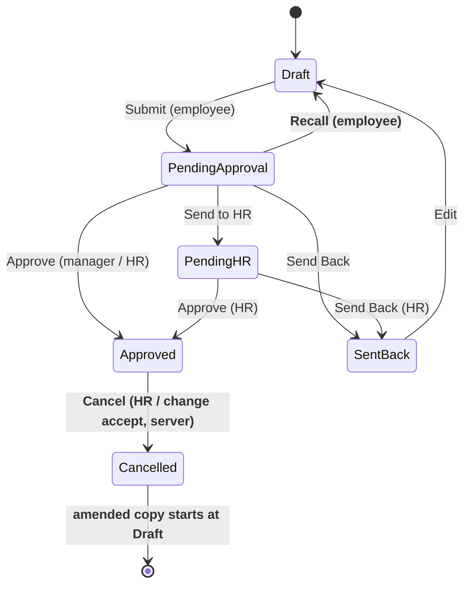
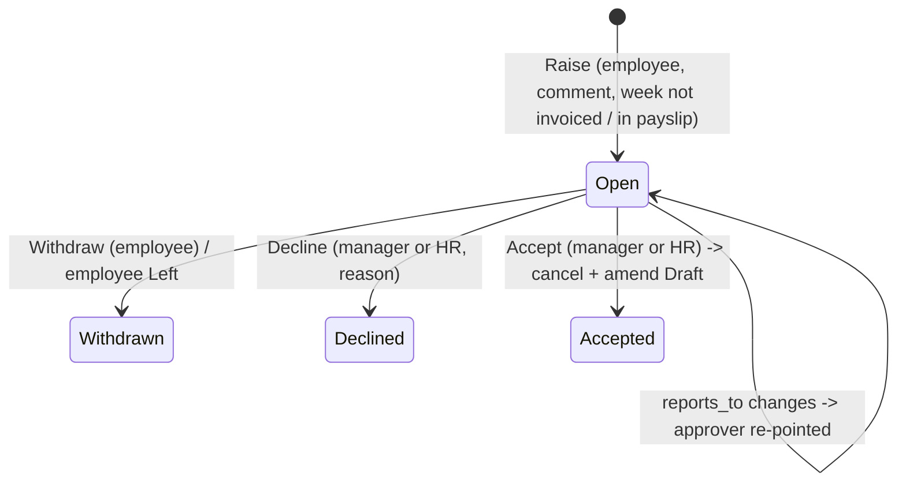
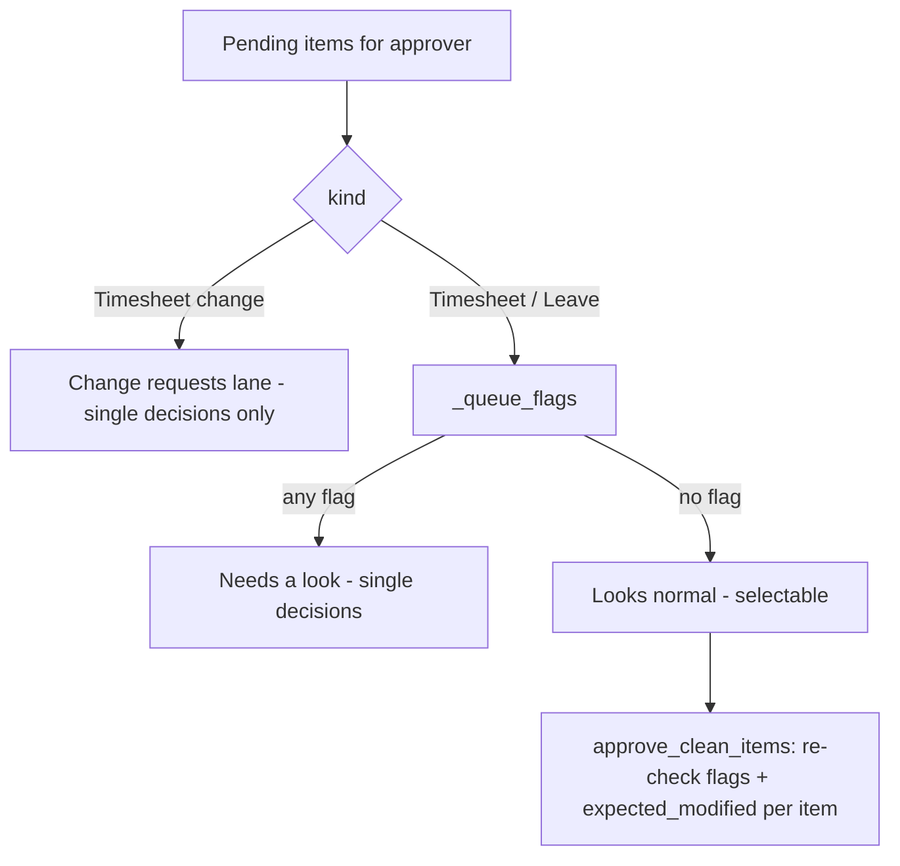

# feat: Timesheet recall, change requests on approved weeks, Team timesheets tab, at-a-glance approval queues

## Summary

Managers get a Timesheets sub-tab beside Leaves on the Team page to see every report's week after approval. Employees can recall a week still waiting for approval, and can ask to change an approved week with a required comment. That change request reaches the manager in its own marked lane, and on acceptance the approved week is cancelled and an editable copy returns to the employee.

The approval queue is rebuilt for teams of 5 to 50. Rows are grouped per person and split into "Needs a look" (flagged) and "Looks normal". Only "Looks normal" timesheet and leave rows can be approved together, behind a confirm that states the count and total hours.

---

## Problem Frame

After a manager approves a week, the DocShare that let them read it is removed (`helixhr/events.py:356-360`), and `get_my_team_week` (`helixhr/api.py:9224`) projects leave only. A manager therefore cannot see their team's approved timesheets.

The Timesheet Approval workflow (`helixhr/fixtures/workflow.json`) has no exit from Approved and no recall. A mistake found after approval needs HR to cancel in Desk. A Desk cancel today leaves `workflow_state = "Approved"` at docstatus 2, so the approver's Decided list shows a cancelled week as approved (`api.py:4895-4915`).

The Approvals queue (`frontend/src/pages/Approvals.vue`) is a flat list paged at 25 (`_APPROVAL_PAGE`), reading at most 50 per kind (`_QUEUE_FETCH`). Each row shows little that separates a normal week from an odd one. A manager with 30–50 reports either opens every row or approves blind. The repo deliberately has no bulk approve (`api.py:4656` comment); this plan reverses that decision in a guarded form (user decision).

---

## Actors

- A1. Employee: fills, submits, recalls a week; raises and withdraws a change request.
- A2. Line manager (`reports_to` user): approves, sends back, sends to HR; accepts or declines change requests; views the Team timesheets tab.
- A3. HR Manager: decides Pending HR weeks; decides change requests in place of an absent or missing manager; company-scoped.
- A4. Delivery Manager: not involved in any flow here.

---

## Requirements

**Team timesheets view**
- R1. Team page has sub-tabs Leaves | Timesheets, selected via URL (`/team?tab=timesheets&week=YYYY-MM-DD`).
- R2. Timesheets tab lists every current direct report for the chosen week: state (Not started, Draft, Pending, Sent back, Pending HR, Approved, Change requested), total hours vs expected, hours per day, and a link to a read-only week view.
- R3. The read-only week view shows tasks × days, hours, the decision trail, and any change request; it never exposes cost or billing fields.
- R4. "Not submitted" weeks are visible so a manager can chase them.

**Recall**
- R5. An employee can recall their own week while it is Pending Approval; it returns to Draft, leaves the manager's queue, and the manager gets a bell notice.
- R6. Recall is refused once the manager has decided, and in Pending HR; a manager's later Approve on a recalled week is refused with "the employee recalled this week".

**Change requests on approved weeks**
- R7. On an Approved week the employee can raise a change request with a required comment (minimum 10 characters).
- R8. At most one open change request exists per week. The employee can withdraw an open one.
- R9. A week linked to a submitted Sales Invoice or a submitted Salary Slip is not changeable; the employee sees why, before writing a comment.
- R10. The current `reports_to` manager decides; HR Manager may decide in their place. With no manager, it routes to HR.
- R11. Accept cancels the approved week and creates an editable Draft copy owned by the employee; the employee edits and resubmits through the normal flow. Accept rechecks R9 under lock.
- R12. Decline requires a reason; the week stays Approved; the employee sees the reason.
- R13. In the manager's queue a change request is a distinct item type: "Change request" badge, the employee's comment, the approved week's hours, and Accept / Decline buttons. Accept and Decline are never offered for bulk.

**Approval queues at scale (5–50 reports)**
- R14. Timesheet and leave items are grouped per person (one header per employee with their item count), sorted by oldest waiting first.
- R15. Each timesheet row shows total hours vs expected, days with no hours, project split, and flag badges. Each leave row shows dates, days, balance after approval, and how many of the approver's other reports are off on overlapping days.
- R16. Items are split into "Needs a look" and "Looks normal". A timesheet needs a look when: hours differ from expected by more than 10%, any expected working day has zero hours, it is a resubmission after send-back, it arrives from an amend, or it has waited past the overdue threshold. A leave needs a look when: balance after approval is negative, it overlaps another report's approved or pending leave, it is a send-to-HR item, or it starts within 2 days.
- R17. Only "Looks normal" timesheet and leave rows are selectable together. A confirm states the count, people and total hours or days before deciding.
- R18. Bulk approval reports per-item results; one stale or refused item never stops the rest.
- R19. The queue shows every pending item for up to 50 reports, with sections and filter chips (Needs a look, Looks normal, Change requests, Leave, Timesheets), instead of a 25-row page.
- R20. Phone layout: one column, selection disabled under 640px; individual decisions still work.

**Notifications**
- R21. New portal emails/bells: week recalled (to manager), change request raised (to manager), change request accepted / declined (to employee, with reason on decline). Each is a `NOTIFICATION_EVENTS` entry editable on the Email Templates page.

---

## Key Technical Decisions

- KTD1. Recall is a workflow transition, not an endpoint-only state write. `Pending Approval → Recall → Draft`, allowed Employee. The condition requires the employee's `user_id` equal the session user. `allow_self_approval: 1` is needed because Frappe's check keys on `doc.owner` (memory `frappe-workflow-self-approval`). Without the condition, the manager, who also holds Employee, could recall. Docstatus stays 0; existing share removal and pending-since handling already cover non-Pending states.
- KTD2. Add a `Cancelled` workflow state (doc_status 2), appended to the states list, never reordered. An `Approved → Cancel → Cancelled` transition is allowed to HR Manager only. A doc_status-2 state makes `can_cancel_document` false, which hides the raw Desk Cancel. The approver's Decided list filters `docstatus != 2` or shows "Cancelled".
- KTD3. A change request is its own DocType, `HelixHR Timesheet Change`. An approved timesheet is docstatus 1 and immutable, so state on it would need allow-on-submit fields and could not keep history of several requests. The DocType has no portal-role DocPerms; every read and write goes through whitelisted projections, matching "Projections, not permissions".
- KTD4. Accept runs the cancel and amend server-side inside `utils.as_administrator()` after the HelixHR gate (`_may_act_on_timesheet_change`), in one transaction. Steps:
  1. Lock the change row and the timesheet.
  2. Recheck invoice and payslip links.
  3. Set the timesheet `workflow_state = "Cancelled"` and cancel it.
  4. Copy it as an amendment (`amended_from`) with `workflow_state = "Draft"` and `owner` = the employee's user.
  5. Clear `helixhr_decision_reason`, then insert.

  Owner must be the employee: an amend run as the manager would make the manager the owner and trip self-approval on resubmit. Elevated execution follows the report system's precedent (memory `report-system-elevated-exec`), never `frappe.set_user`.
- KTD5. Changeability check: a timesheet is locked when a submitted Sales Invoice references it (`Sales Invoice Timesheet.time_sheet`), when `salary_slip` is set, or when a submitted Salary Slip for the employee covers its dates. HR has no override in this plan.
- KTD6. Bulk approval is a single whitelisted batch endpoint, `approve_clean_items(items)`, capped at 60 items. It loops server-side and calls the same per-item path as `act_on_approval` (`api.py:5433`), with each item's `expected_modified` and `expected_state`. The server recomputes "Looks normal" per item and refuses any flagged item, so the client cannot force a flagged row through. One call avoids the 30/60s `act_on_approval` rate limit. This reverses the documented no-bulk decision at `api.py:4656`; the comment and `docs/architecture.md` are updated with the guard.
- KTD7. Flags are computed server-side in one place (`_queue_flags`) and returned on each row. The UI never derives flags, so the batch guard and the display cannot disagree. Expected hours = `HR Settings.standard_working_hours` × the employee's working days in that week, minus holidays and approved leave days. With no standard hours configured, the hours flag is off and a preflight WARN says so.
- KTD8. Queue limits rise for timesheet and leave kinds to serve 50 reports: per-kind fetch 150 and the page removed for those kinds. A server-side hard cap of 200 is kept with `total_is_capped`. Grouping and sorting happen server-side.
- KTD9. Team timesheets use a new projection, `get_my_team_timesheets(week_start)`, with an explicit field allow-list over `_direct_report_filters` (`api.py:706`) and `ignore_permissions`. Approved weeks are no longer shared, so permission-based reads cannot work. Scope is current direct reports only, matching the share model.
- KTD10. `employee_on_update` reconciliation extends to open change requests: when `reports_to` changes, open rows re-point their `approver_user`. When the employee leaves, open rows auto-close as Withdrawn.

---

## High-Level Technical Design

Timesheet states (existing in plain, new in bold):

Change request lifecycle:

Queue triage (directional):

---

## Implementation Units

### U1. Workflow: Recall and Cancelled

- **Goal:** Add the Recall transition and the Cancelled state.
- **Requirements:** R5, R6, R11
- **Dependencies:** none
- **Files:**
  - Modify: `helixhr/fixtures/workflow.json`, `helixhr/fixtures/workflow_state.json`, `helixhr/fixtures/workflow_action_master.json`, `helixhr/hooks.py` (fixture filters for "Recall", "Cancel", "Cancelled")
  - Modify: `helixhr/api.py` (`_decided_timesheets` ~4889 handles docstatus 2)
  - Modify: `helixhr/preflight.py` (Timesheet workflow state order check covers Cancelled)
  - Test: `helixhr/tests/test_api_timesheet.py`, `helixhr/tests/test_fixtures.py`, `helixhr/tests/test_preflight.py`
- **Approach:** Append states; never reorder. Recall condition compares `Employee.user_id` with the session user. Cancel transition allowed to HR Manager, guarded "not own". Consider removing cancel/amend from `Employee Self Service` DocPerm through a dated `apply_permission_deltas` line, so `frappe.client.cancel` cannot bypass the workflow. Confirm on the bench first that no portal flow relies on it.
- **Execution note:** Verify on a bench that `apply_workflow(Cancel)` sets the state then cancels, and that an amended copy validates into Draft. Do this before building U3 on top of it.
- **Test scenarios:**
  - Employee recalls own Pending Approval week → Draft, manager share removed.
  - Manager (who also holds Employee) tries Recall on a report's week → no Recall action offered; direct call refused.
  - Recall on Pending HR or Approved → refused.
  - HR Manager applies Cancel on an Approved week → docstatus 2, `workflow_state` Cancelled; Decided list shows "Cancelled", not "Approved".
  - Desk Cancel button hidden for an Approved timesheet (`can_cancel_document` false).
  - Fixture sync on a fresh site keeps existing rows' states (no backfill shift).
- **Verification:** Workflow tests pass on a fresh site after `clear-cache`.

### U2. Recall from the portal

- **Goal:** Employee recall button and manager notice.
- **Requirements:** R5, R6, R21
- **Dependencies:** U1
- **Files:**
  - Modify: `helixhr/api.py` (new `recall_my_week(week_start, expected_modified)`; `act_on_approval` stale-state refusal names recall)
  - Modify: `helixhr/utils.py` (`NOTIFICATION_EVENTS` `timesheet_recalled`, `RATE_LIMIT_POLICY`), `helixhr/helixhr/doctype/helixhr_message_template/helixhr_message_template.json` (`template_key` option), `helixhr/events.py` (send on Pending → Draft)
  - Modify: `frontend/src/pages/Timesheet.vue` (Recall button while Pending Approval)
  - Test: `helixhr/tests/test_api_timesheet.py`, `helixhr/tests/test_notifications.py`, `helixhr/tests/test_upload_security.py`, `frontend/tests/e2e/timesheet-entry.spec.ts`
- **Approach:** Mirror `withdraw_my_attendance_request` (`api.py:3929`): `_lock_employee`, `for_update` on the timesheet, ownership and state check, then `apply_workflow(doc, "Recall")`. Clear the manager's arrival Notification Log row for this week if present.
- **Patterns to follow:** `withdraw_my_attendance_request`, `submit_my_week` (~4428).
- **Test scenarios:**
  - Pending week recalled → state Draft, editable, manager receives `timesheet_recalled`.
  - Concurrent: manager approves first → recall refused "already approved"; recall first → manager's approve refused "the employee recalled this week".
  - Stale `expected_modified` → refused.
  - Another employee's week → refused.
- **Verification:** e2e: submit, recall, edit, resubmit.

### U3. Change request DocType and decisions

- **Goal:** Raise, withdraw, accept and decline change requests.
- **Requirements:** R7–R12, R21
- **Dependencies:** U1
- **Files:**
  - Create: `helixhr/helixhr/doctype/helixhr_timesheet_change/` (json, py, `__init__.py`). Fields: timesheet, employee, company, week_start, comment, status (Open / Accepted / Declined / Withdrawn), approver_user, decided_by, decided_on, decision_note, amended_timesheet. `track_changes` on.
  - Modify: `helixhr/api.py` (`raise_timesheet_change`, `withdraw_timesheet_change`, `_APPROVAL_KINDS["HelixHR Timesheet Change"]`, `_may_act_on_timesheet_change`, accept/decline through `act_on_approval`, `get_my_week` returns open change and changeability)
  - Modify: `helixhr/events.py` (`employee_on_update` reconciliation, notifications), `helixhr/utils.py` (`NOTIFICATION_EVENTS` `timesheet_change_requested`, `timesheet_change_decided`; `RATE_LIMIT_POLICY`)
  - Modify: `helixhr/reminders.py` (`collect_overdue` includes open changes); `helixhr/events.py` `stamp_pending_since` / `_pending_key`
  - Modify: `frontend/src/pages/Timesheet.vue`, `frontend/src/pages/TimesheetHistory.vue` ("Request a change" on Approved weeks, comment dialog, open-request banner, withdraw)
  - Test: create `helixhr/tests/test_timesheet_change.py`; modify `helixhr/tests/test_api_approvals.py`, `helixhr/tests/test_notifications.py`, `helixhr/tests/test_upload_security.py`
- **Approach:** Raise stamps `approver_user` from the current `reports_to`, or routes to HR when none. Accept follows KTD4 exactly; any failure rolls back the whole accept and leaves the request Open with the error shown. The week view after accept loads the amended Draft through `_week_timesheet`, which already prefers the newest non-cancelled row.
- **Execution note:** Write the accept-path integration test first: invoiced week refused; plain week cancelled + amended with owner = employee and state Draft.
- **Test scenarios:**
  - Raise on Approved week with comment → Open row, manager notified; second raise on same week refused.
  - Comment under 10 characters → refused.
  - Week referenced by submitted Sales Invoice → raise refused with reason; `get_my_week` reports not changeable.
  - Week covered by submitted Salary Slip → refused.
  - Manager accepts → original docstatus 2 / Cancelled; new Draft with `amended_from`, owner = employee user, `helixhr_decision_reason` empty; employee notified; resubmit reaches the manager, who can approve (no self-approval trip).
  - Invoice submitted between raise and accept → accept refused, request stays Open.
  - Decline without reason → refused; with reason → Declined, week stays Approved, reason visible to employee.
  - Employee withdraws → Withdrawn; manager queue drops it.
  - `reports_to` changes while Open → `approver_user` re-pointed; old manager cannot act, new one can.
  - Employee set Left → open request Withdrawn.
  - No manager → HR Manager of the company sees and decides it; HR in another company cannot.
  - Employee cannot accept own request; HR cannot decide own request.
  - Two-company isolation: HR of company B never sees company A's change requests.
- **Verification:** Full accept round trip passes on a fresh site with strict user permissions.

### U4. Team timesheets tab

- **Goal:** Managers see their reports' weeks in any state.
- **Requirements:** R1–R4
- **Dependencies:** U3 (shows change state)
- **Files:**
  - Modify: `helixhr/api.py` (new `get_my_team_timesheets(week_start)`, `get_team_member_week(employee, week_start)`; reuse `_direct_report_filters`, `_hours_by_day`)
  - Modify: `frontend/src/pages/Team.vue` (sub-tabs, timesheets table, read-only week drawer), `frontend/src/router.js` if query handling needs it
  - Test: `helixhr/tests/test_api_team.py`, `frontend/tests/e2e/team.spec.ts`
- **Approach:** Projection with explicit allow-list: employee name, state, total hours, expected hours, per-day hours, open change flag, decision reason. Task rows in the drawer show project, task, activity and hours only; no rates, costing or billing amounts. Gated on `has_reports`.
- **Patterns to follow:** `get_my_team_week` (~9224) structure and `_TEAM_REPORT_LIMIT`.
- **Test scenarios:**
  - Manager with 3 reports: one Approved, one Pending, one with no timesheet → three rows with correct states ("Not started" for none).
  - Approved week of a report readable by manager after the share was removed.
  - Non-report employee's week requested → refused.
  - Response contains no cost/billing fields (assert on keys).
  - Week with open change request shows "Change requested".
  - A manager with 50 reports → 50 rows, one query per kind (no per-row queries).
- **Verification:** Team tab shows an approved week the manager decided earlier.

### U5. Queue flags and grouping (server)

- **Goal:** Each pending item carries flags; the queue returns grouped and complete.
- **Requirements:** R14–R16, R19
- **Dependencies:** U3
- **Files:**
  - Modify: `helixhr/api.py` (`_queue_flags`, `_expected_hours`, `_summary_row` ~1471 adds `flags`, `needs_look`, `hours`/`expected_hours`, `project_split`, leave `balance_after`, `overlap_count`; `get_my_approvals` ~4701 group-by-employee and raised caps; `_QUEUE_FETCH` per kind)
  - Modify: `helixhr/preflight.py` (WARN when `standard_working_hours` unset)
  - Test: `helixhr/tests/test_api_approvals.py`, create `helixhr/tests/test_queue_flags.py`
- **Approach:** Batch queries per kind: one for time-log totals, per-day and project split; one for holidays per holiday list; one for approved leave overlaps; one for leave balances via HRMS `get_leave_balance_on`, cached per employee and type. Resubmission = the timesheet has a prior Sent Back version (Version log or `helixhr_decision_reason` history). Amend = `amended_from` set. Overdue uses the existing `is_overdue`.
- **Test scenarios:**
  - 40h expected, 40h logged, all days filled → no flags.
  - 34h logged (−15%) → `hours_off`; 44h (+10%) → no flag; 44.5h → flag.
  - Expected working day with 0h → `missing_day`; holiday day with 0h → no flag; approved leave day with 0h → no flag.
  - Resubmitted after send-back → `resubmitted`; amended week → `amended`.
  - Leave with balance going negative → `negative_balance`; overlapping another report's approved leave → `overlap` with count; starting tomorrow → `short_notice`.
  - `standard_working_hours` unset → no hours flag; other flags still computed.
  - 50 reports × 1 week each → all 50 returned, grouped by employee, oldest first; query count bounded (assert ≤ fixed number).
- **Verification:** Flags match the table above for seeded data.

### U6. Batch approval endpoint

- **Goal:** Approve many clean items safely.
- **Requirements:** R17, R18
- **Dependencies:** U5
- **Files:**
  - Modify: `helixhr/api.py` (`approve_clean_items(items)`; update the no-bulk comment at ~4656)
  - Modify: `helixhr/utils.py` (`RATE_LIMIT_POLICY` e.g. 10/60), `helixhr/tests/test_upload_security.py`
  - Test: `helixhr/tests/test_api_approvals.py`
- **Approach:** Accept `[{doctype, name, expected_modified, expected_state}]`, at most 60 items, only Timesheet and Leave Application. For each item: run the same authorization as `act_on_approval`, recompute `_queue_flags` and refuse flagged items, then apply Approve inside a savepoint. Return a per-item `{name, ok, message}`. Commit per item, so a later failure does not undo earlier successes.
- **Test scenarios:**
  - 5 clean timesheets + 3 clean leaves → all approved; result lists 8 ok.
  - One item flagged since the page loaded → that item refused "needs a look"; others approved.
  - One stale `expected_modified` → that item refused; others approved.
  - Change request in payload → refused (not batchable).
  - Item belonging to another manager's report → refused.
  - 61 items → whole call refused before any work.
  - Own timesheet in payload → refused.
- **Verification:** Mixed batch returns correct per-item results and DB state.

### U7. Approvals page redesign

- **Goal:** At-a-glance, mistake-resistant queue UI.
- **Requirements:** R13–R20
- **Dependencies:** U5, U6, U3
- **Files:**
  - Modify: `frontend/src/pages/Approvals.vue` (or split into `frontend/src/components/approvals/` components: `PersonGroup`, `TimesheetRow`, `LeaveRow`, `ChangeRequestRow`, `BulkBar`)
  - Test: `frontend/tests/e2e/approvals.spec.ts`, `frontend/tests/e2e/timesheet-approval.spec.ts`; vitest for any pure selection/summary helper (`frontend/src/lib/`)
- **Approach:**
  - Layout and controls:
    - Section order: Change requests, Needs a look, Looks normal.
    - Each person header shows name, item count and the oldest waiting age.
    - Timesheet row: hours/expected with a small per-day strip (7 cells), project split as text, flag chips labelled in words (never colour alone).
    - Leave row: dates, days, balance after, and an overlap count with a tooltip naming who is off.
    - Selection checkboxes appear only in Looks normal. The sticky bar reads "Approve 8 items · 312 h · 3 days leave".
    - The confirm dialog names the counts and people. The result toast lists any refused items, with a jump link to each.
  - Behaviour:
    - Existing single-item detail and actions stay.
    - Filter chips sit in the URL.
    - On phones, selection is hidden.
  - Run `/ui-ux-pro-max` and `/impeccable` per AGENTS.md UI order. The redesign changes an existing screen, so start at `/impeccable` critique against the current design system.
- **Test scenarios:**
  - Manager with mixed queue: change request appears in its own section with the employee's comment and Accept/Decline.
  - Flagged timesheet has no checkbox; clean ones do; selecting 3 shows correct hours total.
  - Confirm then approve → rows leave the queue; toast reports results; a refused item stays with its message.
  - Phone viewport: no checkboxes; single approve works.
  - Keyboard: rows, checkboxes and bulk bar reachable; dialog traps focus.
- **Verification:** e2e passes with a seeded manager of 12 reports including flagged and clean items.

### U8. Docs and preflight

- **Goal:** Record the reversed bulk decision and new flows.
- **Requirements:** all
- **Dependencies:** U1–U7
- **Files:** `docs/architecture.md` (timesheet lifecycle, change requests, bulk guard, projections), `docs/runbook.md` (cancel/amend, invoice lock), `docs/deployment.md` (standard working hours prerequisite), `README.md` if screens are listed
- **Test expectation:** none -- documentation only.

---

## System-Wide Impact

- **Auth boundaries:** elevated cancel/amend runs only after the HelixHR gate (KTD4). The batch endpoint reuses per-item authorization.
- **Billing/projects:** cancelling a timesheet recomputes Task and Project hours/costing through ERPNext `on_cancel` (`update_task_and_project`); the amend's resubmit restores them. Invoiced weeks are locked (KTD5).
- **Reports:** the report system counts approved hours by `workflow_state`. A cancelled week must drop out (docstatus 2 filtered). Confirm `helixhr/reports.py` time entries filter `docstatus = 1` and add a test.
- **Notifications:** three new `NOTIFICATION_EVENTS` keys add options to `HelixHR Message Template.template_key` (doctype JSON change) and appear on the Email Templates page.

---

## Risks & Dependencies

| Risk | Mitigation |
|---|---|
| Workflow fixture edit shifts existing rows' states | Append-only states; fresh-site test of fixture sync; `clear-cache` after migrate. |
| Amend as Administrator leaves wrong owner, blocking approval | Set owner explicitly; test resubmit + manager approve. |
| Bulk approve rubber-stamping | Server recomputes flags per item; flagged and change items never batchable; confirm states totals. |
| Expected hours wrong for part-time or shift staff | Hours flag only; never blocks single approval; threshold ±10% recorded in KTD7; per-employee override deferred. |
| Queue query cost at 50 reports | Batched per-kind queries; query-count assertion in tests. |
| `Employee Self Service` cancel perm bypasses workflow | Remove via permission delta after verifying no dependency (U1). |

---

## Scope Boundaries

- Delivery Manager has no timesheet approval role.
- No HR override for invoiced or payroll-locked weeks.
- No undo after approval; the confirm is the guard (submit is not reversible cheaply).

### Deferred to Follow-Up Work

- Per-employee expected hours (part-time contracts).
- Saved queue filters per manager.
- Team timesheets for former reports.

---

## Sources & Research

- Workday Edit and Approve Time: alert vs no-alert grids, mass action on clean grid, 50-worker ceiling — https://doc.workday.com/admin-guide/en-us/human-capital-management/time-tracking/reviewing-and-approving-time/nla1675283926780.html (shaped KTD6, R16, R19)
- Clockify approvals: approve-all with confirm, reject requires note, withdraw approval — https://clockify.me/help/track-time-and-expenses/approval
- Tempo: recall allowed while pending, not after approval — https://help.tempo.io/timesheets/latest/timesheet-approvals (shaped R5–R6)
- Personio: per-employee grouped inbox, balance after approval, overlap preview (shaped R14–R15)
- NN/g confirmation dialogs: specific, sparing, action-labelled — https://www.nngroup.com/articles/confirmation-dialog/
- Frappe: `frappe/model/workflow.py` `can_cancel_document` (~231), `has_approval_access` (~298); ERPNext `timesheet.py` `on_cancel` / `update_task_and_project` (~152-192), `get_overlap_for` excludes docstatus 2 (~249)
- Repo: `helixhr/events.py:323-360` share lifecycle; `helixhr/api.py:925` `_week_timesheet`; `:3929` recall pattern; `:4656` no-bulk comment; `:9224` team projection
