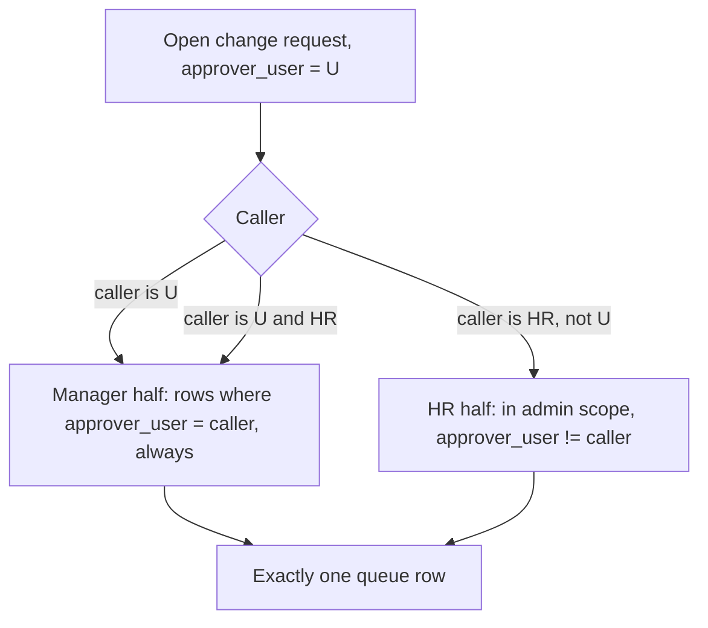
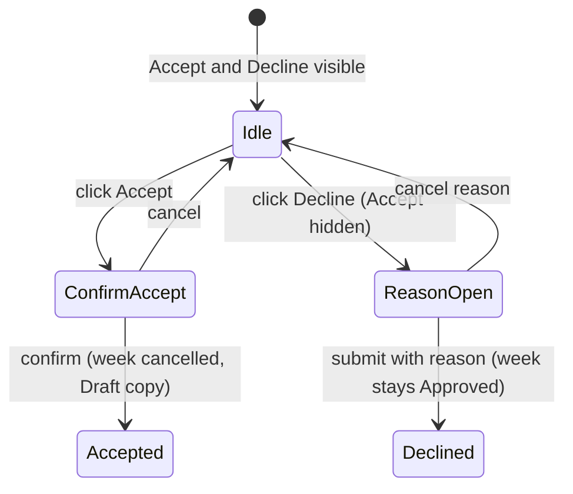
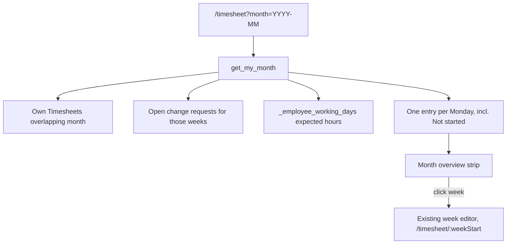

# fix: Timesheet month view and change-request bugs, report field audit, branded email templates with reset, rejected-leave placement

## Summary

This plan follows up on shipped plans 2026-10-04-001, -003 and -004 in four areas. Each phase can ship by itself.

- Phase A (Timesheets). Recall and Request change get a clear status banner. A month overview shows missing and approved weeks, and clicking a week opens it. Two bugs are fixed: change requests vanish from Approvals, and an Accept can fire when the manager meant Decline. Employees get a read-only My projects page.
- Phase B (Reports). The filter pickers list current options without typing. Reports show project and person names instead of IDs. Blank cells are filled or explained. Custom becomes a real period choice. Fields get "i" help.
- Phase C (Email). One company logo appears on every template. Each company gets its own celebration and holiday template. The defaults get better, and each template can be reset to its default.
- Phase D (Leaves). Rejected leave moves out of "Coming up", and its card offers "Apply again".

---

## Problem Frame

Each user complaint traces to a cause in the code.

**Timesheets**
- **Change request missing from Approvals.** `_change_request_summaries` returns `[]` whenever `_is_hr()` is true (`helixhr/api.py:5239-5243`). `_hr_change_request_summaries` excludes rows where `approver_user == session.user` (`helixhr/api.py:5294`). A request addressed to a manager who also holds HR Manager or System Manager therefore lands in neither half. The email link still works because `get_approval_detail` only checks `_assert_may_act_on`. Tests miss this because they use a plain manager (`helixhr/tests/test_timesheet_change.py:507`).
- **"Declined but employee could resubmit."** The decline path is correct: the week stays Approved (tested). In the detail pane, the first Decline click only opens the reason box (`frontend/src/pages/Approvals.vue:276-279`). The solid green Accept button stays next to it and fires with no confirmation (`Approvals.vue:1366`, `:2025`). Accept cancels the week and returns an editable Draft, which matches "option to resubmit". This is the leading hypothesis. U1 confirms it from the record before changing any code.
- **Past weeks page crashes** with AttributeError when any week has an open change request. `open_names` holds name strings, but the loop then reads `.timesheet` from them (`helixhr/api.py:4784-4793`). The decline email links straight to that page.
- **Email links lose the week.** Links use `timesheet?week=`, but the page only reads the `:weekStart` route param (`frontend/src/router.js:117`, `helixhr/api.py:5365-5367`).
- **Recall and Request change are hard to see.** They are grey outline buttons in a muted inset box (`frontend/src/pages/Timesheet.vue:627-691`), and the bottom action bar is hidden for read-only weeks. After one decline, the page never offers another request, although the server accepts one (`helixhr/api.py:5122` only checks for an open request).
- **No month view.** The page renders one week. `get_my_timesheet_history` lists existing Timesheets only, so weeks never started are invisible.
- **No "my projects" for employees.** Projects is gated to System Manager, HR and Delivery Manager (`helixhr/utils.py:1055`). `get_my_projects` (`helixhr/api.py:4834`) only feeds the timesheet dropdown.

**Reports**
- **Pickers look empty.** `EntityPicker` and `search_report_options` return nothing below 2 typed letters (`frontend/src/components/reports/EntityPicker.vue:21`, `helixhr/reports.py:1600-1602`). There is no status filter, so completed and cancelled projects mix with current ones.
- **Project IDs instead of names.** `hours_by_project` selects `td.project` without joining Project (`helixhr/reports.py:104-122`). The flagship builds `extra.project_name` and `customer`, but only the PDF shows them. No report adds a name next to Reports to, Assignee or Routed to (`helixhr/reports.py:877-878`, `:974`).
- **Blank cells.** `task_subject` is null for rows with no task. Subtotal rows fill only the group column and the totals (`helixhr/reports.py:1787-1797`). For the 10 wrapped HRMS reports, nobody has checked that column fieldnames match row keys.
- **Custom is greyed out.** `ReportFilters.vue:111-116` hard-codes `<option value="custom" disabled>` as a status label.
- **No field help.** `_f()` has no description key, and `frontend/src` uses no Tooltip.

**Email**
- **"Custom template ignores my changes."** The leading cause: every company's reminder row links to one shared `Email Template` per event (`helixhr/api.py:8053-8059`, `helixhr/patches/v1_0/split_celebration_reminders_by_company.py:69`). Saving for one company overwrites the others. Two other causes are possible. A portal notification template that raises on real data silently falls back to the default (`helixhr/utils.py:824-832`). The 36 h same-day guard can also suppress a rerun.
- **Logo.** Portal notifications use only the global default company's logo (`helixhr/utils.py:777`). Celebration and holiday templates show a logo only if HR keeps the `` block in their own HTML. There is no reset for celebration or holiday templates.

**Leaves**
- `Leave.vue:52-64` groups only by `to_date`, so a rejected or cancelled leave with future dates sits in "Coming up". The missing edit is on purpose. A submitted Rejected leave is final (`api._leave_state`, `helixhr/api.py:2894-2931`), and HRMS's overlap check ignores it, so the employee can apply again for the same dates.

---

## Requirements

**Timesheet actions and month view**
- R1. A non-Draft week shows a status banner at the top of the week view. The banner names the state and offers that state's action as a prominent button: Recall (Pending Approval), Request a change (Approved and changeable), Withdraw request (open request). It also shows the send-back or decline reason.
- R2. After a declined request, the employee still sees the decline and its reason, and can raise a new request. The page and the server then agree.
- R3. The Timesheet page shows a month overview. It has one row or card per week that overlaps the month. Each shows the state (Not started, Draft, Pending, Sent back, Pending HR, Approved, Change requested), logged hours against expected hours, and a "missing" mark on past weeks not yet submitted.
- R4. Clicking a week in the overview opens it in the existing week editor. Submitting still happens one week at a time. Previous and next month are navigable, and the month lives in the URL.
- R5. The overview shows approved weeks at a glance with a distinct style, so the employee can confirm without opening each one.

**Change-request routing and integrity**
- R6. A change request appears in its approver's Approvals queue whether or not the approver holds an HR role. It appears exactly once.
- R7. Accepting a change request needs an explicit confirm step that says the approved week will be cancelled and reopened. While the Decline reason box is open, Accept is not available.
- R8. The Past weeks page loads when any listed week has an open change request.
- R9. Email links for recall, change accept and change decline open the right week. The Accept email opens the reopened Draft week.

**My projects**
- R10. Any linked employee can open a read-only My projects page. It lists their open projects: name, customer, status, their open tasks and their hours this month. No cost or billing fields appear. Managers with access keep the existing Projects page.

**Reports**
- R11. Project, Task, Employee and Department pickers show the first in-scope options on focus with no typing. Active projects come first. Completed and Cancelled projects or tasks appear only when the user searches for them.
- R12. Changing the Project filter clears a chosen Task that no longer belongs to it.
- R13. Every report column holding a Project, Task or Employee ID shows the human name next to it, and on-screen and in CSV, Excel and PDF exports alike.
- R14. No report cell is blank without a reason. Missing task shows "(No task)". Subtotal rows label themselves. Optional fields that are truly empty render as an em dash.
- R15. Custom is a selectable Period option. Picking it moves focus to From and keeps the current dates.
- R16. Each filter whose meaning isn't obvious has a help text, shown through an "i" control that works on keyboard and touch and is linked with `aria-describedby`.

**Email branding and templates**
- R17. HR can upload or replace their company's logo from the Email Templates page. Every portal notification, celebration and holiday email then shows the recipient company's logo with no template edits.
- R18. Each company has its own celebration and holiday templates. Saving one company's template never changes another's.
- R19. Birthday, work anniversary and holiday get improved default templates.
- R20. Each celebration and holiday template has "Reset to default" with a confirm. It restores the shipped default for that company only.
- R21. A saved portal template that fails on real data, and falls back to the default, surfaces in the editor. HR then learns why their wording didn't send.

**Leaves**
- R22. Rejected and cancelled leaves sit in Past, whatever their dates, and show their reason.
- R23. A rejected leave card offers "Apply again", which opens a new application prefilled from it.

---

## Key Technical Decisions

- **KTD1. Change-request queue: the manager half never stands down for HR.** `_change_request_summaries` always returns rows where `approver_user == session.user`. The HR half already excludes those rows, so nothing is duplicated. This mirrors the timesheet manager half, which narrows for HR instead of returning nothing (`helixhr/api.py:1848`).
- **KTD2. Fix the misfire with a confirm, not a layout swap.** Accept gets a confirm dialog that states the consequence. Opening the Decline reason box hides Accept, and cancelling the reason box brings it back. This is the smallest change that makes the destructive action deliberate.
- **KTD3. The month overview sits above the week editor and doesn't replace it.** The existing per-week editor, its submit path and its workflow stay unchanged. The overview is a navigator.
- **KTD4. One new endpoint, `get_my_month`.** It returns every Monday that overlaps the month, including weeks with no Timesheet. Expected hours come from `_employee_working_days` and `_team_expected_hours` (`helixhr/api.py:1554-1628`, `:10777`). It must not add a parallel holiday calculation. It reads the employee's own Timesheets and open change requests in one query each, like the history page.
- **KTD5. Allow a new change request after a decline.** The server already allows it (R2). The older decline stays visible above the button. A one-time ban would be a product rule nobody asked for.
- **KTD6. My projects is a new employee page backed by `get_my_projects`.** The endpoint gains customer, status, open tasks and this month's own hours. It keeps its current membership rule (Project User or User Permission). The manager-facing `Projects.vue` and `resolve_project_scope` stay unchanged.
- **KTD7. Pickers browse on empty query.** `search_report_options` returns up to `OPTIONS_LIMIT` in-scope rows when the query is empty. It orders active status first, then by most recent activity. `EntityPicker` fetches on focus. The 2-letter rule is removed, and the e2e assertion at `frontend/tests/e2e/reports.spec.ts:117` changes with it.
- **KTD8. Names live in a separate column next to the ID.** Each report adds `project_name`, `task_subject` or `employee_name` columns rather than swapping the ID out. The ID stays useful for filtering and Desk lookups, and exports stay stable for anyone parsing them.
- **KTD9. Help text lives in the filter spec.** `_f()` takes an optional `help` string, and `client_entry` passes it on. `ReportFilters` renders an info icon with frappe-ui `Tooltip`, which is already a dependency, plus visible `aria-describedby` text for screen readers and touch.
- **KTD10. Logo source is `Company.company_logo`.** The upload control writes that existing field. No new HelixHR setting is added. Rendering resolves the recipient's company, not the global default.
- **KTD11. Celebration and holiday bodies get the shared layout.** The sender wraps a body in `helixhr/templates/emails/helixhr_layout.html` unless the body already contains `<html` or `<body`. This protects HR-customised full-document templates from double wrapping. New defaults are body-only.
- **KTD12. Defaults move to a runtime constant, and a new patch clones the templates per company.** Shipped defaults live in `helixhr/reminders.py`, used by both reset and the new patch. The applied `seed_celebration_templates.py` stays as it is. A new patch gives each company its own copy of each Email Template and repoints the reminder rows. It installs the new defaults only where the current text still equals the old seeded default, so customised text survives.
- **KTD13. Leave fix is frontend-only.** Grouping keys on `state` (rejected or cancelled go to Past), not just `to_date`. "Apply again" reuses `editAndResend` (`frontend/src/pages/Leave.vue:180`). Making submitted rejected leave editable would need cancel/amend in HRMS core and contradicts P4-R4.

---

## High-Level Technical Design

Change-request queue routing after KTD1:

Change-request decision in the detail pane after KTD2:

Month overview data flow:

---

## Implementation Units

### Phase A — Timesheets

### U1. Confirm the decline root cause from the record

**Goal:** Prove which hypothesis produced "declined, then resubmit" before changing code.

**Requirements:** R7

**Dependencies:** none

**Files:** none changed. Findings go into the U3 commit message and `docs/runbook.md`.

**Approach:** On the dev bench, find the `HelixHR Timesheet Change` row in question. Read `status`, `decided_by`, `decision_note` and `amended_timesheet`, plus the workflow history of its Timesheet. If status is Accepted with an amended copy, Accept misfired, and KTD2 applies. If status is Declined but a Draft exists, look for a separate Send back on a Pending week, or a second request. Then widen U3 to that path before coding.

**Test expectation:** none, because this is a read-only investigation.

**Verification:** One sentence recording the confirmed cause, with record evidence.

### U2. Change requests always reach their approver's queue

**Goal:** Fix the HR-role approver gap.

**Requirements:** R6

**Dependencies:** none

**Files:** `helixhr/api.py` (`_change_request_summaries`), `helixhr/tests/test_timesheet_change.py`

**Approach:** Remove the `_is_hr()` early return, and keep the `approver_user == session.user` filter (KTD1). Update both docstrings so they match the behaviour.

**Patterns to follow:** The timesheet manager half at `helixhr/api.py:1848`.

**Test scenarios:**
- A plain manager approver sees the request once (regression of the existing case).
- An approver with HR Manager sees their own report's request once, in the queue summary.
- An approver with System Manager sees it once.
- An HR Manager who is not the approver, in the same company, sees it once, tagged as HR.
- An HR Manager in another company does not see it.
- A routed request (no manager) appears for in-scope HR only.

**Verification:** Queue tests pass, with no duplicate rows for any caller.

### U3. Accept needs a confirm; Decline hides Accept

**Goal:** Make the destructive decision deliberate.

**Requirements:** R7

**Dependencies:** U1

**Files:** `frontend/src/pages/Approvals.vue`, `frontend/tests/e2e/approvals.spec.ts`

**Approach:** In both decision blocks (narrow at `:1363` and wide at `:2021`), route Accept through a confirm dialog. The dialog says "This cancels the approved week and reopens it for {name} to edit." Reuse the dialog pattern the bulk-approve confirm already uses on this page. Hide Accept while `reasonFor === 'Decline'`.

**Test scenarios:**
- e2e: click Decline. Accept is no longer visible. Enter a reason and submit. The request is Declined and the week stays Approved.
- e2e: click Accept, then cancel the confirm. Nothing changes.
- e2e: click Accept, then confirm. The week is cancelled, and the employee's week view shows a Draft.
- e2e: open the Decline reason, then cancel it. Accept is back.

**Verification:** No path fires Accept with a single click.

### U4. History crash, email deep links, and decline re-raise

**Goal:** Fix the three small defects around change requests.

**Requirements:** R2, R8, R9

**Dependencies:** none

**Files:** `helixhr/api.py` (`get_my_timesheet_history` around `:4784`; link builders around `:5365`; `raise_timesheet_change` behaviour unchanged), `helixhr/events.py` (recall notice link, if it uses `?week=`), `frontend/src/pages/Timesheet.vue` (declined branch around `:668`), `helixhr/tests/test_api_timesheet.py`, `helixhr/tests/test_timesheet_change.py`

**Approach:**
- History: keep the rows, not their names.
- Links: use `timesheet/<monday>`. The Accept email points at the amended week's Monday.
- Declined branch: show the decline and its reason, then the Request a change button when `changeable.ok` (KTD5).

**Test scenarios:**
- History with one open change request returns 200, and that week carries `change.comment`.
- History with no change requests is unchanged.
- The decline email body contains `/helixhr/timesheet/<monday>` and no `?week=`.
- The Accept email link targets the amended Draft's week.
- After a decline, `raise_timesheet_change` on the same week succeeds, and the week payload exposes both `declined_change` and `changeable.ok`.

**Verification:** Past weeks loads in the fixture scenario. Links open the right week.

### U5. Status banner and month overview

**Goal:** Make actions obvious and show the whole month.

**Requirements:** R1, R3, R4, R5

**Dependencies:** U4

**Files:** `helixhr/api.py` (new `get_my_month`), `frontend/src/pages/Timesheet.vue`, `frontend/src/lib/` (pure week-of-month helper, plus its vitest), `frontend/src/lib/statusBadge.js` (reuse the state colours), `helixhr/tests/test_api_timesheet.py`, `frontend/tests/e2e/timesheet-entry.spec.ts`

**Approach:**
- Banner: replace the inset boxes (`Timesheet.vue:627-691`) with one banner at the top of the week. Tint it by state and give it a solid primary action. It holds the send-back or decline reason and the open-request comment. Mobile and desktop share one component block.
- Month overview: build the endpoint per KTD4. The strip is a compact grid of week cards (Mon–Sun range, state chip, logged vs expected hours, missing mark), with month prev/next controls and `?month=` in the URL.
- Clicking a week navigates to `/timesheet/<monday>`, and the current week is highlighted.
- The page drops vertical slack, so the overview and the selected week fit on one desktop screen.
- Run `/ui-ux-pro-max` → `/hallmark` before writing markup (AGENTS.md "UI work, in order"), within the existing portal design system.

**Technical design:** `get_my_month(month)` returns a list of `{week_start, state, total_hours, expected_hours, missing, change_open}`. A week counts as missing when it is in the past, its state is Not started, Draft or Sent back, and its expected hours are above 0.

**Test scenarios:**
- A month with no Timesheets returns 4 or 5 weeks, all Not started, with past weeks marked missing.
- A week spanning two months appears in both months.
- A week whose working days are all holidays or approved leave has expected 0 and is not marked missing.
- Approved, Pending, Sent back and Change requested map to the right states.
- Another employee's Timesheets never appear (own employee only).
- Vitest: the Mondays-of-month helper handles a month starting on Monday, a month starting on Sunday, and February in a leap year.
- e2e: open `/timesheet?month=…`, click a missing week, and the editor loads that Monday. Recall shows as a primary button on a Pending week.

**Verification:** The month strip renders with correct states, and every action is reachable within one screen.

### U6. My projects page for employees

**Goal:** Employees see the projects they belong to.

**Requirements:** R10

**Dependencies:** none

**Files:** `helixhr/api.py` (`get_my_projects` extended, or a sibling read that returns the richer shape), `frontend/src/pages/MyProjects.vue`, `frontend/src/router.js`, `frontend/src/components/AppShell.vue`, `helixhr/tests/test_api_projects.py`, `frontend/tests/e2e/projects.spec.ts`

**Approach:**
- Keep the timesheet dropdown's current payload stable. Add the extra fields under a flag, or as a sibling method.
- Add the `/my-projects` route and a nav item for any linked employee, next to Timesheet.
- Show one card per project: name, customer, status, my open tasks, and my hours this month.
- No cost or billing fields.
- An empty state explains who adds people to projects.

**Patterns to follow:** The read-only layout of `Projects.vue`, and the `get_my_projects` membership rule.

**Test scenarios:**
- An employee who is a Project User on 2 open projects sees both, with their own open tasks only.
- A Completed project is excluded.
- Another employee's hours are never summed.
- A user with no projects gets an empty list and the empty state.
- The response contains no costing or billing keys.
- The timesheet dropdown payload is unchanged (regression).

**Verification:** A plain employee reaches My projects from the nav and sees accurate data.

### Phase B — Reports

### U7. Pickers that browse current options

**Goal:** Project and Task (and the other pickers) are usable on focus.

**Requirements:** R11, R12

**Dependencies:** none

**Files:** `helixhr/reports.py` (`search_report_options`, around `:1516-1615`), `frontend/src/components/reports/EntityPicker.vue`, `frontend/src/components/reports/ReportFilters.vue` (around `:145`), `helixhr/tests/test_reports_access.py`, `frontend/tests/e2e/reports.spec.ts`

**Approach:**
- Apply KTD7: an empty query returns in-scope rows, active first.
- Status filter: Project status Open first. Completed and Cancelled are excluded from browse but included when the typed query matches.
- Tasks of the selected project come first.
- Clear Task when the Project changes and the task isn't in the new project.
- The existing company scope stays exactly as it is.

**Test scenarios:**
- An empty query for Project returns in-scope Open projects only, up to the limit.
- A query matching a Completed project's name returns it.
- An out-of-company project never appears for a company-scoped HR caller (regression).
- A Task query with a project set returns only that project's tasks.
- e2e: focusing Project lists options without typing. Changing Project clears an incompatible Task.

**Verification:** Both pickers show current options on first focus.

### U8. Names next to IDs, and no unexplained blanks

**Goal:** Readable report output, on screen and in exports.

**Requirements:** R13, R14

**Dependencies:** none

**Files:** `helixhr/reports.py` (`hours_by_project` around `:104-122`; directory around `:962-976`; request aging around `:877`; subtotal shaping around `:1787`; wrapped-report column mapping around `:1699`), `frontend/src/pages/Reports.vue` (flagship header: `extra.project_name`, customer), `frontend/src/components/reports/ReportTable.vue` (`cell()` em dash for empty), `helixhr/tests/test_api_reports.py`, `helixhr/tests/test_reports_shaper.py`, `helixhr/tests/test_reports_catalog.py`

**Approach:**
- Join Project and add a `project_name` column. Coalesce `task_subject` to "(No task)", matching the flagship. Add `*_name` columns for Reports to, Assignee and Routed to (KTD8).
- Subtotal rows put "Subtotal" in the first non-group text column.
- The flagship's on-screen header shows the project name and customer.
- For each of the 10 wrapped HRMS reports, assert that every column fieldname appears in the row keys. Fix mismatches in our mapping layer, never in HRMS.

**Execution note:** Start with a catalog-wide characterization test. It runs every report on fixture data and lists columns that are blank in every row. Fix against that list.

**Test scenarios:**
- `hours_by_project` rows carry `project_name` equal to `Project.project_name`.
- A row with no task has `task_subject` "(No task)".
- A grouped report's subtotal row has a non-empty label cell.
- The CSV export of `hours_by_project` includes the Project name column.
- Wrapped reports: every declared column fieldname is present in at least one row (parametrised over the 10 keys).
- The directory renders an empty optional field as an em dash on screen, while raw data stays empty.

**Verification:** The characterization test reports zero always-blank columns, except those the plan documents as truly optional.

### U9. Custom period becomes a real choice

**Goal:** Users can pick Custom.

**Requirements:** R15

**Dependencies:** none

**Files:** `frontend/src/components/reports/ReportFilters.vue` (`:92-135`), `frontend/src/lib/datePresets.js`, `frontend/src/lib/datePresets.test.js`

**Approach:** Remove `disabled`. Choosing Custom keeps the current From/To and focuses From. Editing either date still shows Custom (current `matchPreset` behaviour).

**Test scenarios:**
- Vitest: `presetRange('custom')` returns null and leaves the dates as they are; `matchPreset` is unchanged for presets.
- e2e: choose Custom. From is focused, and the dates are unchanged.

**Verification:** Custom is selectable and behaves as described.

### U10. "i" help on report filters

**Goal:** Users understand what a field does.

**Requirements:** R16

**Dependencies:** U7 (same files)

**Files:** `helixhr/reports.py` (`_f` at `:72`, `client_entry` at `:1635`, help strings in `CATALOG`), `frontend/src/components/reports/ReportFilters.vue`, `helixhr/tests/test_reports_catalog.py`, `frontend/tests/e2e/reports.spec.ts`

**Approach:**
- Per KTD9, add help to every filter that isn't self-evident: include_pending, basis, project_members_only, the HRMS `parameter`, the As of date and Period.
- The "i" is a button with an accessible name. On touch it opens the same Tooltip on tap.
- Before writing the markup, confirm the frappe-ui Tooltip API via ctx7.

**Test scenarios:**
- The catalog payload carries `help` for the named filters and omits it elsewhere.
- e2e: the info button for include_pending is keyboard-focusable, reveals the text, and is referenced by the input's `aria-describedby`.

**Verification:** Every filter that needed help has it, and the axe check on the reports page stays clean.

### Phase C — Email

### U11. Per-company celebration and holiday templates, with new defaults and reset

**Goal:** Edits stick per company, and HR can recover.

**Requirements:** R18, R19, R20

**Dependencies:** none

**Files:** `helixhr/reminders.py` (default constants, render wrap per KTD11), `helixhr/api.py` (`_CELEBRATION_DEFAULT_TEMPLATES` around `:8053`, `save_celebration_reminder` around `:8138`, new `reset_celebration_template`, projection around `:8076` showing defaults when the row is missing), `helixhr/patches/v1_0/clone_celebration_templates_per_company.py` (new), `helixhr/patches.txt`, `frontend/src/components/templates/CelebrationEditor.vue`, `helixhr/tests/test_api_celebrations.py`, `helixhr/tests/test_reminders.py`, `frontend/tests/e2e/email-templates.spec.ts`

**Approach:**
- Apply KTD12. The template name derives from event and company. Save writes only that company's template, and the patch is idempotent.
- Reset (System Manager or in-scope HR Manager only) restores the constant into the caller's company template and writes an Info comment, like `reset_message_template`.
- The editor gets a Reset to default button behind a confirm.
- New defaults are warm, short and body-only. They use the existing context variables. Celebrations get `persons` (name, first_name, image_url, years), `names`, `count`, `company`, `date` and `portal_url`. Holiday gets `employee_name`, `holidays`, `company`, `frequency`, `date` and `portal_url`.

**Test scenarios:**
- Saving company A's birthday template leaves company B's text unchanged.
- The patch on a site with one shared template and 2 companies gives 2 templates. Rows are repointed, and customised text is preserved for both.
- Running the patch twice changes nothing more.
- Reset restores the default for the caller's company only.
- Reset from an HR Manager of another company is refused.
- Rendering a body-only template wraps it in the shared layout with the logo. A full-document template is not wrapped again.
- A company with no reminder row shows the default text in the editor projection, not blank.

**Verification:** Edits on one company appear in the next send for that company only, and reset works.

### U12. Company logo everywhere

**Goal:** One upload brands every email.

**Requirements:** R17

**Dependencies:** U11 (the layout wrap)

**Files:** `helixhr/utils.py` (`_default_context` around `:777`, `render_message` signature gains the recipient company), call sites that send portal notifications, `helixhr/api.py` (new logo upload/set endpoint scoped like the templates page), `frontend/src/pages/EmailTemplates.vue`, `helixhr/tests/test_api_celebrations.py` or a new `helixhr/tests/test_email_branding.py`, `frontend/tests/e2e/email-templates.spec.ts`

**Approach:**
- The logo control on the Email Templates page uploads a site `File` and sets `Company.company_logo` for the caller's company (KTD10).
- `render_message` resolves the logo from the recipient employee's company, and falls back to the default company.
- Validate the upload: image types only, and a size cap.

**Test scenarios:**
- A notification to an employee of company B uses B's logo while the default company is A.
- No company logo means the layout renders without a broken image.
- The upload sets `company_logo` for the caller's company only.
- A non-image upload is refused.
- An HR Manager of another company cannot set this company's logo.
- A celebration send includes the logo `` with no template edit.

**Verification:** A test email per type shows the right company logo.

### U13. Surface silent template fallbacks

**Goal:** HR learns when their portal template failed and fell back.

**Requirements:** R21

**Dependencies:** none

**Files:** `helixhr/utils.py` (`:824-832`), `helixhr/api.py` (`get_notification_setup` around `:7825`), `frontend/src/pages/EmailTemplates.vue`, `helixhr/tests/test_api_celebrations.py` or the existing message-template tests

**Approach:**
- On fallback, record the event key and the last failure time and error summary. The Error Log entry already exists, so a lookup by title is enough, with no new doctype.
- The setup projection returns a `last_fallback` per event, and the editor shows a warning with the error.

**Test scenarios:**
- A template that references a None attribute on real data falls back, and the setup returns `last_fallback` for that key.
- A healthy template returns no fallback.

**Verification:** A broken custom template shows a warning in the editor.

### Phase D — Leaves

### U14. Rejected leave in Past, with Apply again

**Goal:** A final rejection reads as history and offers a way forward.

**Requirements:** R22, R23

**Dependencies:** none

**Files:** `frontend/src/pages/Leave.vue` (`groups` at `:52-64`, rejected card around `:385-411`), `frontend/tests/e2e/leave.spec.ts`, `docs/architecture.md` (leave states note)

**Approach:**
- Apply KTD13.
- Optionally limit the Dashboard's "Waiting on others" rejected entries to the last 14 days. That is a server change at `helixhr/api.py:1151-1172`, with a test in `helixhr/tests/test_leave_flow.py`.

**Test scenarios:**
- e2e: a rejected leave with future dates appears under Past with its reason, not under Coming up.
- e2e: Apply again opens the form prefilled with type and dates. Submitting creates a new Open application.
- A cancelled future leave appears under Past.
- A sent-back leave (docstatus 0) still shows Edit and resend under Coming up (regression).
- If the dashboard limit lands: a rejection older than 14 days is not in Waiting on others.

**Verification:** The leave page groups by meaning, and the employee can retry in one click.

---

## System-Wide Impact

- **Data migration:** U11's patch clones Email Templates and repoints the reminder rows. This is the plan's only persistent data change. It must be idempotent and must preserve customised text.
- **Public API:** `get_my_month` and `reset_celebration_template` are new whitelisted methods, and so is the logo setter. `get_my_projects` keeps its current shape for the timesheet dropdown. Dotted paths are public API, per the memory note on `api.py`.
- **Exports:** CSV, Excel and PDF gain name columns. Existing columns keep their order and keys, so anyone parsing exports by header name is unaffected. Parsers that rely on column position need a release note.
- **Permissions:** My projects is open to every linked employee but reads only that employee's own memberships and hours. The logo setter and template reset reuse the Email Templates page's company scope.

---

## Risks & Dependencies

| Risk | Mitigation |
|---|---|
| U1 finds a cause other than an Accept misfire | U3 is gated on U1. Widen U3 before coding. |
| Browse-on-focus picker floods the network | Fetch once on focus, with the same debounce and the 60/min limit already in place |
| Wrapping celebration bodies double-wraps HR's full-HTML templates | KTD11's `<html`/`<body` detection, with a test for both shapes |
| Wrapped HRMS report columns drift on HRMS tips | The parametrised fieldname test (U8) catches drift on CI's fresh site |
| Month overview expected hours disagree with the Team tab | Both read `_employee_working_days` (KTD4) |
| Long-lived `test_site` masks regressions | Final run on a fresh site with strict permissions (memory: fresh site is the real gate) |

---

## Scope Boundaries

- Submitting several weeks at once from the month view is out of scope (KTD3).
- The rule that a submitted rejected leave is final is not changed (KTD13).
- No edits to Frappe, ERPNext or HRMS core.
- No changes to the timesheet workflow states or transitions.

### Deferred to Follow-Up Work

- Using `_holiday_list_spans` (per-period holiday lists) in `_employee_working_days`. Today it reads `Employee.holiday_list` or the company default only.
- Replacing the constant `full_week_hours = 40` in `get_my_week` with real expected hours. The month overview will show the honest figure. The week header keeps the constant until then.
- Locked bank-change events ignore a custom subject (`helixhr/utils.py:486`, `:503`). This is intended, but the editor could say so.

---

## Documentation / Operational Notes

- `docs/runbook.md`: record the U1 cause, the HR-approver queue gap, the per-company template patch and how to verify it, and that the 36 h guard still applies after an edit.
- `docs/architecture.md`: change-request queue routing (KTD1), the month overview endpoint, and the email layout wrap rule (KTD11).
- After deploy: `bench --site <site> migrate`, then `clear-cache`, then `helixhr.preflight.run`.

---

## Sources & Research

- Prior plans: `docs/plans/2026-10-04-003-feat-timesheet-corrections-and-approval-queues-plan.md`, `docs/plans/2026-10-04-004-fix-celebration-emails-company-scope-and-templates-plan.md`, `docs/plans/2026-10-04-001-feat-report-system-export-and-access-plan.md`
- Runbook: "Cancelled weeks…", "Celebrations and holidays", "Assert the payload, not the chrome"
- Architecture: Leave Rejected display (docstatus pair), §4 strict user permissions
