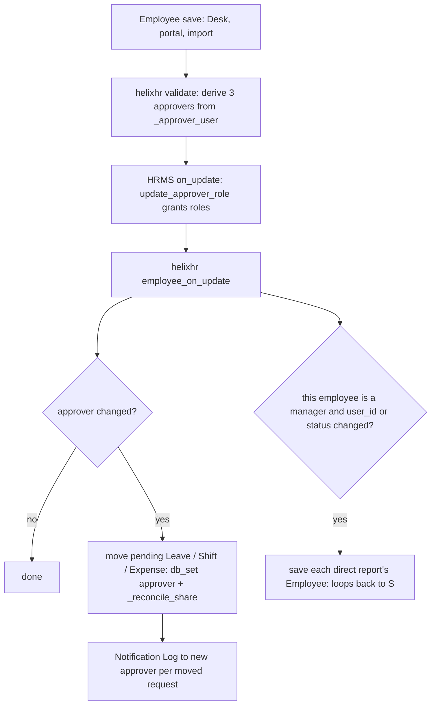

# feat: Approvers follow Reports to

## Summary

Make `Employee.leave_approver`, `expense_approver` and `shift_request_approver` always equal the login of the employee's Active `reports_to` manager, enforced on every Employee save from Desk, the portal and data import. When the approver changes, the employee's pending leave, shift and expense requests move to the new approver, who alone is notified. A Portal Admin screen previews and applies a one-time cleanup, and a preflight check catches drift.

---

## Problem Frame

Timesheets and attendance requests already follow `reports_to`. Leave, shift and expense requests use three separate HRMS fields, and when `leave_approver` is empty HRMS falls back to the first Department Approver. To work around this, HR created one department per manager. HRMS never grants a Department approver the Leave Approver role. On 2026-10-07 that caused "Only Leave Applications with status 'Approved' and 'Rejected' can be submitted", which `api._act_on_leave_application` now works around with `ignore_permissions`.

Two separate sources of "who approves" drift apart. Changing a manager today moves pending timesheets but leaves pending leave with the old approver.

---

## Requirements

**Derivation**
- R1. On every Employee save, the three approver fields are set to the `reports_to` manager's `user_id`, but only if that manager is Active. If there is no usable manager, all three are cleared.
- R2. No override: neither Desk nor the portal can set an approver that differs from the derived value.
- R3. A change to a manager's own `user_id` or `status` re-derives the approvers of every direct report.

**Pending requests**
- R4. When an employee's approver changes, their pending requests move to the new approver:
  - Leave Applications: `docstatus` 0, `status` Open, manager stage.
  - Shift Requests: `docstatus` 0, `status` Draft.
  - Expense Claims: `docstatus` 0, `approval_status` Draft.
- R5. Only the new approver is notified, once per moved request. The old approver loses access through the DocShare.

**Cleanup and guardrails**
- R6. A Portal Admin screen lists every in-scope employee whose stored approvers differ from the derived ones, together with the pending requests that would move. Applying it fixes them.
- R7. The same screen flags employees who will end up with no approver: no manager, a manager who has left, or a manager with no login.
- R8. A preflight check FAILs on drift. It WARNs on employees without a usable manager and on derived leave or expense approvers missing their HRMS role.

---

## Scope Boundaries

- Departments and Department Approver tables stay as they are. HRMS's department fallback remains for employees with no usable manager.
- Shift and expense approval stay Desk-only. No portal approval UI is added for them.
- Leave Applications in the HR stage do not move. HR owns them.
- The `ignore_permissions` decision path in `api._act_on_leave_application` stays as a safety net.

### Deferred to Follow-Up Work

- Restructuring departments into real org units.
- A per-employee HR override. It would need an explicit "overridden" flag, not inference.

---

## Key Technical Decisions

- Derive in a new helixhr Employee `validate` hook. On this site HRMS hooks run first, and HRMS's `update_approver_role` runs at `on_update`, after `validate`. So a derived value set in `validate` still gets its Leave Approver and Expense Approver roles granted. Desk, the portal's `save_person`, data import and `doc.save()` all pass through `validate`.
- Use `events._approver_user` as the single source. It already requires an Active manager and decides shares and arrival notices, so "approver", "who may act" and "who is told" can never disagree.
- Clear the fields when there is no usable manager rather than keep a stale value. HRMS then falls back to the department approver, and the preview and preflight report it. A stale approver who has left is worse than a visible gap.
- Move pending requests with `db_set` plus `events._reconcile_share`, not a full save. A full save re-runs balance, overlap, backdated-grace and HRMS approver validations, which can refuse an old row for reasons unrelated to the move. `_reconcile_share` already leaves exactly one approver share.
- Extend `events.employee_on_update` / `_reconcile_pending_documents` instead of adding a new hook. Reassignment of Timesheet, Attendance Request and Timesheet Change already lives there and already runs for direct reports when a manager's login or status changes.
- To re-derive direct reports when a manager changes, save each report's Employee record. A save, rather than `db_set`, is what makes HRMS grant the role. The cost is one save per direct report, which is acceptable for line-manager team sizes.
- Notify through a Notification Log via `events._notify_manager_of_arrival`, not email. This follows the P5-U10 rule for managers.
- Desk lock: add a fixture Property Setter making the three fields `read_only`, with a description saying they follow Reports to. Keep their existing permlevel 1. The `validate` hook stays the real enforcement. `read_only` just stops Desk from inviting an edit that will be overwritten.
- The cleanup is an apply action on the Portal Admin screen, not a patch. The user wants a preview first, and a patch cannot preview. The preflight FAIL is what reminds an operator to run it after deploy.

---

## High-Level Technical Design

What happens on an Employee save:

---

## Implementation Units

### U1. Derive approvers on every Employee save

- **Goal:** the three approver fields always equal the derived manager login.
- **Requirements:** R1, R2, R3
- **Dependencies:** none
- **Files:**
  - `helixhr/events.py`
  - `helixhr/hooks.py`
  - `helixhr/tests/test_approvers_follow_reports_to.py` (new)
- **Approach:**
  - Add an `employee_validate` hook that sets each field from `_approver_user(doc.name)`. Read `reports_to` from the in-memory doc, not the database, so an unsaved change is honoured.
  - Values set in `validate` survive a non-HR saver: Frappe v16 runs `validate_higher_perm_levels` before the `validate` hooks.
  - In `employee_on_update`, the existing direct-report loop for manager `user_id`/`status` changes now saves each report's Employee record instead of only reconciling shares. The share reconcile still runs through U2.
- **Patterns to follow:**
  - `events.employee_before_save` for the hook shape.
  - The manager-change loop already in `events.employee_on_update`.
- **Test scenarios:**
  - Setting `reports_to` to an Active manager with a login sets all three approvers to that login and grants Leave Approver and Expense Approver roles.
  - Changing `reports_to` from A to B rewrites all three to B.
  - Clearing `reports_to` clears all three.
  - A manager who has left, or who has no `user_id`, clears all three.
  - A save that tries to set `leave_approver` to someone else, from Desk or `frappe.client.set_value`, ends with the derived value.
  - A manager's `user_id` changing re-derives every direct report. Their status moving to Left clears every direct report's approvers.
  - Data import of an Employee with an explicit `leave_approver` stores the derived value.
- **Verification:** no Employee can be saved with an approver that differs from `_approver_user`.

### U2. Move pending leave, shift and expense requests to the new approver

- **Goal:** pending requests change hands with the approver, and only the new approver is told.
- **Requirements:** R4, R5
- **Dependencies:** U1
- **Files:**
  - `helixhr/events.py`
  - `helixhr/tests/test_approvers_follow_reports_to.py`
- **Approach:**
  - Extend `_reconcile_pending_documents` with three more doctypes:

    | Doctype | Pending when | Approver field |
    |---|---|---|
    | Leave Application | `docstatus` 0, `status` Open, manager stage (`helixhr_stage` empty or Manager) | `leave_approver`; also refresh `leave_approver_name` |
    | Shift Request | `docstatus` 0, `status` Draft | `approver` |
    | Expense Claim | `docstatus` 0, `approval_status` Draft | `expense_approver` |

  - For each row whose stored approver differs from the derived one: `db_set` the approver field, call `_reconcile_share` with submit, then `_notify_manager_of_arrival` to the new approver.
  - If the new approver is None, remove the share and send no notification.
  - Trigger this from `employee_on_update` whenever any of the three approver fields changed, not only `reports_to`.
- **Patterns to follow:**
  - The existing Timesheet / Attendance Request branches in `_reconcile_pending_documents`.
  - `test_api_approvals.py::test_reassigning_the_manager_moves_every_pending_share`.
- **Test scenarios:**
  - Moving the employee from manager A to manager B, for each request type:
    - A pending leave now has `leave_approver` set to B, B holds the submit share, A holds none, and B has one Notification Log while A has none.
    - B can approve that leave through `act_on_approval`.
    - A pending Shift Request and a pending Expense Claim move the same way.
  - These do not move:
    - An HR-stage leave.
    - An approved or rejected leave.
    - A submitted expense claim.
  - A leave that would now fail validation, such as a backdated grace period that expired since filing, still moves, because it is moved by `db_set`.
  - Moving to no usable manager: the shares are removed and nobody is notified.
- **Verification:** after any manager change, no pending request is shared with or addressed to the old approver.

### U3. Lock approver fields in Desk and the portal

- **Goal:** neither surface offers an approver edit. Both show who it is and that it follows Reports to.
- **Requirements:** R2
- **Dependencies:** U1
- **Files:**
  - `helixhr/fixtures/property_setter.json`
  - `helixhr/utils.py`
  - `helixhr/api.py`
  - `frontend/src/pages/People.vue`
  - `helixhr/tests/test_api_people.py`
  - `frontend/tests/e2e/people.spec.ts`
- **Approach:**
  - Add `read_only` and `description` Property Setters for the three fields, and keep their permlevel.
  - Reduce `PERSON_EDITABLE_FIELDS["approvers"]` to `reports_to`. Remove the approver branches from `save_person` and `_resolve_approver_user` if nothing else uses them.
  - In People.vue, the approvers edit card edits only Reports to. The read card shows the three approvers with a "Follows Reports to" note, and a "No approver — manager has no portal login" state when they are empty.
- **Patterns to follow:**
  - Existing Employee field-lock Property Setters.
  - The People.vue read and edit card structure.
- **Test scenarios:**
  - `save_person` with `leave_approver` set to someone else ignores it and stores the derived value.
  - `save_person` changing `reports_to` updates all three approvers.
  - Rewrite the old `test_api_people.py` approver-picker tests to assert the derived behaviour.
  - e2e: the person edit card has no approver pickers, and changing Reports to updates the displayed approvers.
  - Preflight "Employee field locks" still passes.
- **Verification:** no portal or Desk control can submit an approver value.

### U4. Portal Admin approver cleanup screen

- **Goal:** a Portal Admin previews the drift and applies the fix with one action.
- **Requirements:** R6, R7
- **Dependencies:** U1, U2
- **Files:**
  - `helixhr/api.py`
  - `frontend/src/pages/Settings.vue`
  - `frontend/src/components/settings/ApproverCleanupSection.vue` (new)
  - `helixhr/tests/test_portal_admin.py`
  - `frontend/tests/e2e/settings.spec.ts`
- **Approach:**
  - Add two whitelisted endpoints, gated by `_assert_portal_admin` and scoped by `resolve_portal_admin_scope`:
    - **Preview (read-only):** one row per Active employee in scope. Each row shows current and derived values for the three approvers, the count of pending requests per type that would move, and a problem tag: `no_manager`, `manager_left` or `manager_no_login`.
    - **Apply:** takes the employee ids from the preview and saves each Employee record through the normal path, so U1 and U2 do the work.
  - Apply re-checks scope per id. One row failing does not stop the rest; it returns a per-row result like `approve_clean_items`.
  - Add a new "Approvers" tab under `PORTAL_SECTIONS`.
- **Patterns to follow:**
  - `PortalRolesSection.vue` and its endpoints.
  - `api.approve_clean_items` for per-item results.
  - `rate_limit_per_user` on writes.
- **Test scenarios:**
  - Preview lists an employee whose `leave_approver` is a Department approver or empty, with the derived value and their pending leave count.
  - Applying it fixes the fields and moves the leave (covered via U2).
  - An HR Manager without Portal Admin is refused on both endpoints.
  - An employee outside the admin's company scope does not appear, and an apply naming them is refused.
  - Employees whose manager has no login appear tagged `manager_no_login`, and applying clears their approvers.
  - Once everything is fixed, preview returns an empty list.
- **Verification:** after apply, preview is empty for that scope apart from the tagged problem rows.

### U5. Preflight: approvers follow Reports to

- **Goal:** catch drift that bypassed the save path, such as direct SQL or a `db_set` backfill, and approvers missing roles.
- **Requirements:** R8
- **Dependencies:** U1
- **Files:**
  - `helixhr/preflight.py`
  - `helixhr/tests/test_preflight.py`
- **Approach:** a `check_approvers_follow_reports_to` added to `CHECKS`, reusing the same derivation helper as U4's preview. It FAILs, naming up to N employees, when any Active employee's stored approver differs from the derived one. It WARNs on employees without a usable manager and on derived leave or expense approvers missing their role.
- **Patterns to follow:**
  - `check_unsubmitted_approved_leave`.
  - `_result(name, status, detail)`.
- **Test scenarios:**
  - A clean site passes.
  - An employee whose `leave_approver` is changed by `db_set` FAILs, and the detail names them.
  - A manager without a login WARNs.
  - The well-formed-result test covers the new check.
- **Verification:** `bench --site <site> execute helixhr.preflight.run` reports the check.

### U6. Docs

- **Goal:** record the rule and retire the department workaround advice.
- **Requirements:** R1–R8
- **Dependencies:** U1–U5
- **Files:**
  - `docs/architecture.md`
  - `docs/runbook.md`
- **Approach:**
  - Architecture: approver derivation and the move rules, next to the existing reassignment section.
  - Runbook: run the Approvers cleanup after deploying, and what each problem tag means.
- **Test expectation:** none — documentation.

---

## System-Wide Impact

- **Roles:** every Active manager with a login gains the Leave Approver and Expense Approver roles. HRMS only ever adds these roles, so a former manager keeps them. Their DocShares are what get removed.
- **Desk users:** the three fields become read-only on the Employee form.
- **HR habit change:** pointing someone's leave at a non-manager is no longer possible.
- **Hook cost:** saving a manager whose login or status changed now saves every direct report. Each save is light, but for a very large team the request takes longer.

---

## Risks & Dependencies

| Risk | Mitigation |
|---|---|
| HRMS `ShiftRequest.validate_approver` requires the approver to be in the department list or `shift_request_approver`; a moved request whose `approver` is set by `db_set` is never re-validated | Desk saves later still pass, because the derived value equals `Employee.shift_request_approver` |
| Recursion: a report's save inside the manager's `on_update` | A report's save only cascades if the report is itself a manager whose `user_id` or `status` changed, which it is not, so it ends after one level |
| Employees with no usable manager now have no approver; leave applications fail if `leave_approver_mandatory_in_leave_application` is on | Intentional and visible; the U4 preview and U5 preflight list them for HR to fix the reporting line |

---

## Sources & Research

- `helixhr/events.py`: `employee_on_update`, `_reconcile_pending_documents`, `_reconcile_share`, `_approver_user`, `_notify_manager_of_arrival`.
- HRMS:
  - `hrms/overrides/employee_master.py`: `update_approver_role` on Employee `on_update`; `update_approver_user_roles` on User `validate`.
  - `hrms/hr/utils.py::share_doc_with_approver`.
  - `hrms/hr/doctype/leave_application/leave_application.py::get_employee_leave_approver`: the department fallback.
- `docs/architecture.md`, "Submit permission path (revised 2026-10-07)".
- Plan 2026-10-06-001 for the Portal Admin gate.
- Plan 2026-09-09-001 AE9 for the reassignment shape.
