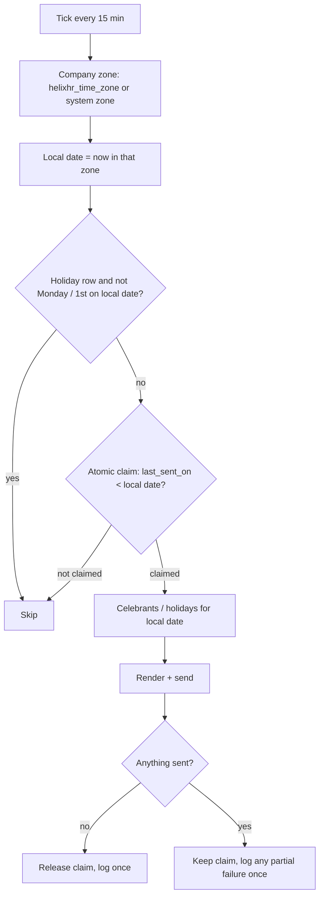

# fix: Reminders at company midnight, company date for the grace rule, celebrations upcoming-first

## Summary

This deployment's server clock (System Settings → Time Zone) is America/Chicago, and it also runs a company in IST. HelixHR's reminder jobs and its backdated-leave grace rule both read the *system* date. So the IST company's birthday and holiday mail arrives mid-morning IST, sometimes about the wrong day, and the grace rule counts from a date that lags IST by up to 11.5 hours.

This plan gives each company an optional time zone. Reminders are sent shortly after the company's own local midnight, about the company's own local date. Each send is claimed durably, so it happens at most once. The grace rule counts from the employee's company date.

Separately, the dashboard's Celebrating-this-month card lists upcoming dates first, and moves past ones to the bottom, dimmed.

---

## Problem Frame

- **Reminder timing.** `send_celebration_reminders` and `send_holiday_reminders` run from `scheduler_events["daily"]`, at 00:00 system time. They pick celebrants with HRMS's `get_employees_having_an_event_today`, which uses the system `getdate()` and takes no date argument.
  - For an IST company, Chicago midnight is 10:30 IST (CDT) or 11:30 IST (CST).
  - The user's requirement: a birthday on the 1st arrives at 12:00 AM on the 1st, company time.
- **Grace rule date.** `events.backdated_leave_earliest` counts working days back from `getdate()`. From IST midnight until Chicago midnight, an IST employee's "today" is still the previous day in the system zone, so they get a day less grace than HR configured.
- **Celebrations order.** `api._ordered_celebrations` sorts today first, then by day of month. On the 20th, someone celebrating on the 2nd sits above someone on the 25th. Because the card shows five rows, upcoming people get hidden behind past ones.

The original "backdated approve" report has been resolved by configuration. The cause was HRMS's HR Settings → Restrict Backdated Leave Application, set to HR Manager, which checks the session user on every validate, the approving manager included. It is now off, and the HelixHR Leave rules own backdating. A live check on 2026-10-08 confirmed the HelixHR rule behaves as intended. It is not part of this plan.

---

## Requirements

- R1. A company can carry an IANA time zone. Blank means the System Settings time zone, so single-zone sites behave exactly as today.
- R2. Birthday and work-anniversary reminders for a company are sent within 15 minutes after 00:00 in that company's zone. They are about celebrants whose day and month match the company's local date.
- R3. Holiday reminders follow the same rule. Their Weekly (Monday) and Monthly (1st) send days and windows are judged on the company's local date.
- R4. Each (event, company, local date) sends at most once. That holds across many ticks a day, `bench clear-cache`, Redis restarts and partial send failures. A failure never becomes repeated mail or a repeated Error Log row.
- R6. The backdated grace window counts back from the employee's company date, not the system date.
- R7. The Celebrating-this-month card lists today first, then the rest of the month in date order, then days already past at the bottom, dimmed.

(R5 is deliberately unassigned. The portal-wide calendar fallback was moved to Deferred during review.)

---

## Scope Boundaries

- Overdue-approval digests (`send_overdue_digests`) are unchanged. They are site-wide, because HR Managers span companies, and stay in the daily system-time slot.
- The portal-wide "today" is unchanged: `api.get_user_time_zone` / `user_today`, which drive week bounds, the dashboard and the timesheet.
- No change to how stored timestamps are written or converted.
- HRMS's stock reminder jobs stay off. `hr_settings_validate` and preflight already guard that.
- The HRMS backdated restriction is configuration only (see Problem Frame).

### Deferred to Follow-Up Work

- Editing the company time zone from portal Settings. This plan exposes it on the Desk Company form, and preflight lists every company's effective zone.
- Overdue digests at a per-company morning hour.
- **Company time zone as the portal calendar fallback** (User zone → company zone → system zone).
  - The obstacle: HRMS and ERPNext future-date checks still use the system `getdate()`. These include Attendance, Attendance Request and Timesheet. For about 11 hours a day the portal would offer an IST employee a "today" that core refuses as a future date.
  - It needs its own plan, with a cross-zone e2e covering attendance request and timesheet.

---

## Key Technical Decisions

- **Company zone is a Custom Field, `Company.helixhr_time_zone`, shipped in `helixhr/fixtures/custom_field.json`.**
  - ERPNext's Company has no zone field.
  - A Company `validate` hook checks the value against `zoneinfo.available_timezones()`, so a typo is refused rather than silently ignored.
- **One resolver, one seam.**
  - `utils` gains two helpers: "this company's zone" (the field, else `get_system_timezone()`) and "this company's local today" (`get_datetime_in_timezone(zone).date()`).
  - The reminders and the grace rule both call it, so they cannot disagree.
  - It is the single function tests patch or freeze. The existing `patch.object(reminders, "getdate", ...)` stops controlling the date once the date comes from the resolver.
  - An employee's company is read from their Employee record.
  - An unreadable stored zone falls back to the system zone, and the fallback is logged once per day.
- **Both reminder jobs move from `daily` to `cron` `*/15 * * * *`.**
  - Frappe v16 schedules cron from the job's last run on the system clock. A 15-minute grid lands on the same quarter-hours in every zone, so every company is sent within 15 minutes of its midnight: IST's :30 and Nepal's :45 included.
  - `bench migrate` removes the old daily Scheduled Job Types.
  - **Rejected:** hourly, which would land 30 minutes late for IST.
- **A durable claim on the reminder row replaces the Redis guard.**
  - **The field.** `HelixHR Celebration Reminder` gains a read-only `last_sent_on` Date. There is one row per (event, company), the guard's exact granularity, and holiday rows live in the same doctype.
  - **The claim.** A tick claims the day with one conditional UPDATE: set `last_sent_on` to the local date where it is empty or earlier. It commits, and sends only if a row changed. This is atomic across workers, overlapping ticks and a hand-run during a tick.
  - **Why not the Redis key:** `persistent_cache_keys` only protects against `clear-cache`. A Redis restart or LRU eviction still drops it, and at 96 ticks a day either one would mean a same-day resend.
- **Claim before send, release only when nothing went out.**
  - **Nothing went out:** a missing template, or a render that raises before the first send. The claim is restored to its previous value, so HR can fix the template and the next tick sends.
  - **A later send raised:** for example, the pool mail went out and a shared-day mail failed. The claim stands and the failure is logged once. Retrying would re-mail the people who already received it.
- **No deploy-day bridge, just a one-off patch.**
  - The patch copies today's existing Redis guard keys (`helixhr-celebration|{system_date}|{event}|{company}`) into `last_sent_on`, so a company the old daily job already mailed today is not mailed again.
  - Keys are per company, so a company whose local date is already ahead has no matching key, and its new day's mail is correctly due.
  - Nothing compares system-date keys after deploy.
- **Logs once per (company, local date).** Error Log rows from a tick (missing template, no-company celebrants, render failures, invalid zone) are written only by the tick that claims or releases. They are de-duplicated with a dated persistent cache key. Losing that key costs at most one repeated log line, never mail.
- **Celebrants come from a date-parameterised HelixHR query, not HRMS's helper.** It selects active employees of the company whose birth or joining day and month match the local date, with an earlier year. These are the same rules HRMS and `api._get_celebrations` use. The email's `date` and anniversary `years` take the company's local date.
- **Grace rule.** `backdated_leave_earliest(employee, as_of=None)` defaults `as_of` to *that employee's* company local today, not the session user's. That way HR filing on someone's behalf counts from the employee's date. The preview and the validate rule share the function, so they stay in step.
- **Celebrations order: today, then upcoming, then past. Past rows carry `is_past`.** The server keeps owning the order, and adds one boolean the card uses to dim the row. No date, year or age goes on the wire, which preserves P4-KTD14.

---

## High-Level Technical Design

Each 15-minute tick, per enabled reminder row:

---

## Implementation Units

### U1. Company time zone field and resolver

**Goal:** Every company has an effective time zone, and one place answers "what is today for this company / employee".

**Requirements:** R1, R6

**Dependencies:** none

**Files:**
- Modify: `helixhr/fixtures/custom_field.json` (Company `helixhr_time_zone`)
- Modify: `helixhr/hooks.py` (Company `validate` doc event; fixture filter if needed)
- Modify: `helixhr/events.py` (company validate: refuse an unknown zone)
- Modify: `helixhr/utils.py` (company zone, company local today, an employee's company local today)
- Modify: `helixhr/preflight.py` (INFO listing each company's effective zone; WARN on an invalid stored value)
- Test: `helixhr/tests/test_company_time_zone.py` (new)

**Approach:** Follow the existing `custom_field.json` row shape (`module: HelixHR`, fixed `modified`). Desk-editable through default Company permissions. Fieldtype is Autocomplete or Data; settle it in implementation. Validation is server-side either way.

**Patterns to follow:** `custom_field.json` rows; `events.hr_settings_validate` for a refusal sentence; `api.get_user_time_zone` for the zone-or-system idiom.

**Test scenarios:**
- Company `Asia/Kolkata`, system `America/Chicago`, frozen at 2026-10-31 20:00 CDT: company local today is 2026-11-01.
- A blank company zone resolves to the system zone.
- Saving `Asia/Kolkatta` is refused with a sentence naming the field; `Asia/Kolkata` is accepted.
- An invalid value written behind validate resolves to the system zone, and preflight WARNs.
- An employee's company local today follows their company. An employee with no company gets the system date.

**Verification:** a fresh site migrates the field, and preflight lists each company's zone.

---

### U2. Reminders at company-local midnight, claimed durably

**Goal:** Birthday, work-anniversary and holiday reminders go out within 15 minutes after 00:00 in each company's zone, about that company's date, exactly once.

**Requirements:** R2, R3, R4

**Dependencies:** U1

**Files:**
- Modify: `helixhr/helixhr/doctype/helixhr_celebration_reminder/helixhr_celebration_reminder.json` (`last_sent_on`, Date, read-only, no_copy)
- Modify: `helixhr/hooks.py` (both jobs move to `cron` `*/15 * * * *`; `send_overdue_digests` stays `daily`)
- Modify: `helixhr/reminders.py` (`_send_event`, `send_celebration_reminders`, `send_holiday_reminders`, `_context`, celebrant query, claim/release, once-per-day logging, docstrings that say "daily" or "the site's time zone")
- Create: `helixhr/patches/v1_0/seed_reminder_last_sent_on.py` (copy today's Redis guard keys into `last_sent_on`)
- Modify: `helixhr/patches.txt`
- Modify: `helixhr/preflight.py` (if `check_celebration_reminders` asserts the daily registration)
- Test: `helixhr/tests/test_reminders.py`

**Approach:**
- `_send_event` iterates companies with an enabled row for the event, rather than HRMS's grouped result. Per company: resolve the local date, claim, select celebrants for that date, send, then keep or release the claim.
- Employees with no company are still counted, and logged once per local system date.
- Holiday: `_is_holiday_send_day` and the window take the company's local date. The send-day check runs before the claim, so a non-send day never writes `last_sent_on`.
- Rewrite the existing tests' `patch.object(reminders, "getdate", ...)` date pins (holiday tests) onto the U1 seam or Frappe's `freeze_time` (`frappe/tests/classes/context_managers.py`).

**Execution note:** start with a failing test for an IST company at a frozen CDT afternoon before changing the send loop.

**Patterns to follow:** existing per-company try/except isolation in `_send_event` / `send_holiday_reminders`; `persistent_cache_keys` for the log-dedupe key.

**Test scenarios:**
- **Midnight boundary:** IST company with a celebrant born on Nov 1. At 2026-10-31 13:40 CDT (00:10 IST Nov 1), the company is mailed about that person, the email's `date` is Nov 1, and `last_sent_on` is Nov 1.
- **Before midnight:** at 2026-10-31 13:20 CDT (23:50 IST Oct 31), nothing about the Nov 1 celebrant is sent.
- **The bug the review caught:** the next day, 2026-11-01 13:40 CDT is 01:10 IST Nov 2 (CST from Nov 1, offset 11h30). The IST company is mailed about Nov 2 celebrants, even though the system date (Nov 1) equals the previous claim.
- **Two zones, one tick:** a Chicago company and an IST company each get mail only for their own local date, and recipients never cross companies.
- **Repeat ticks:** a second tick on the same local date sends nothing. Two concurrent calls on the same row result in one send (the claim UPDATE changes one row).
- **Restart-proof:** with the Redis cache flushed after a send, the next tick still sends nothing.
- **Release:** a missing template releases the claim, logs one Error Log row across two ticks, and sends once the template exists.
- **Partial failure:** the pool mail sends, then a shared-day mail raises. The claim stands, the next tick sends nothing, and one Error Log row is written.
- **Holiday:** an IST Weekly row sends at IST Monday 00:10 (Sunday in Chicago), with the window IST Monday to Sunday. A Monthly row sends on the IST 1st. On a non-send day no claim is written.
- **Blank zone:** a company behaves as before, on the system date.
- **Registration:** both jobs are under `cron` `*/15 * * * *`, and `send_overdue_digests` is still `daily`. This replaces the two "registered as a daily scheduler event" tests.
- **Patch:** a guard key for today's system date sets `last_sent_on` for that row; with no key the row stays empty.
- **Kept as-is:** one company's render failure leaves the other company its mail; the no-company employee is never celebrated or mailed.

**Verification:** with the clock frozen across an IST midnight, only the IST company mails, once. `bench migrate` registers the cron jobs and removes the daily ones.

---

### U3. Grace rule on the employee's company date

**Goal:** The backdated grace window counts from the employee's company local date.

**Requirements:** R6

**Dependencies:** U1

**Files:**
- Modify: `helixhr/events.py` (`backdated_leave_earliest` default `as_of`)
- Test: `helixhr/tests/test_leave_flow.py` (grace class)

**Approach:** With no `as_of`, use the U1 "employee's company local today". `get_leave_day_count` and the validate rule already share the function.

**Test scenarios:**
- IST employee, grace 1, frozen at 2026-10-08 20:00 CDT (Oct 9 06:30 IST, a Friday): the earliest start is Oct 8. A request starting Oct 8 is accepted; Oct 7 is refused with the grace sentence.
- The same employee's preview returns `earliest_start` Oct 8 and the same blocked sentence for Oct 7.
- A blank-zone company is unchanged, and the existing grace tests stay green.
- HR Manager stays exempt regardless of zone.

**Verification:** the grace class passes, plus the cross-zone case.

---

### U4. Celebrations: upcoming first, past dimmed

**Goal:** The card answers "who's next" first.

**Requirements:** R7

**Dependencies:** none

**Files:**
- Modify: `helixhr/api.py` (`_celebration_projection` adds `is_past`; `_ordered_celebrations` key: today, then upcoming by day, then past by day)
- Modify: `frontend/src/components/Celebrations.vue` (dim a row with `is_past`; update the "server sorts today-first" comment)
- Test: `helixhr/tests/test_api_dashboard.py`

**Approach:** The sort key is `(0 if today, 1 if upcoming, 2 if past; day)`. Dimming uses an ink-gray treatment on name and date that keeps text contrast at WCAG AA.

**Test scenarios:**
- On the 20th, with celebrants on the 2nd, 20th, 25th and 28th, the order is 20 (today), 25, 28, 2. Only the 2nd carries `is_past: true`.
- On the 1st nobody is past. On the last day, everyone except today is past and ordered by day.
- No `date`, `year` or `age` key on any row (existing projection test kept).

**Verification:** the dashboard test passes, and the card shows past rows last and dimmed.

---

## System-Wide Impact

- **Scheduler:** two jobs tick 96 times a day instead of once. A tick with nothing due reads the enabled rows, resolves each zone, and runs one conditional UPDATE per row whose date has turned.
- **Single-zone sites:** with every company blank, mail still goes out at system midnight, now within 15 minutes of it, and the grace rule is unchanged.
- **Data:** one new Custom Field (blank on existing companies) and one new read-only Date field on the reminder doctype. Nothing is backfilled except the one-off patch.

---

## Risks & Dependencies

| Risk | Mitigation |
|------|------------|
| A tick runs longer than 15 minutes on a very large company | The claim UPDATE is atomic, so an overlapping tick cannot double-send |
| A Redis loss would let a log line repeat | Mail is guarded by the DB claim. The log dedupe is cache-only by design and costs at most one extra row |
| The job tests depend on the old `getdate` patching | U2 explicitly rewrites them onto the U1 seam or `freeze_time` |
| HR leaves the IST company's zone blank | Preflight INFO lists every company's effective zone, and the runbook step says to set it |

---

## Documentation / Operational Notes

- `docs/runbook.md`:
  - Set a company's Time Zone on the Desk Company form.
  - Reminders tick every 15 minutes and send once per company-local day; `last_sent_on` on the reminder row shows the last send.
  - The HRMS backdated restriction must stay off, because the HelixHR Leave rules own backdating.
- `docs/architecture.md`: the company-zone resolver, and the claim-before-send reminder model.
- After deploy: set the IST company's zone, then run preflight.

---

## Sources & Research

- `helixhr/reminders.py`:
  - celebration guard: `:261-319`
  - holiday guard: `:594-631`
  - logs that run on every tick: `:209-216`, `:272-283`, `:611-617`
- `helixhr/hooks.py`: `scheduler_events`, `persistent_cache_keys`.
- HRMS `hrms/controllers/employee_reminders.py::get_employees_having_an_event_today` (no date parameter).
- Frappe:
  - `frappe/core/doctype/scheduled_job_type/scheduled_job_type.py` (cron support, migrate cleanup)
  - `frappe/utils/data.py::get_system_timezone` (falls back to Asia/Kolkata when unset)
  - `frappe/tests/classes/context_managers.py::freeze_time`
- 2026-10-08 live check on `test_site`:
  - The grace rule refuses N+1 working days, and the preview agrees.
  - HR Manager files 20 days back.
  - The manager approves both.
- Document review on 2026-10-08 (coherence, feasibility, adversarial):
  - It removed a "first-deploy bridge" that would have blocked IST mail daily until Chicago midnight.
  - It replaced the Redis-only guard with a durable claim.
  - It deferred the portal-wide calendar fallback.
